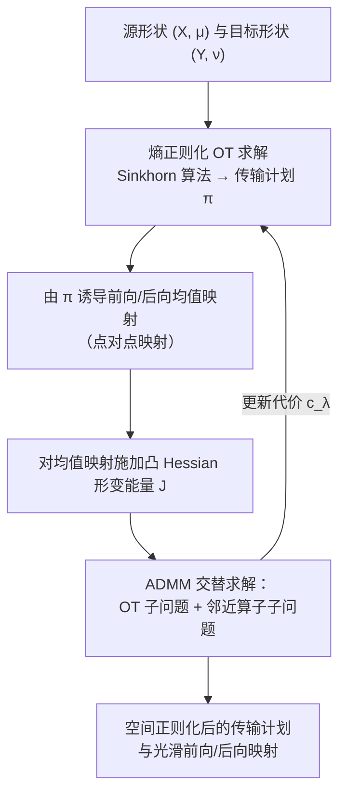

## 一句话总结

本文提出基于传输计划"均值映射（mean map）"的空间正则化框架：不再对整张传输计划的系数施加正则，而是对由传输计划诱导出的前向/后向点对点均值映射施加凸形变能量，从而得到一个变量数大幅减少、可用 ADMM 结合 Sinkhorn 算法高效求解、并能扩展到大规模网格的空间正则化最优传输方法。

## 研究背景

最优传输（OT）在图形学中被广泛用于形状匹配、重建、插值等任务，因为其代价对噪声与离群点天然鲁棒。Cuturi 提出的熵正则化让 Sinkhorn 算法可以比线性规划快若干数量级地求解 OT，但传输计划本身并不保证任何空间正则性：源上相邻的两点可能被送到目标上相距很远的区域（不连续），单个质点也可能在目标上大范围散开（质量劈裂）。这使得从 OT 计划中提取有用的、非模糊的映射非常困难，限制了它在实际配准中的应用。

已有的空间正则化工作很少，且各有硬伤：

- **凸方法**（Solomon 等 2012、2013；Ghoussoub 等 2020）直接在传输计划上定义类 Dirichlet 能量，虽是凸的，但需要对传输计划系数做优化，变量数是离散测度规模的平方量级，超出玩具模型就不可行。
- **非凸方法**（Mandad 等 2017）以传输计划的局部方差度量正则性，能得到光滑双射映射，但能量高度非凸，需要复杂的由粗到细策略避免陷入局部极小，且在特征尺度跨度大的模型上收敛缓慢。

本文的立场是：把正则化对象从"整张传输计划"换成"从计划诱导出的点对点均值映射"，既保持凸性，又把优化变量数量级从平方降回线性，从而兼得可扩展性与稳健性。

## 方法

### 整体框架

核心观察是：任意传输计划 $$\pi$$ 都能典范地诱导出两个点对点映射。由解耦定理，存在一族条件测度 $$\pi_x$$，前向均值映射把源上每个点 $$x$$ 映到它所对应目标质量分布的重心 $$\overrightarrow{m}_\pi(x) := \int_Y y\, d\pi_x(y)$$；后向均值映射则反过来把目标点映到其对应源质量的重心。由于传输计划集合是凸的，均值映射集合也是凸的，因此可以对这些"真正的点对点映射"施加任意凸形变能量而不破坏整体凸性。

### 关键设计

1. **均值映射作为正则化对象。** 若传输计划由 Monge 映射诱导，则该映射本身就是均值映射；一般情形下均值映射是重心平均。文中证明均值映射满足方差收缩性质 $$\mathrm{Var}_\mu(\overrightarrow{m}_\pi) \le \mathrm{Var}_\nu$$，当且仅当它是 Monge 映射时方差取最大值。这一性质后续被用来"逼出" Monge 映射。

2. **凸对偶 + ADMM 求解。** 对二次形变能量 $$Q$$，引入变量 $$\phi$$ 代表 $$\overrightarrow{m}_\pi$$ 并用拉格朗日乘子对偶化，得到一个无约束凸问题，其梯度有简洁形式 $$\nabla \hat{Q}(\phi) = A(\phi - \overrightarrow{m}_{\pi[\phi]})$$，其中 $$\pi[\phi]$$ 是修改代价 $$c_\lambda$$ 下的 OT 最优解。对一般凸能量，用 ADMM 交替求解两个子问题：一个是带演化代价的 OT（用 Sinkhorn 解），另一个是形变能量的邻近算子（对多数算子 $$A$$ 只需一次线性求解 $$(A+\rho I)\phi = \rho m - \gamma$$）。这样整个求解过程本质上就是若干次 Sinkhorn 调用，实际配准往往只需 3 到 6 次。

3. **Hessian 正则化。** 采用基于 Hessian 的形变能量：它凸、等距不变、核空间小（仅仿射映射在核中），能有效去除 Dirichlet 能量导致的"收缩/挤压"伪解。文中分别给出体积情形（$$\tfrac{1}{2}\lVert\nabla^2\phi\rVert^2$$）与曲面到曲面情形（结合切向梯度与 Gauss 映射的能量）的邻近算子，二者都归结为简单线性求解。

4. **Mongification（代价无关匹配）。** 对源、目标差异很大、难以设计可靠代价的情形，额外加入一个最大化均值映射方差的非凸项，强制均值映射趋近 Monge 映射，从而间接偏好两形状间的微分同胚。此时即便取零传输代价也能得到良好配准；由于走的是对偶，每次 ADMM 迭代内部仍是凸子问题，稳健性得以保持。

## 实验结果

论文以定性配准与聚类示例为主，未提供标准数值基准表。下表汇总文中报告的代表性实验设置及其收敛表现（均来自原文描述，未作推断）：

| 实验 | 任务 / 数据 | 地标数 | 正则化 / 变体 | 收敛表现 |
| --- | --- | --- | --- | --- |
| 左心室配准 | 患者间左心室网格（ImageCAS） | 0 | 前向 Hessian、纯凸 | 3 次 ADMM 迭代（3 次 Sinkhorn） |
| 条形→螺旋（2D） | bar 到 spiral | 3 | 前向 Hessian，对比 LDDMM/Dirichlet/纯 OT | 本方法干净收敛，对比法出现翻转或收缩 |
| 狗→骆驼 | Dog 到 Camel，非平衡 OT | 7 | 前向 Hessian、混合代价 | 3 次 ADMM 迭代（3 次 Sinkhorn） |
| 马姿态迁移 | 同一匹马不同姿态 | 3 | 前后向、Mongification | 收敛 |
| 人体姿态迁移 | FAUST 两姿态 | 2~3 | 前后向、Mongification | 收敛 |
| 十个人体姿态 | FAUST 静止姿态到九个姿态 | 5 | Mongification | 均 < 30 次 ADMM 迭代 |
| 球面/环面参数化 | Spot 到球、Bob 到环面 | — | Dirichlet/Hessian、Mongification | 无需切割网格或固定顶点 |
| MNIST 相异度 | 两组 MNIST 数字聚类 | — | 前后向 Hessian 化欧氏代价 | 单链接聚类仅 1 处错误（优于纯 OT） |

主要结论：相比对整张传输计划做优化的已有凸方法，本文把优化变量数从平方量级降到线性量级；纯 OT 配准虽能大致对齐但充满不规则伪影，加入均值映射的 Hessian 正则化后即可得到视觉上干净的配准，且通常仅需极少次 Sinkhorn 调用。

## 亮点与局限

亮点：

- **凸性与可扩展性兼得。** 将正则化从传输计划转移到点对点均值映射上，既保持问题凸性（唯一解、不陷局部极小），又把变量规模降到线性，能处理大网格。
- **框架通用。** 可对前向、后向或两者施加任意凸形变能量，兼容任意传输代价（欧氏、地标测地、特征描述子、非平衡 OT 等），并直接支持球面/环面等非平面参数化。
- **求解简单高效。** 整个流程可复用现有高效 Sinkhorn 库，实际只需 3 到 6 次调用即可完成典型配准。

局限：

- **Mongification 引入非凸项。** 对差异极大的形状需要加入方差最大化这一非凸项，虽然对偶后每步仍是凸子问题，但整体凸性保证被打破。
- **均值映射存在收缩效应。** 由方差收缩性质导致配准结果有轻微缩小（原文在螺旋示例中指出）。
- **精细网格计时仍有提升空间。** 作者指出采用由粗到细求解器可显著改善精细网格上的耗时，属未来工作。

## 延伸思考

均值映射这一"从概率化传输计划中提取点对点映射"的视角很有启发性：它把难以正则化的高维对象（整张计划）替换成低维、语义清晰、且集合仍为凸的对象（重心映射），是"换正则化载体以换回可解性"的典型思路，或可迁移到其他难以直接正则化的概率匹配问题。作者提出的几个方向也值得关注：一是把位置信息扩展到法向，可能进一步提升配准质量；二是基于优化均值映射定义比现有 OT 重心更自然的"形状平均"；三是利用对偶把非凸（如弹性）正则项"凸化"求解——若能澄清原始非凸问题的收敛性，这可能成为一类通用的能量凸化手段。
