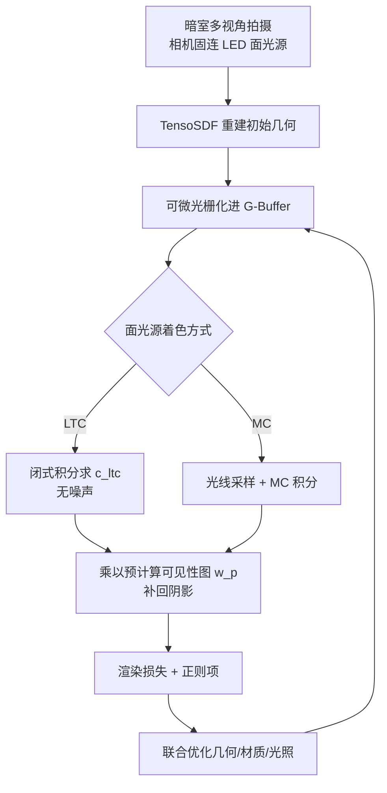

## 一句话总结

本文把"主动面光源"引入逆向渲染的物体采集流程：面光源比点光源在单张照片里覆盖更宽的 BRDF 角度，从而更准地估计材质（尤其粗糙度），并用可微的线性变换余弦（LTC）替代蒙特卡洛积分做闭式、无噪声的面光源着色，使几何与材质重建又快又好。

## 研究背景

逆向渲染要从多视角照片中恢复物体的几何与材质，本质上是欠约束问题：光照与材质之间存在歧义，颜色变化既可能来自光照也可能来自反照率或粗糙度，需要大量照片才能解耦。降低难度的一条路是压缩光照模型的自由度，例如在暗室中使用可控点光源。

已有的主动光照方法多用（近似）共位点光源、分离点光源、偏振点光源或 LED 阵列。但点光源每张照片只在每个表面点提供一个入射角，对高光/镜面区域的角度采样效率低——只有当视角恰好对齐镜面波瓣时才出现高光提示，导致粗糙度常被高估。作者观察到：如今平面矩形面光源（带均匀响应）已很便宜、易于搭建，且每个表面点能同时照亮多个入射角，对 4 维 BRDF 空间的覆盖更广，因此有望以更少照片得到更好的材质重建。

面光源逆向渲染还需要可微着色。面光源着色通常用带重要性采样的蒙特卡洛（MC）积分，但采样带来噪声与计算开销。在忽略物体自身间接光的主动光照设定下，面光源的着色可用线性变换余弦（LTC）以闭式近似，天然无噪声且快。此前没有工作研究过用于多视角物体重建的可微 LTC，这正是本文的切入点。

## 方法

整体框架：沿用基于网格的 NVDiffrecMC 管线，把初始几何可微光栅化进 G-buffer，再对每个像素用面光源着色（MC 或 LTC 二选一），最后以渲染损失端到端联合优化反照率、粗糙度、金属度、几何（顶点位置与法向偏移）以及面光源辐射强度。材质用 Disney 的 PBR 模型（漫反射项 + 各向同性 GGX 镜面波瓣）。

**关键设计 1：面光源优于点光源。** 面光源在每个表面点覆盖更宽的入射角范围，对镜面区域"打中"非零镜面反射的概率更高。合成实验显示，仅用 25 个视角的面光源，重光照质量就明显超过用 144 个视角的点光源，核心原因是粗糙度 $$r$$ 的重建显著更准（点光源因缺少高光提示而高估粗糙度，使镜面反射消失）。

**关键设计 2：可微 LTC 面光源着色。** 在无间接光假设下，面光源着色是对面光源覆盖球面域 $$P$$ 的照度积分。LTC 利用余弦分布在多边形光源上的闭式解，并通过线性变换 $$M$$ 近似各向同性 BRDF，将积分写成沿光源边界各边的（带符号）面积之和：

$$E(P') = \frac{L}{2\pi}\sum_{\langle p_i,p_j\rangle\in\partial P'}\arccos(p_i\cdot p_j)\,\frac{p_i\times p_j}{\lVert p_i\times p_j\rVert}\cdot(0,0,1)$$

漫反射分量直接对余弦分布积分得到，镜面分量则用为 BRDF 拟合的逆变换 $$M^{-1}(r,\beta)$$ 结合能量补偿项 $$F(r,\beta)$$ 计算。$$M$$、补偿函数与 Fresnel 项都预计算为 2D 查找表（LUT），并用前向差分求数值梯度接入链式法则，从而把梯度反传到粗糙度、$$\beta$$、顶点位置、反照率与金属度。

**关键设计 3：面积引导的可见性补回阴影。** LTC 本身不含遮挡，作者把带阴影颜色分解为"无遮挡的 LTC 颜色乘以可见性权重 $$w_p$$"：

$$w_p(x,\omega_v)=\frac{\int_P V(x,\omega_l)\,\rho(x,\omega_v,\omega_l)\cos\theta_l\,d\omega_l}{\int_P \rho(x,\omega_v,\omega_l)\cos\theta_l\,d\omega_l}$$

其中 $$V(x,\omega_l)$$ 是入射光在着色点的可见性。由于主动光照下可见性图主要依赖大体准确的初始几何与相机视角，作者在优化开始时用光线追踪算一次，之后每隔约 1000 次迭代才更新一次，即可把重建时间压到 1/4，仅损失约 0.5 dB 重光照质量。

**关键设计 4：裁剪后合并邻近顶点。** 将多边形光源裁剪到切平面时可能产生两个过近的顶点，导致式中叉积趋零、以及 $$\arccos$$ 在接近 1 时梯度趋于无穷而不稳定。作者对满足 $$p_i\cdot p_j>1-10^{-4}$$ 的相邻点在前向与反传中都做合并，因该小边贡献极小而几乎不影响结果。此外还引入过曝检测的渲染损失、鼓励金属度取 0 或 1 的二值损失，以及一系列平滑正则。方法同样以概念验证方式集成进 3DGS 的 R3DG 管线。

## 实验结果

在合成数据（TensoIR 的 ficus/lego/armadillo/hotdog 与 Shiny Blender 的 coffee/helmet/musclecar/teapot/toaster）与 8 个真实拍摄物体上评估。真实数据用消费级单反相机加 15cm×10.6cm LED 面光源、AprilTag 镜面标定相对位姿。下表为合成数据上基于同一 NVDiffrecMC 代码库的对比（上半区，直接体现面光源与 LTC 的作用）与方法级 SOTA 对比（下半区），运行时间基于单张 RTX 3090。

| 方法 | 光照模型 | NVS PSNR↑ | 重光照 PSNR↑ | 粗糙度 MAE↓ | 法向 MAE↓ | 运行时间 |
|---|---|---|---|---|---|---|
| NVDiffrecMC | 静态环境图 | 29.24 | 26.52 | 0.02552 | 0.05543 | 65 min |
| NVDiffrecMC（改） | 主动点光 | 29.48 | 26.61 | 0.01673 | 0.07170 | 12 min |
| NVDiffrecMC（改） | 主动面光 16 SPP | 29.19 | 27.77 | 0.01755 | 0.03929 | 16 min |
| NVDiffrecMC（改） | 主动面光 1024 SPP | 29.11 | 27.97 | 0.01708 | 0.02461 | 350 min |
| NVDiffrecMC（改） | 主动面光 LTC | 29.37 | 28.29 | 0.01704 | 0.02477 | 12 min |
| TensoSDF | 静态场 MLP | 29.68 | 25.66 | 0.01833 | 0.03524 | 396 min |
| IRON | 主动点光 | 22.59 | 23.23 | 0.02935 | 0.05333 | 571 min |
| DPIR | 主动点光 | 25.16 | — | — | — | 223 min |

结论要点：面光源相比点光源带来约 +1.7 dB 的重光照提升与更低的粗糙度/法向误差；LTC 在与 MC 16 SPP 相近甚至更好的质量下平均快 25%，且无采样噪声（MC 16 SPP 偶因梯度噪声失败，需增至 1024 SPP 才逼近 LTC 质量，但慢约 29 倍）。方法级对比中，本文显著优于同为主动点光的 IRON 与 DPIR，速度也快一个数量级。3DGS 管线（R3DG + 面光 LTC）同样把重光照从点光的 27.49 dB 提升到 28.18 dB。面光源尺寸消融显示存在最优区间：过小退化为点光（高光提示不足），过大则缺乏有/无高光区域的对比，二者都降质。

## 亮点与局限

亮点：

- 把便宜易得的平面面光源系统性地引入主动光照逆向渲染，指出其对镜面/粗糙度重建的采样效率优势——同质量下所需照片可降到点光源的 1/5。
- 首次将可微 LTC 用于多视角物体重建，闭式无噪声着色使优化时间降低 25%，并给出裁剪顶点合并等稳定性处理。
- 面积引导的可见性图与低频更新策略，把阴影计算与着色解耦，用可控的小幅质量损失换取约 4 倍加速。

局限：

- 不建模层间反射（interreflection）、透明/高镜面镜面材质等效果。
- 最终质量依赖大体准确的初始几何，几何存在大缺陷时无法自动修正；高金属或低反照率物体的初始几何还需额外在固定环境光下拍摄辅助。
- 可见性图与 LTC 均为近似，本身引入偏差；面光源尺寸/拍摄距离需按 BRDF 波瓣角度覆盖、表面细节与亮度（过曝风险）经验设定。

## 延伸思考

本文的价值在于把"硬件采集设定"与"可微着色算法"合并优化：面光源提高了单张照片的信息量，LTC 则让这种照明的可微着色几乎零成本。这提示逆向渲染的效率不只是算法问题，采集端的光照设计同样是可优化维度。作者展望的方向——把面光源换成带图案或彩色的"图案光源"以增强法向估计——很有想象力：MC 采样在此只会增噪，而 LTC 通过把图案切分成多边形仍能高效低噪地着色，这类"结构光 × 闭式可微着色"的组合可能进一步压缩所需视角数、提升法向与细节重建质量。此外，如何在保留 LTC 速度的同时补回被忽略的间接光与镜面互反射，是走向更一般场景的关键一步。
