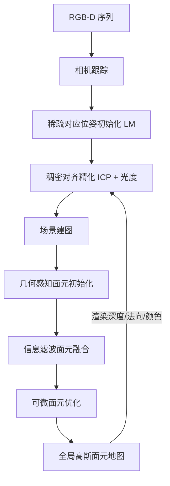

## 一句话总结

EGG-Fusion 是一套实时 RGB-D 重建系统，用高斯面元（Gaussian Surfel）作为场景表示，并引入基于信息滤波的面元融合显式处理传感器噪声，在 24 FPS 下实现约 0.6cm 的高精度表面重建。

## 研究背景

实时三维重建是计算机图形学的基础任务，在混合现实、自动驾驶、机器人等领域有广泛应用。经典 RGB-D SLAM 使用点云、面元、截断有符号距离场（TSDF）等表示，效率高但表达能力有限，难以刻画复杂场景的精细几何且扩展性受限。

近年可微渲染（NeRF、3D Gaussian Splatting）显著提升了重建的真实感与视觉质量，基于 3DGS 的实时方法凭借高效的可微光栅化尤其被看好。但 3DGS 基元参数自由度过高，会带来几何歧义，在视角覆盖有限、传感器噪声较大的复杂场景中，重建误差被进一步放大，甚至完全失败，严重限制了这类方法在实际中的可靠性与可扩展性。

本文希望结合面元表示的多视一致几何优势与可微渲染的高质量外观优势，并显式建模传感器噪声，做到既准又快的实时重建。

## 方法

### 整体框架

系统由两个模块组成：相机跟踪与场景建图。场景表示采用 2D 高斯面元（用一个圆盘近似的可学习基元，含中心、两个正交轴尺度、旋转四元数、不透明度与球谐颜色）。对每一帧 RGB-D 输入，先由深度与内参预处理出法向图与顶点图，经跟踪得到相机位姿后转换到世界系；建图侧做几何感知的面元初始化、基于信息滤波的面元融合，再进行可微优化；跟踪侧采用稀疏到稠密（sparse-to-dense）的位姿估计。

### 关键设计 1：几何感知的面元初始化

不像以往在图像空间均匀采样新基元，本文只在几何显著区域激活面元：一是低不透明度区域（暴露重建缺陷），二是正深度视差区域（新观测到的前景几何），在保证保真度的同时抑制冗余。此外提出自适应尺度初始化：远处面元投影面积小，应赋予更大尺度，使其在图像空间保持一致分布：

$$s = [\alpha_s \cdot d / f_x,\ \alpha_s \cdot d / f_y],$$

其中 $$\alpha_s$$ 为像素缩放因子（取 2.0），$$d$$ 为深度。实验表明该紧凑初始化能在相同面元数下取得更高渲染质量。

### 关键设计 2：基于信息滤波的面元融合

为抑制消费级传感器的深度噪声，把面元状态估计建模为马尔可夫过程，每个面元几何状态 $$x_t = [p, n]^\top \in \mathbb{R}^6$$（位置与法向）并关联协方差以量化不确定性。用观测方程 $$z_t = H x_t + \bar{t} + \epsilon$$ 建立观测与状态的关系，通过递推贝叶斯更新信息矩阵 $$\Lambda$$ 与信息向量 $$\eta$$：

$$\Lambda_t = \Lambda_{t-1} + H^\top \Lambda_z^t H,\quad \eta_t = \eta_{t-1} + \eta_z^t,$$

再由 $$\hat{x}_t = (\Lambda_t)^{-1}\eta_t$$ 得到更新后的几何状态。协方差简化为对角阵，且噪声强度与深度平方成正比，从而可高效实时求解。由于法向更新对旋转是欠约束的，作者用更新前后法向的叉积 $$n_{tg} = n_g \times n_t$$ 与夹角 $$\theta = \cos^{-1}(n_g \cdot n_t)$$ 构造唯一旋转 $$\Delta R(n_{tg}, \theta)$$ 来更新面元朝向。信息矩阵的迹 $$\mathrm{tr}(\Lambda)$$ 还可作为置信度，用于提取高可信表面。逐帧几何更新让场景始终保持高精度几何，优化时只需少量精修即可快速收敛。

### 关键设计 3：可微面元优化与几何正则

显式融合后，用光栅化渲染管线做端到端优化。渲染的颜色、深度、法向分别用真值监督，法向损失 $$L_n = \lvert 1 - \gamma \rvert$$（$$\gamma$$ 为两单位法向的余弦）。为弥补逐像素监督缺乏全局一致性的问题，引入逐面元几何正则，使面元几何在优化中尽量贴合融合结果、同时允许外观变化：

$$L_{reg} = \lVert p - p_f \rVert + w_{reg}^n \cdot \lVert 1 - n \cdot n_f \rVert,$$

总损失为 $$L_{total} = L_c + w_d L_d + w_n L_n + w_{reg} L_{reg}$$。作者指出这类正则不适用于纯 3DGS 方法，因为其体积表示缺乏与几何的显式约束。

### 关键设计 4：稀疏到稠密的相机跟踪

先用稀疏 2D-3D 对应做重投影误差最小化，经 Levenberg–Marquardt 优化得到稳健的位姿初值；再用稠密对齐精化，联合几何（ICP）与光度误差 $$E_{dense} = E_{icp} + \lambda_{photo} \cdot E_{photo}$$。稀疏初始化避免了快速运动时纯稠密对齐易失败的问题，并大幅缩短收敛时间。

## 实验结果

在 Replica 与 ScanNet++ 上评估重建精度（单位 cm，Points 方案从最终高斯基元采样 100 万点评估）。EGG-Fusion 平均达到约 0.6cm 精度，准确率比 SOTA 的 GS 方法提升超过 20%：

| 方法（Points 方案） | Acc.↓ (Replica/ScanNet++) | Acc. Ratio↑ | Comp.↓ | Comp. Ratio↑ |
|------|------|------|------|------|
| ElasticFusion | 1.38 / N/A | 91.72 / N/A | 7.38 / N/A | 65.50 / N/A |
| SplaTAM | 2.87 / 1.71 | 74.27 / 89.15 | 3.58 / 1.60 | 71.72 / 92.64 |
| RTG-SLAM | 0.80 / 1.06 | 98.52 / 95.34 | 2.88 / 1.22 | 81.92 / 95.78 |
| Ours | **0.60 / 0.67** | **99.99 / 99.98** | **2.67 / 0.91** | **84.88 / 99.04** |

跟踪方面，在 Replica 上平均 ATE RMSE 为 0.17cm（优于 RTG-SLAM 的 0.18），在 TUM-RGBD 实景上取得实时方法中最高的平均跟踪精度。渲染方面，在 ScanNet++ 新视角与训练视角上 PSNR 均领先（新视角 25.70dB）。系统性能上，单线程理论 24.21 FPS、显存约 1.8GB，优于 RTG-SLAM（15.73 FPS）等。消融显示：去掉稀疏跟踪在复杂场景会失败；深度感知尺度初始化在相同面元数下提升渲染质量；信息滤波融合显著改善几何指标；几何正则同时提升跟踪、外观与几何。

## 亮点与局限

亮点：

- 用高斯面元替代 3DGS 椭球，配合逐面元几何正则，得到多视一致、贴合表面的高精度几何；
- 信息滤波融合显式建模与深度相关的传感器噪声，逐帧更新几何与协方差，既提升稳定性又让优化接近收敛、加速显著；
- 信息矩阵的迹提供了自然的置信度度量，可提取高可信表面；系统在 24 FPS 下兼顾精度、渲染质量与低显存，并开源。

局限：

- 依赖深度传感器，纯 RGB 输入下对面元位置与法向的鲁棒估计要求更高；
- 快速运动、宽基线或卷帘快门等极端运动会导致伪影甚至跟踪丢失；
- 假设静态环境，场景中的动态物体或人会引入重影、损害重建质量。

## 延伸思考

这篇工作的核心是把经典 SLAM 里成熟的概率滤波思想（信息滤波、贝叶斯递推更新）重新嫁接到可微渲染表示上：3DGS/面元优化本质是"拟合观测"，但对噪声缺乏显式的不确定性建模，而信息滤波恰好补上了这块，让几何在多帧观测中逐步收敛并携带置信度。这种"显式概率融合 + 可微精修"的组合，可能比纯粹端到端优化更省算力也更稳健，值得推广到动态场景、纯 RGB 或多传感器融合的设置中。另一个务实之处是几何感知的初始化——把基元只放在真正需要的地方并按深度自适应定尺度，是在质量与效率间取舍的好例子。至于对动态环境和极端运动的局限，也正指向后续与去模糊、动态建模结合的方向。
