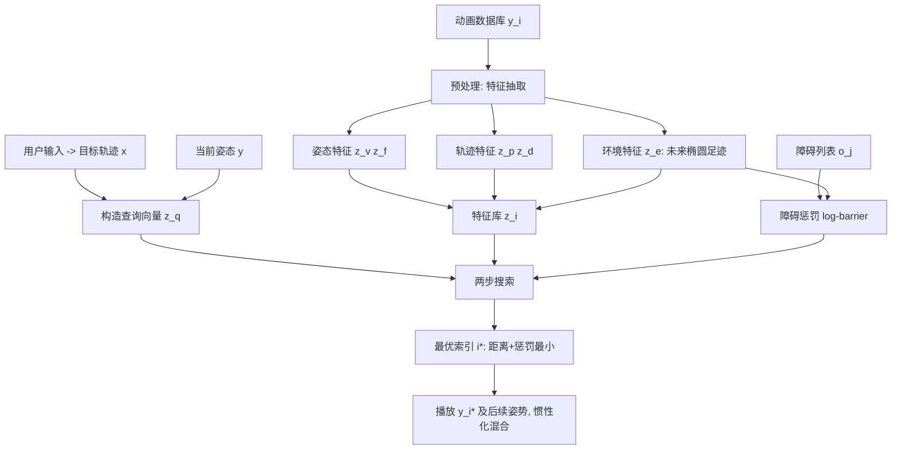

## 一句话总结

把简单的碰撞代理（2D 椭圆足迹）直接塞进 Motion Matching 的搜索循环里，让角色仅凭单人动捕库就能在拥挤、狭窄、含动态障碍的场景中，实时地同时调整全身姿态与根运动来自然避障，弥合了人群仿真里「轨迹规划」与「身体动画」长期割裂的问题。

## 研究背景

Motion Matching 是游戏工业中广泛使用的运动合成技术：它在一个庞大、无结构的动捕数据库中，实时搜索既贴合目标轨迹、又能与当前姿态平滑衔接的姿势序列。它的优势在于简单、迭代快、能保留动捕的高质量细节，因此在 AAA 游戏中长期沿用。

但一旦需要建模「与环境、与其他角色的交互」，标准 Motion Matching 就力不从心：要匹配的特征数量迅速膨胀，除了目标轨迹和当前姿态，还得考虑周围环境元素。常见做法要么是在场景中手工预设触发标记来播放特定动画片段（需要角色预对齐、灵活性差、人工成本高），要么用基于逆运动学的程序化动画（缺乏动捕的自然感）。

在人群仿真领域问题更明显：大量研究把身体动画当作独立于轨迹规划与避障的后处理层，导致身体运动与角色根运动不一致，产生脚滑等瑕疵。而真实的人类交互本质是双向的——身体姿态会影响轨迹选择，环境与潜在轨迹的约束反过来也会决定身体姿态（比如在狭窄走廊里选择侧身通过）。本文正是要在 Motion Matching 框架内恢复这种姿态与轨迹的双向耦合。

## 方法

### 整体框架

系统分两个阶段：预处理阶段从动捕库中为每个姿势抽取特征；实时阶段用一个环境感知控制器，结合用户输入、当前姿态、周围障碍进行搜索并播放动画。

### 关键设计

- **查询特征与环境特征的分离**：这是全文的核心抽象。**查询特征** $$\boldsymbol{z_q}=(\boldsymbol{z_v}\,\boldsymbol{z_f}\,\boldsymbol{z_p}\,\boldsymbol{z_d})\in\mathbb{R}^{27}$$ 会被拿去和一个目标查询向量做欧氏距离匹配，其中姿态特征是脚与髋关节的 3D 线速度 $$\boldsymbol{z_v}\in\mathbb{R}^9$$ 和脚关节 3D 位置 $$\boldsymbol{z_f}\in\mathbb{R}^6$$（保证非顺序转移时姿态连续），轨迹特征是未来 20/40/60 帧的 2D 位置 $$\boldsymbol{z_p}\in\mathbb{R}^6$$ 与朝向 $$\boldsymbol{z_d}\in\mathbb{R}^6$$（驱动角色跟随用户意图）。**环境特征** $$\boldsymbol{z_e}\in\mathbb{R}^9$$ 则不与任何目标向量直接比较，而是用来对场景做动态分析、计算惩罚因子。完整特征向量 $$\boldsymbol{z}=(\boldsymbol{z_q}\,\boldsymbol{z_e})\in\mathbb{R}^{36}$$。这种「匹配 vs 惩罚」的划分让新增/删除特征都很容易。

- **椭圆足迹作为碰撞代理**：环境特征用 2D 椭圆近似身体在地面的投影足迹。相比圆盘（只需半径一个数、但无法区分侧身与正走），椭圆只多两个数（半长轴向量 + 半短轴长度）就能编码不同身体朝向与形状，从而区分侧身、转身等动作；相比凸包或完整 3D 表示又省内存省算力。椭圆的半长轴由相邻角色位置的位移方向确定，半短轴取垂直方向，轴长由所有关节在两轴上的最大投影距离决定，并对未来 20/40/60 帧各建一个椭圆。

- **对数障碍（log-barrier）惩罚**：对每个未来椭圆与附近障碍算最小距离 $$d$$，再用受 Incremental Potential Contact 启发的障碍函数施加惩罚：$$f(d)=-(t-d)^p\log\!\left(\frac{d}{t}\right)$$（当 $$d<t$$，否则为 0）。其中 $$t$$ 是开始惩罚的距离阈值，$$p$$ 控制靠近障碍时惩罚增长的陡峭度。惩罚在接近 $$t$$ 时几乎为零、$$d\to 0$$ 时指数级爆炸，形成强排斥。第二、三个未来椭圆的惩罚还乘以更小的权重（$$\lambda_{40}=0.4$$、$$\lambda_{60}=0.1$$），因为优先规避即将发生的碰撞更重要。最终得分 = 加权查询距离 + 所有加权惩罚之和，取得分最小的索引 $$i^*$$。

- **双频率实时控制器**：每 $$n=10$$ 帧（60 Hz 应用）做一次搜索，收集附近障碍、构造查询向量、找到最优姿势，并计算从动画空间到当前角色空间的变换，搜索后用惯性化（inertialization）平滑混合；每帧则在动画库中前进一帧播放 $$\boldsymbol{y}^{(i^*+c+1)}$$。由于碰撞规避会让最终轨迹偏离输入轨迹，角色运动完全由动画库内嵌的根运动驱动，新目标轨迹总是从角色当前位置起算。

- **四个高层控制参数**：在底层特征权重之上，提供直观旋钮。**Responsiveness** $$\omega_r$$ 调整贴合目标轨迹的程度；**Continuity** $$\omega_c$$ 控制姿态连续性权重；**Evasion** $$\omega_e$$ 在靠近障碍时按 $$\lambda_d=\lambda_d^0\max\!\left(\omega_e,\frac{\lVert\boldsymbol{o}-\boldsymbol{p}\rVert}{t}\right)$$ 降低方向权重，让身体朝向能自适应障碍；**Anticipation** $$\omega_a$$ 按目标速度放大环境权重 $$\lambda_e=\max(\lambda_e^0\cdot\dot{v}\cdot\omega_a,\ \lambda_e^0)$$，让高速移动时也能提前避障而不必减速。

- **可扩展的额外环境特征**：框架不局限于 2D 椭圆。文中通过给每个椭圆再加最小/最大竖直分量两个数，实现高度特征，使角色能自动选择跳过栅栏或下蹲/趴下钻过低矮天花板。

### 性能优化

朴素实现里，环境特征依赖动态障碍，必须线性遍历数据库，随姿势数与障碍数线性增长，代价高昂。作者做了两类优化：

- **基础优化**（不改变行为、始终启用）：核心是**早期拒绝**——先算查询距离，只有低于当前最优才继续算惩罚；遍历障碍时一旦累计得分超过当前最优立即拒绝；先算第一个椭圆再算权重更低的后两个以加速拒绝；先处理简单障碍（圆盘）再处理复杂的（椭圆）。还预筛选轨迹附近的相关障碍（半径 $$r_{obs}+t+r_{ellipse}$$，$$r_{ellipse}=0.9$$ m），无障碍时退回 BVH 加速的纯查询搜索。配合面向数据的连续内存布局与 SIMD。

- **时间相干性优化**：引入最小搜索步长（stride $$k=8$$ 帧）与自适应阈值，预处理时挑出彼此至少 $$k$$ 帧、特征差异 ≥5% 的代表性特征向量，形成稀疏数组，先粗搜代表向量、命中后再在其邻域细搜，形成两级层次搜索。粗搜时按当前代表向量与当前最优的差异 $$s=\lVert\boldsymbol{z}^{(i)}-\boldsymbol{z}^{(i^*)}\rVert$$ 动态调步长：$$k'=\max\!\left(1,\ v\sqrt{\frac{s}{s^*}}\right)$$，$$v$$ 控制搜索激进程度。搜索还从上一帧最优索引附近约 1% 处起步，利用运动的周期性快速建立好的初始最优分以触发早期拒绝。

## 实验结果

系统在 Unity 中用面向数据编程与 Burst 编译器实现，在 i7-12700k 单线程 CPU 上运行搜索。作者在一个密集障碍的最坏情况环境里（角色跟随预定路径约 90 秒）做了性能与消融分析，指标包括：搜索耗时（ms，每 10 帧一次）、多样性（使用的不同姿势数）、轨迹误差（每帧偏离目标路径的米数）、碰撞时间（每次障碍相交的平均时长）。

| 配置 | 性能↓ (ms) | 多样性↑ | 误差↓ (m) | 碰撞时间↓ (s) |
| --- | --- | --- | --- | --- |
| Motion Matching（基线） | 0.22 ±0.05 | 1997 | 0.09 ±0.04 | 0.88 ±0.64 |
| Linear Search（仅基础优化） | 9.50 ±4.16 | 3305 | 0.12 ±0.06 | 0.05 ±0.04 |
| One Obstacle | 5.83 ±0.12 | 2103 | 0.09 ±0.04 | 0.79 ±0.67 |
| Disk（圆盘代理） | 0.90 ±0.22 | 3838 | 0.29 ±0.17 | 0.37 ±0.29 |
| No Adaptive | 2.40 ±0.70 | 3729 | 0.13 ±0.07 | 0.08 ±0.08 |
| No Dissimilarity | 1.62 ±0.17 | 3608 | 0.13 ±0.08 | 0.12 ±0.10 |
| Start 0 | 1.02 ±0.20 | 3807 | 0.16 ±0.10 | 0.06 ±0.12 |
| Large $$v$$ | 0.88 ±0.35 | 4389 | 0.37 ±0.34 | 0.12 ±0.10 |
| Ours（全部优化） | 0.80 ±0.16 | 4378 | 0.14 ±0.07 | 0.08 ±0.05 |

关键结论：

- 标准 Motion Matching 虽最快（0.22 ms，靠 BVH），但完全无视环境，约 30% 的时间都在穿模，且姿势多样性低（1997）；本文完整方法碰撞时间占比降到约 2%，多样性反而最高（4378），仅以略高的轨迹误差（0.14 vs 0.09 m）为代价——这是优先避障的合理权衡。
- One Obstacle 实验（模拟早期拒绝理想工作）仍需 5.83 ms，说明必须「跳过」特征向量而非仅靠早期拒绝；时间相干性优化把线性搜索的 9.50 ms 降到 0.80 ms，约十倍加速，且无障碍时性能与基线持平（0.22 ms）。
- 圆盘代理误差最高（0.29 m），因为无法区分动作类型，两角色在窄道相遇时会卡死；椭圆则能自然找到侧身序列通过。
- 数据库可扩展性分析（10 万姿势为 100% 基准，测到 400% 约 41 万姿势）显示实际增长斜率远低于线性预期，得益于早期拒绝丢弃大量数据库、以及相关障碍数受角色周围环境限制而有界。整个动捕库（约 18.5 万姿势、约 50 分钟）未压缩仅约 50 MB。

定性上，系统能在渐窄至 0.35 m 的走廊里从奔跑过渡到侧身，能在锥形障碍锯齿走廊仅凭「持续向前」一个输入生成丰富的绕行/侧身动作，能应对移动方块与冲来的汽车（自动后退跳避），能让多角色在不同宽度走廊相向通过时按需转身，还能与规则式人群系统集成、在窄门口产生自然的等待行为。仅靠替换动捕库即可切换动画风格（持道具、抬箱过头、收窄手肘等），约两小时即可采集出一套全新可用的动画库。

## 亮点与局限

亮点：

- 把碰撞代理直接融入 Motion Matching 搜索这一想法既简单又工程友好，能无缝接入现有 Motion Matching 管线，只需单演员动捕、无需多角色采集或障碍标注；
- 「查询特征 vs 环境特征」的抽象干净利落，新增交互类型（如高度特征实现跳/蹲/趴）几乎不改算法；
- 恢复了姿态与轨迹的双向耦合，直接解决人群仿真中身体动画与根运动脱节的老问题，且能从最简单的输入生成复杂行为；
- 一整套优化把朴素线性搜索加速约十倍达到实时，$$v$$ 参数还天然支持按角色调质量-性能权衡，适合人群的 LOD 策略；相比强化学习，无需训练、无灾难性遗忘/模式坍缩，扩展新运动模态或风格只需扩充数据库。

局限（作者自述）：

- 当前碰撞代理只基于骨架、不含实际网格或蒙皮，若需更高几何精度需在预处理阶段投影网格顶点，或改用凸包/完整 3D 表示；
- 无法严格保证无碰撞，因为轨迹与环境特征的姿势是以离散间隔（约 333 ms）采样的，采样点之间可能出现短暂穿插；
- 对用户输入的响应性存在固有权衡：像快节奏游戏那样要求对根运动精细直接控制时，本方法会为迁就环境约束而偏离精确目标轨迹，只能靠 Responsiveness 控制与充分多样的动捕库来缓解。

## 延伸思考

- 「把物理仿真里的障碍势能函数（IPC 的 log-barrier）借来做数据驱动搜索的软约束」是一个很有迁移潜力的思路：它把连续优化里的碰撞处理经验，低成本地嫁接到了纯检索式的动画框架上，而无需真正做物理仿真。
- 环境特征作为「不参与匹配、只算惩罚」的旁路信号，本质上是给检索加了一个可插拔的软约束通道。这套抽象或许能推广到更多非几何约束，例如社交距离偏好、注视/朝向舒适度、地形代价等，只要能定义成关于候选姿势的惩罚即可。
- 方法目前保证「自然运动」却牺牲了「轨迹精确性」和「无碰撞硬保证」。对于需要硬约束的场景（如严格禁止穿模的机器人/XR 交互），如何在检索得到候选后再叠加一层轻量投影/求解来消除采样间隙的穿插，是值得探索的补强方向。
- 作者提到的 budget-based 搜索（到达帧时间上限即终止）与按距离分配搜索激进度，指向一个完整的动画 LOD 体系；结合把每 10 帧一次的搜索负载跨帧分摊，理论上能支撑相当大规模的人群，这对实时人群渲染是很实际的工程价值。
