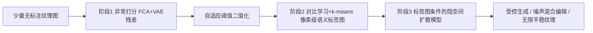

## 一句话总结

从少量无标注的材质照片出发，自动检测并聚类纹理上的"瑕疵特征"（污渍、裂纹、破洞、磨损等），再训练一个可交互控制的扩散模型，让用户像画笔一样在任意尺寸纹理上"绘制"这些非平稳特征。

## 研究背景

- 领域现状：自动纹理生成与贴图工具（如 Substance 3D Painter）多偏向"理想化、干净"的外观，真实世界材质常见的瑕疵往往靠美术师手动叠加预制 alpha 贴图或克隆图章刷来添加。已有基于单图的生成方法（SinGAN、GPNN、图像类比等）能复制特征，但难以融合多张图片的信息、也难保证过渡自然。
- 核心痛点：一是现有方法大多需要用户手动标注/框选相关特征，当需要几十张图覆盖某类特征的完整分布时，手工分割负担过重；二是大多数方法只能建模单一风化/瑕疵类型，且难以做到"空间可控 + 可交互 + 任意尺寸 + 忠于原图编辑"这几点同时成立。
- 本文 idea：把"找瑕疵"重新表述为全无监督的异常定位问题（因为瑕疵天然打破纹理的平稳性统计），自动检测后再做像素级对比学习聚类得到语义标签图，最后用标签图作为条件训练轻量扩散模型，串成一条"从小图集到可交互生成模型"的完整流水线。

## 研究背景中的关键能力主张

本文声称是首个同时具备以下四种能力的框架：从少量图片自动抽取正常与异常外观；生成兼具空间与语义控制、且可交互的纹理；在合成纹理和真实图像上都能通过特征迁移来绘制特征；生成任意大尺寸纹理而不产生分布漂移。

## 方法

整体框架是一条三阶段流水线：先做"显著特征打分"（无监督异常定位），再做"特征类型聚类"（对比学习 + $$k$$-means 得到像素级语义标签图），最后用标签图作为条件训练一个扩散模型来做受控生成、编辑与无限纹理合成。

关键设计分为四点：

1. **无监督显著特征打分**：输入是若干张大体平稳、但含瑕疵的照片。把瑕疵视为全局纹理中的异常，用零样本异常检测方法 FCA 作用于 VAE 重建残差上，为每张图得到一张异常分数图 $$A_i$$。这一步彻底去掉了以往方法需要的人工标注。

2. **自适应阈值 + 像素级聚类**：异常分数范围任意，需要先二值化。作者发现全局阈值和简单分位数都不通用，Otsu 又过于宽松，于是先用指数偏置 $$\hat{T}(A_i) = \mathrm{Otsu}(A_i^{\beta})^{1/\beta}$$（取 $$\beta = 1.5$$）压低误检，再取局部与全局阈值的较大者：$$T(A_i) = \max(\mathrm{Otsu}(\{\hat{T}(A_j)\}), \hat{T}(A_i))$$，这样完全平稳的纹理也不会被强行分出假异常区。二值掩码取连通分量得到区域，用预训练 WideResnet-50 特征算区域描述子，最近邻构成正样本对。关键观察是：naively 采负样本会因正常类过采样而失效，于是用分层采样（先按描述子 $$k$$-means 预聚类、各簇均匀取负样本）。正负对训练一个感受野 $$5 \times 5$$ 的 3 层 CNN，优化 InfoNCE 目标，最后对所有像素的对比特征做 $$k$$-means 得到语义标签图。

3. **标签图条件的隐空间扩散模型**：以标签图 $$\{L_i\}$$（0 为正常类，$$1 \ldots K$$ 为特征类型）作为条件，在 Stable Diffusion 的 VAE 隐空间里用 EDM（含其调度、预条件、Heun 求解器）训练扩散模型。做法是改造 ADM/EDM 的 U-Net：把标签图用小卷积网编码后加到时间步嵌入上，用卷积层为每个空间位置和通道预测各自的 scale/shift，实现细粒度空间控制。为支持"少到一张图"训练，先在 DTD 数据集（5640 张纹理、47 类，用类别标签作条件）上预训练，微调时标签图以 7.5% 概率丢弃以启用无分类器引导。生成 $$512 \times 512$$ 约 1 秒，满足交互目标。

4. **噪声混合编辑与无限平稳纹理生成**：编辑走扩散反演路线，用定点迭代 + Euler 求解器（Heun 在反演时不稳定）找到重建原图的噪声。核心是 noise-mixing：反演时保存各噪声层的无条件估计 $$\epsilon(z_i, \varnothing; \sigma_i)$$，生成时把它与新标签条件下的引导估计按步数自适应混合，混合因子随反演推进从 1 衰减到近 0（$$\alpha = 0.3$$ 控制衰减速度），编辑区外的背景混合因子设 0，从而只改目标区、忠于原结构。同一机制还支持把特征从原生类别迁移到分布外的真实图像。对于任意尺寸生成，借鉴 MultiDiffusion 用滑动窗口对重叠 patch 同时去噪、重叠区平均噪声估计，配合随机窗口偏移避免接缝、环绕包裹实现可平铺。为消除远距 patch 独立去噪导致的全局分布漂移，提出 noise-uniformization：把白噪声的低频分量替换成某个风格原型低频的随机置换，$$z_N = w - \mathrm{blur}(w) + \mathrm{upscale}(\mathrm{shuffle}(\mathrm{downscale}(\mathrm{blur}(p_N))))$$，既保持风格一致又避免重复图案。

## 实验结果

在异常检测数据集 MVTec 的 5 类纹理（每类约 100 张、每种异常约 20 张）上评估，并用手机额外采集 9 类小样本纹理（1 到 20 张，其中 3 类为单张图）做压力测试。特征检测与聚类的消融（在最优匹配到真值类别下计算指标）表明自适应阈值和分层负采样都是关键：

| 配置 | Accuracy↑ | IoU↑ | F1↑ |
|------|-----------|------|-----|
| 完整方法 | 0.978 | 0.473 | 0.566 |
| 去掉自适应阈值 | 0.963 | 0.320 | 0.407 |
| 去掉分层负采样 | 0.794 | 0.367 | 0.451 |

定性上，本文的像素级异常分割能把语义相近的特征归入同类、区域紧凑、正常像素映射到唯一类别，优于图像级方法 BlindLCA（像素级分割时标签嘈杂）和通用无监督语义分割 STEGO（因异常稀有而无法区分）。生成方面，模型能按标签图绘制多种形状大小的特征，并从"训练时每图单一异常类型"泛化到多特征绘制。编辑上噪声混合能让编辑区外几乎与原图一致（残差主要来自 SD 的 VAE 容量），高分辨率编辑可做到约 1.5 秒每次。方法还能扩展到 SVBRDF 材质贴图合成。

## 亮点与局限

- 亮点：
  - 首个把"自动检测 + 语义聚类 + 可控生成 + 忠实编辑 + 无限尺寸"打包进单一可交互模型的完整流水线，去掉了人工标注需求。
  - 噪声混合编辑既忠于原纹理结构、又能自然融合新特征，还能做跨类别的特征迁移到分布外真实图像。
  - noise-uniformization 与滑窗去噪解决了大尺寸纹理的分布漂移与接缝问题，且这两个算法（编辑、噪声均匀化）具有超出本任务的通用价值。

- 局限：
  - 结果真实度依赖输入掩码的合理性，掩码形状离训练分布太远时会退化。
  - 流水线非端到端可训练，自动聚类的分割瑕疵可能把不同特征映射到同一标签，此时模型靠标签形状来"猜"画哪种特征。
  - 推理虽快，但为新纹理类别训练扩散模型需 6 到 12 小时。

## 延伸思考

- 把异常检测重构成"打破平稳性"从而无监督定位瑕疵，是个漂亮的问题转换；这种思路或可反哺自监督异常检测——论文自己也提到可用来生成假异常。
- 用无分类器引导的方向差来实现特征迁移，本质上把"特征相对正常纹理的偏移"作为可搬运的量，值得在更一般的图像编辑里借鉴。
- 低频分量控制风格、并用"谱分布相似而非低频相同"来兼顾一致性与多样性的观察，和"扩散是近似谱自回归"的直觉一致，可能对其他大尺寸/无限生成任务通用。
- 与并发的基于文本提示添加磨损细节的工作相比，本文强调空间可控且保留未风化区域，二者思路互补，结合文本 + 示例条件或是自然的下一步。
