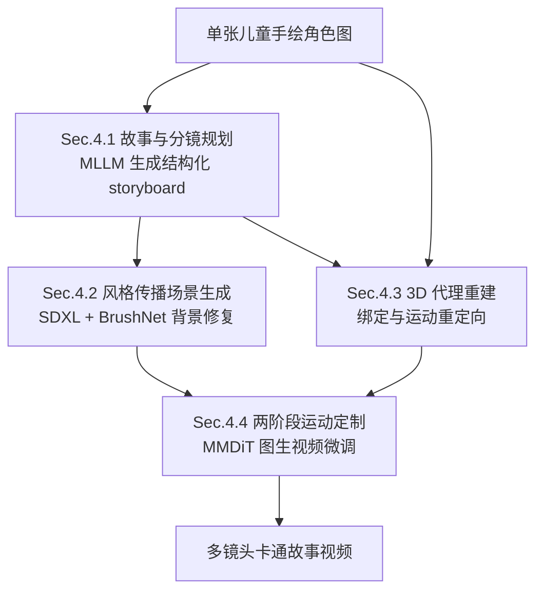

## 一句话总结

FairyGen 从一张儿童手绘角色图出发，先用多模态大模型规划分镜故事，再通过"风格传播 + 3D 代理驱动运动 + 两阶段运动定制"的解耦流程，自动生成风格一致、叙事连贯且运动自然的多镜头卡通故事视频。

## 研究背景

把儿童涂鸦变成连贯的动画故事，在教育、数字艺术治疗、个性化内容创作等场景中很有价值。但已有的故事可视化方法存在明显短板：早期的 GAN 或 Transformer 方法受限于数据规模与风格多样性；近来 LLM 驱动的模块化流水线（如 TaleCrafter、DreamStory）虽然可控性更好，却常出现角色不一致、叙事碎片化、运动质量差的问题；基于扩散的视频模型（如 MEVG、Vlogger）改善了时序连贯性，但仍难以同时兼顾跨镜头角色一致性、艺术风格保持与复杂运动生成。

这些问题在处理抽象手绘角色时尤为突出，因为单张手绘图的风格与训练数据分布差异很大。作者的核心思路是：显式解耦前景角色建模与风格化背景生成，用符合物理约束的 3D 重建来保持角色身份并生成合理运动，同时把背景生成当作从角色到场景的风格适配过程，从而在单样本条件下实现电影感的故事叙述。

## 方法

整体框架分为四个阶段：故事与分镜规划、风格一致的场景生成、基于 3D 代理的角色运动序列生成、以及基于运动定制的镜头动画合成。

关键设计：

1. **故事与分镜规划（Sec.4.1）**：用多模态大模型把单张角色图解构为分层叙事结构——全局叙事概述（角色外观、背景语境、主要事件）加镜头级 storyboard（每个镜头的背景设定、角色动作、相机构图）。再拆出动作规划（用 LLM 抽取动作关键词，从 3D 动画平台检索匹配动作后绑定重定向）与多镜头规划（用 LLM 生成裁剪背景的边界框，并渲染多视角保证一致性）。

2. **风格传播适配器（Sec.4.2）**：不同于传统从参考背景迁移风格，这里把风格从前景角色"传播"到背景。基于 SDXL，训练时只对前景 token 定制以学习艺术风格：$$y = Wx + PA(x \cdot m)$$；推理时借助 BrushNet 修复背景，只对背景 token 应用适配器：$$y = Wx + PA(x \cdot (1 - m))$$，其中 $$m$$ 为前景二值掩码。作者发现 DoRA 比原始 LoRA 更能捕捉笔触、色板、线条密度等风格细节。

3. **3D 代理驱动运动（Sec.4.3）**：借鉴传统图形学流水线，参考 DrawingSpinUp 从单张 2D 草图重建角色的 3D 几何代理，再做骨骼绑定与运动重定向，把复杂运动序列迁移到角色上，同时保持结构保真与视觉一致，为后续视频生成提供可靠的运动先验。

4. **两阶段运动定制 + 时间步偏移（Sec.4.4）**：受 DynamicConcept 启发，把外观学习与运动学习解耦。第一阶段用时序打乱的帧学习身份特征 $$y = Wx + A_{id}B_{id}x$$（对 $$B_{id}$$ 施加 dropout 以剥离时序偏置）；第二阶段冻结身份适配器，引入运动适配器，把运动建模为身份表征上的残差形变 $$y = Wx + A_{id}B_{id}x + A_{id}B_{motion}x$$。同时提出时间步偏移采样策略，用高斯采样加 sigmoid 变换 $$t = \sigma(z) = \frac{1}{1 + e^{-z}},\ z \sim \mathcal{N}(\mu, \sigma^2)$$，通过让 $$\mu$$ 偏向 $$T$$ 来加大对高噪声步的采样，迫使模型依赖全局结构而非低层像素线索，从而学到更平滑连贯的运动。

## 实验结果

实验基于 AnimatedDrawings 数据集，在单张 NVIDIA L20 GPU 上进行（风格学习约 120 分钟，运动定制约 180 分钟）。运动质量对比选用 VBench 的运动平滑度与主体一致性指标，并辅以用户研究。

| 方法 | Motion Smooth. | Subject Consist. | Motion Realness（用户） | Visual Quality（用户） |
| --- | --- | --- | --- | --- |
| Animate-X | 0.974 | 0.908 | 0.106 | 0.023 |
| Wan2.1-Fun | 0.977 | 0.842 | 0.114 | 0.106 |
| Ours | 0.987 | 0.955 | 0.780 | 0.871 |

在运动平滑度、主体一致性以及用户对运动真实感与视觉质量的偏好上，FairyGen 均明显领先姿态引导的 Animate-X 与深度引导的 Wan2.1-Fun。风格对比中，本方法在风格相似度上也超过 B-LoRA、InstantStyle 与 DreamBooth（用户研究共收集 3360 条意见）。

## 亮点与局限

亮点：
- 显式解耦前景角色与背景生成，用 3D 代理承接复杂运动，规避了直接靠视频扩散先验生成复杂运动的难题，天然利于长视频与多事件叙事。
- 风格从角色"传播"到背景的思路新颖，配合 DoRA 能较好保留手绘笔触与线条风格。
- 时间步偏移采样被验证为提升图生视频运动学习质量的关键技巧。

局限：
- 目前只展示单角色结果（作者认为可用多个 3D 代理扩展到多主体）。
- 前景角色或动物有时无法被 3D 代理正确重建，需要更先进的绑定方法。
- 受视频扩散生成先验不可控的影响，有时背景保持静止而只有前景运动（例如奔跑场景），需要更换图生视频模型并引入更多相机运动来改善。

## 延伸思考

FairyGen 展示了"图形学 3D 代理 + 生成式扩散"混合路线在单样本、跨域风格场景下的价值：当纯数据驱动的生成先验难以覆盖抽象手绘分布时，引入显式的几何与运动结构能显著提升可控性与一致性。这种解耦思路可能进一步推广到多角色交互、可控相机运动，乃至把 storyboard 规划与运动检索做成可交互的创作闭环。另一方面，方法对 3D 重建质量与背景静止问题的依赖，也提示未来在鲁棒绑定、动态背景生成上仍有较大改进空间。
