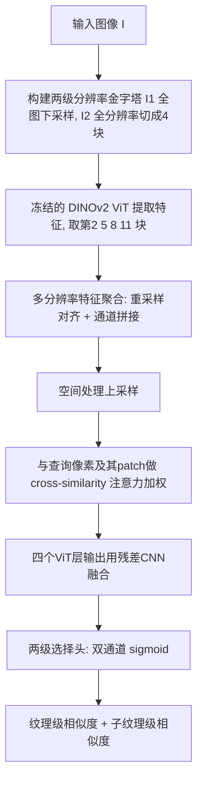

## 一句话总结

本文提出一种图像材质选择方法：给定一张图像与用户点击的像素，输出与该像素材质相似的所有像素，且同时支持"纹理（texture）"与"子纹理（subtexture）"两种粒度；借助 DINOv2 特征、多分辨率处理与多查询采样，并配合新构建的 80 万+ 张合成图像数据集 DuMaS，在选择精度与一致性上显著超越前作 Materialistic。

## 研究背景

选择（selection）是众多图像编辑流程的第一步——给定图像和用户输入（如点击一个像素），目标是找出图像中与该输入共享某种属性的其他像素。选择可以按颜色、物体或材质进行；其中按材质选择尤为有用，因为它能跨物体、跨物体内部地一次性框住共享同一材质的区域，便于后续统一编辑，也为逆向渲染与场景理解提供关键信息。

已有代表性工作 Materialistic 从预训练视觉 Transformer（ViT）提取特征并做空间处理来实现选择，但存在两方面局限：

- ViT 的分词 patch 尺寸与较小的工作分辨率限制了选择精度，尤其在边缘和细结构处表现差。
- 其训练所用合成数据把材质定义为"带纹理的表面"（如带重复花纹的墙纸），无法选择共享相似子纹理属性的图像元素——例如重复花纹里外观相近的某一部分。

物体级选择方法（如 SAM/SAM2）针对的是"离散物体"，而材质选择要识别的是"共享点击像素材质的区域"，与物体边界无关：一个物体可含多种材质，一种材质也可出现在多个物体上。此外，表面感知外观受几何、光照、周围表面等因素影响，单图分解为物理成分本身就很困难，可用的稠密材质标注数据也大多只有粗粒度语义标签。

## 方法

模型输入一张图像与一个查询像素，输出该查询在纹理级与子纹理级两个层次上的逐像素材质相似度，经阈值化即得二值选择掩码。整体架构沿用 Materialistic 框架，并做三项关键改进。

### 改进 1：多分辨率处理与特征聚合

ViT 分词会大幅降低输入图像分辨率，损害边缘与细结构精度。方法据此对输入图像在多个分辨率下提取特征。给定输入图像 $$I$$，构建 $$n$$ 级分辨率金字塔 $$\{I_1, I_2\}$$：$$I_1$$ 是编码器原生分辨率（DINOv2 为 $$r=518$$）的下采样版本，$$I_i$$ 为 $$2^{i-1}$$ 倍更高分辨率版本，并保证其分辨率能被 patch 尺寸 $$ps$$ 整除以对齐各分辨率的特征图。每个 $$I_i$$ 被切成 $$2^i$$ 个不重叠、各为 $$r\times r$$ 的 tile。实践中 $$1024\times 1024$$ 训练图被下采样得到 $$I_1$$，$$I_2$$ 用全分辨率略微缩放后切为四块。各 tile 送入编码器，从四个 Transformer 块得到特征图 $$F_{ij}$$（分辨率 $$i$$、块 $$j$$）。

聚合时先把所有特征图重采样到目标分辨率（各块目标分辨率不同），再沿通道维拼接，并保持 tile 重排后的原始图像布局：

$$
F_{agg,j} = \mathrm{Concat}(\{\mathrm{Resample}(F_{ij})\}_{i=1}^{n})
$$

与前人多分辨率聚合（总是把高分辨率特征下采样后再拼接）不同，本文按各块目标分辨率自适应上/下采样，特意保留最高分辨率的空间细节；且拼接优于取平均，因为拼接同时保留细粒度与更广的上下文信息。实验发现两级 $$n=2$$ 已足够，三级在当前训练分辨率下收益不明显却大幅增加算力。

### 改进 2：两级表示

模型以两条各带 sigmoid 激活的输出通道，分别输出纹理级与子纹理级相似度图，二者联合训练，在 DuMaS 数据集上最小化二元交叉熵（BCE）损失。纹理级与 Materialistic 一致（如棋盘的黑白格会被一起选中），子纹理级则可把外观相近的纹理子成分单独选出（黑格与白格分开选）。

### 改进 3：训练时多查询采样

训练时每张图采样多个查询像素、覆盖多种材质，而非只采一个像素。这类似于提高有效 batch size，复用编码器计算，使优化更稳定，并提升选择的鲁棒性与精度——尤其有助于让"同一批次里出现相同反照率不同材质、或强光照变化下同材质"等困难样本，从而改善梯度。实现上每个裁剪块均匀采样 10 个像素。

### DuMaS 数据集

方法依赖新构建的合成数据集 DuMaS（Dual-level Material Selection），含 80 万+ 张室内外场景图像，规模是 Materialistic 数据集的 16 倍以上，且同时提供纹理级与子纹理级的稠密逐像素标注。构建流程：从 Substance Designer 的 12 个基础噪声图案随机采样生成参数得到 1,571 个二值掩码；用掩码作为 alpha 通道把 3,026 个平稳（stationary）反射率贴图两两组合（每个掩码采 5 对，共 7,855 个纹理贴图），最终得到 10,881 个唯一材质贴图。将这些材质随机指派到 Evermotion 的 132 个场景（119 室内、13 室外），每场景 5 种指派共 660 种配置，保持原场景中物体间的材质关系；透明与自发光材质保持不变。标注规则：若物体被指派初始反射率材质，则两级 ID 相同；若被指派纹理材质，纹理级存该纹理 ID、子纹理级存其构成反射率贴图 ID。按第一人称漫游相机轨迹以 30fps 渲染每场景最长 1 分钟视频，每帧 $$1024\times 1024$$、256 spp、Blender Cycles 4.2，共 816,415 帧（约 250 天 GPU 渲染）。以视频形式渲染便于微调 SAM2 等视频选择模型。

训练细节：在 DuMaS 上训 10 个 epoch，Adam 优化器学习率 1e-4，4 张 A100-40GB、DDP、每卡 batch 4；训练时按 ViT 分辨率随机裁剪，并做随机曝光、饱和度、亮度增强。DINOv2 采用 ViT-B/14（$$ps=14$$、特征维 $$d=768$$），取第 2、5、8、11 块的中间特征。

## 实验结果

在两个真实图像测试集上评测：Materialistic Test（50 图，纹理级标注）与本文新建的 Two-Level Test（20 图，两级标注，含强光照变化、室内外、杂乱细结构、高频外观等挑战场景），每图采 10 个查询像素。对比 Materialistic 与在 DuMaS 上微调的 SAM2。指标含 L1（越低表示与真值越吻合、置信度越高）、IoU、F1（阈值固定 0.5）。灰色数字表示该方法评测于其非训练目标的任务。

| 方法 | Mat.Test 纹理 L1↓ | IoU↑ | F1↑ | Two-Level 子纹理 IoU↑ | Two-Level 纹理 IoU↑ |
| --- | --- | --- | --- | --- | --- |
| Materialistic | 0.057 | 0.858 | 0.906 | 0.513 | 0.657 |
| Materialistic + DINOv2 | 0.069 | 0.838 | 0.890 | 0.463 | 0.636 |
| Materialistic + DuMaS | 0.043 | 0.858 | 0.904 | 0.615 | 0.680 |
| SAM2 + DuMaS | 0.060 | 0.784 | 0.847 | 0.576 | 0.730 |
| Ours | 0.030 | 0.896 | 0.935 | 0.673 | 0.750 |

结果显示：本文方法在两级选择的所有指标上均最优。Materialistic 换用 DINOv2 编码器反而略降，因其更大的 patch（14 对 8）导致特征分辨率更低、显著影响边缘表现——这恰恰凸显多分辨率流水线的价值。相比 Materialistic，本文预测更锐利干净；相比微调后的 SAM2（Hiera 编码器、patch 更小、分辨率翻倍，边缘锐利），本文误报（false positive）更少，而 SAM2 倾向过度选择外观相近区域。

一致性评测（像素、缩放、光照，用平均成对 Hamming 距离衡量，越低越好；仅测一致性不测精度）中，本文比 Materialistic 一致性约高 1.8 倍。Materialistic 在 DuMaS 上训练后一致性大幅提升（说明数据集多样性的贡献），而本文架构与训练法进一步增强一致性，在更难的 Two-Level Test 与 Multi-Illumination 数据集上尤为明显；相比 SAM2+DuMaS 一致性略优且精度更高。

消融显示：将 DINOv2 换成 DINO 或 Hiera 精度与置信度均下降（二者更偏向颜色与光照）；多分辨率聚合大幅改善细边缘（如篮球网）表现；多查询采样整体提升精度（尤其纹理级）并显著降低对阈值的敏感度；在 30 个困难样本子集上，多采样带来约 50% 更低 L1、20% 更高 IoU；纹理级与子纹理级联合训练不损害性能，支持"联合估计有益于精度"的假设，可用单一模型同时输出两级。应用上，子纹理级掩码可在 Photoshop 中对材质做精细编辑（如衣裙上的花朵、靠垫与墙纸上的鹿）。

## 亮点与局限

亮点：
- 提出两级（纹理 / 子纹理）可控粒度的材质选择架构，把"相似材质"的定义细化到纹理子成分层面。
- 改进的训练方案：多查询采样提升稳定性与鲁棒性，多分辨率处理与特征聚合大幅提升边缘与细结构精度。
- 贡献 DuMaS 大规模合成数据集（80 万+ 图、两级稠密标注），并将公开模型、测试代码与数据集的重要子集，同时建立选择质量与鲁棒性的基准。

局限：
- 点击在离焦（out-of-focus）区域可能导致错误选择，模型难以区分焦外花瓣并错误激活背景区域。
- 含长地平线、因透视产生强烈频率变化的图像也可能出问题，近处花排被选中而远处未被选中（或相反）。
- 子纹理的定义难以推广到连续渐变表面（如彩虹墙），需要更连续的相似度定义。
- 作者不宣称已彻底解决材质选择固有的歧义性：面向不同下游目标，"何为同一材质"可能需要不同定义。

## 延伸思考

这项工作的核心在于把"材质选择"从单分辨率、单粒度推进到多分辨率、双粒度，并用大规模合成数据补足细粒度标注的稀缺。其思路值得借鉴之处有二：一是多分辨率 tile 拼接策略——在冻结的大视觉模型之上，用切块+原生分辨率并行提特征再对齐拼接，以较低代价"绕过"ViT 分辨率瓶颈，这一模式可迁移到其他依赖 ViT 特征的稠密预测任务；二是"子纹理"这一新粒度层次，实质是在承认材质选择本身歧义的前提下，提供多层次输出让用户/下游按需取用。作者点出的离焦、长地平线频率变化、连续渐变表面等失败案例，都指向"相似度定义应更依赖上下文与深度"的方向；引入显式景深、大尺度室外数据，或用连续相似度替代二值同/异判定，可能是把这类选择工具推向更通用图像编辑场景的关键。
