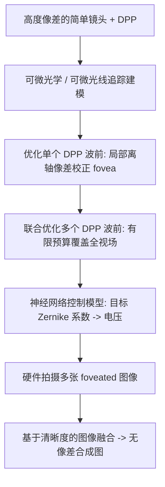

## 一句话总结

本文提出 Fovea Stacking：用一片可动态变形的相位板（deformable phase plate, DPP）在一个高度像差的简单镜头系统里，对图像中任意局部区域（"中央凹" fovea）做实时像差校正，再把多张不同校正位置的局部清晰图像"堆叠"融合，得到一张全画幅无像差的图像，从而以更少的光学元件逼近复杂镜头的成像质量。

## 研究背景

为了把相机做得更小，业界一直在探索用更少镜片的计算成像系统。但简化光学系统会带来严重像差，尤其在离轴（off-axis）区域，纯靠软件很难校正。传统高质量成像依赖精心设计的复杂镜组同时校正轴上与轴外像差，而这种设计范式的进一步小型化正逼近物理极限。

近年出现的动态可调光学元件带来了新的设计范式。最广为人知的是液体可调透镜（liquid tunable lens），已小到可用于手机。更新的一类是可变形相位板 DPP：它是一层夹在可变形薄膜与刚性玻璃之间的充液光学腔，通过对薄膜背面 63 个透明六边形电极施加电压产生静电力来控制局部液面形状，可校正到第七径向 Zernike 阶的畸变。与反射式可变形镜（需要折叠光路）和液晶空间光调制器（需偏振光、波长依赖强）相比，DPP 是一种透射式、宽波段的折射式波前调制器，更适合做紧凑光学系统。

本文的核心思路借鉴人眼的中央凹与"扫视"（saccade）：光学系统无法同时在全画幅校正所有像差，但可以用 DPP 把一块清晰的 fovea 区域动态放到画面任意位置；多次扫视再融合，就能覆盖整个视场。

## 方法

系统由一枚高度像差的消色差双胶合镜（achromatic doublet）和一片 DPP 组成。整体流程分三块：用可微光学优化 DPP 波前以定位并覆盖 fovea；用神经网络控制模型把目标波前映射到真实电压；最后把捕获的图像堆叠融合。

### DPP 波前建模与可微优化

DPP 的充液腔厚度仅 $$55\mu m$$，可视为一块做相位调制的薄板。基于费马原理与广义斯涅尔定律，在可微光学系统里把 DPP 建模为一个按其引入的光程差（optical path difference, OPD）来偏折光线的折射面。入射与折射光线方向满足

$$
\alpha' = \alpha + \frac{\partial D(x,y)}{\partial x}, \quad \beta' = \beta + \frac{\partial D(x,y)}{\partial y}, \quad \gamma' = \sqrt{1 - \alpha'^2 - \beta'^2}
$$

其中 $$D$$ 是 OPD，用 Zernike 多项式参数化：

$$
D(\rho, \varphi) = \sum_{k}^{K} w_k Z_k(\rho, \varphi)
$$

$$\rho$$ 是归一化径向距离，$$\varphi$$ 是方位角，$$w_k$$ 为待优化系数（按 OSA 索引）。水平/垂直倾斜项只会造成几何畸变、导致图像间像素错位而不改善清晰度，因此固定为零、排除在优化之外；径向镜头畸变也不校正，因为只要 DPP 不引入倾斜，它在整叠图像里保持一致。

### 单波前优化：离轴 fovea 成像

对某个离轴角 $$\phi$$，采样并追踪光线穿过 DPP 与镜头到达像面，用 RMS 光斑尺寸（RMS spot size）作为损失，反向传播优化 DPP 波前。对距离 $$D$$ 处的物点 $$P$$，在孔径面采样 $$N_a$$ 条光线，追踪到像面位置 $$p_{i\lambda}$$，损失为多波长积分的均方半径偏差：

$$
r(P) = \frac{1}{3} \sum_{\lambda}^{3} \frac{1}{N_a} \sum_{i}^{N_a} \| p_{i\lambda} - \bar{p} \|_2
$$

RMS 光斑尺寸与调制传递函数（MTF）曲线下面积密切相关，是镜头设计常用损失。为改善收敛，每升一个 Zernike 阶就把该阶系数的学习率降低 $$\sqrt{10}$$ 倍。实验表明，仅优化 defocus 项（等价于对焦/液体透镜）只能缓解场曲，而优化到第四阶 Zernike 才能有效校正离轴像差。但 fovea 的清晰区域大小随位置变化：越靠近画面边缘，fovea 越小，需要更多张图像覆盖；估计要约 100 张才能让整块方形传感器都超过 30 lp/mm 的清晰度阈值。

### 联合优化：有限预算覆盖全视场

逐块独立校正 ROI（ROI tiling）没有利用整叠图像的信息，效率低。作者提出对整叠 RMS 光斑网格做联合优化。在给定深度对全视场采样 $$H\times W$$ 网格，对 $$N$$ 个 DPP 波前分别追踪得到 RMS 光斑网格 $$\{r_n(i,j)\}$$。融合后每个位置的质量取决于整叠中的最小光斑，因此定义网格堆叠损失：

$$
L_{gs} = \frac{1}{H\times W} \sum_{i,j} r_{min}(i,j), \quad r_{min}(i,j) = \min_n r_n(i,j)
$$

这样每个波前只在它"表现最好"的区域被优化。但预算增大时可能出现某些波前处处都不是最优、没有活动区域的退化情况。为此再加一个难区加权损失，鼓励这些波前去优化困难区域：

$$
L_{hr} = \sum_{n'} \frac{1}{H\times W} \sum_{i,j} r_{n'}(i,j)\frac{r_{min}(i,j)}{\bar{r}_{min}}
$$

其中 $$n'$$ 取那些没有成为任何位置最优（掩码索引 $$n^*(i,j) = \arg\min_n r_n(i,j)$$）的波前。联合总损失为

$$
L_{joint} = L_{gs} + L_{hr}
$$

优化出的 PSF 网格呈现互补的、径向对称的模式。效率分析表明：联合优化仅用 3–5 张图像就能显著提升整体质量，明显优于 ROI tiling；超过约 10 张后收益趋于饱和。

### DPP 神经网络控制模型

早期工作用线性模型，假设期望的薄膜形状与电极电压平方成线性关系 $$W = AV^2$$（$$W$$ 为 Zernike 系数，$$V^2$$ 为 63 个电极电压的逐元素平方，$$A$$ 为标定得到的影响矩阵，$$V_{max}=270V$$）。但该模型有两个缺陷：在 Zernike 空间工作难以判断目标形状是否物理可实现；且大幅变形时线性假设失效。

作者改用编码器-解码器神经网络，直接在电压空间控制以保证可行性。解码器用双分支结构（线性分支建模整体线性、sigmoid 分支建模残差非线性），输入扩展为 $$[V, V^2]$$，以残差学习方式在线性模型基础上做非线性修正；编码器则用两层 MLP 直接从波前系数预测控制电压，末端 sigmoid 约束在物理电压范围内。

训练数据用定制的编码波前传感器（coded wavefront sensor, CWFS）测量：随机采样 Zernike 系数施加电压，测得 OPD 并拟合系数，共采 1800 组电压-系数对（80% 训练、20% 测试），并对 Zernike 系数加噪声（标准差 0.36）做数据增强。结果显示神经网络模型的训练/测试损失显著低于线性模型、逼近测量下限，且在大变形下误差保持稳定，而线性模型误差随幅度增大而恶化。控制策略比较中，"编码器+解码器"（用编码器预测值初始化电压，再通过解码器反向传播优化）在控制电压误差和实测波前误差上都最优，尤其对二阶及以上的高阶像差。

### 图像融合

由于硬件不完美（波前保真度偏差、标定误差）以及扩展景深应用中场景深度任意变化，直接用预优化掩码 $$n^*$$ 做像素级融合会在区域边界产生伪影。作者发现基于深度学习的 Focus Stacking 方法通常在空间不变的圆盘模糊核上训练，难以适应 fovea 成像里多样的 PSF。因此采用传统融合流程：用拉普拉斯算子检测清晰区域再模糊，融合图每个像素取整叠的清晰度加权平均。方法虽简单，却能稳定产出高质量、像差校正后的图像。

### 原型系统与标定

原型由 DPP（Phaseform Delta 7）、50mm 消色差双胶合镜（Thorlabs AC-254-050-A，装在可调后焦的变焦筒 SM1ZM 内）和 Bayer RGB 传感器（FLIR GS3-U3-41C6C-C，$$5.5\mu m$$ 像素、$$2048\times2048$$）组成，系统总长 15cm，已紧凑到可在实验室外使用。用基于图像的可微光学标定：通过匹配拍摄图像与仿真图像来优化未测量的装配距离（DPP 到镜头、镜头到传感器等），并用 SSIM 比较局部结构而非像素值以应对显示与传感器响应差异。

## 实验结果

作者在硬件原型上验证了三类应用：

- 远距离像差校正成像：在 60m 处联合优化 5 个相位并拍摄。单张图像有明显离轴像差；Focus Stacking（同样张数、只用 defocus）只能部分补偿场曲；Fovea Stacking 在细结构分辨率和文字可读性上明显更好。基于清晰度的融合比预优化掩码融合边界更平滑、伪影更少，且清晰度图与预优化掩码高度吻合。
- 扩展景深成像：在 535–835mm 视差空间均匀采样三个平面、每面 5 个相位共 15 张。单张受离焦与离轴像差双重限制；Focus Stacking 只修离焦、边缘仍受离轴像差限制；Fovea Stacking 两者兼修，细节更清晰。与 Laplacian Pyramid、IFCNN、MGDN、DEReD 等融合方法相比，成对融合网络（IFCNN、MGDN）在顺序融合整叠时损失清晰度，DEReD 过拟合训练数据出现色相偏移，传统 Laplacian 清晰度接近但在文字与条码分辨率上稍逊，本文方法整体质量最高。作者归因于 fovea 成像引入了与传统 Focus Stacking 训练域不同的 PSF，而传统清晰度/拉普拉斯方法对模糊核不敏感。
- 目标跟踪的注视成像：一辆小车以 1mm/s 在平移台上移动（距相机 652mm）。因逐位置反向传播优化太慢，改为在 $$9\times9$$ 网格上预优化 DPP 变形并线性插值估计任意位置的控制电压。DPP 响应时间小于 55ms，但等待 200ms 确保变形稳定后再拍下一帧。无调制时边缘模糊；自适应对焦跟踪校正场曲改善局部质量；Fovea 跟踪则在整段视频中保持目标清晰。

## 亮点与局限

亮点：
- 提出 Fovea Stacking 新范式：用一片折射式动态波前调制器（DPP）配合简单镜头，通过"局部校正 + 扫视堆叠"逼近复杂镜组的成像质量，指向更小型化的相机光学。
- 联合优化框架让 3–5 张图像即可完成全视场像差校正，大幅降低扫视次数与成像预算。
- 神经网络控制模型（残差解码器 + 直接预测电压的编码器）解决了 DPP 大变形下的非线性问题，缩小仿真与真实硬件的差距，并天然保证波前可实现性。
- 全部能力在紧凑（15cm）、可出实验室的硬件原型上验证，还展示了扩展景深与目标跟踪等下游应用。

局限：
- 像差校正能力受硬件最大可达变形量限制，作者建议未来级联多片薄 DPP 来突破。
- 基于神经网络的融合方法无法适应 fovea 成像的模糊核，只能退回传统清晰度融合。
- 跟踪应用受 DPP 稳定时间制约（每帧需等 200ms），实时性有限。

## 延伸思考

这篇工作把"人眼中央凹 + 扫视"的生物直觉搬进计算相机：不追求一次成像处处清晰，而是让光学元件动态地把有限的校正能力投放到最需要的局部，再用时间维度上的多次曝光换取空间上的全画幅质量。这与端到端可微光学、以及"用软件补偿硬件简化"的大趋势一脉相承，其价值在于给出了一条依赖折射式、宽波段、可小型化的动态元件的现实路径，而非需要偏振光或折叠光路的方案。真正的瓶颈在器件本身——变形幅度与响应速度。一旦 DPP 像液体透镜那样成熟小型化，这类"光学做粗、扫视做细、计算做融合"的架构有望重塑移动端成像的设计边界。此外作者提到的方向也很有想象力：foveated 成像本质是把 3D 场景投影成多个 2D 视角，不动相机就能重建更精细的 3D 细节，进而用当前 3D 估计反过来指导自适应扫视，形成感知与成像的闭环。
