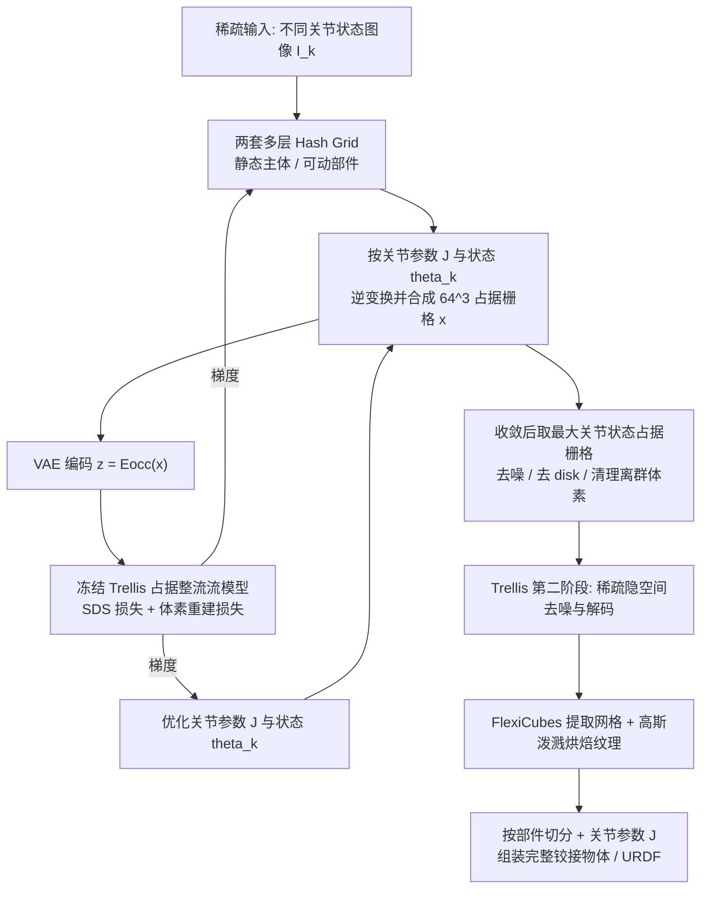

## 一句话总结

FreeArt3D 把原本为静态物体设计的预训练 3D 扩散模型（Trellis）当作形状先验，将 Score Distillation Sampling 从 3D 扩展到"3D 到 4D"，把关节运动当作额外的生成维度，从而在无需专门训练、无需铰接物体数据集的情况下，仅用几张不同关节状态的稀疏视图，几分钟内联合优化出高保真几何、真实纹理与准确关节结构的铰接三维物体。

## 研究背景

铰接（articulated）三维物体在机器人、数字孪生、AR/VR 与动画中无处不在，准确刻画其几何、外观与底层运动学结构十分关键。已有工作分两条路线：

- **基于优化的重建**（NeRF 或 3D Gaussian Splatting）：能恢复精细几何，但计算量大、需要稠密多视图监督，难以规模化。
- **前馈生成模型**：从类别、关节图或单图直接生成，速度快，但常用包围盒、模板部件或小规模检索库来近似几何，导致形状粗糙、缺乏细节，且大多忽略表面纹理。

与之对比，静态物体的开放世界三维生成已相当成功，尤其是 Trellis 这类原生 3D 扩散模型能生成高质量几何与真实纹理并具备良好泛化。但把它们直接迁移到铰接物体面临两大难题：其一，铰接物体需要同时表达多部件几何与运动学结构；其二，现有铰接数据集通常只有几千个形状，比静态物体数据集小几个数量级，难以训练扩散模型。FreeArt3D 的思路是：不再训练新模型，而是复用静态 3D 扩散先验来监督逐实例优化。

## 方法

### 整体框架

给定一个铰接物体在 $$K$$ 个不同关节状态 $$\{\theta_k\}_{k=1}^{K}$$ 下拍摄的稀疏 RGB 图像 $$\{I_k\}_{k=1}^{K}$$，FreeArt3D 将问题建模为逐实例优化。为简化，先考虑单关节物体，把物体拆成静态主体 $$M_{body}$$ 与可动部件 $$M_{part}$$ 两套带纹理网格；关节参数 $$J$$ 依关节类型而定：旋转关节包含单位旋转轴 $$a$$ 与轴上枢轴点 $$p$$，关节状态 $$\theta_k$$ 为绕 $$a$$ 的旋转角；平移关节仅含平移轴 $$a$$，$$\theta_k$$ 为沿轴平移量。若关节状态未知，则一并优化。

每次迭代采样一张图像 $$I_k$$，按对应关节状态变换可动部件并与静态主体合成为该状态下的铰接网格，再连同图像送入冻结的 3D 扩散模型 Trellis 获取梯度信号，驱动几何与关节参数的优化。

### 关键设计

1. **把 SDS 从 3D 扩展到 3D-to-4D**。用两套连续可优化的多层 hash grid $$H_{body}$$、$$H_{part}$$ 表达规范帧下两部件的占据场；每次迭代按逆铰接变换 $$T^{-1}_{\theta_k}$$ 把体素坐标映回规范帧并取最大值 $$x(c)=\max\left(Occ_{body}(c),\ Occ_{part}(T^{-1}_{\theta_k}(c))\right)$$ 合成占据栅格。编码为隐向量后送入冻结的整流流模型，按 DreamFusion 的 SDS 流程加噪并计算 $$L_{SDS}$$；由于直接把"每个关节状态对应的完整 3D 形状"喂给 3D 扩散模型，避免了 2D SDS 常见的多视图不一致（Janus 问题），监督更丰富、收敛更快。

2. **体素空间重建损失**。额外引入 $$L_{vox}=\lVert D_{occ}(\hat z_0)-x\rVert_2^2$$，鼓励合成占据与去噪预测一致，稳定优化。总损失为 $$L_{total}=\lambda_{SDS}\cdot L_{SDS}+\lambda_{vox}\cdot L_{vox}$$。

3. **跨关节状态的尺度归一化（disk 归一化）**。由于 Trellis 把训练形状都归一化到单位包围盒，同一物体在不同关节状态下静态主体的尺度会剧烈变化，破坏几何对应、甚至导致优化崩塌。方法在所有输入视图物体下方加入一块固定的大参考圆盘（形如地毯/地板），作为尺度与空间对齐的视觉锚点，使扩散模型以固定元素为参照稳定预测部件尺寸；收敛后圆盘可安全移除。消融显示该策略对成功率至关重要。

4. **关节与几何初始化 + 精细化生成**。先对每张图独立跑 Trellis 推理生成各状态网格，渲染后用 LoFTR 等 2D 对应检测器建立跨视图对应并提升到 3D 点对，过滤静态点、仅保留可动部件点对，最小化 3D 距离估计 $$J$$ 与 $$\theta_i$$ 的初值；几何则以初始关节状态推得的占据栅格为初始化。粗几何收敛后，取最大关节状态的合并占据栅格注入小噪声并单步去噪清理、去掉 disk 平面与离群体素，送入 Trellis 第二阶段稀疏整流流模型解码出 FlexiCubes 系数与高斯泼溅参数，分部件提取网格并烘焙纹理，最后与关节参数组装为完整铰接物体。

## 实验结果

在 PartNet-Mobility 的 12 个类别（每类随机 12 个形状，共 144 个测试形状）上评测，与 Articulate-Anything、Singapo、URDFormer、PARIS 对比。下表为所有方法都能处理的五个类别上的平均（Average-5），指标含 F-Score↑、Chamfer Distance↓、CLIP 相似度↑、关节轴向误差↓、关节枢轴误差↓：

| 方法 | F-Score↑ | CD↓ | CLIP-Sim↑ | Axis-Err↓ | Pivot-Err↓ |
| --- | --- | --- | --- | --- | --- |
| FreeArt3D（本文） | 0.883 | 0.026 | 0.882 | 0.208 | 0.171 |
| Articulate-Anything | 0.817 | 0.036 | 0.876 | 0.527 | 0.168 |
| Singapo | 0.832 | 0.031 | 0.859 | 0.247 | 0.101 |
| URDFormer | 0.679 | 0.054 | 0.817 | 1.258 | 0.312 |
| PARIS | 0.776 | 0.035 | 0.783 | 1.247 | 0.186 |

本文方法在几何（F-Score/CD）、外观（CLIP）与关节轴向误差上整体领先；在 Articulate-Anything、PARIS 与本文都支持的 12 类平均（Average-12）上 F-Score 达 0.891、CD 0.025。运行时约 606 秒（单张 H100），慢于检索类方法但快于优化类的 PARIS（494s）。消融显示：去掉 SDS 损失 F-Score 从 0.892 跌到 0.610，去掉 disk 归一化跌到 0.749，随机关节初始化时轴向误差从 0.155 恶化到 1.024；6 视图输入下整体成功率约 77.08%。

## 亮点与局限

亮点：

- **免训练、免铰接数据集**：直接复用静态 3D 扩散先验，绕开铰接数据稀缺的根本瓶颈，泛化到 12 类乃至真实拍摄图像。
- **概念上的干净扩展**：把关节状态当作生成的额外维度，将 SDS 从 3D 提升到 3D-to-4D，用完整 3D 形状监督规避 2D SDS 的多视图不一致。
- **端到端产出可用资产**：同时得到分部件几何、真实纹理与关节参数，可组装为 URDF，支持多关节与真实世界 iPhone 拍摄输入。

局限：

- 逐实例优化仍需约 10 分钟/形状，慢于纯前馈方法。
- 强依赖 disk 归一化与关节初始化质量，去掉任一项成功率明显下降。
- 主要针对单自由度运动链，多关节需更多输入图像与逐部件 hash grid；真实场景需物理地毯或在照片中加虚拟圆盘。

## 延伸思考

FreeArt3D 最值得回味的一点是"把外部时间/状态维度折叠进已有静态生成先验"的范式：当某类数据（铰接物体、4D 动态）稀缺、难以直接训练生成模型时，可以把变化维度参数化为显式变换，用一个数据充足领域训练出的强先验反复监督逐实例优化。这一思路或可推广到布料、软体、可变形工具等同样缺数据的结构。其代价是逐实例优化的耗时与对初始化/归一化技巧的依赖——文中的 disk 归一化本质是"借一个固定参照物欺骗归一化到单位盒的先验"，略显工程化，作者也在结论中把"更优雅的归一化方案"与"加速优化"列为未来方向。一个自然的问题是：能否把这套逐实例优化的产出蒸馏成一个前馈铰接生成器，从而兼得速度与免数据的优势。
