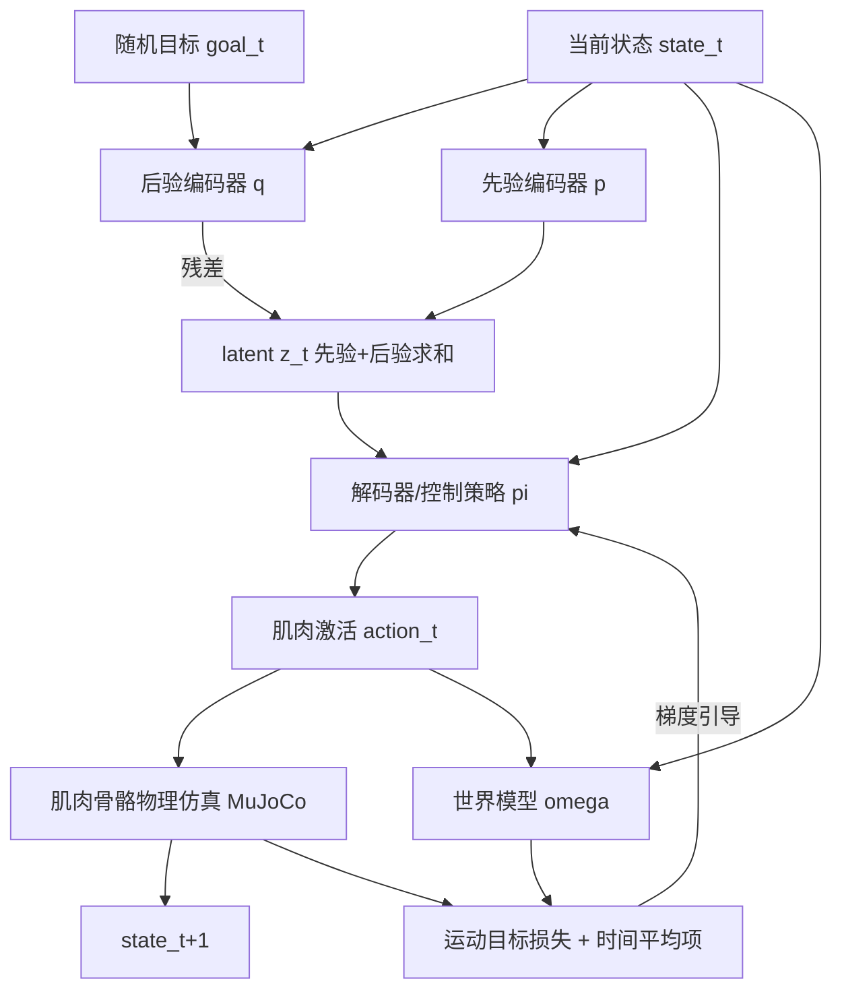

## 一句话总结

FreeMusco 是一个"无动作数据（motion-free）"框架，仅借助肌肉骨骼模型这一强先验，通过基于模型的强化学习端到端学出运动的隐空间与控制策略，让能量感知、随形态自适应的步态在没有动捕数据的情况下自然涌现，并支持目标导航、路径跟随等高层任务。

## 研究背景

physically-based 角色控制的主流做法依赖动捕数据：把数据集里的动作与转移嵌入到低维隐空间（用 VAE、GAN、VQ-VAE 等生成模型），再训练控制策略完成各种下游任务。这类"运动驱动"的方法擅长模仿多样行为，但天然受限于训练数据的分布，生成的动作会带上表演者的个人风格，也难以覆盖数据集之外的形态。

对于动物、虚构生物这类难以采集动捕的角色，"无动作数据"路线更有吸引力：不依赖示范数据，潜在能生成更泛化、不偏向特定数据集的行为。但没有动作参考时，要产生自然稳定的步态往往需要注入大量先验知识，例如手工调关节功率比与力矩上限、基于步态周期的控制启发式、或课程学习逐步加难度。而且以往的无动作数据方法大多只聚焦单一行为（走或跑），缺乏训练中的显式引导，很难像运动驱动方法那样扩展到丰富的下游任务。FreeMusco 正是要在无示范条件下，联合学出隐表示与控制策略，突破这一局限。

## 方法

### 整体框架

FreeMusco 建立在 ControlVAE 的结构之上（后验编码器、先验编码器、解码器即策略、可微世界模型），但把它从"运动模仿"改造为"无动作数据"设定。角色用 MuJoCo 中的 Hill 型肌腱作动器建模，控制输入是肌肉激活，动作在生理可行范围内涌现。训练用基于模型的强化学习，通过随机采样的目标条件去探索运动空间，用肌肉骨骼仿真把运动约束到生理合理区间，从而无需模仿即可学到有意义的隐表示。

- 后验编码器学 $$q(z_t \mid s_t, g_t)$$：在当前状态 $$s_t$$ 下，为达成目标 $$g_t$$ 的隐变量分布，实际预测的是对先验的残差。
- 先验编码器学状态条件先验 $$p(z_t \mid s_t)$$：仅凭当前状态给出可行隐变量分布。
- 解码器（策略）$$\pi(a_t \mid s_t, z_t)$$ 输出肌肉激活；训练时 $$z_t$$ 由先验与后验输出求和得到。
- 世界模型 $$\omega(s_{t+1}, e_t \mid s_t, a_t)$$ 预测下一状态与每块肌肉的代谢能耗，使隐空间具备"能量感知"。

训练按三阶段循环：Stage 1 采样随机目标、驱动仿真收集转移数据入缓冲区；Stage 2 用缓冲区数据训练世界模型（对状态与能耗做 $$\ell_1$$ 拟合）；Stage 3 冻结世界模型，用当前编码器-解码器滚动 $$T_P$$ 步轨迹，最小化 $$L_{VAE} = L_{objective} + \beta \cdot L_{KL}$$。

### 关键设计

1. **时间平均损失（Temporally Averaged Loss）**：不做逐帧对齐，而是在一个时间窗口内比较仿真值与目标值的加权平均。动机是真实动物运动中速度、姿态、朝上方向都会围绕目标值节律性波动，逐帧硬约束会导致僵硬失真。对速度、姿态、朝上方向等主项采用该公式，鼓励围绕目标的振荡行为、捕捉步态周期性；实验用 $$T_P = 32$$、折扣 $$\gamma = 0.99$$。方向项 $$L_{dir}$$ 仍用逐帧损失，因为方向对齐需要即时反馈。

2. **运动目标损失（Locomotion Objective Loss）**：无需模仿，由三类项组成——控制项（速度 $$L_{vel}$$、朝向 $$L_{dir}$$）、平衡项（高度 $$L_{height}$$、朝上 $$L_{up}$$）、生物力学项（姿态 $$L_{pose}$$、能量 $$L_{energy}$$）。其中姿态目标设为角色默认站立姿态，仅作最小引导（作者发现完全不加姿态正则会训练失败）；能量目标设为零以鼓励省力。

3. **形态自适应涌现**：仅凭肌肉骨骼先验和上述损失，不同形态自然发展出各自的高效步态。手臂加长（1.2×）、腿部缩短（0.7×）的类黑猩猩角色 Chimanoid，即便训练目标姿态是站立，也会涌现出对角肢体同步、四肢触地的小跑式四足步态；Humanoid 则始终保持双足。这说明"最省能的步态取决于形态"，而无动作数据方法能让这种策略自发出现。

4. **目标姿态与能量随机化**：训练时从预设范围随机采样目标姿态与能量并纳入目标 $$g_t$$，扩展学到的姿态与能量范围，让隐空间反映多样风格。运行时可在同一目标速度下灵活调节步态的形态与强度（如高能奔跑、低能自然步态）。

## 实验结果

模型在 RTX 4070 上约一天收敛，高层策略额外训练约 30 分钟。下表为论文表 1：在名义步速 1.2 m/s 下，一个步态周期内测得的关节活动范围（ROM）等指标，对比时间平均损失（本文）与逐帧损失。ROM 为每周期最大最小角度差再多周期平均。

| 损失项 / 指标 | 时间平均（本文） | 逐帧 |
|---|---|---|
| $$L_{pose}$$ · 髋 ROM（矢状面） | 33.3° | 23.7° |
| $$L_{pose}$$ · 肩 ROM（矢状面） | 12.8° | 5.3° |
| $$L_{pose}$$ · 骨盆 ROM（矢状面） | 7.6° | 4.8° |
| $$L_{pose}$$ · 骨盆 ROM（冠状面） | 7.6° | 3.0° |
| $$L_{up}$$ · 骨盆 ROM（矢状面） | 7.6° | 3.4° |
| $$L_{up}$$ · 骨盆 ROM（冠状面） | 7.6° | 2.3° |
| $$L_{vel}$$ · 骨盆前向速度 | 1.16 m/s | 0.48 m/s |
| $$L_{vel}$$ · 骨盆 ROM（矢状面） | 7.6° | 3.9° |
| $$L_{vel}$$ · 骨盆 ROM（冠状面） | 7.6° | 4.8° |

逐帧损失强行对齐帧级目标，导致 ROM 缩小、骨盆振荡受抑、且在 $$L_{vel}$$ 下甚至维持不住目标步速（仅 0.48 m/s 对 1.16 m/s），表现为局促、步长短、骨盆旋转受限的步态；时间平均损失则让自然的振荡与更大关节活动范围得以涌现。此外，与同样损失下训练的力矩驱动 humanoid 相比，后者即便手调力矩上限也只能收敛到极短步、高频的不稳定踏步，说明肌肉骨骼模型隐式地把解空间约束到生理合理行为，是无动作参考时的强先验。无条件从隐空间随机采样也能解码出多样、稳定且生物力学有效的步态，验证隐空间学到的是结构化运动而非任意肌肉激活。

## 亮点与局限

亮点：
- 首个（据作者所知）无动作数据、却能支持目标导航与路径跟随等高层任务的框架，端到端联合学出隐空间与控制策略。
- 以肌肉骨骼模型作强先验，让能量感知、随形态自适应的步态自发涌现，泛化到人类、非人类（鸵鸟）与虚构（Chimanoid）形态。
- 提出时间平均损失，解决无动作数据设定下随机目标缺乏节律性、逐帧损失导致动作僵硬的问题。
- 代码与数据开源。

局限：
- 用默认站立姿态作目标只是"最小引导"而非最优；如手肘被摆在完全伸直的极限，导致 Humanoid 行走时手臂偏僵硬。
- 转向控制以根部（骨盆）朝向定义，有时产生不自然的转身；作者提出可引入"头部先行"朝向线索改进。
- 尚未扩展到操作、多点接触等更丰富的运动技能，目标结构仍需人工设计。

## 延伸思考

FreeMusco 最耐人寻味之处，是把"物理先验"而非"数据先验"当作学习的骨架：当作动器本身（肌肉骨骼）已经把可行解限制在生理合理区间，策略无需模仿也能收敛到自然步态，这为无法采集动捕的对象（动物、幻想生物、假设形态）提供了可扩展路径。它也提示一种研究范式的反转——与其用海量数据"教会"角色怎么动，不如把身体的物理约束建得足够真实，让运动作为能量最优化的副产品自然长出来。时间平均损失的思路同样可迁移：在缺乏节律性监督信号的生成任务中，用窗口平均替代逐帧对齐，或许是让周期性、振荡性行为涌现的通用技巧。未来若能自动发现目标结构、并把头部朝向等生物学线索纳入控制，这套框架有望覆盖更复杂的多接触与交互动作。
