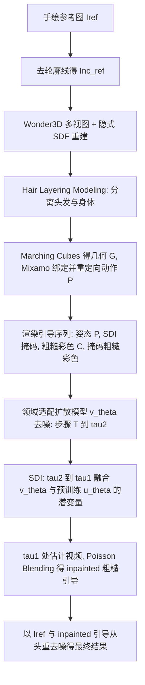

## 一句话总结

本文提出一个混合动画系统，把骨骼动画（保证几何一致性）与视频扩散先验（提供物理合理的动态）结合起来：先用骨骼动画对角色重定向渲染出"粗糙图像序列"作为几何引导，再把这些图像的细化视为一个 inpainting 任务，用一个领域适配的视频扩散模型补齐纹理细节与次生动态，从而让单张手绘角色在给定 3D 动作下生成自然、风格一致的动画。

## 研究背景

给静态手绘角色赋予动作是计算机图形学的活跃方向，但要同时做到"几何一致"和"表现力丰富的动态细节"很难。现有两类主流方法各有短板：

- 传统骨骼动画（把手绘角色嵌为 2D/3D 网格、绑骨骼、用 ARAP 变形重摆姿态）能保持身份一致，但只能表现主运动（primary motion），难以处理长发、宽松衣物等复杂非刚性元素，也缺乏次生动态（secondary dynamics，如头发、衣摆的细微摆动）。更糟的是单图到 3D 的重建往往得到低面数、单一网格的几何，齐肩以上的长发会粘连到脖子和肩膀，产生不自然形变。
- 姿态可控的视频扩散模型（如 AnimateAnyone、UniAnimate、Animate-X）在真人数据域内学到了物理感知的运动先验，能同时生成主运动与次生动态，但直接套用到手绘角色上会出现问题：忽略艺术细节、在角色轮廓附近扭曲变形、甚至合成出"真人化"特征。这些都源于手绘角色与真人之间的领域差异（体型比例、轮廓线、夸张动作）。

为手绘角色专门训练一个视频扩散模型看似可行，但收集大规模、带真实次生动态的手绘动画数据集并不现实。作者由此提出："骨骼动画补几何一致性，视频扩散补动态细节"，把两者互补地结合起来。

## 方法

输入是一张近似正面 A/T 姿势的手绘参考图 $$I_{ref}$$、可选的用户手工发-身分割图、以及目标 3D 动作 $$P$$，输出是角色动画序列 $$\{\hat{I}_{1:N}\}$$。整体流程分三大块：发层建模、引导序列渲染、以及推理阶段的次生动态注入。

### 关键设计 1：发层建模（Hair Layering Modeling, HLM）

针对长发角色因单一网格几何导致的粘连形变，作者提出 HLM，在隐式场层面把头发与身体分开。沿用 DrawingSpinUp 先去掉非真实感轮廓线得到 $$I^{nc}_{ref}$$，用 Wonder3D 生成多视图并重建神经隐式符号距离场 $$\mathcal{I}$$。基于用户提供的正视图、右视图发-身分割图（$$S_{front}$$、$$S_{right}$$），拆出头发与身体的分割掩码，其中 $$S^{hair}_{back}$$ 通过填充 $$S^{hair}_{front}$$ 内部得到，用于提取后脑头发。隐式场的分离表示为：

$$
S_{hair} = S^{hair}_{front} \cup \left( S^{hair}_{back} \cap S^{hair}_{right} \right)
$$

$$
S_{body} = S^{body}_{front} \cap S^{body}_{right}
$$

$$
\mathcal{I}_{hair} = \mathcal{I} \odot S_{hair}, \quad \mathcal{I}_{body} = \mathcal{I} \odot S_{body}
$$

其中 $$\odot$$ 是逐元素乘。头发几何 $$G_{hair}$$ 与身体几何 $$G_{body}$$ 分别用 Marching Cubes 从各自隐式场重建后合并为最终几何 $$G$$，再用 Mixamo 自动绑定骨骼并重定向目标动作。对无长发角色此步可选。

### 关键设计 2：引导序列渲染

对绑定动作后的几何渲染三类引导序列，为动画生成提供几何一致性：

- 姿态序列 $$\{P_{1:N}\}$$ 与参考姿态 $$P_{ref}$$：用 OpenPose 18 关键点格式，因手绘角色手脚抽象而排除手部、足部关节。
- SDI 掩码序列 $$\{M^{SDI}_{1:N}\}$$：用户可选地提供 $$M^{SDI}_{front}$$、$$M^{SDI}_{back}$$ 标出需要增强次生动态的区域（如发梢、裙摆，值 1 表示增强、0 表示保留），反投影到几何 $$G$$ 上给顶点染白/黑，再渲染成掩码序列。
- 粗糙彩色序列 $$\{C_{1:N}\}$$：把动画后的 3D 角色渲染回 2D。再用掩码得到掩码粗糙彩色序列 $$\{C^{masked}_{1:N}\} = \{C_{1:N}\} \cdot (1 - M^{SDI}_{1:N})$$。

### 关键设计 3：领域适配扩散模型 $$v_\theta$$

以 SOTA 的姿态可控真人动画方法 UniAnimate 为基座，把生成任务重构为面向手绘域的 inpainting。架构上新增一个轻量的粗糙先验编码器 $$\mathcal{E}_{coarse}$$（两个 2D 卷积层 + 一个时序 Transformer 层），把 $$\{C^{masked}_{1:N}\}$$ 与 $$\{M^{SDI}_{1:N}\}$$ 沿通道拼接后编码，再与输入噪声拼接送入去噪 UNet。

模型基于 v-prediction 参数化。前向加噪为 $$z_t = \alpha_t z_0 + \sigma_t \epsilon$$，预测目标为速度 $$v_t = \alpha_t \epsilon - \sigma_t z_0$$，训练损失为 $$L_\theta = \mathbb{E}_{z_0,t,\epsilon}[\|v_t - v_\theta(z_t,t)\|_2^2]$$，去噪时无噪潜变量估计由 $$\hat{z}^t_0 = \alpha_t z_t - \sigma_t v_\theta(z_t,t)$$ 恢复。

由于自建数据集远小于原始真人舞蹈视频（10K 以上），全量微调会有灾难性遗忘风险。参考 ToonCrafter 的策略，只微调空间层（适配风格化外观）、冻结时序层（保留真实运动先验），同时训练粗糙先验编码器 $$\mathcal{E}_{coarse}$$，用通用扩散损失联合优化。

### 关键设计 4：次生动态注入（Secondary Dynamics Injection, SDI）

蒙皮变形只能生成主运动，即便冻结时序层保留真人动态先验，微调后模型的次生动态仍不够丰富。作者的关键观察是：去噪过程的不同步骤对应不同类型的运动——早期步骤先建立空间结构与主运动，后续步骤才逐渐引入纹理细节与次生动态。据此提出 SDI，用原生预训练 UniAnimate（记为 $$u_\theta$$，区别于领域适配模型 $$v_\theta$$）的真实运动先验来引导去噪方向。

用两个阈值 $$\tau_2$$、$$\tau_1$$（$$T > \tau_2 > \tau_1$$，且 $$\tau_2 = \alpha \cdot T$$、$$\tau_1 = \beta \cdot T$$，$$\alpha,\beta \in [0,1]$$）把生成分三阶段：

1. 在 $$[T, \tau_2]$$：仅用 $$v_\theta$$ 去噪，配合去轮廓参考图 $$I^{nc}_{ref}$$，确保身份保留与主运动生成。
2. 在 $$[\tau_2, \tau_1]$$：用下采样掩码 $$\{M^{SDI}_{1:N,down}\}$$ 融合两个模型的无噪潜变量估计，以第 $$n$$ 帧为例：

$$
\hat{z}^{t,blend}_{n,0} = (1 - M^{SDI}_{n,down}) \cdot \hat{z}^{t,v_\theta}_{n,0} + M^{SDI}_{n,down} \cdot \hat{z}^{t,u_\theta}_{n,0}
$$

即在掩码区域注入预训练模型的动态，非掩码区域保持领域适配模型的结果。

3. 在 $$\tau_1$$ 处：用 VAE 解码器 $$D(\cdot)$$ 解出估计视频 $$D(\{\hat{z}^{\tau_1,blend}_{1:N,0}\})$$，通过 Poisson Blending 增强 $$\{C^{masked}_{1:N}\}$$ 得到 inpainted 粗糙引导 $$\{C^{inpainted}_{1:N}\}$$（比直接拼接更自然）。最后以 $$\{C^{inpainted}_{1:N}\}$$ 和带轮廓的原始参考图 $$I_{ref}$$ 为条件，从初始噪声从头重去噪（re-denoising），得到最终结果。

这里还包含"参考切换"（reference switching）：早期用去轮廓参考 $$I^{nc}_{ref}$$ 避免预训练模型把轮廓纹理错误传播到内部区域，后期再切换回带轮廓的 $$I_{ref}$$，并通过重去噪保证轮廓风格一致。

## 实验结果

数据集方面，作者从 Amateur Drawings 与 SketchAnim 两个数据集选取 174 张高质量手绘角色图，每个角色配 1-2 个 Mixamo 动作，用 DrawingSpinUp 生成的风格化动画视频作为真值来微调扩散模型；训练集还包含角色静止姿态的 60 帧整圈旋转以提升多视图一致性。最终得到 428 段动画视频片段：训练集 359 段（124 个角色），评测集 69 段（50 个角色）。实验在单张 80G A100 上进行，微调 40k 步、学习率 2e-5、批大小 4，推理用 20 步 DDIM，推荐 $$\alpha \in [0.7, 0.95]$$、$$\beta \in [0.5, 0.7]$$。生成一个绑定 3D 角色需 3-5 分钟（仅一次），生成 32 帧 768×512 视频无 SDI 时 45 秒，加 SDI（$$\beta$$ 为 0.7/0.6/0.5）分别为 72/81/90 秒。

定量评测用 LPIPS（纹理一致性）、FID（分布相似度）、CLIP 相似度（语义对齐），在生成帧与参考图之间计算。由于 UniAnimate、AnimateAnyone、MikuDance 无法准确按 3D 姿态动画化、会直接保留参考图纹理导致偏差，作者主要与能准确变换姿态的 DrawingSpinUp 和 UniAnimate*（在自建数据上微调的 UniAnimate）对比：

| 方法 | LPIPS↓ | FID↓ | CLIP↑ |
| --- | --- | --- | --- |
| UniAnimate* | 0.1792 | 158.1467 | 0.8964 |
| DrawingSpinUp | 0.1734 | 157.7452 | 0.8880 |
| Ours | 0.1733 | 152.9022 | 0.9030 |

本方法在三项指标上均领先。定性对比中：相较传统骨骼动画（Smith et al.、DrawingSpinUp），本方法能捕捉如跳跃时马尾摆动等次生动态，并自然处理长发角色而不出现头发与肩膀的粘连形变；相较扩散类方法（AnimateAnyone、MikuDance、UniAnimate），本方法在多样风格上泛化更好、身份保持更稳，而扩散基线常出现轮廓线不一致、把角色误判为背景、或误解 2D 骨骼造成的错误动画（如左右臂互换、生成本应被遮挡的肢体）。

消融实验验证了各组件：HLM 避免了脸部与腋下的不自然形变；粗糙先验编码器 $$\mathcal{E}_{coarse}$$ 提供密集结构化 3D 引导，消除肢体混淆与遮挡推理错误；空间层微调（SLT）优于时序层微调（TLT），空间层对外观建模更关键；SDI 及其子模块（Blending、Reference Switching、Re-denoising）逐一验证有效，最终组合能既注入自然动态又保持风格一致。参数分析显示 $$\alpha$$ 显著影响注入强度（过高如 0.95 会出现伪影），$$\beta$$ 影响较小、体现粗糙先验编码器的鲁棒性，从运行时间考虑取 0.6 或 0.7。

## 亮点与局限

亮点：
- 提出骨骼动画与视频扩散先验的混合系统，用粗糙图像序列作几何引导、把细化重构为 inpainting，兼顾几何一致性与丰富动态细节，且大幅降低对大规模训练数据的依赖。
- 首次观察到视频扩散去噪过程中"不同步骤对应不同类型运动"，据此设计 SDI 策略，用预训练模型的真实运动先验按掩码注入次生动态。
- 提出发层建模 HLM，在隐式场层面分离头发与身体，解决低面数单一网格导致的长发粘连形变。
- 支持用户友好的编辑：在参考图上局部涂改即可自动传播到所有动画帧，无需重建 3D 几何。

局限：
- 支持倒立等反常姿态的骨骼重定向，但预训练真人视频扩散模型缺乏此类先验（真人视频中罕见），会导致次生动态不真实，如头发无法在重力下自然下垂。
- 为避免学习到发-身一体几何导致的不自然形变，训练时排除了长发案例，这反而限制了模型在长发角色后视图中修补头发区域的泛化能力。
- 生成的 3D 模型只是粗糙代理几何，不满足基于仿真的动画输入要求，因此与仿真式次生动态路线不直接可比。
- 当前框架不支持显式的面部表情控制，值得未来探索。

## 延伸思考

这项工作最有启发的一点是把"去噪时间步"当作可分配的资源：既然扩散过程天然地先定结构、后补细节、再补次生动态，就可以在不同时间段切换不同的引导源（领域适配模型管风格与身份，预训练模型管真实动态），并用空间掩码把两者的优势按区域拼接。这种"分阶段、分区域的潜变量融合"思路，比单纯微调或单纯用预训练模型都更可控，也为"小数据领域适配 + 大模型运动先验"的组合范式提供了一个干净的样例。局限也指向清晰的改进方向：更强的视频生成基座能缓解反常姿态与后视长发的先验缺失，而把面部表情、手部等更精细的控制纳入同一引导框架，是把该系统推向真正实用的手绘角色动画工具的关键一步。
