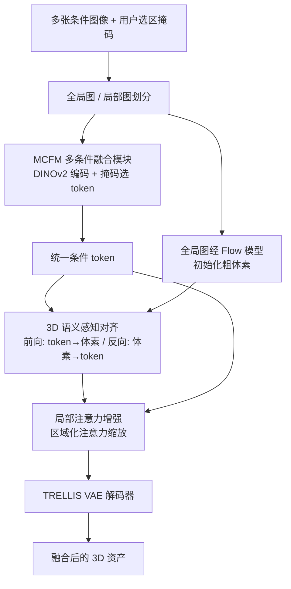

## 一句话总结

Fuse3D 首次实现由多张条件图像共同控制的可控 3D 资产生成，让用户能把不同图像中选定的局部区域，从全局造型到细节外观，融合进同一个 3D 物体的对应部位。

## 研究背景

近年来以图像为条件的 3D 生成质量大幅提升，但已有方法通常只服务于单一的全局控制目标：生成一个整体上与输入图像和文本对齐的 3D 资产，难以对物体的不同区域做细粒度、部件级的独立控制。文本描述虽然能提供高层语义控制，却缺乏空间精度、语义容易含糊。

作者观察到，2D 图像生成在可控性上领先于 3D：ControlNet、Ctrl-X、IP-Adapter 等方法通过特征组合与注意力调制，已能用多个条件对最终图像的不同区域做精确控制。受此启发，作者希望把「多条件图像融合控制」这一能力迁移到 3D 生成中：给定多张带用户选区的条件图像，让每张图像各自控制目标 3D 物体的特定区域，同时保持结构与外观的一致性。这里的核心难点有三：如何把多个 2D 区域特征融合成统一且保持空间语义完整的条件表示；如何在 2D 选区与其对应的 3D 区域之间自动建立精确的空间对应；以及如何解决多个控制目标在同一 3D 区域上的冲突与相互干扰。

## 方法

Fuse3D 以 3D 原生生成模型 TRELLIS 作为骨干，利用其 SLat 稀疏体素隐空间表示，并复用其基于 DINOv2 的条件特征空间。整体流程分为三步：先用多条件融合模块得到统一条件 token，再用 3D 语义感知对齐建立 2D-3D 对应，最后用局部注意力增强调节融合强度并解码出 3D 资产。整个生成过程可在约 20 秒内完成。

关键设计：

- **多条件融合模块（MCFM）**：不裁剪局部区域，而是把整张局部条件图像送入 DINOv2 编码，保留相对位置编码与全局自注意力上下文，再用与 patch 对应的 2D 掩码筛选出选区 token；各图像保留的 $$\text{CLS}$$、$$\text{REG}$$ 与选区 patch token 拼接成统一条件 token。由于这些 token 通过交叉注意力注入而非作为序列输入，token 数量可灵活扩展。

- **3D 语义感知对齐**：利用预训练 Flow 模型 $$G_L$$ 交叉注意力天然学到的 2D-3D 语义对应，做双向匹配。前向对齐把每张局部图 token 的注意力分数在选区上聚合并阈值化，得到语义对齐的体素集合 $$\lbrace \boldsymbol{p}_i \mid i \in \mathcal{V}_k \rbrace$$；反向对齐则对未被任何选区覆盖的体素 $$\mathcal{V}_{\text{unaligned}}$$，从全局图像 token 中反查对应 token 补齐。注意力沿不同轴做 softmax 归一化以区分两种匹配方向。

- **局部注意力增强**：为解决多控制目标在共享 3D 区域上的混叠，在交叉注意力做 softmax 前引入增强矩阵 $$E$$。对每张局部图像赋予增强强度 $$\lambda_k$$，对其对齐的 token-体素对置 $$E[i,j]=\lambda_k$$，其余置 1，得到 $$A_{\text{scaled}} = A \odot E$$。$$\lambda$$ 值越低越促进跨区域平滑融合，越高越强调局部、解耦的控制；默认按选区在整图中的占比确定，使选取越精细的区域对对应体素施加越强的局部影响。

## 实验结果

作者用 CLIP 相似度（全局与区域）和 ImageReward 与四个近似基线对比。由于没有现成方法直接支持多图区域级融合，基线均借助 GPT-4o 生成的融合描述来近似同一目标。

| Metric | IP-Adapter | Blended Diffusion | FLUX | TRELLIS | Ours |
| --- | --- | --- | --- | --- | --- |
| Region-specific CLIP Similarity ↑ | 0.223 | 0.240 | 0.224 | 0.237 | 0.243 |
| Global CLIP Similarity ↑ | 0.201 | 0.236 | 0.238 | 0.235 | 0.241 |
| ImageReward ↑ | -1.21 | -0.79 | -0.54 | -0.63 | -0.51 |

Fuse3D 在区域级、全局 CLIP 相似度与 ImageReward 上均取得最优。此外基于 GPTEval3D 的成对偏好评测中，Fuse3D 在区域一致性、视觉无缝性、编辑可控性、细节保持、总体偏好五项上相对各基线的被偏好比例均超过 50%（对 IP-Adapter 多项达到 76% 以上）。消融实验也表明移除任一模块都会导致指标下降。

## 亮点与局限

亮点：首次把多图像、区域级的融合控制引入 3D 原生生成；巧妙复用预训练 TRELLIS 交叉注意力所隐含的 2D-3D 语义对应，无需额外训练即可建立空间对齐；局部注意力增强用一个可调强度矩阵，在「平滑融合」与「解耦局部控制」之间灵活权衡；整个流程约 20 秒即可完成，远快于依赖 SDS 迭代优化的方法。

局限：方法强依赖 TRELLIS 与 DINOv2 的预训练能力与条件空间，泛化受骨干限制；对齐依赖交叉注意力分数加阈值与投票补洞，选区边界或语义模糊时对应可能不稳；缺乏直接支持多图区域融合的基线，评测只能借助 GPT-4o 构造的近似设置，且大量依赖以 GPT-4o 为代理的主观偏好评测。

## 延伸思考

Fuse3D 揭示了一个值得关注的方向：预训练 3D 生成模型的交叉注意力本身就编码了可复用的 2D-3D 语义对应，这意味着许多「可控生成」能力也许无需重训，而可以通过在推理期对注意力做定向调制来解锁。沿此思路，能否把区域级控制进一步扩展到文本、点云、草图等异构条件的混合融合，或让 $$\lambda$$ 强度可交互地由用户实时调节，都是自然的延伸。另一方面，如何减少对 GPT-4o 主观评测的依赖、建立更客观可复现的多图融合评测基准，是这一新任务走向成熟需要补齐的一环。
