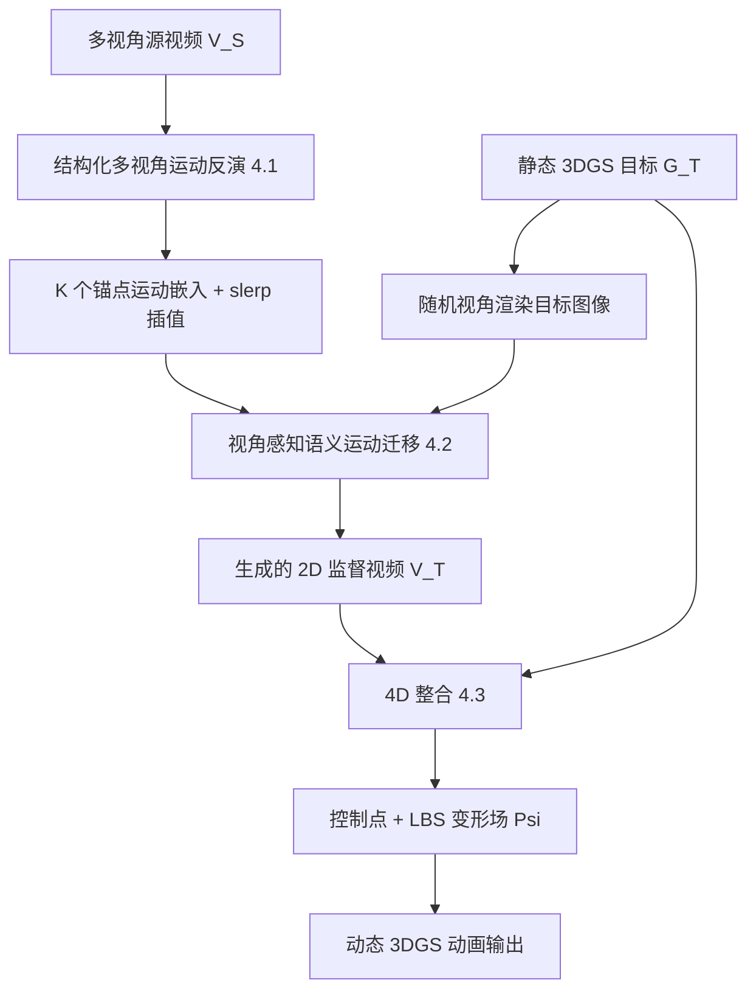

## 一句话总结

从多视角视频里提取"语义运动嵌入"，再把它施加到一个静态的 3D 高斯泼溅（3DGS）资产上，实现无需绑定骨架、可跨类别（如把马匹前扬的动作迁移到汽车抬起前轮）的 3D 运动迁移。

## 研究背景

3D 动画的需求在游戏、VR/AR、机器人仿真等领域快速增长，但为任意 3D 物体生成高质量运动仍是难题。传统运动生成高度依赖"绑定"（rigging）——预先定义骨骼结构来驱动运动，这类方法对人体、部分动物有效，却难以推广到没有预定义运动学结构的任意物体。

用文本描述运动是一条路，但复杂运动往往难以用语言精确刻画。更自然的思路是"运动迁移"（motion transfer）：让一个物体模仿另一个物体演示的动作。已有的运动重定向研究大多局限于同类别、且依赖绑定骨架；而语义运动迁移在 2D 视频生成领域已经出现（把运动意图从外观中解耦并迁移到不同目标），但这种能力在 3D 中还是空白。

本文提出从多视角视频进行语义 3D 运动迁移，让动态源物体的运动可以适配到结构、姿态都不同的静态 3D 目标上，且不依赖两者的结构相似性，从而支持跨类别迁移。之所以要求多视角输入，是因为单视角会丢失被遮挡区域（例如章鱼的腿在不同角度articulation差异很大），多视角视频可来自计算机动画，也可用普通设备采集。

## 方法

### 整体框架

方法分两个阶段：先从多视角源视频里提取结构化的运动嵌入，再用这些嵌入生成目标物体的监督视频，并以此驱动静态 3DGS 目标完成 4D 重建。

### 关键设计

1. **基于锚点的视角感知运动嵌入**：直接把 2D 运动反演套到 3D 会失败——为某个角度优化的运动嵌入并不适用于其他角度（"踢腿"动作在正交方向上像素表现不同）。为每个视角单独优化嵌入则运行/存储成本随视角线性增长，且无法泛化到未见视角。作者假设不同视角共享同一底层 3D 运动，因此只优化固定的 $$K$$ 个锚点嵌入（均匀分布在源视角角度上）；当需要某个角度 $$\phi$$ 的嵌入时，用最近的两个锚点做球面线性插值（slerp）：
   $$\boldsymbol{m}_\phi = \mathrm{slerp}\left(\boldsymbol{m}_i, \boldsymbol{m}_j, \frac{\phi-\phi_i}{\phi_j-\phi_i}\right)$$
   这样一次反向传播能同时更新多个锚点嵌入，既保证跨视角一致性，又加速收敛。

2. **视角感知语义运动迁移**：先用随机相机位姿 $$C$$ 渲染目标图像 $$R[G_T; C]$$，再以该图像和对应角度的运动嵌入 $$\boldsymbol{m}_\phi$$ 为条件，让冻结的视频扩散模型生成 2D 监督视频。由于嵌入可在锚点间插值，可以灵活生成任意视角的监督。

3. **鲁棒的 4D 整合与正则**：生成的监督视频天然带噪声、空间不一致，直接监督会得到糟糕的重建。方法在 SC-GS 的动态 3DGS 基础上，用控制点 + 线性混合蒙皮（LBS）驱动目标，并引入三项关键设计：一是 **ARAP Rotation**，标准 ARAP 只约束控制点位置、不约束旋转，导致 MLP 预测的旋转产生可见伪影，作者用最优刚性旋转 $$\hat{R}^t_k$$ 替换 MLP 预测旋转，并将该约束直接融入训练而非后处理；二是把逐像素损失（MSE/mask）换成 **LPIPS 感知损失**，在噪声和空间不一致场景下更鲁棒；三是评估了 SDS 损失与迭代数据更新，但发现二者都不如本方法。

4. **首个基准**：作者构建了首个跨类别 3D 语义运动迁移基准，源视频与静态 3D 目标取自 Mixamo 子集与网络公开资产。Mixamo 子集包含成对运动（同一动作由源与目标角色各演一遍）可做参考式评测；网络爬取的跨类别子集涵盖人、动物、物体等多样运动，目标从骨架到机械臂，所有目标资产均用 3DGS 重建。

## 实验结果

评测采用运动保真度（Motion Fidelity，源自 2D 视频运动度量）、CLIP-I（外观保持）与 CLIP 相似度（与真值的相似性）。对比对象为改编后的 SC4D 与 DreamGaussians4D（DG4D）两个基线。

| 方法 | Motion Fidelity ↑ (Mini-Mixamo) | Motion Fidelity ↑ (Cross-Category) | CLIP-I ↑ (Mini-Mixamo) | CLIP-I ↑ (Cross-Category) | CLIP Score ↑ (Mini-Mixamo) |
| --- | --- | --- | --- | --- | --- |
| SC4D Motion Transfer | 0.65 | 0.56 | 0.888 | 0.872 | 0.905 |
| DreamGaussians4D | 0.61 | 0.54 | 0.931 | 0.908 | 0.945 |
| Ours | 0.74 | 0.66 | 0.950 | 0.948 | 0.963 |
| Ground Truth | 0.87 | - | - | - | 1.0 |

本方法在两个基准上的运动保真度、CLIP-I 与 CLIP 相似度均显著优于基线，说明它在保持目标结构与身份的同时，实现了更好的源—目标运动对齐。用户研究进一步显示人类评测者一致更偏好本方法的结果。作者还展示了在真实世界场景（用野外图像重建的 3D 资产）上的效果。

## 亮点与局限

**亮点**
- 提出全新问题设定：从多视角视频到 3DGS 目标的语义 3D 运动迁移，无需骨架绑定、无需结构相似，可跨类别（马→汽车、鸟翅→大象耳朵）。
- 锚点 + slerp 的视角感知嵌入机制兼顾全局一致性与视角相关细节，同时显著加速收敛，避免了逐视角嵌入的线性膨胀。
- 针对生成式监督天然带噪的问题，用 ARAP Rotation + LPIPS 等正则把不一致的监督"整合"为稳定的 4D 重建，工程上很实用。
- 建立首个跨类别 3D 运动迁移基准，填补了评测空白。

**局限**
- 强依赖预训练 2D 视频扩散模型的运动先验与其隐式"运动—外观解耦"假设，性能上限受制于该先验的能力。
- 需要多视角源视频作为输入，采集或获取成本高于单视角设定。
- 监督视频本身带噪、空间不一致，方法靠正则来缓解，说明运动质量的"下游净化"仍是瓶颈而非源头解决。

## 延伸思考

这项工作本质上是把 2D 生成模型里已经成熟的"语义运动迁移"范式抬升到 3D，思路是"用 2D 扩散生成带噪监督 → 3D 表征做鲁棒整合"。这种"生成先验负责语义、显式 3D 表征负责一致性"的分工模式，可能会成为把更多 2D 能力搬到 3D/4D 的通用配方。

一个值得关注的方向是：既然监督视频的噪声与不一致是主要痛点，未来能否用具备更强多视角一致性的视频/3D 生成模型直接产出更干净的监督，从而减少对 ARAP、LPIPS 这类"补救型"正则的依赖？此外，跨类别语义对应目前隐含在扩散模型的先验里，如何显式度量并控制"运动语义在结构差异极大的物体间的可迁移边界"，也是一个开放而有趣的问题。
