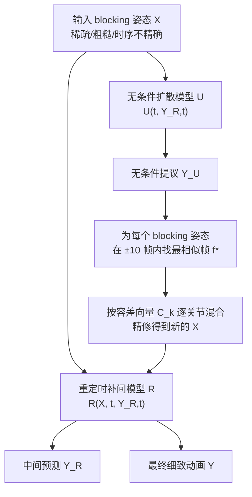

## 一句话总结

提出一种推理阶段的简单技巧：在扩散去噪过程中不断用无条件模型的输出去"精修输入条件"，从而让重定时补间扩散模型能把稀疏、粗糙、时序不精确的"blocking 姿态"稳健地转化为自然细致的角色动画。

## 研究背景

在专业角色动画流程中，动画师往往先做"动作分块"（motion blocking）：在时间轴上摆放少量代表性的关键姿态（blocking poses / keys），勾勒出动作的时机、位置与大致姿势。这些 blocking 姿态数量少、时序不精确、姿势粗糙（通常只摆了根关节、肩、肘、髋、膝等少数重要关节），仅作为后续"精修"（motion detailing）的脚手架，动画师会在精修中补全细节并按需调整姿态与时机。

现有扩散方法难以稳健完成"动作精修"这一任务，即把 blocking 姿态转成合理且细致的动画。Goel 等人的重定时补间模型（本文记为 $$R$$）能够处理时序不精确的关键帧，但它假设输入是精确摆好的关键帧，会力图保留原始姿势，因而无法丰富 blocking 姿态本身的细节，输出保持与输入同样的粗糙度。而常见的"松弛约束"手段——把扩散输出与目标关键帧做混合，或用重建引导把关键姿态作为外部约束——在 blocking 场景下都难以产出自然运动：混合掩码 $$M$$ 难以设置（太窄导致运动不连续，太宽则输出贴近未细化的输入），引导也被证明不足以生成自然运动。

## 方法

核心思想：不去调整每帧的输出混合掩码，而是在整个扩散过程中反复"精修输入条件 $$X$$"，用无条件模型的输出为其注入细节，再交给现成的重定时模型 $$R$$ 补间。

关键设计：

- 条件精修（Constraint Refinement）：每隔 $$N$$ 个去噪步，除用 $$R$$ 生成中间预测 $$\tilde{Y}_R$$ 外，还对同一噪声用 $$U$$ 走一步得到 $$\tilde{Y}_U$$。对每个 blocking 姿态 $$X_{f_k}$$，在 $$\tilde{Y}_U$$ 中于 $$\pm 10$$ 帧内搜索最相似的帧 $$f_k^*$$（因为 $$R$$ 会重定时，$$f_k^*$$ 未必等于 $$f_k$$），再按公式混合：$$X_{f_k} = C_k \odot X_{f_k} + (1 - C_k) \odot \tilde{Y}_{U, f_k^*}$$，其中 $$\odot$$ 为逐元素相乘。混合后可选做 IK 后处理消除穿地，再用线性插值重建 $$X$$。

- 逐姿态逐关节容差 $$C_k \in \mathbb{R}^J$$：容差高的关节更贴近原始 blocking 姿态，容差低的更多采纳 $$U$$ 的合理提议。动画师只需在"blocking 姿态粒度"上指定贴合程度，由扩散先验自行决定如何把这种贴合沿时间轴铺开，避免了脆弱的逐帧掩码启发式。

- 精修输入而非输出：与混合模型输出的传统做法相反，本方法修改的是输入条件。由于 $$\tilde{Y}_U$$ 通过依赖 $$Y_{R,t}$$ 间接受 $$X$$ 影响，混合结果保持连贯；$$U$$ 拥有对合理运动学运动的强先验，能把欠定的 blocking 姿态对齐到其学到的细致运动分布。

- 容差经验取值：默认 $$C_{k,j}=0.85$$ 在贴合与自然之间取得平衡；对需强保留的关节（如踢腿时的髋、膝）取 $$C_{k,j}>0.95$$ 以防"改写"姿态语义；对未摆放的关节（如踢腿姿态中的肘、腕）取较低值以便系统自由调整。

## 实验结果

实验沿用 Goel 等人的设置，将 HumanML3D 训练/测试集切成 60 帧片段训练 $$R$$ 与 $$U$$。由于没有大规模 blocking 级数据集，作者据 Cooper 对典型 blocking 姿态的刻画合成基准：随机选取至多 10 个关键帧并遮蔽其余（时序稀疏）；仅保留根、肩、肘、髋、膝等重要关节的随机子集、其余置为中性姿态（空间不完整）；对每个姿态施加 $$\pm 5$$ 帧随机时序扰动（时序不精确）。评测指标为 FootSkate、Jitter、FID 与关键帧误差 KE。

| Metric | FootSkate ↓ (10⁻³) | Jitter ↓ (10⁻²) | FID ↓ | KE ↓ (10⁻²) |
|---|---|---|---|---|
| Ours (c=0.85) | 5.96 | 0.241 | 0.058 | 0.105 |
| Ours (c=0.50) | 5.14 | 0.223 | 0.038 | 0.106 |
| U-Guidance (w=5.0) | 9.86 | 2.562 | 0.118 | 11.455 |
| U-Guidance (w=1.0) | 7.21 | 1.274 | 0.043 | 1.101 |
| R-DiffusionBlending (c=0.85) | 9.62 | 7.783 | 0.211 | 0.684 |
| R-DiffusionBlending (c=0.50) | 10.36 | 6.021 | 0.146 | 1.163 |
| R-SoftMask (c=0.85) | 6.70 | 0.321 | 0.063 | 0.130 |
| R-SoftMask (c=0.50) | 5.97 | 0.284 | 0.040 | 0.144 |
| CondMDI | 29.51 | 2.293 | 0.305 | 0.664 |
| R-NoTolerance | 8.19 | 0.282 | 0.077 | 0.145 |

本方法在整体运动质量上最好，Jitter、FootSkate、FID 均为最低，且各 $$c$$ 值下质量稳定。$$c$$ 越大 KE 越小（更贴合输入），本方法在 KE 上也最优，说明它在生成最真实运动的同时最贴合 blocking 姿态的整体结构。R-NoTolerance 与 CondMDI 因力图贴合粗糙输入而质量下降；R-DiffusionBlending 的稀疏混合掩码在关键帧前后产生明显不连续（高 Jitter）；R-SoftMask 的线性衰减掩码导致过度平滑；引导类基线脚滑严重、FID 偏高。消融显示 $$N$$ 越小质量越好，但过小会因去噪步不足而变差且计算更贵，作者取 $$N=100$$ 作平衡。

## 亮点与局限

亮点：
- 用一个极简的推理期技巧，就让现成的重定时补间模型获得了从 blocking 姿态生成细致运动的能力，无需重新训练。
- "精修输入条件而非输出"的思路巧妙规避了逐帧混合掩码难以设置的难题，把时间分配的责任交给扩散先验。
- 容差接口只需在姿态与关节粒度设定，符合动画师的直觉与工作流。

局限：
- 生成运动仍可能出现脚滑等常见伪影，需 IK 后处理或物理跟踪等手段缓解。
- 当 blocking 姿态本身缺乏动作的关键信息或结构时会失效，例如只给起止两个地面 T-pose 无法推出跳跃，需补一个空中姿态才能表达跳跃意图。

## 延伸思考

当 blocking 输入过于模糊时，引入额外条件（如文本提示或视频示范）来澄清意图是很自然的扩展方向，这会把"稀疏姿态 + 高层语义"结合起来，可能显著提升欠定情形下的稳健性。此外，本文"精修条件而非输出"的范式，或许可推广到其他以扩散先验做约束松弛的生成任务（如受草图/布局约束的图像与视频生成），值得进一步验证其通用性。
