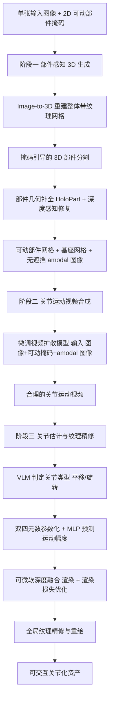

## 一句话总结

本文提出 DreamArt：给定单张图像，通过"部件感知 3D 重建 → 微调视频扩散模型合成关节运动视频 → 用双四元数优化关节参数并精修纹理"的三阶段流水线，生成部件分割准确、外观高保真、关节运动物理合理的可交互关节化 3D 资产。

## 研究背景

关节化物体（如笔记本电脑、微波炉、抽屉柜）在日常环境中无处不在，其高保真、可交互的 3D 资产对具身智能、机器人操作、场景合成与重建等应用越来越重要。但生成这类资产面临两难：

- 现有 image-to-3D 方法（如 latent diffusion in 3D）主要关注表面几何与纹理，缺乏部件分解和关节建模，产出的是"死"的整体网格。
- 神经重建方法（NeRF、Gaussian Splatting）能精确建模部件运动，但依赖多视角或多状态的密集观测数据，采集成本高、可扩展性差。
- 基于"拖拽"（drag）提示的部件运动先验学习方法需要人工指定运动轨迹，且拖拽信号存在歧义——单个像素可对应多个 3D 位置，难以在多部件场景中明确指出正确的运动部件与运动类型（平移 vs 旋转）。

本文将该任务定义为 Image-to-Articulated-Asset（I2A）生成：从单张图像创建高保真、可交互的关节化 3D 资产，目标是在最小人工干预下恢复部件感知的 3D 结构、推理合理的关节运动模式，并将先验蒸馏到网格上做关节优化。

## 方法

DreamArt 采用三阶段流水线：先从单图重建出完整且显式分割的部件网格，再用视频扩散模型合成关节运动视频，最后优化关节参数并精修纹理。

关键设计：

1. **掩码引导的混合式 3D 部件分割 + amodal 补全**：利用 PartField 的逐面特征，先取落入 2D 可动掩码内的面片计算均值特征 $$F_m$$，再按特征距离 $$\lvert\lvert F_i - F_m \rvert\rvert_2 \le \max_{j\in S}\lvert\lvert F_j - F_m\rvert\rvert_2$$ 把面片二分为可动/基座两部分，最后用 k-means 去除离群、提升空间平滑性。由于 image-to-3D 只重建表面、忽略内部与被遮挡结构，再用 HoloPart 补全部件几何，并用修复模型 $$I_m = F_{inp}(I \odot M, M_{inp})$$ 生成填补缺失外观的 amodal 图像。

2. **以可动部件掩码为提示的关节视频合成**：相比需要人工轨迹的 drag 提示，可动部件掩码作为图像式条件天然契合视频扩散框架、几乎不需人工介入，且能在多部件场景中无歧义地指定运动部件。视频生成为 $$V = f(I, M, I_m, I_b)$$，所有条件图像复制 $$N$$ 份后经同一 VAE 编码、在隐空间拼接，与含噪运动序列一起送入去噪 UNet。引入 amodal 图像作为额外条件，让模型专注学习关节模式、避免把容量浪费在幻想被遮挡区域上。

3. **双四元数统一表达 + 可微软深度融合**：用关节位置 $$A_{pos}$$ 与轴向 $$A_{dir}$$ 表示关节轴，MLP 预测器给出各时刻运动偏移 $$\theta_t = F_{motion}(t)$$。旋转与平移用双四元数 $$q_{r,t}, q_{d,t}$$ 统一参数化平移关节与旋转关节，可推导出旋转矩阵 $$R_t$$ 与平移 $$t_t$$，部件网格按 $$v^t_m = R_t \cdot v_m + t_t$$ 变形。基座与可动部件分别渲染，通过对深度差做 sigmoid 得到逐像素融合权重 $$w = \sigma(\Delta D \cdot \beta)$$（$$\beta=500$$），合成 $$I_{pred} = w\cdot I_{mov} + (1-w)\cdot I_{base}$$，用与合成视频参考帧的渲染损失优化关节参数。

## 实验结果

关节运动视频合成在自建的 MAPPA 数据集（基于 PartNet-Mobility 生成 44k 训练视频、349 测试视频）上评测，采用与 DragAPart、Puppet-Master 相同的测试划分：

| 方法 | PSNR ↑ | SSIM ↑ | LPIPS ↓ | CLIP-T ↑ | FVD ↓ |
|------|--------|--------|---------|----------|-------|
| DragAPart | 23.132 | 0.921 | 0.068 | 0.992 | 475.695 |
| Puppet-Master | 24.660 | 0.919 | 0.072 | 0.988 | 640.341 |
| Ours（无 amodal） | 27.914 | 0.948 | 0.045 | 0.991 | 211.447 |
| Ours | 28.906 | 0.955 | 0.038 | 0.992 | 195.707 |

DreamArt 在图像对齐指标（PSNR/SSIM/LPIPS）与跨帧一致性（FVD）上大幅领先基线；消融显示去掉 amodal 图像会明显掉点，验证了其对关节模式学习的帮助。在资产生成对比（对比 STAG4D、L4GM）中，DreamArt 的 Aesthetic Score、MUSIQ 以及用户研究的关节合理性、3D 一致性、整体质量三项主观评分均显著更优。

## 亮点与局限

亮点：

- 用"可动部件掩码"替代歧义大的拖拽提示，几乎零人工干预即可在多部件场景中明确指定运动部件，控制信号更易获取（现成 2D 分割模型即可）。
- amodal 图像条件缓解部件间相互遮挡，让视频模型聚焦学习关节运动而非幻想遮挡内容，与后续优化无缝衔接。
- 双四元数统一参数化平移/旋转关节，配合可微软深度融合，在网格层面通过可微渲染优化关节参数，泛化到 in-the-wild 图像。

局限：

- 依赖现成 image-to-3D 生成模型，偶尔产出物理不合理结果（如柜门开启时长度异常）。
- 单视角视频的关节优化对视角歧义和遮挡敏感，作者计划用多视角视频生成在未来工作中改善。

## 延伸思考

- 该框架把"视频生成模型的运动先验"当作关节推理的桥梁，本质是用大规模视频预训练的时空一致性弥补单图信息不足。这一"生成视频 → 蒸馏几何参数"的范式是否可推广到更一般的物体动力学（如柔性体、多关节联动机构）值得探索。
- 掩码提示解决了 drag 的歧义，但仍依赖对单个可动部件的指定；面对树状/多层级关节结构（多个抽屉、门中门），如何自动推理部件连接图与联合优化多关节，是走向复杂关节资产的关键。
- MAPPA 基于 PartNet-Mobility 合成，训练分布与真实世界仍有差距；结合物理仿真校验或引入真实交互数据，或能进一步提升物理合理性与可仿真性（sim-ready）。
