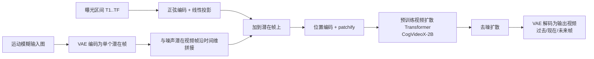

## 一句话总结

把"运动模糊图像分析"从图像复原问题重新表述为条件视频生成问题，微调大规模预训练视频扩散模型，从单张运动模糊图像生成揭示曝光期间场景运动、并外推到拍摄前（过去）与拍摄后（未来）的连贯视频。

## 研究背景

运动模糊由相机或场景在曝光期间移动导致，通常被视为需要消除的退化。但作者指出，模糊同时编码了曝光时间窗内的时空运动信息，可用于分析场景运动、恢复三维结构、乃至推断拍摄前后发生了什么。

已有工作把该问题当作图像复原：从模糊图恢复一张对应曝光内某时刻的清晰图（场景的"现在"），或进一步恢复一小段视频。这些方法依赖手工先验、精心设计的损失函数或网络结构来消解逆问题的歧义，且只在几千到几万对模糊-清晰样本上训练。然而真实随手拍的模糊成因极其多样（物体形变、独立运动、遮挡与去遮挡、相机抖动、各种快门速度），小数据集无法充分刻画，导致这些方法难以处理复杂动态，也从不尝试预测曝光窗之外的过去与未来。

大规模视频扩散模型在数百万视频片段与数十亿图像上训练，能从极少输入生成照片级、时序一致的视频，且被证明是求解成像逆问题的通用先验。一个初步实验很有启发性：给现成视频扩散模型输入一张运动模糊图和文本提示，它生成的未来帧运动方向会与图中模糊方向一致，说明模型内部已隐含"模糊与场景动态"的关联先验。本文正是要挖掘并放大这一能力。

## 方法

核心思想：运动模糊本质上是曝光期间随时间变化的外观积分，而视频恰好是对这一退化过程完整且物理准确的解释。因此作者不把模糊分析当作复原，而是当作以模糊图和一组曝光区间为条件的视频生成。

成像模型：图像 $$I$$ 记录传感器平面上随时间变化的辐照度 $$E(t)$$，即

$$I_{\mathcal{T}} = g\left( \int_{t \in \mathcal{T}} E(t)\, dt \right)$$

其中 $$g$$ 是相机响应函数，$$\mathcal{T} = [t_{start}, t_{end}]$$ 是曝光区间。给定模糊图，目标是恢复由 $$F$$ 帧、具有连续或非连续曝光区间的视频 $$V = [I_{\mathcal{T}_1}, \dots, I_{\mathcal{T}_F}]$$。

条件建模：作者修改预训练视频扩散模型，使其同时条件于（1）模糊图和（2）每个输出帧对应的曝光区间：

$$P(\tilde{V} \mid \tilde{I}, \mathcal{T}_1 \dots \mathcal{T}_F)$$

当把所有 $$\mathcal{T}_i$$ 都设在输入图实际曝光区间内时，模型预测"现在"；当条件区间落在实际曝光之外时，模型即可外推到"过去"与"未来"。

架构要点（基于文本到视频模型 CogVideoX-2B，20 亿参数扩散 Transformer）：

- **潜在编码**：用 CogVideoX 的 VAE 把模糊图编码为单个潜在帧，空间下采样 8 倍，视频时间维再压缩 4 倍。潜在视频维度为 $$(\tilde{F}, \tilde{D}, \tilde{H}, \tilde{W})$$，其中 $$\tilde{F} = F/4$$。每个潜在帧因此对应 4 个曝光区间，用向量 $$\tilde{\mathcal{T}}_i \in \mathbb{R}^8$$ 表示。
- **曝光区间编码**：先把输入模糊图的曝光归一化为区间 $$[-0.5, 0.5]$$，其余区间相对它表达。对 $$\tilde{\mathcal{T}}_i$$ 每个坐标施加正弦位置编码函数 $$\gamma$$，拼接后线性投影：$$\text{Linear} \circ \text{Concat}(\gamma(\tilde{\mathcal{T}}_i[1]) \dots \gamma(\tilde{\mathcal{T}}_i[8])) \in \mathbb{R}^{\tilde{D}}$$。正弦编码定义为 $$\gamma(t) = [\cos(2\pi\nu_1 t), \sin(2\pi\nu_1 t), \dots, \cos(2\pi\nu_N t), \sin(2\pi\nu_N t)]$$。消融表明该正弦投影对效果至关重要。
- **微调目标**：对潜在视频帧加噪，最小化去噪潜在视频与干净潜在视频的 L2 差 $$\mathbb{E}_{\tilde{V}, \boldsymbol{\epsilon}} \lVert \hat{V} - \tilde{V} \rVert^2$$。全参数微调，batch 64，16 张 NVIDIA L40 GPU 训练 10 天、20000 步，学习率 $$10^{-4}$$。同时以 20% dropout 训练无条件生成分支。推理用 50 步 DDPM，CFG 引导尺度 1.1，单张 L40 约 2 分钟。

数据与模糊合成：在 linear sRGB 空间对连续帧做平均来模拟模糊（避免非线性 gamma 影响）；用帧插值器把视频时间上采样到 1920 FPS 以消除帧间"死时间"造成的积分近似误差。为增强真实场景泛化，第三个版本在 GoPro、Adobe240、REDS、iPhone240、Sports240 等高帧率视频汇编（694 段、平均 507 帧）上微调。模型支持两种生成模式：仅现在（present-only）、过去/现在/未来（past/present/future），每次迭代随机采样帧数与模式。

## 实验结果

评测同时考虑运动歧义：一段视频与其时间反转版本对同一模糊图都可能成立。作者提出双向 patch 版指标——对每个 patch 取正向与时间反转版本中误差较小者：

$$M_p(\hat{V}, V) = \frac{1}{p} \sum_p \min\left[ M(\hat{V}^{(p)}, V^{(p)}),\ M(\hat{V}^{(p)}_{rev}, V^{(p)}) \right]$$

使用 PSNR、SSIM、LPIPS、FVD、EPE 五项指标。

生成"现在"（GoPro 数据集）：

| 方法 | PSNR_p ↑ | SSIM_p ↑ | LPIPS_p ↓ | FVD ↓ | EPE ↓ |
| --- | --- | --- | --- | --- | --- |
| Jin et al. | 25.23 | 0.8190 | 0.084 | 235.53 | 3.38 |
| MotionETR | 26.54 | 0.8825 | 0.015 | 94.90 | 1.46 |
| 本文 | 30.01 | 0.9359 | 0.010 | 21.46 | 0.39 |

B-AIST++ 数据集（舞者）上本文同样全面领先 Animation from Blur（如 PSNR_p 27.37 对 26.69，FVD 37.16 对 138.27）。定性上，本方法能处理空间变化的模糊、遮挡与去遮挡，结果比基线更自然、无扭曲伪影，作者归因于底层视频模型的大规模预训练先验。

生成"过去与未来"（GoPro）：由 7 帧合成模糊图，预测 13 帧（前 3 帧过去、中间 7 帧曝光内、后 3 帧未来）。中间 7 帧质量保持一致，说明模糊内每帧约束程度相当；曝光窗外精度虽下降，但仍落在 20–30 dB PSNR，表明模糊图为过去/未来预测提供了有效线索。

曝光区间控制：把 16 帧曝光均匀切分为 2/4/8/16 帧，或引入帧间死时间。随输出帧数增多（曝光更短），PSNR/SSIM/感知指标仅小幅退化；引入死时间时因歧义与模糊尺寸增大而性能下降，但仍能生成合理视频。逐帧曝光区间编码优于隐式编码替代方案（起止时间+时长+帧数），正弦投影亦被证明关键。

与输入模糊图一致性：将生成帧平均后与输入模糊图比较，GoPro 上本文 PSNR 35.47 dB 优于 Jin et al.（33.64）与 MotionETR（32.17）。作者强调该一致性是微调过程的自然结果，无需像扩散后验采样（DPS）那样在目标中显式约束——他们尝试对 1280×720 视频用 PSLD 会需要约 380 GB 显存反传 VAE，不可行。

多模态与三维一致性：对头部摇动等方向歧义场景，模型能采样出左右不同的合理运动；对汽车则一致地生成前向运动，体现真实世界运动先验。通过 SIFT+RANSAC 分析首末帧的对极线与单应矩阵，发现结果与相机运动几何一致，并能揭示交通标志与背景间的视差，说明模型在无显式三维监督下仍产出几何合理、具备一定三维一致性的视频。

## 亮点与局限

亮点：

- 首次把大规模预训练视频扩散模型用于从单张运动模糊图恢复视频，并统一支持"过去/现在/未来"外推，而非仅复原曝光窗内的现在。
- 通过曝光区间编码实现对每帧曝光起止时间与时长的精确控制，甚至支持非连续（含死时间）区间。
- 泛化能力强：适用于舞蹈、体育、水花、旋转木马、繁忙路口等复杂真实场景，甚至能让 80 多年前的历史黑白照片"动起来"。
- 下游应用广泛：结合现成跟踪、光流、结构光/运动恢复方法，可做 2D 运动场估计、4D 场景与相机轨迹重建、单张模糊肖像的三维头部姿态恢复。
- 双向 patch 指标更细粒度地处理了局部运动歧义的评测问题。

局限：

- 对偏离所假设模糊模型的图像（如分离曝光合成图）恢复效果差。
- 极端模糊场景（延时摄影、快速摇镜叠加复杂场景运动）常无法生成合理视频，作者认为可通过更多样的训练数据缓解。
- 模型不精确还原拍摄瞬间真实发生的运动，而是采样"可能发生"的多种合理结果。
- 潜在扩散/VAE 高参数量导致难以直接套用 DPS 类显式一致性约束（显存开销过大）。

## 延伸思考

本文最具启发性的一点是把"物理成像退化"当作"视频时序生成"的条件信号：模糊不再是噪声，而是携带场景动态的编码。作者进一步指出，散焦模糊、色差等光学效应也可能作为推断几何的线索，甚至可以端到端设计光学退化，让相机主动把信息编码进单张图像以服务下游生成任务。这种"用退化换信息"的视角，把计算摄影从"去退化"推向"解码退化"，与大规模生成先验结合后，为图像/视频复原与生成的交叉地带打开了不少新方向。同时，模型对运动方向的多模态采样与真实世界先验（如车辆前行）之间的张力，也提示生成式复原在追求物理真实与感知合理之间需要权衡。
