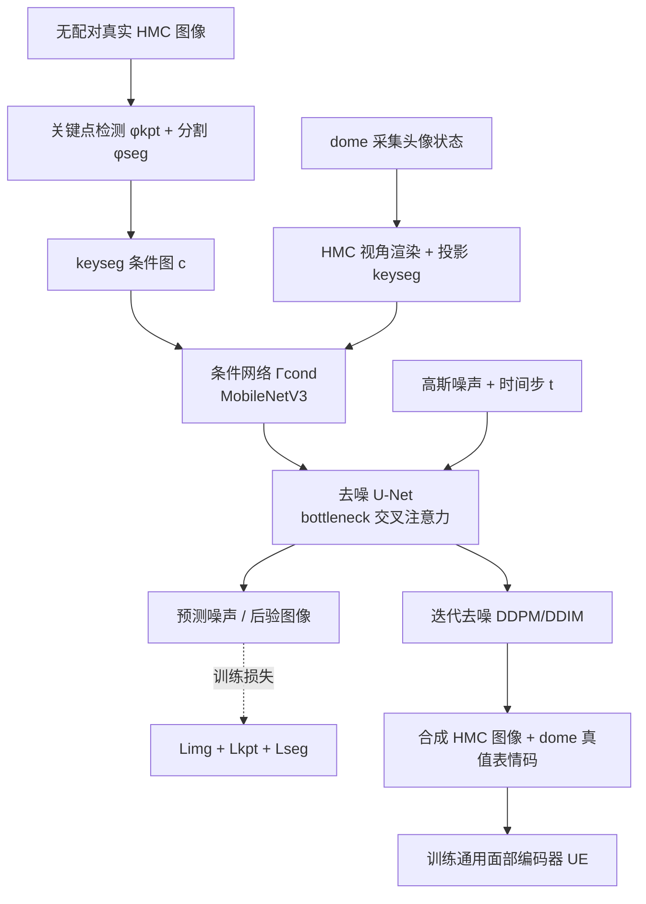

## 一句话总结

本文提出 GenHMC：不再用"分析-合成"去拟合真实头显相机（HMC）图像，而是反向操作——用大规模、易采集的无配对 HMC 图像训练一个表情条件扩散模型，给定任意 dome 采集的头像状态就能直接生成高质量合成 HMC 图像，从而低成本地建立"HMC-头像"对应关系，并显著提升通用面部编码器的精度与泛化能力。

## 研究背景

在 VR/AR 中驱动照片级头像的核心难题是"HMC-头像对应问题"：头显相机（HMC）只能看到红外、局部、斜视角的人脸，而外向内的 dome 相机阵列才能提供与头像外观匹配的完整观测，但两者物理上无法同时同步采集。

以往方案（分析-合成）需要：对同一被试同时做 HMC 与 dome 配对采集、用含该被试的数据构建头像、训练风格迁移模型跨越域差（红外 vs 可见光、光照方向）、再把完整头像拟合到局部 HMC 观测上。这带来两类问题：

- 成本上：换新头显就要从头重采配对数据；头像表情空间一更新就要重训分析-合成流程。
- 质量上：风格迁移与表情之间解耦不彻底，产生所谓"作弊"效应；把完整头像拟合到局部观测需要对不可见区域（如头发）加正则，降低拟合精度；精度还受限于头像本身的表情表达范围与外观差异（如妆容）。

因此需要一种既能免除昂贵配对采集、又能泛化到未见身份的对应关系建立方法。

## 方法

### 整体框架

核心思路是把问题"反过来做"：不去优化头像表情来匹配真实 HMC，而是把虚拟 HMC "戴"到已在 dome 中精确捕获表情的头像上，用扩散模型合成对应的 HMC 图像。关键条件信号是把关键点与分割图叠加而成的 keyseg 图，它同时可从真实 HMC 图像检测、也可从头像投影得到，因此对表情隐码的具体取值无关。

### 关键设计

1. **keyseg 条件图作为表情控制信号**：把关键点检测（上脸的眉毛、内外眼睑、瞳孔中心；下脸的唇缘、丘比特弓、上下唇、嘴角、鼻孔、鼻基、鼻尖、舌尖、下巴顶底）与语义分割（脸区、眼球、虹膜、瞳孔；脸区、上下唇、口内、舌）以不同颜色叠加到同一张图上：$$c = c_{keyseg} = \phi_{kpt}(x) \cup \phi_{seg}(x)$$。图像化条件能在瞳孔、嘴唇、面部轮廓等精细结构上实现精确对齐，且便于编辑与扩展（如换成抽象光照图）。

2. **轻量条件注入 + U-Net 去噪**：条件 $$c$$ 经浅层卷积网络 $$\Gamma_{cond}$$（基于 MobileNetV3）得到 $$\Gamma_{cond}(c) \in \mathbb{R}^{C \times 12 \times 12}$$（$$C=160$$），展平后经交叉注意力注入去噪 U-Net 的瓶颈层。作者特意不用潜在扩散模型（LDM），因为只需生成较轻量的 256×256 单色图，避免额外的 VAE 训练。

3. **三项训练目标**：噪声重建损失 $$L_{img} = \lVert \varepsilon_\theta(\alpha_t x + \sigma_t \varepsilon, c, t) - \varepsilon \rVert_2^2$$；关键点热图感知损失 $$L_{kpt} = \lVert hm(\phi_{kpt}(x)) - hm(\phi_{kpt}(\hat{x}_0)) \rVert_2^2$$；分割图的逐像素交叉熵 $$L_{seg} = \mathrm{CrossEntropy}(logit(\phi_{seg}(\hat{x}_0)), \phi_{seg}(x))$$。总损失为加权组合 $$L_{total} = \lambda_{img} L_{img} + \lambda_{kpt} L_{kpt} + \lambda_{seg} L_{seg}$$。

4. **推理即建立对应关系**：推理时无真实 HMC 图像，改为从模拟 HMC 视角渲染头像、投影得到 keyseg 条件 $$c$$，再从纯噪声按 DDPM/DDIM 迭代去噪生成合成 HMC 图像。这样即可把 dome 侧的真值表情码（甚至 dome 图像）与合成 HMC 图像配成对，直接用于训练面部编码器。

5. **编码器训练系统**：合成 HMC 数据与 dome 资产天然同步，带来三点收益——来自多视角 dome 的更准真值监督、无需昂贵配对采集、以及 GenHMC 在光照/胡须/眉毛粗细/虹膜颜色/眼镜等正交因子上的自然增强，从而在保持表情不变的前提下扩大外观多样性。

## 实验结果

数据规模：341 名被试的 dome 多视角采集（90 相机、4096×2668、30 FPS、逾 12M 帧），341 名同被试的配对 HMC 采集，超过 18K 名被试的大规模无配对 HMC 采集（约每人 40K 帧，用于训练 GenHMC），以及为每个 dome 帧生成的逾 12M 帧合成 HMC。评测保留 34 名训练完全未见的被试，用 dome 导出的表情码做参照，指标包括光度 $$L_1$$ 误差、几何 $$L_2$$ 误差（全脸与嘴部）、以及唇形误差。

通用面部编码器（UE）对比（200K 迭代、batch 16）：

| 方法 | Photo. $$L_1$$ ↓ | Geo. $$L_2$$ ↓ | Geo. $$L_2$$ (嘴) ↓ | 唇形 ↓ |
|------|------|------|------|------|
| Real+GenHMC (Ours) | **2.8598** | **1.2325** | **1.8959** | **1.9968** |
| Real (Baseline) | 2.9149 | 1.2603 | 1.9666 | 2.0921 |
| Real w/o SSL | 2.9578 | 1.2740 | 1.9811 | 2.1519 |
| GenHMC Only | 3.5501 | 1.5118 | 2.4387 | 2.5563 |

真实+合成混合（约 50/50）在所有指标上超过当前最优基线，嘴部几何误差与唇形误差改进超过 5%。需注意"仅合成"配置指标偏高，是因为参照的"真值"实际上是旧方法基于风格迁移生成的伪对应（偏向真实 HMC），本身带偏差；而仅合成配置用的是 dome 帧的真实表情码。

规模化规律：GenHMC 生成质量随训练被试数增加而提升，但用比 18K 小一个数量级的数据即可获得可比效果；下游 UE 的光度误差随 GenHMC 被试数增加而下降，约在 1K–3K 被试处趋于平台；即便真实被试很少，加入 GenHMC 合成数据也能稳定提升 UE 性能。作者还指出 GenHMC 的训练与推理比采集大规模配对真实数据高效一个数量级以上。

## 亮点与局限

亮点：

- 首个用生成模型解决 HMC-头像对应问题的方法，把"拟合头像去匹配 HMC"反转为"生成 HMC 去匹配头像"，绕开了不可见区域拟合与表情范围受限等痛点。
- 利用海量易采集的无配对 HMC 数据，扩散模型只需训练一次，即可泛化到未见身份，免除逐头显、逐表情空间的重训。
- 表情不变、正交因子（光照、外观、眼镜等）可控增强，显著提升下游编码器在未见被试上的泛化与鲁棒性，并给出清晰的规模化规律。

局限：

- 逐帧独立生成，缺乏时间一致性。
- 不以身份为条件，身份保持能力有限（对逐帧、身份无关的编码器设置无影响，但限制更广应用）。
- 最终输出质量依赖关键点/分割模型的精度与头像渲染的保真度，尽管条件框架能缓解小误差，这些组件仍是关键因素。

## 延伸思考

- "反向生成对应关系"的范式可推广到其它难以获得同步真值的传感场景：只要存在一个易采集的目标域大数据池与一个可从两侧共同导出的条件信号，就能用条件扩散把稀缺配对问题转化为生成问题。
- keyseg 这种图像化、语义显式的条件，兼具精确对齐与可编辑性，值得作为一类通用条件接口——把光照图、遮挡图、配饰掩码等都统一成"可叠加的图像条件"。
- 时间一致性与身份条件是自然的下一步，若与多帧/视频扩散和身份感知条件结合，有望把该框架从"训练数据工厂"升级为可直接驱动的头像动画生成器。
