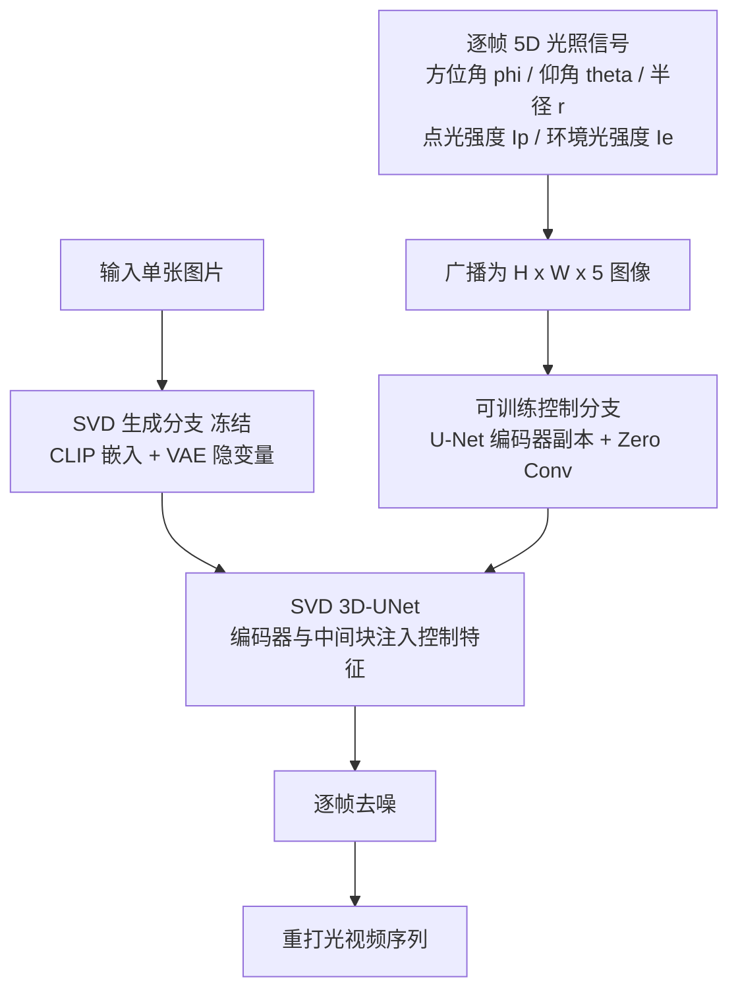

## 一句话总结

GenLit 把"单图重打光"重新表述为"图生视频"任务，借助 Stable Video Diffusion 的隐式场景理解，让用户在一张图片里插入并移动一个点光源，直接生成带有合理阴影与漫反射互反射的重打光视频，而无需显式重建 3D 资产或做光线追踪。

## 研究背景

单图重打光是计算机视觉与图形学的基础难题。传统做法依赖逆向渲染（inverse rendering）：先从单张图显式恢复几何、材质、光照等 PBR 资产，再在新光照下重新渲染。但这类方法要求精确估计资产，还要准确复现光与材质的交互、直接阴影、光线反弹，既容易出错又计算昂贵，且大多假设漫反射材质或需要多视角输入。

同时，近场重打光（near-field relighting，即在场景中加入可能可见的局部光源）相比全局重打光受关注更少，但它能通过投影阴影、镜面反射和明暗变化揭示高频表面细节与场景结构，对虚拟产品展示、后期编辑等应用价值很高。

作者的关键洞察是：改变光照本质上是一种"随时间的变化"，而视频扩散模型正是被训练来建模这种时间变化（包括光照变化）的，并且已展现出隐式的 3D 场景理解能力。因此可以利用视频扩散模型隐含的世界表征来求解单图重打光，绕开显式的逆向图形学。

## 方法

### 整体框架

GenLit 以预训练的图生视频模型 Stable Video Diffusion（SVD）为骨干，冻结其权重，并以类似 ControlNet 的方式外挂一个可训练的控制分支。输入一张图片作为生成分支的条件，逐帧的光照信号（5D 向量）作为控制分支的全局输入，模型输出一段场景与物体静止、仅光照随时间变化的视频。整套系统只在一个小规模合成数据集 Objaverse-GenLit 上微调，却能泛化到真实图像。

### 关键设计

1. 可解释的 5D 控制信号：点光源由随时间变化的 3D 位置与强度定义。位置用极坐标 $$(\phi_i, \theta_i, r_i)$$ 表示，其中 $$\phi_i \in [0, 360]$$、$$\theta_i \in [45^\circ, 80^\circ]$$。每帧条件是 5D 向量 $$\vec{l}_i = [(\phi_i, \theta_i, r_i, I_{pi}, I_{ei})]$$，$$I_{pi}$$ 与 $$I_{ei}$$ 分别是点光与环境光强度。

2. 先"调暗"再"移动"的时序策略：前四帧逐渐把环境光强度降到初值的 20%，从第二帧起把插入点光强度从 0 逐渐升到 120 流明；第五帧到最后帧按控制信号移动点光。这样先去除原图环境光的影响，再引入受控光运动。

3. ControlNet 式注入与训练：将每个 $$\vec{l}_i$$ 广播成图像 $$L_i \in \mathbb{R}^{H \times W \times 5}$$，送入可训练的 U-Net 编码器副本 $$\Psi$$，预测的控制特征加到冻结 SVD 编码器与中间块。条件去噪过程为 $$x_t = c_{skip}(\sigma)\, x_{t-1} + c_{out}(\sigma)\, \Phi(x_{t-1}, c, \Psi(L))$$，遵循 EDM 框架，微调损失为 $$\mathcal{L} = \mathbb{E}_{x_0, \epsilon, \sigma}[w(\sigma)\lVert x_t - x_0 \rVert_2^2]$$。

4. 整体建模前景与背景（不分割物体），保证前景物体的阴影能投射到地面、背景或其他物体上，作者验证这种阴影对真实感至关重要。数据集 Objaverse-GenLit 用 Blender Cycles 路径追踪渲染，包含 SingleObject 与 MultiObject-FlyingLight 两类场景，取自 Objaverse 与 Poly Haven 的 1436 个 3D 资产。

## 实验结果

在 SingleObject-Test 上做单图重打光的物体级评测（仅对前景物体计算指标），与多种扩散基线及逆向渲染方法 WS-SIR 对比，GenLit 在全部四项指标上均最优：

| 方法 | RMSE ↓ | LPIPS ↓ | SSIM ↑ | PSNR ↑ |
|------|--------|---------|--------|--------|
| WS-SIR | 0.0766 | 0.0530 | 0.9364 | 37.5996 |
| Neural Gaffer | 0.0456 | 0.0596 | 0.9377 | 38.5483 |
| IC-Light | 0.0583 | 0.0450 | 0.9505 | 39.0976 |
| DiLightNet | 0.0764 | 0.0645 | 0.9288 | 38.9696 |
| Diffusion Rend. | 0.0453 | 0.0308 | 0.9634 | 39.2117 |
| Ours | **0.0309** | **0.0209** | **0.9780** | **40.7174** |

此外，在真实图像（iPhone 拍摄）与 MIT Multi-Illumination 数据集上做定性评测与感知实验（五点 Likert 量表），三组实验的均值与中位数都接近 4，分布集中，表明参与者一致认为重打光结果"真实"。

## 亮点与局限

亮点：
- 把重打光重构为图生视频任务，充分挖掘视频基础模型对光照、材质、形状的隐式理解，无需显式 PBR 资产重建或光线追踪。
- 仅在小规模合成数据上微调即可零样本泛化到复杂真实场景，能合成合理的投影阴影、光衰减，以及漫反射互反射（颜色渗漏）等间接光效。
- 插入的点光源可在场景中自由运动（甚至"飞过"场景），控制灵活，光运动本身还能带来强烈的 3D 场景感知。

局限：
- 仅支持单个点光源，尚未扩展到用 HDRI 环境贴图整体改变环境光。
- 部分情况下原图中已有的阴影无法去除，会被"烘焙"保留，因为方法聚焦于添加光源而非移除已有光照。
- 由于合成数据集不含相关材质，模型无法处理焦散（caustics）与次表面散射（SSS）。

## 延伸思考

GenLit 的核心价值在于揭示了视频扩散模型可作为一种"隐式渲染器"：它把图形引擎的光操控能力蒸馏进生成模型，用可解释的 5D 控制信号取代显式物理管线。这条路线的自然延伸是把控制信号从单点光扩展到环境贴图、多光源乃至完整光照编辑，从而逼近可交互的神经渲染引擎。另一个值得关注的问题是"加光容易去光难"——如何让生成模型学会显式地移除原有阴影与光照，可能需要在训练数据中引入强主导阴影的场景，或引入解耦式的光照表示。焦散与次表面散射的缺失也提示：这类数据驱动方法的物理表达上限，仍受制于训练分布覆盖的材质与光传输现象。
