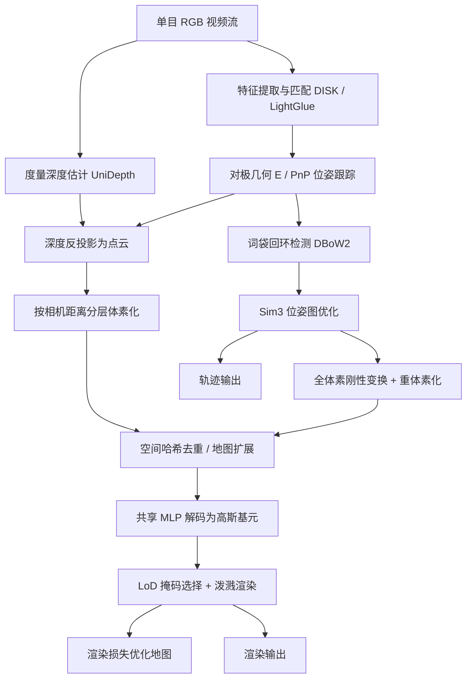

## 一句话总结

GigaSLAM 用分层稀疏体素表示的高斯泼溅地图，配合度量深度估计与词袋回环，首次让纯单目 RGB 的 NeRF/3DGS 类 SLAM 扩展到公里级、无界的室外长序列，同时保持高保真的自由视角渲染。

## 研究背景

传统的 NeRF 与 3D 高斯泼溅（3DGS）类 SLAM 主要面向小尺度、有界的室内场景，难以直接搬到大规模室外环境。作者指出两个核心障碍：

- 场景表示受限。隐式的 NeRF 表示能力有限，且依赖人工预设的场景包围盒，在尺度动态、边界未定义的室外场景中不再适用；稠密体素网格具有 $$O(n^3)$$ 的空间复杂度，扩展到上千立方米时内存与算力代价过高。显式的高斯泼溅则内存不友好，规模随场景增长而膨胀。并行工作 OpenGS-SLAM 把 3R 模块与 3DGS 结合，但其基于自注意力的设计带来 $$O(n^2)$$ 内存开销，只能覆盖百米级序列。
- 全局对齐困难。大尺度场景里回环检测对抑制全局漂移至关重要，但多数 NeRF/3DGS SLAM 依赖增量式、基于梯度的配准，不适合这种场景下的全局对齐。

因此现有方法大多局限于室内或短程室外，且往往需要 RGB-D 深度先验。GigaSLAM 的目标是仅用单目 RGB 就实现公里级、长期、无界室外场景的鲁棒跟踪与可渲染建图。

## 方法

### 整体框架

系统以单目 RGB 视频流为输入，围绕一个分层稀疏体素结构展开：前端用度量深度估计与特征匹配做在线位姿跟踪，把深度反投影为点云后按距离分层体素化写入地图；地图用共享 MLP 把体素解码为高斯基元并渲染；回环模块用词袋检索触发 Sim(3) 优化，再把所有体素做刚性变换与重体素化以保持一致性。

### 关键设计

- 分层稀疏体素与细节层级（LoD）表示。借鉴 Scaffold-GS 的体素化思想，把场景切成多级、由细到粗的体素，每个锚点携带上下文特征、缩放因子与 $$k$$ 个偏移，由共享 MLP 解码出 $$k$$ 个高斯。近处用细体素、远处用粗体素，既节省算力又缓解长序列中不同视角高斯相互"碰撞"影响跟踪的问题。渲染时按体素到相机的欧氏距离 $$d_v = \lVert x_v - x_c \rVert_2$$ 落入的距离区间、体素层级标签与可见性三条件构造选择掩码，只把命中的体素送入 MLP 生成高斯。消融显示层级从 1 增到 5 时，视锥内平均体素数从约 41 万降到约 2 万，显存从 22.46 GiB 降到 8.62 GiB，而 PSNR 基本持平。

- 空间哈希去重的地图扩展。相邻视角视觉重叠大，新建体素常与已有体素重复。作者用空间哈希函数 $$h(x) = \left( \bigoplus_{i=1}^{3} x_i \pi_i \right) \bmod T$$（$$\pi_i$$ 为质数，$$T = 2^{63}$$）在常数时间内对锚点去重，只保留唯一体素，显著降低大规模建图的内存与计算冗余。

- 度量深度驱动的前端跟踪。基于 DF-VO 框架，用 UniDepth 恢复度量深度以消除单目尺度歧义，并用 RANSAC 校正帧间尺度误差。特征点用 DISK 提取、LightGlue 匹配，先建立 2D-2D 对应并用对极几何求解本质/基础矩阵恢复运动；当运动退化或尺度歧义导致对极几何失效时，用 GRIC 选择运动模型，并在本质矩阵不可靠时切换到 PnP 用 2D-3D 对应最小化重投影误差。

- 回环与地图更新。用 DBoW2 图像检索检测回环，随后做带平滑项与回环约束的 Sim(3) 位姿图优化。位姿更新后对所有层级体素施加刚性变换 $$p_i^{\text{new}} = T^{(j)}_{\text{new}} \cdot \left( T^{(j)}_{\text{old}} \right)^{-1} \cdot \left[ p_i ; 1 \right]$$，为控制大规模体素的内存开销，更新按批次分块进行，再借助空间哈希做重体素化与快速查找。地图优化损失由 L1 颜色项与 D-SSIM 组成，并加入几何边缘平滑项与 MonoGS 的各向同性正则项，总损失为 $$L_{\text{total}} = L_{\text{render}} + \lambda_i L_{\text{iso}} + \lambda_s L_{\text{smooth}}$$。

## 实验结果

在 KITTI 数据集上评估相机跟踪精度（ATE RMSE，单位米，越低越好）。GigaSLAM 是唯一能在长序列室外数据上同时完成高保真渲染并保持较强跟踪的高斯泼溅类方法；面向室内设计的 MonoGS 与 Splat-SLAM 在多数序列上崩溃或失败。

| 方法 | 回环 | 渲染 | 平均 ATE | 序列 00 | 序列 08 |
| --- | --- | --- | --- | --- | --- |
| ORB-SLAM2（含回环） | 是 | 否 | 54.816 | 6.03 | 38.85 |
| DF-VO | 否 | 否 | 16.440 | 14.45 | 7.63 |
| DPV-SLAM++ | 是 | 否 | 25.749 | 8.30 | 110.90 |
| MonoGS | 否 | 是 | / | failed | failed |
| Splat-SLAM | - | 是 | / | 83.07× | 52.07× |
| 本文（无回环） | 否 | 是 | 16.437 | 7.09 | 9.48 |
| 本文（含回环） | 是 | 是 | 15.576 | 6.83 | 7.04 |

（表中"failed"表示跟踪模块返回 NaN 导致整段失败；"num×"表示 Splat-SLAM 在建图模式下崩溃、数值取自仅跟踪模式。）在渲染质量上，本文在 KITTI 上平均 PSNR 达 24.22 db、SSIM 0.95、LPIPS 0.31，明显优于 MonoGS 与 Splat-SLAM。在更长的 KITTI 360（平均约 8497 帧）与 4 Seasons（平均约 2 万帧）上，DROID-SLAM 大量序列显存耗尽，本文含回环版本平均 ATE 分别为 47.107 与 92.950，展现出对超长序列的可扩展性。

## 亮点与局限

亮点：

- 首个面向公里级、无界室外长序列的单目 RGB NeRF/3DGS 类 SLAM 框架，可在单张 GPU 上支持长达数十公里的城市驾驶场景。
- 分层稀疏体素 + LoD 表示同时解决"无界动态扩张"与"大规模高效渲染"，用较少的活跃高斯换来稳定的显存占用与渲染效率。
- 把词袋回环、Sim(3) 优化与高斯地图的刚性更新、重体素化打通，给出适用于高斯泼溅地图表示的回环闭合流程。

局限：

- 回环检测依赖 DBoW2，在高速运动或起止点难以匹配的序列上会漏检潜在回环（如 4 Seasons 部分序列中 DBoW 未能识别隐含回环）。
- 超长序列（如 4 Seasons）帧数激增导致内存需求陡升，个别序列 ATE 明显偏大（如 City Loop 达 362.13）。
- 依赖度量深度模型（UniDepth）等外部先验，单目度量深度的质量会直接影响建图与跟踪；作者也指出用超分算法替代双三次上采样可能进一步提升渲染质量。

## 延伸思考

这项工作把"高斯泼溅当渲染地图"和"传统 SLAM 后端（词袋回环 + 位姿图优化）"较为务实地缝合在一起，核心洞见是：在无界室外场景里，与其追求端到端可微的全局配准，不如让显式几何（体素 + 度量深度）承担尺度与结构，让高斯只负责外观渲染。分层 LoD 的思路本质是"按需加载"，与图形学里经典的细节层级、以及大规模 3DGS 的 Octree/锚点方法一脉相承，值得思考能否进一步引入内容感知的自适应层级划分，而非固定距离阈值。另一个开放问题是回环检测：作者把失败明确归因于 DBoW 的外观匹配能力，未来结合学习式地点识别或几何验证，或许能显著改善高速、重复纹理场景下的全局一致性。
