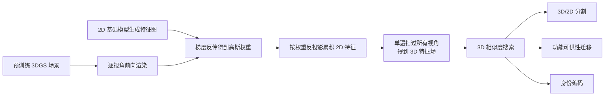

## 一句话总结

本文提出一种**免训练**的 3D 高斯特征场构建方法：利用推理期梯度反传把多视角 2D 特征按每个高斯在渲染中的影响权重反投影回 3D 高斯上，从而在无需训练特征场的情况下同时获得高质量的 2D 与 3D 分割能力，且速度比蒸馏式方法快数百倍。

## 研究背景

3D Gaussian Splatting（3DGS）以显式的三维高斯作为渲染基元，天然适合编辑、重排等交互式应用。在其之上做**特征场渲染**（feature field rendering）能为分割、语义查询等任务提供更强表示，但主流做法存在两个痛点：

- **训练代价高**：让 3DGS 直接渲染高维特征图需要额外训练，特征空间维度越高越昂贵。作者实测训练 Feature-3DGS 版本约需 20～30 分钟，而不带特征场的原版 3DGS 只需 2 分 30 秒，前者慢约 10 倍。
- **3D 分割不准**：渲染特征是多个高斯贡献的加权和，只有表面高斯与特征图对齐，场景深处的高斯特征并不能准确对应到特征图。因此像 Feature-3DGS、LangSplat 这类方法在 2D 渲染结果上分割表现好，但在 3D 物体分割上往往需要后处理且效果不佳。

作者的核心洞察是：既然渲染色是各高斯的加权和，那么某个高斯颜色对像素色的梯度恰好等于它在该像素中的权重（不透明度乘透过率）。据此可以用推理期梯度反传，把 2D 特征直接、廉价地聚合到每个 3D 高斯上，绕开训练。

## 方法

整体框架：先用预训练好的原版 3DGS 场景与一个 2D 基础模型（如 LSeg、DINOv2）在各训练视角生成特征图；再对每个视角做一次前向渲染并反传，得到每个高斯的梯度权重；用该权重把 2D 特征加权累积到每个高斯，一遍扫过所有训练视角即得到 3D 特征场；最后在 3D 特征空间上用相似度搜索完成分割、功能可供性迁移、身份编码等下游任务。

3DGS 中像素 $$(x, y)$$ 的渲染色为各高斯颜色的加权和：

$$
C(x, y) = \sum_{n \le N} c_n \alpha_n(x, y) \prod_{m < n}\bigl(1 - \alpha_m(x, y)\bigr) = \sum_{n \le N} c_n \alpha_n(x, y) T_n(x, y)
$$

其中 $$T_n = \prod_{m<n}(1 - \alpha_m)$$ 为第 $$n$$ 个高斯的透过率。

### 关键设计 1：梯度即权重

对第 $$k$$ 个高斯的颜色 $$c_k$$ 求导，得到

$$
\frac{\partial C(x, y)}{\partial c_k} = \alpha_k(x, y) T_k(x, y)
$$

这一梯度恰好等于该高斯在该像素渲染中的权重。于是可以借助现成的自动微分框架在推理期一次反传，高效地拿到"每个高斯对每个像素的影响"，无需任何训练。

### 关键设计 2：期望特征反投影方程

用上述权重把多视角 2D 特征聚合到高斯上，定义**期望特征反投影方程**：

$$
f_k = \frac{\sum_{(x, y, n)} F_{2D}(x, y, n)\, \alpha_k(x, y, n) T_k(x, y, n)}{\sum_{(x, y, n)} \alpha_k(x, y, n) T_k(x, y, n)}
$$

其中 $$f_k$$ 是第 $$k$$ 个高斯的特征，$$F_{2D}(x, y, n)$$ 是第 $$n$$ 个视角在 $$(x, y)$$ 处的 2D 特征。去掉分母即为**累积反投影**版本；若对 $$f_k$$ 做欧氏归一化，两种形式等价。特别地，当把 $$F_{2D}$$ 换成表示掩码有无的二值函数时，该式退化为已有工作中"用掩码梯度投票"的特例。

### 关键设计 3：直接在 3D 特征空间查询

得到高斯特征集合 $$\lbrace f_k \rbrace \in \mathbb{R}^D$$ 后，用查询嵌入 $$q$$（如语言查询）与之做余弦相似度 $$\mathrm{sim}(f_k, q)$$，阈值化即得 3D 分割掩码：

$$
G = \lbrace g_k \mid \mathrm{sim}(f_k, q) > \theta \rbrace
$$

由于查询直接作用在每个高斯的特征上、而非渲染后的加权特征，深处高斯也能被正确归类，因此 3D 分割更干净、离群点更少；同样的相似度也可投影回 2D 得到 2D 掩码。

### 关键设计 4：下游应用——功能可供性迁移与身份编码

- **功能可供性迁移**：先把 DINOv2 特征反投影到目标场景，再对每个高斯用 kNN 在特征空间中找最相近的源标注，从而把源图像上的标注区域迁移到外观不同但同类的目标物体上，服务机器人操作。
- **身份编码**：为场景中不同物体分配唯一向量并反投影。正交编码用程序化生成的正交向量，分离度最高但受特征维度限制物体数量；对比编码用对比学习拉开非正交向量，可编码远超嵌入维度的物体数。身份编码器-解码器的训练损失为分类损失与正交性损失之和：

$$
\mathcal{L} = \mathcal{L}_{classification} + \mathcal{L}_{orthogonality}, \quad \mathcal{L}_{orthogonality} = \lVert E E^\top - I \rVert_F
$$

## 实验结果

在 LERF-Mask 数据集上按 Gaussian Grouping 的协议评测 2D mIoU，本文方法（免训练、仅需约 10 秒训练分类器 + 10 秒迁移编码）达到与逐场景训练身份编码的 Gaussian Grouping 相当甚至更优的水平：

| 方法 | Figurines | Ramen | Teatime | Mean |
| --- | --- | --- | --- | --- |
| DEVA | 46.2 | 56.8 | 54.3 | 52.4 |
| LERF | 33.5 | 28.3 | 49.7 | 37.2 |
| SA3D | 24.9 | 7.4 | 42.5 | 24.9 |
| LangSplat | 52.8 | 50.4 | 69.5 | 57.6 |
| Gaussian Grouping | 69.7 | **77.0** | 71.7 | 72.8 |
| Ours | **73.5** | 72.7 | **74.1** | **73.4** |

此外，特征反投影在所有训练视角上单遍完成，含生成真值特征图平均仅需 2～3 分钟；推理时单次物体分割（含文本编码与相似度计算）约 30 ms，相比"掩码梯度"方法的完整流程加速约 900 倍，其中大部分延迟来自文本编码，相似度计算本身不足 1 ms。功能可供性迁移上，本文 2D-3D 方案 mIoU 略低于 2D-2D-3D 基线（均值 51.30 对 54.67），但耗时从均值约 251 秒降到约 7 秒。

## 亮点与局限

亮点：
- **免训练**：不更新任何高斯参数，仅靠推理期一次梯度反传就把 2D 特征聚合成 3D 特征场，构建特征嵌入远快于蒸馏方法。
- **2D 与 3D 分割兼优**：直接在 3D 高斯特征上查询，3D 分割干净、离群点少，弥补了蒸馏式方法在 3D 上的不足。
- **通用且可扩展**：同一框架支持 LSeg/DINOv2 特征、正交与对比身份编码，覆盖分割、功能迁移、物体提取与删除等多种下游任务。

局限：
- 由于不更新高斯参数，无法享受传统特征场方法自带的正则化效应，单个 2D 特征图中的细微瑕疵可能残留（但作者称影响很小）。
- 方法依赖已预训练好的 3DGS 场景与外部 2D 基础模型，特征质量受这些前置模型限制。
- 功能可供性迁移的 mIoU 略逊于逐帧迁移基线，是用少量精度换取大幅提速。

## 延伸思考

"梯度即渲染权重"这一观察把可微渲染的反传机制变成了一个几乎零成本的特征聚合算子，提示我们：许多在 3DGS 上原本需要训练才能获得的属性（不止语义特征，或许还有材质、光照、运动等标注信息），都可能通过一次反传的加权反投影"读"回到基元上。这种免训练、单遍扫描的范式对实时场景理解、机器人交互尤其有吸引力；后续值得探索的方向包括：如何补上缺失的正则化以进一步抑制多视角特征不一致，以及把反投影从颜色梯度推广到其他可微通道，用于更丰富的编辑与仿真任务。
