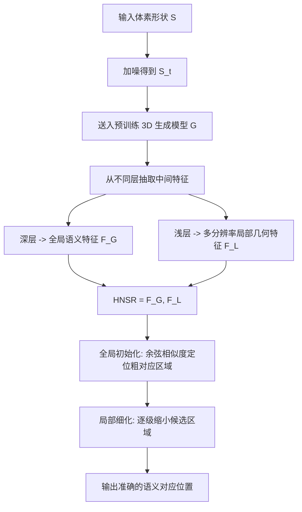

## 一句话总结

本文提出层次化神经语义表示（HNSR），从预训练的 3D 生成模型中免训练地抽取"全局语义特征 + 多分辨率局部几何特征"，再配合从全局到局部逐级细化的匹配策略，在拓扑与几何差异巨大甚至跨类别的 3D 形状之间建立准确、语义一致的稠密对应。

## 研究背景

3D 语义对应旨在为两个形状建立"语义上对齐"的映射（如把人的脚对应到狮子的爪），是形状分析、纹理迁移、形状编辑等任务的基础。它比传统几何对应更难：既要处理拓扑差异、缺失部件、类别差异，又要兼顾细粒度几何细节。

已有方法各有局限：

- 传统方法依赖手工描述子（如 WKS），泛化能力弱；基于功能映射（functional map）的方法依赖拉普拉斯-贝尔特拉米算子（LBO）的谱分解，当形状几何或拓扑差异大时谱基容易发散、错位，导致误差传播。
- 基于学习的方法需要标注数据，往往局限于人体、动物等特定域，难以覆盖多样拓扑与几何。
- 基于模板形变的方法把形状锚定到统一参考，但固定模板难以应对大拓扑变化与精细几何。
- 近期把 2D 图像特征投影到 3D 再聚合的方法，因图像特征缺乏显式 3D 几何信息，迁移到 3D 时容易噪声大、不一致。

与此同时，大规模 3D 生成模型（在 Objaverse 等数据上训练）隐含了丰富的几何与语义先验，但如何把这些先验用于形状分析这类下游任务仍未被充分探索。本文正是要回答：能否直接在 3D 空间、免训练地利用这些生成先验来构造对应？

## 方法

### 整体框架

给定源形状 $$S_{src}$$ 与目标形状 $$S_{tar}$$（均以体素形式输入），框架分两阶段：先为每个形状构造层次化神经语义表示 HNSR，再用"全局到局部"的渐进匹配策略求解稠密对应。

### 关键设计

1. 层次化神经语义表示（HNSR）。为忠实复用生成模型的先验，抽特征的方式要"镜像"其训练过程：对扩散式模型，按噪声调度对输入加噪得到 $$S_t = \sqrt{\bar{\alpha}_t}\, S + \sqrt{1-\bar{\alpha}_t}\,\boldsymbol{\epsilon}$$，再送入模型取第 $$l$$ 层输出 $$F^{(l)}_t = G^{(l)}(S_t)$$。借鉴"深层编码全局语义、浅层编码局部几何"的观察，把深层的单个特征作为全局语义特征 $$F_G$$，把若干浅层特征作为多分辨率局部几何特征集合 $$F_L=\lbrace F_{L_1},\dots,F_{L_N}\rbrace$$，组合成 $$F=(F_G, F_L)$$。整个过程免训练。

2. 渐进式全局到局部匹配。单独用全局特征会因分辨率低而粗糙；单独用局部特征则会在"局部相似但语义不同"的区域出错（如混淆汽车前后轮）。因此先做全局初始化：对源体素在低分辨率全局网格上找位置 $$v^{src}_G$$，与目标全局网格所有位置按余弦相似度比较，取 $$v^{tar}_G=\arg\min_{v}\ \delta_{cos}\big(F^{src}_G[v^{src}_G],\ F^{tar}_G[v]\big)$$，上采样得到粗匹配区域 $$R^{tar}_0$$。随后局部细化：在每一层 $$i$$ 把上一级区域 $$R^{tar}_{i-1}$$ 下采样为候选集合，只在该受限区域内按余弦相似度匹配局部特征，得到更细区域 $$R^{tar}_i \subset R^{tar}_{i-1}$$，逐级收缩直到定位到精确对应点 $$v^{tar}$$。全局阶段虽粗但稳健，可避免坏初始化导致的失败。

3. 兼容多种生成骨干、且训练无关。框架不绑定具体模型：SDF-Diffusion（$$32^3$$ 体素 SDF）、LAS-Diffusion（$$64^3$$ 占据栅格）、以及 3D 基础模型 TRELLIS（$$16^3$$ 体素结构嵌入）都可接入，只需按各自输入格式定义 $$S$$ 与生成器 $$G$$。接入在 Objaverse 上训练的 TRELLIS 时，方法展现出强跨类别泛化，甚至能在源、目标朝向不一致时继承 TRELLIS 的朝向鲁棒性。

## 实验结果

在 SHREC'19（人体扫描）与 SHREC'20（多样姿态动物）上评估形状对应精度（1% 误差容忍下的准确率与误差），与多种方法比较。由于 SDF-Diffusion 与 LAS-Diffusion 未在人/动物形状上训练，此表仅用 TRELLIS 骨干评估本文方法。

| 方法 | SHREC'19 准确率 ↑ | SHREC'19 误差 ↓ | SHREC'20 准确率 ↑ | SHREC'20 误差 ↓ |
| --- | --- | --- | --- | --- |
| DPC | 17.4 | 6.3 | 31.1 | 2.1 |
| SE-ORNet | 21.4 | 4.6 | 31.7 | 1.0 |
| 3D-CODED | 2.1 | 8.1 | – | – |
| FM + WKS | 4.4 | 3.3 | 4.1 | 7.3 |
| DenseMatcher | 11.3 | 6.5 | 27.8 | 2.7 |
| DIFF3F | 26.4 | 1.7 | 72.6 | 0.9 |
| DIFF3F + FM | 21.6 | 1.5 | 62.3 | 0.7 |
| HNSR（本文） | 37.4 | 1.3 | 83.8 | 0.5 |

在完全免训练的前提下，本文方法在两个数据集的准确率与误差上均取得最佳。此外在测地误差与边扭曲比、以及 13 个类别的协同分割（per-part IoU）上，三种骨干接入后也一致优于现有方法；推理效率上 SDF-Diffusion、LAS-Diffusion、TRELLIS 每对形状分别约需 1.6、1.3、2.8 秒。

## 亮点与局限

亮点：

- 免训练、免标注：直接复用预训练 3D 生成模型的几何与语义先验，无需针对任务微调。
- 骨干无关：兼容类别专用扩散模型与 3D 基础模型，接入 TRELLIS 后可处理跨类别、非对齐朝向的形状。
- "全局定语义、局部定精度"的渐进匹配显式化解了单一尺度匹配的两难，兼顾语义一致与几何精确。
- 直接在 3D 空间构建表示与匹配，绕开了先分割形状的依赖，也避免了 2D 到 3D 特征迁移的域差。

局限：

- 效果本质上受限于预训练生成模型的能力，若目标形状远离生成先验的训练分布，抽取的特征可能无法编码有意义的语义/几何线索，导致对应退化。
- 域偏移或代表性不足的类别仍是挑战，作者建议通过额外微调增强生成模型鲁棒性。
- 当前框架面向静态形状对，未直接处理随时间变化的 4D 序列中的时序一致对应。

## 延伸思考

这项工作提示了一个更一般的范式：大规模生成模型学到的中间特征本身就是强表示，下游任务未必需要再训练，而可以通过"如何抽取、如何组织、如何匹配"来释放先验。这里的关键工程直觉——用镜像训练过程的加噪方式抽特征、按网络深度划分语义与几何层次——值得迁移到其他 3D 分析任务。

一个自然的方向是把该表示扩展到动态 4D 场景，例如在人和鹿同时奔跑的序列中持续跟踪脚部区域，这要求在连续形变与姿态变化下维持语义一致，可能需要引入时空先验。另一方面，方法对生成骨干分布的依赖也意味着：随着 3D 基础模型能力提升，这类免训练对应方法的上限会被同步抬高，二者的进步高度耦合。
