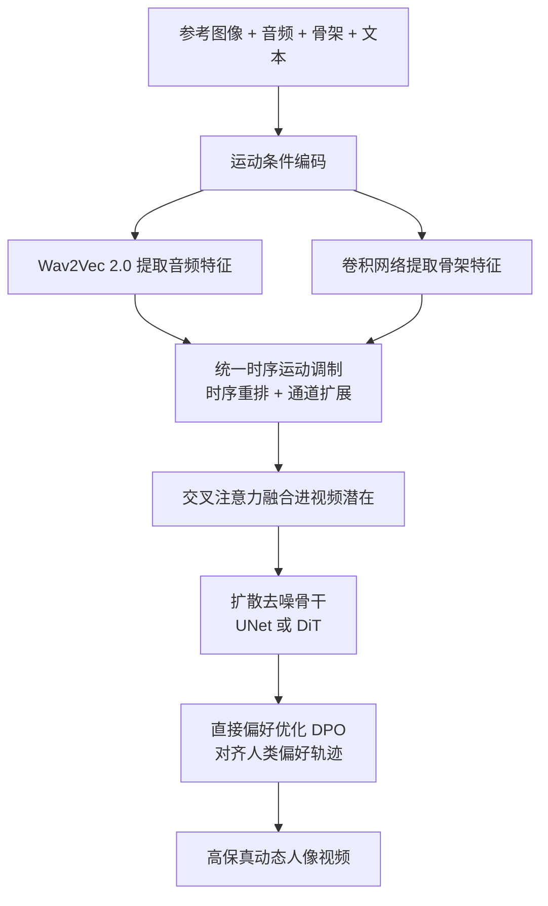

## 一句话总结

本文（Hallo4）提出一个与人类偏好对齐的扩散框架，通过面向人像动画的直接偏好优化（DPO）和统一的时序运动调制两项技术，在音频与骨架双模态驱动下生成唇音同步精准、表情自然、身体高频动作保真的高动态人像视频。

## 研究背景

人像图像动画旨在由文本、音频、姿态等多模态控制信号合成逼真的人物 2D 视频，在数字娱乐、虚拟现实、人机交互与个性化营销等场景有广泛价值。尽管扩散模型、视觉 Transformer 与自回归架构近年进展显著，高保真动画仍受两大难题制约：

- 生成既感知自然、又符合人类偏好的唇音同步与面部表情；
- 捕捉高频运动，例如细微发音、动态表情与快速肢体手势，尤其在急促语音或突发手部动作时。

已有 DiT 类扩散模型在跨场景、跨身份的泛化与写实渲染上优于 UNet，但它们依赖 VAE 在时序上下采样的潜在特征：为了对齐视频潜在的时序维度，运动条件（唇部发音、面部表情、骨架运动）通常被时序下采样，这会丢弃对同步快速唇动与手势至关重要的高频细节。本文聚焦音频驱动、并由骨架运动增强的面部与上半身人像动画，针对上述两点难题给出方案。

## 方法

整体框架由两条主线组成：一是构建人类偏好数据集并把直接偏好优化引入扩散式人像合成，让去噪轨迹对齐人类判断；二是用统一时序运动调制解决运动条件与压缩视频潜在之间的时序分辨率与维度不匹配。该机制同时适配 UNet 与 DiT 骨干，DiT 采用 Wan2.1 框架、UNet 采用 Stable Diffusion 1.5。

关键设计：

- 面向人像的偏好数据集与 DPO：沿"运动-视频对齐"和"人像保真"两个维度，用 SadTalker、AniPortrait、EchoMimic-v2、FantasyTalking、Hallo3 等五种代表方法为每段音频生成候选视频，标注者按 5 分制打分并合成复合奖励 $$r = \tfrac{1}{2}(r_{align} + r_{fidelity})$$。采用"best-vs-worst"策略，把最高分样本作为 $$y_w$$、最低分作为 $$y_l$$，最大化奖励间隔以突出唇同步与表情质量的细微差异；对 DiT 的流匹配模型，DPO 损失让预测速度场 $$v_\theta$$ 更靠近 $$v_w$$、远离 $$v_l$$，并以 KL 约束限制对参考策略 $$\pi_{ref}$$ 的偏离。
- 统一时序运动调制：视频经因果 3D VAE 压缩为潜在 $$Z \in \mathbb{R}^{T' \times H' \times W' \times d}$$，其中 $$T' = \lfloor T/4 \rfloor$$。对每种运动条件 $$C_m$$，沿时间轴做重排 $$\tilde{C}_m = \mathrm{Reshape}(C_m,(T',\rho D_m))$$（$$\rho = T/T'$$ 为压缩比），用扩展的通道维承载原始时序特征，避免下采样丢弃高频细节，再经线性投影后与视频潜在做交叉注意力融合 $$Z' = \mathrm{Softmax}(QK^\top/\sqrt{d})V + Z$$。
- 分阶段训练：DiT 先在阶段一冻结 VAE 与去噪块、只更新运动模块中的音频交叉注意力层做音频驱动合成；阶段二引入骨架引导、只更新新增的骨架交叉注意力参数；最后统一施加 DPO 训练调整去噪策略。UNet 则以预训练 Hallo 初始化后直接用 DPO 微调。

## 实验结果

在 HDTF 数据集上与主流音频驱动人像动画方法对比，DiT 变体在唇音同步（Sync-C、Sync-D）与表情保真（E-FID）上均取得最优，Sync-C 甚至超过真实视频。

| Architecture | Method | Sync-C↑ | Sync-D↓ | E-FID↓ |
| --- | --- | --- | --- | --- |
| UNet-based | SadTalker | 7.804 | 7.956 | 11.826 |
| UNet-based | DreamTalk | 7.515 | 7.717 | 9.142 |
| UNet-based | AniPortrait | 3.550 | 11.007 | 14.819 |
| UNet-based | Sonic | 8.186 | 6.823 | 9.370 |
| UNet-based | Hallo | 7.770 | 7.605 | 8.508 |
| UNet-based | Ours (UNet) | 8.286 | 7.502 | 8.241 |
| DiT-based | Hallo3 | 7.384 | 8.613 | 8.589 |
| DiT-based | FantasyTalking | 4.218 | 11.043 | 9.806 |
| DiT-based | Ours (DiT) | 9.161 | 6.987 | 7.645 |
| Real Video | — | 8.976 | 6.359 | — |

在更接近真实野外场景的 Celeb-V 数据集上，Ours (DiT) 的 Sync-C 相较 Hallo3 提升约 22.4%；消融实验也表明：同时使用运动对齐与人像保真两类偏好达到最优平衡，音频条件下"4 倍时序压缩 + 按比例 4 倍通道扩展"的完整方案把 Sync-C 从直接压缩（audio/4）的 2.769 提升到 5.689。

## 亮点与局限

亮点：

- 首个面向音频驱动人像动画的人类偏好数据集与定制 DPO 框架，把偏好对齐问题转成成对轨迹优化，唇同步与表情自然度显著提升。
- 统一时序运动调制以"通道扩展替代时序下采样"的思路保留高频运动细节，无需改动预训练扩散 Transformer 结构即可无缝集成，同时适配 UNet 与 DiT。
- 在 HDTF、Celeb-V、EMTD 三个基准上，唇同步、表情保真、手部动作质量与多样性均取得领先。

局限：

- 依赖人工标注偏好数据，"best-vs-worst"排序与 5 分制打分成本高、且带主观性，规模化扩展受限。
- DiT 变体在 Celeb-V 上的 FID/FVD 等纯视觉质量指标并非全面领先，偏好对齐与像素级视觉质量之间存在权衡。
- 方法聚焦面部与上半身，全身及更复杂交互场景的表现尚未验证。

## 延伸思考

把 DPO 从文本到图像/视频扩展到"音频-人像"这一多模态时序对齐任务，核心难点在于如何定义可区分的偏好对；本文用复合奖励与极端配对策略绕开了显式奖励建模，值得在其他时序生成任务（如手势、舞蹈、全身动作）中借鉴。另一方面，时序运动调制揭示了一个更普遍的问题：当条件信号的采样频率高于潜在空间的时序分辨率时，"通道换时序"的重分配可能比简单下采样更能保真，这一思路对任何需要将高频控制信号注入压缩潜在空间的扩散模型都有参考价值。后续若能用自动化的偏好模型（如学习到的奖励模型或 AI 反馈）替代人工标注，或许能进一步降低数据构建成本并提升可扩展性。
