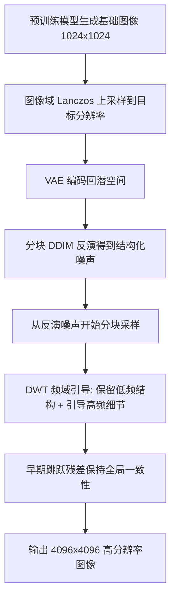

## 一句话总结

HiWave 是一种免训练、零样本的超高分辨率图像生成方法，通过"分块 DDIM 反演 + 基于小波变换的频域细节增强"两阶段流水线，让原本只在 1024×1024 训练的预训练扩散模型（如 SDXL）稳定生成 4096×4096 图像，在保持全局一致性的同时显著减少物体重复与伪影。

## 研究背景

扩散模型已成为图像合成的主流方案，但在高分辨率下直接训练的计算代价极高，且大规模训练数据大多缺乏超过 1024×1024 的高分辨率内容，导致现有模型通常被限制在中等分辨率，难以满足广告、影视等对 4K 输出的需求。

为把预训练模型扩展到超原生分辨率，已有免训练方法大致分两类，各有明显短板：

- **分块方法**（如 DemoFusion、Pixelsmith）：让模型在每个图像块上以原生分辨率工作，能保留细节，但在超过 2048×2048 时常出现物体重复、块边界伪影与跨块语义不一致。
- **直接推理方法**（如 HiDiffusion、FouriScale）：通过注意力缩放或下采样模块改造网络以单次生成，避免了分块伪影，但在超高分辨率（如 4096×4096）下难以维持全局一致性，细节模糊。

因此需要一种既能保持全局一致性、又能抵抗重复与伪影的免训练高分辨率生成方法。HiWave 正是针对这一缺口提出的分块新策略。

## 方法

HiWave 采用两阶段、分块的流水线：先用预训练模型在原生分辨率生成基础图像，在图像域上采样到目标分辨率；再对每个图像块做 DDIM 反演得到保留结构的噪声，从该噪声开始采样，并在采样过程中用基于离散小波变换（DWT）的频域引导注入高频细节，同时用跳跃残差在早期保持全局结构。

### 关键设计一：图像域上采样而非潜空间上采样

多数已有工作在潜空间做插值上采样，但标准 VAE 对缩放操作并不等变，直接在潜空间插值会引入严重的空间伪影。HiWave 改为先在图像域用 Lanczos 插值把基础图像放大到目标分辨率（此时缺细节），再经 VAE 编码回潜空间，从而避免潜空间插值伪影、保持结构一致性。

### 关键设计二：分块 DDIM 反演提供结构化初始噪声

不同于从随机高斯噪声起步，HiWave 对每个图像块用 DDIM 反演，正向积分扩散 ODE 求得能重建该块的噪声向量：

$$\mathbf{z}_{t+1} \approx \mathbf{z}_{t} - \dot{\sigma}(t)\,\sigma(t)\,\nabla_{\mathbf{z}_t}\log p_t(\mathbf{z}_t)\,\Delta t$$

这样得到的噪声保留了原图的结构信息与空间布局，带来两点好处：其一，为后续频域细节增强提供可控噪声，使模块能在保留低频结构的同时精修高频纹理；其二，相邻图像块获得相容的噪声向量，保持连续性、避免可见接缝。

### 关键设计三：基于 DWT 的频域选择性引导

作者认为低频分量主要承载结构一致性，高频分量承载细节与纹理。由于噪声来自 DDIM 反演，若仅用条件预测 $$D_c(\mathbf{z}_t)$$ 采样会复现基础图像（一致但缺细节）。于是对条件与无条件预测分别做 DWT，得到低频与三个高频子带，然后只在频域上对高频子带施加类 CFG 引导、低频保持不变：

$$\tilde{D}^{L}_{\mathrm{CFG}}(\mathbf{z}_t) = D^{L}_{c}(\mathbf{z}_t)$$

$$\tilde{D}^{H}_{\mathrm{CFG}}(\mathbf{z}_t) = D^{H}_{u}(\mathbf{z}_t) + w_d\bigl(D^{H}_{c}(\mathbf{z}_t) - D^{H}_{u}(\mathbf{z}_t)\bigr)$$

（垂直、对角子带 $$D^{V}$$、$$D^{D}$$ 同理引导，引导强度 $$w_d = 7.5$$。）最后用逆小波变换 iDWT 重建完整引导信号。这样可在增强细节的同时精确保留基础图像的全局结构。实现上使用 sym4 小波，兼顾空间与频率定位。

### 关键设计四：仅早期使用的跳跃残差

为在早期去噪阶段进一步保持全局结构，HiWave 把采样潜变量与 DDIM 反演潜变量混合，采用余弦衰减权重 $$c_1 = \bigl((1+\cos(\tfrac{T-t}{T}\pi))/2\bigr)^{\alpha}$$：

$$\hat{\mathbf{z}}_t = c_1 \cdot \mathbf{z}_t + (1-c_1)\cdot \mathbf{z}^{s}_{t}\quad (t < \tau)$$

当 $$t \ge \tau$$ 时不做混合。与在所有步都用跳跃残差的做法不同，HiWave 只在早期使用（2048×2048 用到第 15 步、4096×4096 用到第 30 步，共 50 步）：早期借助基础图像结构，后期放开以合成新细节。全程使用会压制细节，完全不用则导致重复伪影，DWT 引导进一步缓解了这一权衡。分块处理采用 50% 重叠并分批流式处理，使 24GB 显存的消费级 GPU 也能生成 4096×4096 图像。

## 实验结果

在 LAION2B-en-aesthetic 的 1000 个随机提示上，以 SDXL 为基础模型，与分块代表 Pixelsmith、直接推理代表 HiDiffusion 对比（各方法用相同提示与随机种子，单张 RTX 4090）。作者指出现有指标在高分辨率下会先把图像降采样（如 224×224），并不可靠，因此主要依赖人类偏好研究；标准指标列于附录供参考。

| 分辨率 | 方法 | FID↓ | KID↓ | IS↑ | CLIP↑ | LPIPS↓ | HPS-v2↑ |
|------|------|------|------|------|------|------|------|
| 1024² | SDXL（基础） | 61.78 | 0.0020 | 18.67 | 33.22 | 0.7779 | 0.2639 |
| 2048² | HiWave（Ours） | 63.35 | 0.0027 | 19.48 | 33.26 | 0.7784 | 0.2620 |
| 2048² | Pixelsmith | 62.31 | 0.0022 | 19.12 | 33.16 | 0.7808 | 0.2598 |
| 2048² | HiDiffusion | 65.91 | 0.0029 | 17.72 | 31.96 | 0.7834 | 0.2432 |
| 4096² | HiWave（Ours） | 64.73 | 0.0032 | 18.77 | 33.27 | 0.7831 | 0.2585 |
| 4096² | Pixelsmith | 62.55 | 0.0024 | 19.43 | 33.15 | 0.8039 | 0.2598 |
| 4096² | HiDiffusion | 93.45 | 0.0149 | 14.70 | 28.23 | 0.7996 | 0.1821 |

- 各指标上 HiWave 与 Pixelsmith 相当、并在 CLIP 上略优，且在 4096² 明显优于直接推理方法 HiDiffusion（后者 FID 大幅劣化到 93.45）。作者强调这些指标因降采样而不足以反映高分辨率细节差异。
- 人类偏好研究更具说服力：32 个提示、548 次独立盲评中，HiWave 被偏好的比例为 81.2%（445/548），其中 7 个测试用例达到 100% 偏好，验证了其在伪影抑制与一致性保持上的优势。
- 运行时间（RTX 3090）上 HiWave 在 4096² 约 1557 秒，与分块方法处于同一量级（Pixelsmith 549s、DemoFusion 1632s），属于可接受范围。

## 亮点与局限

亮点：
- 免训练、免架构改动即可把 1024×1024 的预训练模型扩展到 4096×4096（像素数 16 倍），实用性强。
- 在频域上分离处理：低频保结构、高频受引导补细节，从原理上同时缓解"重复伪影"与"细节不足"两个对立问题。
- 图像域上采样避免了 VAE 非等变导致的潜空间插值伪影；分块 DDIM 反演提供相容噪声，减少接缝。
- 流式分块处理让 24GB 消费级显存也能跑 4K 生成。

局限：
- 属于两阶段分块流水线，运行时间较长（4K 超过 25 分钟），不适合实时或大批量场景。
- 依赖现有指标难以量化高分辨率优势，主要靠主观偏好研究支撑结论，客观量化不充分。
- 质量上限受基础图像与预训练模型固有高频先验约束，若基础图像语义有误，细节增强难以从根本上纠正。
- 引导强度 $$w_d$$、跳跃残差截止步数 $$\tau$$ 等为经验设定，跨模型/跨内容的稳健性未充分探讨。

## 延伸思考

- 频域选择性引导（低频锚定结构、高频受 CFG 引导）是一种通用思路，是否可迁移到视频生成、超分辨率、图像编辑等需要"保结构、补细节"的任务。
- 小波基与分解层数（本文用 sym4、单层）对不同纹理类型的适配性如何，多尺度递归分解是否能进一步提升细节质量。
- 分块 DDIM 反演的相容噪声与跳跃残差的早期约束共同抑制重复，二者的贡献边界与最优搭配值得通过更系统的消融厘清。
- 高分辨率生成的评测困境（现有指标降采样失真）是领域共性问题，构建能感知超高分辨率细节的客观指标，可能比方法本身更影响后续研究的可比性。
