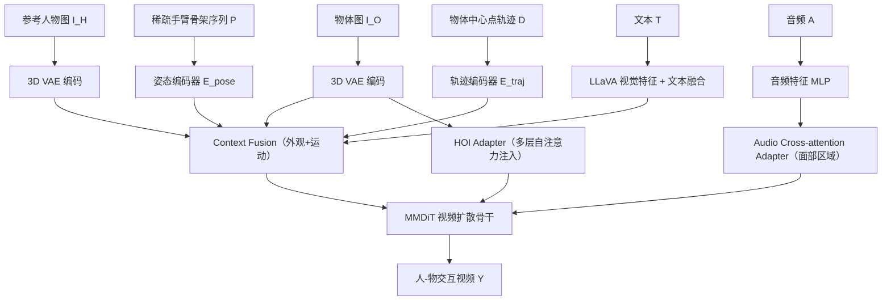

## 一句话总结

HunyuanVideo-HOMA 提出一种弱条件、多模态驱动的人-物交互（HOI）视频生成框架：只用单臂骨架和物体中心点轨迹作为最弱运动信号，把外观与运动条件注入多模态扩散 Transformer（MMDiT）的输入上下文空间，借助生成先验补全未受控部分，实现高保真、强泛化的人-物交互动画。

## 研究背景

给定一张参考人物图和一张待插入的物体图，生成人物与该物体自然交互的视频，在电商、广告、影视等场景有广泛需求。近年的人体动画方法在姿态、音频驱动的单人动画上进展显著，也开始把人-物交互纳入框架。

但现有 HOI 视频生成存在两个核心瓶颈：

- 依赖强运动控制。方法要么需要演员实拍的完整动作序列，要么需要对人和物做计算量巨大的精确 3D 建模，真实场景难以获取，用户可编辑性差。
- 物体泛化不足。多数方法只能处理简单刚体，对复杂几何/表面属性的刚体、可变形或铰接物体的泛化研究不足。

作者的思路是把控制信号弱化到极限：只保留与物体接触的手臂骨架（手指骨架可选去除，由上下文推断）和物体中心点的轨迹点序列，避免包围盒带来的位置/尺寸/朝向的僵硬约束。在这种"弱引导、强推理"的设定下，模型被鼓励用生成先验去填补未受控的部分，同时严格遵守已给出的稀疏控制。

## 方法

### 整体框架

框架基于 HunyuanVideo-T2V，包含一个 MMDiT 视频扩散模型和一个 3D VAE，训练目标用流匹配（flow matching）。核心是围绕 MMDiT 的输入上下文空间做条件注入，由三部分组成：上下文融合（Context Fusion）、HOI 适配器（HOI Adapter）、音频交叉注意力适配器（Audio Cross-attention Adapter）。

### 关键设计

1. **弱 HOI 条件设定**：把任务形式化为用参考人像 $$I_H$$ 与插入物体图 $$I_O$$ 生成 $$n$$ 帧交互视频 $$Y=\{y_{1:n}\}$$。人体运动由稀疏骨架序列 $$P=\{p_{1:n}\}$$ 驱动，只保留与物体接触的手臂、其余部位可选择性去除；物体运动由中心点轨迹 $$D=\{d_{1:n}\}$$ 表示，让模型自主推断朝向。文本 $$T$$ 与音频 $$A=\{a_{1:n}\}$$ 作为补充控制，音频让人物既能动作也能说话。

2. **外观上下文融合**：人和物采用不同注入策略。人像用通道拼接方式在隐空间注入，$$Z_{cat}=\mathrm{concat}_c(Z, Z_{ref})$$，以保留参考图的结构与语义。物体则同时从 token 空间与隐空间注入：token 空间用时序拼接 $$H=\mathrm{concat}_f(H_{obj}, H)$$，物体特征放在第 -1 帧（RoPE 偏移 -1）随后"涌现"进后续帧；隐空间则把物体按轨迹点复制粘贴到对应区域作为强外观先验 $$Z_{obj|D}$$，最终 $$Z_{cat}=\mathrm{concat}_c(Z, Z_{ref}, Z_{obj|D})$$，且不产生明显的复制粘贴伪影。此外抽取 LLaVA 视觉特征与文本融合注入文本分支增强全局语义。

3. **运动上下文融合**：采用"先分离后合并"策略，人体姿态与物体轨迹分别用 3D VAE 编码再经各自的单层 CNN（$$E_{pose}$$、$$E_{traj}$$）投影到隐空间，与外观拼接隐向量相加得最终输入 $$Z=Z_{cat}+Z_{pose}+Z_{traj}$$。消融显示这种分离设计比把异构运动融成单张运动图、共用一个编码器更能保留物体外观（避免运动纠缠导致的语义干扰）。

4. **HOI 适配器**：仅在输入层注入物体特征时，因网络太深梯度传播弱，模型难以学好物体外观。作者主张复用原模型参数空间而非新建分支：改造 MMDiT 双流块，把文本 token 换成物体 token $$H_{obj}$$、权重用预训练参数初始化，形式为 $$H=H+\mathrm{Mask}_{obj}\otimes\mathrm{SelfAttn}([H, H_{obj}+\mathrm{RoPE}(-2)])$$，输出只加回物体区域以提供精确位置，并结合 DINO 特征与时间嵌入提供语义。适配器只插入偶数层。

5. **音频交叉注意力适配器**：把音频特征经 MLP 映射为 $$H_{audio}$$，用交叉注意力只修改面部区域：$$H=H+\mathrm{Mask}_{face}\otimes\mathrm{Softmax}(\frac{Q_H K_A^T}{\sqrt{d}})\cdot V_A$$，实现时序对齐、解剖学准确的唇形同步。同样只加到偶数层。

### 训练与数据

采用三阶段训练：阶段一用纯人体数据学姿态控制；阶段二在 512×512 引入 HOI 数据、加入姿态与音频条件（$$E_{traj}$$ 由 $$E_{pose}$$ 初始化）；阶段三提升到 512×896 增强画质。为缓解 HOI 训练数据稀缺，作者设计了深度感知的数据筛选管线：用 Qwen-VL 识别是否含 HOI 并给物体打标，用 Grounding-DINO 与 SAM2 做检测分割，再用 DepthAnythingV2 估计深度、比较分割物体与手部区域的平均深度，只保留深度相近（物理上合理接触）的片段，最终收集约 140 小时训练数据。

## 实验结果

学习率固定 1e-5，48×96G GPU 上训练，总批量 12，阶段一/二/三分别 16000/2000/5000 步，每段视频 5 秒。评测用两个测试集：从 AnchorCrafter 测试集重采样得到的 80 段简单交互片段，以及自建的 100 段复杂交互片段。对比方法包括 AnchorCrafter、VACE-14B、MimicMotion、StableAnimator、UniAnimate-DiT、EchoMimic-v2。

下表为自建测试集上的定量对比（FID/FVD 衡量画质，OC 衡量物体一致性，SC/BC/MS 衡量通用视频质量，HAS/HF 衡量手部质量，Sync-C 衡量唇音同步）。

| 方法 | FID ↓ | FVD ↓ | OC ↑ | SC ↑ | BC ↑ | HAS ↑ | HF ↑ | MS ↑ | Sync-C ↑ |
| --- | --- | --- | --- | --- | --- | --- | --- | --- | --- |
| MimicMotion | 83.56 | 1072.02 | 81.70 | 93.48 | 93.82 | 87.51 | 99.16 | 99.08 | - |
| Echomimic-v2 | 100.20 | 1332.06 | 79.82 | 94.65 | 92.92 | 86.84 | 99.54 | 99.04 | 4.12 |
| StableAnimator | 125.84 | 1530.48 | 79.26 | 88.19 | 91.36 | 83.98 | 94.97 | 98.42 | - |
| UniAnimate-DiT | 83.18 | 844.32 | 83.74 | 95.82 | 94.96 | 83.17 | 99.48 | 99.27 | - |
| VACE-14B | 77.07 | 968.79 | 82.88 | 94.73 | 95.59 | 75.74 | 99.87 | 99.04 | - |
| Ours（本文） | **51.60** | **502.69** | **90.05** | 95.19 | 94.45 | **87.93** | 98.76 | 99.14 | **4.33** |

本文在 FID、FVD、OC 上明显领先，物体外观保持能力尤其突出，SC/BC/MS 与其他方法相当，复杂交互场景下手部一致性（HAS）最高，Sync-C 也与专门做音频的 EchoMimic-v2 相当。15 人用户研究在人物一致性、物体一致性、运动一致性、交互自然度、视频质量五个维度全面领先（自建集分别达 3.52/3.66/3.84/4.00/3.78）。

消融实验（512×512、2000 步）结论：

- 物体运动表示：包围盒（bbox）导致僵硬不自然运动；高斯彩色点（gaussian dot）因与预训练编码器分布不匹配导致外观错误、收敛困难；本文的轨迹点约束最小、运动最自然。
- 上下文融合：去掉 token 拼接对外观影响最大（丢失细粒度纹理）；去掉通道拼接会因与姿态运动对齐问题降低连贯性；固定位置的复制粘贴不如按轨迹对齐。
- HOI 适配器：完全去掉会收敛慢、跟不上轨迹点、物体常出现在错误的手上；用交叉注意力替换自注意力因分布不匹配导致外观与位置注入变差；复用预训练自注意力权重最契合模型内部先验。

## 亮点与局限

亮点：

- 把 HOI 控制信号弱化到"单臂骨架 + 中心点轨迹"，大幅降低对实拍动作和 3D 建模的依赖，用户可编辑性强。
- 围绕 MMDiT 输入上下文空间设计外观/运动分离注入，充分利用生成先验补全未受控部分。
- HOI 适配器复用预训练 MMDiT 参数而非新建分支，加速收敛、提升外观一致性与交互真实感。
- 深度感知的数据筛选管线用深度一致性过滤伪 HOI，缓解数据稀缺。
- 支持文本、音频等多模态补充控制，并提供可交互 web demo 供用户微调。

局限：

- 轨迹点与手的距离显著影响生成质量：点离手太远时，物体一致性与交互合理性下降。作者指出可通过交互式 demo 让用户重新调整输入点位置来纠正。

## 延伸思考

- "弱条件、强推理"是很有价值的产品化取向：把控制信号压到最小，既降低用户门槛，又把不确定性交给生成先验补全，这套思路可迁移到其它需要用户可编辑控制的生成任务。
- 复用预训练 MMDiT 参数空间来做适配（把文本 token 位置换成物体 token）是个巧思，比新建分支更契合模型内部先验，也提示"在原有注意力结构上做最小改动"往往优于引入全新模块。
- 物体注入"外观走隐空间+token 空间双路、运动分离编码"的设计，本质是在对抗多源条件的语义纠缠；这种模态分离的注入范式对多条件可控生成有普适参考意义。
- 深度一致性作为 HOI 有效性的过滤准则简单有效，用现成的深度估计器判断"手与物体是否真的在接触"，为大规模无标注视频构建交互数据集提供了低成本方案。
