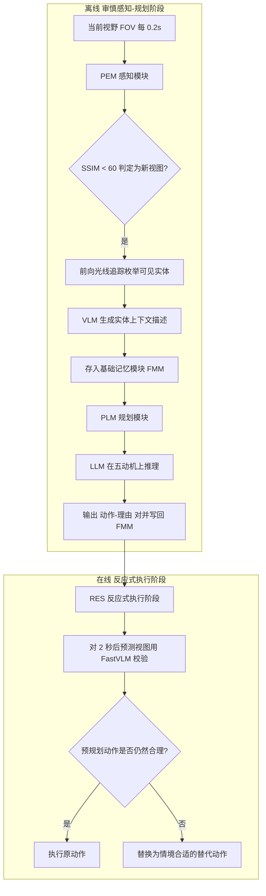

## 一句话总结

本文提出 SCORE：一个用符号化认知推理驱动的虚拟智能体转头框架，先通过 VR 用户研究提炼出五种转头动机（兴趣、信息搜集、安全、社会规范、习惯），再用视觉语言模型（VLM）感知场景、大语言模型（LLM）在这五个动机上推理"看哪里、为什么看"，从而在无需任务特定训练的情况下合成既自然又可解释的头部朝向。

## 研究背景

对可信的具身虚拟智能体而言，自然的转头是揭示"它注意到什么、意图是什么、如何应对风险"的关键微行为，但这一微观层面长期被忽视。现有的头部朝向预测方法大多建立在显著性图（saliency map）之上，把注意力当成图像平面上的一块"彩色斑点"，只会把视线导向明亮或运动的显眼物体，而无法解释人为什么会转向别处。

这导致两类系统性偏差：对醒目物体的注意力被过度预测，而由认知过程引导的、有目的的重新定向（如行人反复扫视来车、扫视寻找空座、抬头看天）被低估。结果是智能体只盯着显眼物体，却忽略障碍或任务相关线索，在杂乱、动态的场景里显得不真实。

问题的根源在于：转头行为源自场景感知、认知评估与决策的整合，而纯数据驱动或显著性代理方法对"认知"的处理过于浅层，一旦显著特征与任务情境或社会规范冲突就会失效，泛化能力差。作者主张：预测转头不只需要刺激检测，更需要理解背后的认知意图，即回答"为什么看"。

## 方法

SCORE 分两个阶段。离线的审慎感知—规划阶段（DPS）沿智能体轨迹预测并调度期望的头部朝向：感知模块（PEM）把当前视野送入 VLM 生成实体的上下文描述并存入基础记忆模块（FMM），规划模块（PLM）再让 LLM 结合场景目标、自身位姿与记忆，在五个认知动机上推理出"动作—理由"对。运行时的反应式执行阶段（RES）用轻量 FastVLM 在显示前约 2 秒对预规划位姿做校验，若与实时场景不符则替换为更合适的动作，从而抑制幻觉、吸收场景突变，且无需重跑昂贵的 VLM–LLM 流程。

两个朝向之间的瞬时角误差用单位四元数定义，作为 DTW 对齐的局部代价：

$$
d(q_1, q_2) = 2 \cdot \arccos\left( \lvert \mathrm{dot}(q_1, q_2) \rvert \right)
$$

其中 $$\mathrm{dot}(q_1, q_2)$$ 是两个四元数的点积。

### 关键设计 1：从 VR 用户研究提炼五种动机

作者用 Oculus Quest 2 让 20 名被试在五个日常环境（公交、咖啡馆、人行横道、商场、街道）各完成 60 秒任务，并设置最小干扰（MDC）与注意力诱发（APC，加入圣诞老人、交通事故、争吵者等干扰）两种条件。被试事后回看第一人称录像、逐次说明每次转头的动机。基于注意力研究的初始编码本（安全、兴趣、信息搜集）在迭代标注中扩展出社会规范（Social Schema）与习惯（Habit）两类，最终形成支撑 SCORE 决策的五因子动机分类。

### 关键设计 2：把动机编码为符号谓词供 LLM 打分推理

LLM 不是直接回归朝向，而是在五个动机上做类似"打分—权衡"的显式推理（如在人行横道给安全 4 分、信息搜集与社会规范各 2 分，最终选择向右看确认来车）。这种符号化的"动作—理由"对既产生朝向决策，又给出可解释的理由，并写回 FMM 以保持行为一致性。

### 关键设计 3：混合式"近在线"控制抑制幻觉

DPS 一次性为整条轨迹规划，成本高但审慎；RES 用更快的 FastVLM 对 2 秒后的预测视图做校验，落后于实时的推理延迟被这段前瞻窗口吸收（VLM/LLM/FastVLM 平均延迟分别为 3.50/7.10/1.49 秒）。这让系统在延迟与场景动态之间取得平衡，既能拒绝基于幻觉的动作，又能对用户操作或突发障碍做出合理反应。

### 关键设计 4：受限的记忆与拟人化转头动力学

FMM 每条记录含时间戳、当前物体/智能体列表与"动作—理由"对；为在长时程保持稳健，最多保留 20 条（10 条最新，其余按 LLM 相关性评分挑选最贴合目标者）。转头以 36°/秒模拟，到位后保持 1~2 秒 $$\sim N(1.5, 0.25^2)$$ 再回到行走方向，模仿人在完成威胁评估或好奇心后重新对齐头部的倾向。

## 实验结果

评测用 Gemini 1.5 Pro 作 VLM/LLM、Gemini 1.5 Flash 作 FastVLM，以显著性方法 Track 为基线，用与所有同场景人类轨迹平均后的 DTW 距离衡量与真人转头的接近程度（越低越好）。IntraHuman 为人类数据两两划分得到的经验下界。下表为单智能体五场景在 MDC 与 APC 两条件下的 DTW 结果：

| 场景 | 方法 | DTW↓ (MDC) | DTW↓ (APC) |
| --- | --- | --- | --- |
| Bus | IntraHuman | 0.2845 | 0.3289 |
| Bus | Track | 0.4733 | 0.4518 |
| Bus | SCORE（本文） | 0.4591 | 0.4029 |
| Café | IntraHuman | 0.3195 | 0.3338 |
| Café | Track | 0.6367 | 0.6550 |
| Café | SCORE（本文） | 0.4234 | 0.5072 |
| Crossing | IntraHuman | 0.1709 | 0.1919 |
| Crossing | Track | 0.5611 | 0.6504 |
| Crossing | SCORE（本文） | 0.2760 | 0.4662 |
| Mall | IntraHuman | 0.5051 | 0.2819 |
| Mall | Track | 0.8337 | 0.8284 |
| Mall | SCORE（本文） | 0.5405 | 0.4569 |
| Street | IntraHuman | 0.2491 | 0.2984 |
| Street | Track | 0.5999 | 0.5912 |
| Street | SCORE（本文） | 0.4705 | 0.3778 |

SCORE 在全部场景都优于 Track，且在场景变化剧烈、干扰物多的 Mall 与 Crosswalk 优势最明显；在 Bus-APC 中能持续关注吸引真人注意的圣诞老人乘客，说明其认知层可推断非典型物体的社会显著性。多智能体（UCY 的 zara01/zara02/students003）实验中 SCORE 同样全面领先 Track。消融实验表明：去掉全部动机、去掉 LLM（改由 VLM 直接选姿态）、去掉 RES 都会使 DTW 误差上升，其中去掉 RES 在 MDC 条件下退化最严重，验证了动机建模、专用推理阶段与 FastVLM 校验三者缺一不可。此外，响应性实验（MDC-APC 优于 MDC-MDC）证明 RES 不仅抑制幻觉，还能对运行时新出现的刺激做出适应。

## 亮点与局限

亮点：
- 首个用认知推理合成情境感知转头的框架，回答的不只是"看哪里"，还有"为什么看"，输出天然可解释。
- 零样本泛化：无需额外数据、调参或改代码即可迁移到未见环境与多智能体人群。
- 五种动机来自真实 VR 用户研究并编码为符号谓词，显著提升行为合理性；混合式 DPS+RES 流程兼顾规划深度与运行时响应。

局限：
- 仅依赖视觉输入，忽略空间音频、触觉等更丰富的感知模态（如逼近的脚步声、震动提醒）。
- 与移动控制解耦，尚未把转头与导航/全身动作统一协调。
- 依赖大规模视觉语言模型带来推理延迟，难以直接用于对实时性要求极高的场景。
- 与真人存在差异，但作者指出这更多反映个体倾向或"人格化"风格（SCORE 常表现得更"安全谨慎"），而非错误；真人在相同条件下本就差异巨大，不存在唯一真值。

## 延伸思考

SCORE 最有价值的立意在于把"转头"从显著性驱动的低层反射，重新框定为一个可用语言表达的认知决策问题：先用受控实验把人的动机蒸馏成一小组符号谓词，再让 LLM 在这些谓词上做可解释的权衡。这条"实验提炼动机→符号化→语言推理"的路线，对其他难以标注、强依赖意图的微行为（如手势、姿态、注视切换）具有很强的可迁移性。

其"审慎规划 + 轻量在线校验"的混合架构也颇具工程启发：把昂贵的大模型推理放到离线，用小模型在前瞻窗口内做实时纠偏，是在延迟与真实性之间取得平衡的通用范式。而作者强调"应建模行为的变异性而非假设一致性"，则指向一个更深的方向——可信智能体或许不该追求唯一正确轨迹，而应生成带有人格倾向的、合理的行为分布。若能进一步融合多模态感知、与导航控制耦合并蒸馏出轻量推理模型，这类方法有望真正走向大规模社交 VR 与远程呈现。
