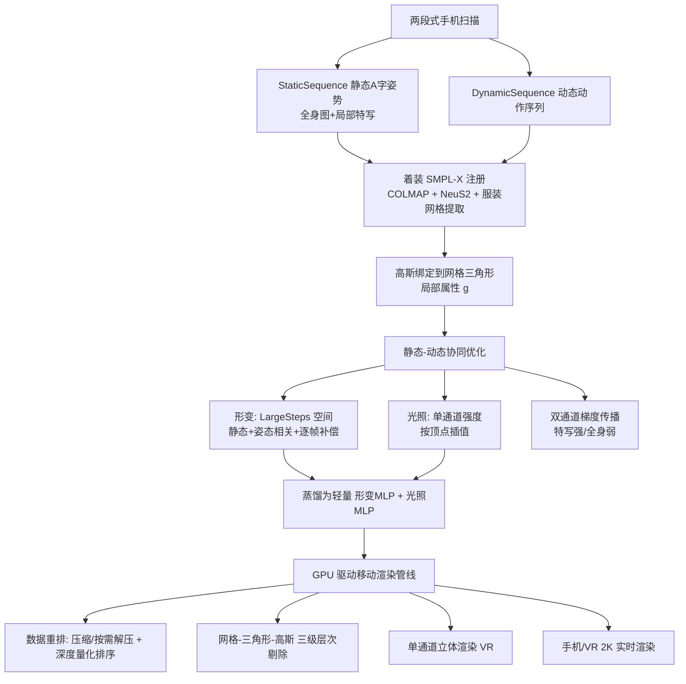

## 一句话总结

HRM²Avatar 用一部手机做 5 分钟单目扫描，就能重建出带真实服装动态与光照变化的高保真全身数字人，并通过网格驱动的高斯表示与 GPU 渲染管线，在手机与 VR 头显上实现 2K 分辨率下 90~120 FPS 的实时驱动与渲染。

## 研究背景

从单目手机视频重建可驱动的高保真数字人，能让普通用户以极低成本获得可用于在线会议、游戏、AR/VR 的虚拟形象，比昂贵的多相机影棚方案更普及。但相比多相机采集，单目输入的视觉与几何信息严重不足，带来三个核心难题：

- 视觉细节受限：为了让姿态估计稳定，拍摄时相机需与人保持较大距离拍全身，导致织物纹理、皮肤微结构等细节丢失。
- 动态形变与光照建模不足：身体形变、服装形变及二者的相互作用常被当作一个整体建模，结果是服装边界模糊、运动学失真。
- 高分辨率渲染的算力瓶颈：NeRF 或 3DGS 的照片级渲染计算量大，在移动硬件上难以达到可交互帧率。

本文提出端到端框架 HRM²Avatar，显式建模非刚性形变与姿态相关的光照变化，并针对移动端做渲染优化，力图在这三方面同时突破。

## 方法

### 整体框架

系统分为四个阶段：采集（两段式手机扫描）→ 表示（着装网格驱动的高斯人体）→ 优化（静态-动态协同重建）→ 渲染（GPU 驱动的移动端管线）。静态、纹理丰富的图像对高斯属性 g 施加强监督，动态、运动密集的序列则主要优化形变 $$\Delta V_d$$ 与光照 $$L$$；形变 MLP 与光照 MLP 蒸馏为轻量网络，配合 GPU 渲染管线在移动设备上实现实时驱动。

### 关键设计

- **两段式单目采集**：StaticSequence 中被摄者保持 A 字静止姿势，先环绕拍全身，再拍 logo、手部等纹理丰富的局部特写；DynamicSequence 则做抬臂、屈肘、抬腿等关节运动以捕捉非刚性形变与姿态相关阴影。每人约 300-400 张图，兼顾精度与效率。
- **着装网格驱动的高斯表示**：在 SMPL-X 基础上扩展出显式服装网格，形成"着装 SMPL-X"，将高斯绑定到网格三角形上。每个高斯用局部属性 $$g=\lbrace t,(u,v,w),r,s,o,sh,l\rbrace$$ 表示，$$t$$ 为父三角形索引，$$(u,v,w)$$ 为三角形局部坐标（$$u,v$$ 为重心坐标、$$w$$ 为沿法向偏移）。非头发区域将高斯约束为贴面 2D，防止穿模与运动尖刺。相比纹理贴图网格，高斯能自然越过网格边界，还原真实的服装轮廓（袖口、领口、下摆）。
- **静态-动态协同优化**：形变分解为 $$\Delta V=LS(\Delta V_s)+LS(\Delta V_d(\theta))+\Delta V_f$$，分别对应姿态无关偏移、姿态相关偏移（MLP 回归）与逐帧补偿；光照被显式建模为单通道强度 $$c_i^f(d)=\phi(sh_i,d)\cdot L_i^f$$，仅调制亮度而非色彩，按三角形顶点重心坐标插值。双通道梯度传播对特写图赋大权重 $$\alpha_{major}=5$$、全身/动态图赋小权重 $$\alpha_{minor}=1$$，并仅用静态序列梯度做高斯分裂，避免动态数据高频误差污染静态纹理。
- **GPU 驱动移动渲染管线**：包括离线压缩+GPU 端按需两阶段解压（先解位置做可见性剔除，通过后再解全属性）、深度量化排序（把视空间 z 映射到低精度整数加速排序）、网格-三角形-高斯三级层次剔除，以及 VR 的单通道立体渲染（蒙皮/解压等共享计算每帧只做一次，排序仅用左眼相机并共享给右眼）。

## 实验结果

在自采数据集上与两个 SOTA 单目方法对比（10% 全身图作测试集，按 ExAvatar 协议拟合 SMPL-X 姿态评测）：

| 方法 | PSNR ↑ | SSIM ↑ | LPIPS ↓ |
| --- | --- | --- | --- |
| GaussianAvatar | 19.78 | 0.931 | 0.075 |
| ExAvatar | 24.43 | 0.948 | 0.051 |
| Ours | 26.70 | 0.963 | 0.040 |

在 NeuMan 数据集上，简化为单层表示的版本（去掉服装提取、碰撞/语义损失与静态-动态协同优化）也取得最优指标（PSNR 35.48 / SSIM 0.986 / LPIPS 0.011），优于 ExAvatar、Vid2Avatar-Pro 等方法。运行性能方面，53.4 万高斯的数字人在 iPhone 15 Pro Max 上达 120 FPS、Apple Vision Pro 上达 90 FPS（未优化时分别为 40 / 39 FPS），相比 Unity/Godot 的 3DGS 实现分别加速约 4.01× 与 2.74×。

## 亮点与局限

亮点：

- 端到端打通"手机采集→高保真重建→移动端实时驱动"全链路，5 分钟单目扫描即可创建可驱动数字人。
- 着装网格-高斯混合表示显式解耦身体与服装动态，兼顾几何一致性与照片级外观，服装边界与褶皱阴影更真实。
- 面向移动/VR 定制的 GPU 渲染管线（层次剔除、按需解压、深度量化、单通道立体渲染），把 53 万高斯做到 2K@120FPS，运行内存压缩到原来的约 10%。

局限：

- 面部表现力有限，扫描协议不含精细面部动态，无法合成说话、大笑等表情。
- 缺乏动态头发建模，大幅摆动的发型被当作贴在头部网格上的静态高斯，捕捉不到高频头发动态。
- 大幅关节运动下仍可能出现服装形变不自然、烘焙阴影、衣体互穿等瑕疵。
- 训练耗时，单人在单张 GPU 上约需 7 小时，几何优化是主要瓶颈。

## 延伸思考

本文的核心思路是"用互补数据弥补单目信息不足"——静态特写补纹理、动态序列补形变与光照，再用双通道梯度控制避免两类数据相互干扰，这种"数据分工 + 梯度分工"的策略对其他单目重建任务同样有借鉴意义。把光照建模简化为单通道亮度调制，是一个务实的取舍：它避开了神经网络直接预测颜色在稀疏数据上的过拟合，却也意味着无法表达真正的色彩级光照变化，未来若结合可微光照/材质分解或许能进一步提升真实感。此外，将重建结果蒸馏为轻量 MLP 并配合工程化的 GPU 管线，是"研究质量"落地到"移动端实时"的关键一环，说明高保真数字人走向消费级设备时，表示设计与系统优化需要协同考虑，而非只追求离线指标。
