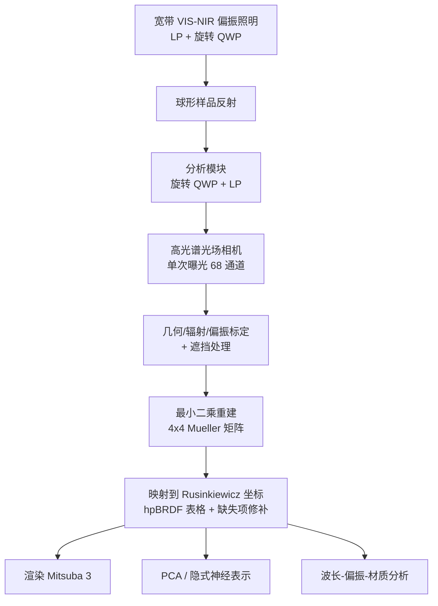

## 一句话总结

本文构建了首个真实材质的高光谱-偏振 BRDF（hpBRDF）数据集，覆盖可见光到近红外（414–950 nm、68 个光谱通道）并以完整 $$4\times4$$ Mueller 矩阵表征偏振反射，同时给出了高效的采集系统与 PCA、隐式神经等紧凑表示方法。

## 研究背景

BRDF 描述表面反射，是物理渲染与逆向渲染的核心。过去二十年的测量数据集大多只记录可见光谱内的强度信息，服务于 RGB 渲染；后续工作把光谱范围扩展到可见光-近红外，也有工作引入偏振（pBRDF）。然而偏振是光的基本波动属性，在科学与工程领域需要在高光谱各窄带上建模带偏振的光传输。

现有偏振 BRDF 数据集（如仅在 5 个可见光波长采样的 pBRDF）无法刻画偏振随光谱的连续变化，而光谱与偏振本身又高度耦合（折射率随波长变化会影响偏振线索）。缺少高光谱-偏振 BRDF 数据集，限制了依赖光谱与偏振信息的建模与仿真精度。主要难点在于 hpBRDF 维度极高，用传统逐点扫描方式采集耗时不可行。

## 方法

整体框架：以球形样品做基于图像的 BRDF 采集，用单次曝光高光谱光场相机获取 68 个光谱通道，并结合双旋转波片（DRR）椭偏测量重建完整 Mueller 矩阵，最终整理为 Rusinkiewicz 坐标下的 hpBRDF 表格，并给出 PCA 与隐式神经两种紧凑表示。

关键设计：

1. **单次曝光高光谱光场成像**：采用 Cubert Ultris X20 高光谱光场相机，通过微透镜阵列上的窄带滤光片一次性采集多视角光谱图像，从 164 个波段中选取 414–950 nm、间隔 8 nm 的 68 个通道（相机 FWHM 为 10 nm），避免了逐波段滤光片时分复用带来的巨大时间开销。

2. **宽带 VIS-NIR 椭偏测量**：照明与分析模块各配置消色差 LP 与 QWP，用 DRR 方法旋转 QWP 采样丰富的偏振态。照明侧 QWP 角度取 $$\{30^\circ, -45^\circ, 60^\circ, -90^\circ\}$$，分析侧取 $$\{0^\circ, 30^\circ, 60^\circ, 90^\circ, 120^\circ, 150^\circ\}$$；照明模块绕样品旋转 25 个角度（$$40^\circ$$ 到 $$160^\circ$$，$$5^\circ$$ 步长）。相机侧 QWP 倾斜约 $$15^\circ$$ 以抑制内反射鬼影，并通过平移 QWP 做两次采集处理遮挡。

3. **Mueller 矩阵重建与表格构建**：基于成像模型将重建写成最小二乘问题 $$\min_{\mathbf{M}} \sum_{\theta,\theta'} \lvert f(\lambda,\theta,\theta') - [\mathbf{L}\mathbf{R}^{\lambda}(\theta')\mathbf{C}_{r\to c}\mathbf{M}\mathbf{C}_{e\to i}\mathbf{R}^{\lambda}(\theta)\mathbf{L}\mathbf{s}^{\lambda}]_0 \rvert^2$$，逐像素求解后按 Rusinkiewicz 坐标 $$(\phi_d,\theta_d,\theta_h)$$（分别离散为 361/91/91 个 bin）与 68 个光谱 bin 映射到表格，每个元素存 $$4\times4$$ 单精度 Mueller 矩阵，单个表约 13 GB。对于因几何约束缺失的表项（尤其低 $$\theta_d$$），用角度空间的 3D 高斯卷积做数值修补。

4. **紧凑表示**：一方面用 PCA 分析光谱-偏振-角度域的低秩结构；另一方面提出以波长 $$\lambda$$ 与入射/出射方向为输入、预测完整 $$4\times4$$ Mueller 矩阵的隐式神经表示，支持连续插值并大幅压缩存储。

## 实验结果

作者在 Mitsuba 3 上完成可见光-近红外偏振渲染，并对 14 种材质做了波长依赖、粗糙度、金属/介质等分析。下表汇总隐式神经表示相较原始表格的紧凑性（数据来自正文与配图）：

| 表示方式 | 存储大小 | 相对原始表格 |
| --- | --- | --- |
| 原始修补后 hpBRDF 表格 | 约 13 GB | 1× |
| 隐式神经 hpBRDF（4 层 256 神经元） | 约 146 kB | 约 1/105 |

此外，物理有效性验证显示，重建的 Mueller 矩阵在所有 hpBRDF bin 上有 94.50% 满足 Givens–Kostinski 可实现性判据；与已有 5 波长 pBRDF 数据在 "white billiard" 材质上的对比也定性一致，同时本数据集的光谱采样更密、范围更宽。

## 亮点与局限

亮点：

- 首个覆盖可见光到近红外、以完整 $$4\times4$$ Mueller 矩阵表征的真实材质高光谱-偏振 BRDF 数据集，填补了光谱与偏振联合建模的空白。
- 采集系统把基于图像的 BRDF 采集、单次曝光高光谱成像与宽带椭偏测量结合，将高维数据的采集时间压到可行范围（单材质 13–35 小时采集）。
- 隐式神经表示在保持视觉保真度的同时把存储压缩约 105 倍，且提供连续的光谱-角度插值，避免表格最近邻查找在高光处的离散伪影。
- 分析揭示了平滑面比粗糙面更强的偏振保持能力，以及金属与介质在延迟矩阵非对角元上的符号反转等规律。

局限：

- 高光谱光场相机把传感器划分给多个波段，导致每波长空间分辨率仅 410×410，限制了球面上的密集角度采样。
- 无法采集各向异性材质。
- 因成像几何缺失的 Mueller 矩阵项依赖修补，虽视觉合理但不保证物理正确。

## 延伸思考

该数据集把光谱与偏振两条此前相对独立的线索统一到 BRDF 层面，为更物理化的 hpBRDF 参数模型、光谱-偏振逆向渲染（形状与反照率分解、反射物体重建）提供了基准。作者也指出现有解析 pBRDF 模型（如 Hwang 等）难以复现延迟矩阵的非对角分量，说明现有参数化在偏振相位建模上仍有明显不足，值得用物理约束或数据驱动方法改进；而对缺失项的物理一致修补，以及向各向异性、更高分辨率的扩展，是自然的后续方向。
