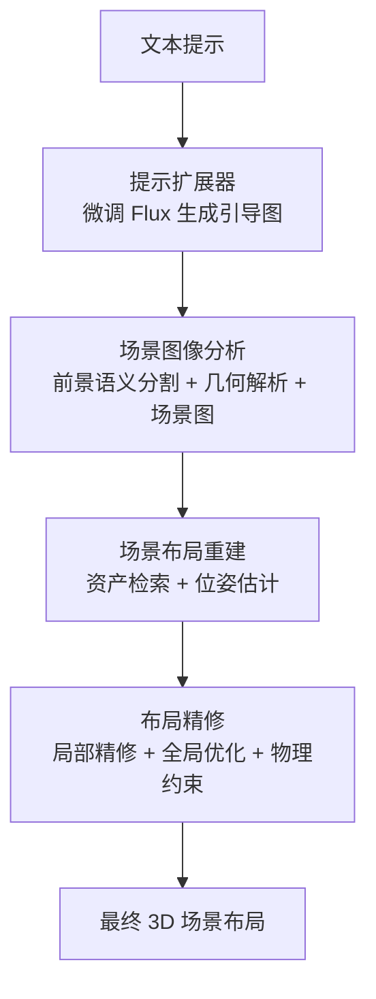

## 一句话总结

本文提出一套"视觉引导"的 3D 场景布局生成系统 Imaginarium：先用微调后的图像生成模型把文本提示扩展成一张风格与素材库一致的引导图，再用视觉基础模型解析图像的语义、几何与逻辑关系，从预建高质量素材库中检索资产并估计其位姿，最终借助场景图与物理约束优化，得到丰富且连贯的 3D 场景布局。

## 研究背景

从预定义素材库生成逻辑连贯、视觉美观的定制场景布局，是游戏场景生成与影视 CGI 中的关键难题，但现有三条技术路线各有短板。

传统优化方法把布局视为基于图的复杂优化问题，从预建布局分布中采样并用场景先验（布局准则、物体类别分布等）迭代优化。它们依赖人工制定的精确规则，既费时又需要大量艺术专业经验，且预定义规则会限制复杂多样场景组合的表达。

深度生成方法从预建 3D 场景数据集学习布局生成器（自回归模型、3D GAN、VAE、扩散模型、以及像 InstructScene 那样先学场景图先验再作为扩散条件的做法）。但 3D 数据采集成本高、涉及隐私且耗时，数据集规模受限，导致输出缺乏多样性、难以满足专业需求，尤其在需要大量高质量布局的新游戏或影视项目中几乎无法预先准备。

基于大语言模型的方法（如 HOLODECK、LayoutGPT、I-Design、SceneCraft 等）从语言模型中抽取布局先验再用场景逻辑规则优化，但它们本质上缺乏空间直觉与几何精度，难以准确表达复杂空间关系、建模物体位姿并遵循美学设计原则；许多方法只提供四个离散朝向选项，稳定性差、易出伪影。

此外，Objaverse、3D-Future 等现有素材库网格质量差、风格化选项有限，且大量依赖复合资产（例如把带摆件的书架当作单一资产），限制了布局灵活性。为此作者整理了一套高质量素材库并据此构造系统。

## 方法

### 整体框架

系统把"从预定义素材集 $$A$$ 与用户提示生成 3D 布局"形式化为函数 $$G(O|prompt, A) = \{o_1, o_2, \dots, o_n\}$$，其中每个物体 $$o_i = \{obj_i, R_i, t_i, s_i\}$$ 包含素材本体、旋转 $$R_i \in SO(3)$$、平移 $$t_i \in \mathbb{R}^3$$ 与缩放 $$s_i \in \mathbb{R}^3$$。整个流程分为四个阶段：素材约束下的提示扩展、场景图像分析、场景布局重建、场景布局精修。

### 关键设计

1. **素材约束下的提示扩展器**：借鉴 DreamBooth，用唯一标记 [V] 标识域内场景数据，以 LoRA（rank 16）微调 Flux 图像生成模型。微调后的模型学到了一致的全局模式（视角、渲染风格）与中等程度的物体级特征（纹理、形状），同时保留了布局的创作灵活性。为覆盖足够的空间信息，训练聚焦于轴测视图与正视图。生成图像与素材库风格一致，显著增强后续的视觉资产检索与位姿估计。

2. **高质量 3D 场景布局数据集**：包含 2,037 个高质量 3D 模型，覆盖 500 个 class、237 个 category，带真实纹理材质；由 20 位三年以上经验的专业艺术家搭建出 20 种类型共 147 个场景布局。相比 3D-Future，其资产多样性（500 vs 34 class）与场景复杂度（平均 31.86 vs 5.09 物体/场景）显著更高。数据集提供多层级标注：资产级含描述性 caption、包围盒尺寸，以及关键的手工标注"内部可放置子空间"；场景级含 caption、每个物体（含相机）的变换矩阵、父子层级关系、分割掩码与深度图。

3. **场景图像分析**：包含三部分。前景语义解析用思维链提示把素材库类别喂给 GPT-4o 解析图中物体，经类别合并映射 $$M$$ 转成适合 grounding-dino-1.5 检测的格式得到 2D 框，再送入 SAM 得到前景分割 $$S_{fg} = \{m_i\}$$。几何内容分析用 Depth Anything V2 估深度图并结合相机内参转点云，对前景拟合有向包围盒（OBB），对背景用 RANSAC 在正交约束下拟合墙、地、顶平面。场景图构造选取两类易从图像判读且泛化性好的关系——支撑关系（$$obj_a \prec obj_b$$，$$b$$ 位于 $$a$$ 之上/被顶棚吊挂/被 $$a$$ 容纳）与靠墙关系（$$d(obb_b, (n_w, t_w)) = 0$$），并用 GPT-4o 分三步（地面支撑树、顶棚支撑物、靠墙物）构造递归支撑树。

4. **场景布局重建**：对每个掩码区域用逆类别映射 $$M^{-1}$$ 结合视觉特征相似度与尺寸兼容度检索最合适资产。旋转估计用粗到精策略：先把资产从 162 个预采样视角渲染，用 GigaPose 的特征提取器算视觉相似度 $$sim_{img}(I_{A_{m_i},v_k}, I_{m_i}) = \sum_{j \in K_{v_k}} \cos\langle F_{ae}(I_{A_{m_i},v_k})_{img}(j), F_{ae}(I_{m_i})_{img}(j)\rangle$$ 粗选出 top-10 候选视角；再对每个候选用 RANSAC 求单应矩阵 $$H_v$$，取其与单位阵差异（Frobenius 范数）最小的 top-4，$$\{v_i^{vis}\}_{i=1}^{k} = \arg\min^{(k)}_{v \in V_{can}} \|U_v V_v^T - I\|_F^2$$，以此抑制对称歧义带来的错误。随后用 OBB 几何信息增强候选：对立方体状物体用 OBB 竖直面朝向引导，通过角度阈值 $$\tau = \pi/5$$ 在 OBB 估计与视觉估计间自适应选择。平移用 OBB 中心近似，缩放按物体类型（竖向可调、细长双轴、完全可缩放）优化以保持设计完整性。

5. **场景布局精修**：分三步。局部精修用场景图约束对齐物体 OBB 与支撑面/顶棚/墙，并对容器内物体按内部子空间容量调整尺寸。全局后优化把平移建模为约束优化，目标为 $$\min_{\{t_i^{update}\}} \sum_i \lambda_1 \|t_i - t_i^{update}\|_2^2 + \|m_i - R_m(obj_{m_i}, v_{ref})\|_2^2$$（取 $$\lambda_1 = 0.1$$），约束包含物体互不相交、顶棚吸附、靠墙贴合、支撑树的高度衔接；求解分两步：先预处理支撑与靠墙约束，再用体素化相交计算下的模拟退火求解。最后用 Blender 物理引擎施加物理模拟，保证枕头置于床上、堆叠物体等符合真实物理行为。

## 实验结果

系统在单张 A100 上约 240 秒完成一个场景（文生图 10 秒、图像分析 110 秒、布局重建 60 秒、布局精修 60 秒），相比专业流程约 2.5 小时大幅提速。

**质量评测（100 名高年级艺术生）**：与 DiffuScene、HOLODECK、LayoutGPT、InstructScene 在客厅/餐厅/卧室三类场景上做二选一偏好对比。合理性与真实感维度，本文相对四者平均偏好率分别为 79.22%、77.71%、76.60%、65.36%；美学质量维度分别为 80.38%、76.73%、79.33%、72.49%，全面领先。

**专业艺术家与 GPT-4o 评分（1-5 分，3 分为专业平均基线）**：本文在构图、语义逻辑、美学三维度综合得人评 3.34、GPT-4o 评 3.06，均达到或略超专业水准，为所有基线中最高。

**重建保真度（从数据集随机抽 30 个场景）**：主要物体的物体恢复率 92.31%、类别保持率 95.83%、旋转 AUC@60° 74.83%、平移 AUC@0.5m 84.32%、场景图关系准确率 93.26%；次要物体因分辨率与检测模型对小物体的限制恢复率较低（70.41%）。CLIP 相似度与 GPT-4o 评分（8.29/10）进一步佐证保真度。

**旋转估计（3DF-CLAPE 数据集）**：本文在类别级达 AUC@60° 70.06%、实例级 81.44%，显著超过 DINOv2、SPARC、DiffCAD、Orient Anything、GigaPose、AENet 等基准；类别级在 5°、15°、45° 阈值下 mAP 分别为 50.5%、65.5%、80.5%。即便 GigaPose 用了相同的关键点提取器，也因难以处理模板-查询差异而落后。

**消融实验**：微调 Flux 把检索 Top-1/Top-3 准确率从 48.57%/68.57% 提到 68.70%/83.21%，且过拟合与多样性指标显示其仍生成新颖布局而非记忆训练集。旋转估计消融显示 AENet、单应、几何逐项叠加后 mAP@5° 从 4.30% 提升到 66.57%。布局精修消融显示全局优化贡献最大，把支撑正确率从初始 62.45% 提到 90.80%、相交对数从 5.43 降到 2.21，加物理约束后达 91.34%。

## 亮点与局限

**亮点：**
- 把 2D 图像生成模型丰富、可控的生成能力迁移到 3D 布局任务，用风格一致的引导图作为桥梁，规避了纯 3D 数据稀缺与纯 LLM 缺乏空间直觉的两难。
- 用连续位姿估计（粗到精 + 单应抑制对称歧义 + OBB 几何自适应增强）替代以往方法的离散朝向，配合场景图约束与物理优化，生成更自然、少穿插的布局。
- 构建并计划开源一套高质量素材库与场景数据集（2,037 资产 / 147 场景 / 标注内部子空间），显著优于 3D-Future 与 Objaverse 在质量、多样性与复杂度上的表现。
- 支持基于图像重绘（Flux 局部 inpainting）的细粒度可控再编辑，实现物体替换、局部增添、全局补全。

**局限：**
- 微调图像生成模型在复杂场景多物体间的高一致性仍是主要挑战。
- 单图位姿估计在严重遮挡下依然困难，会产生失败案例。
- 次要小物体的恢复率受分辨率与检测模型限制而偏低；作者预期这些局限会随视觉基础模型进步而缓解。

## 延伸思考

本文最具启发性的是"以图像为中间表示"的范式选择：与其让 LLM 直接推理 3D 空间关系（缺乏几何精度），或让生成器在稀缺 3D 数据上学习（缺乏多样性），不如把成熟且数据充沛的 2D 图像生成能力当作"空间直觉的代理"，再用视觉基础模型把 2D 语义/几何逐层反投影回 3D。这实际上把"生成布局"拆解为"生成一张好图 + 忠实地把图逆向工程成 3D"，前者交给数据红利最大的模态，后者交给确定性的几何与逻辑约束——这种分工值得在其他 3D 生成任务中借鉴。

另一个值得关注的点是位姿估计中用单应矩阵与单位阵的差异来抑制对称歧义：对称物体的多视角特征相似度会误导匹配，而单应分解提供了一个正交于语义相似度的几何判据。这类"用几何一致性给语义匹配纠偏"的思路，在开放集 CAD 对齐、模板匹配等场景中都有推广空间。

局限也指向清晰的改进方向：多物体一致性依赖生成模型本身的进步，可考虑引入布局条件或多视角约束来强化；严重遮挡下的位姿歧义或许可通过多视角引导图或引入可微渲染的联合优化来缓解。整体来看，随着视觉基础模型持续增强，这类"视觉引导 + 几何约束"的解耦式管线有望成为高质量 3D 内容生成的稳健基座。
