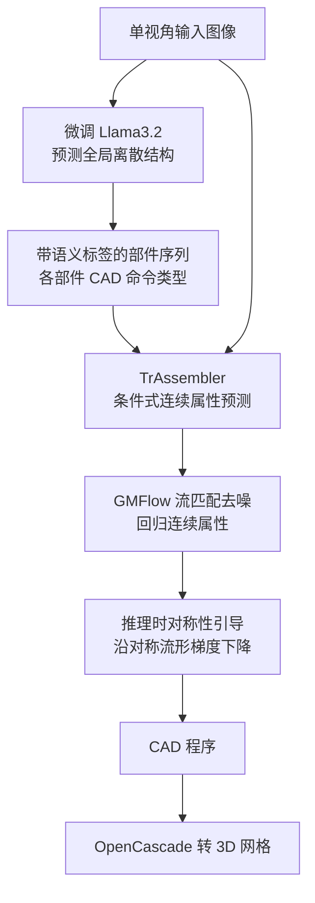

## 一句话总结

本文提出 Img2CAD：把"从单张图像逆向出 3D CAD 模型"这一混合离散—连续难题条件式拆解为两步——先用微调后的视觉语言模型（Llama3.2）预测带语义标注的全局离散结构（各部件及其 CAD 命令类型），再用 Transformer 网络 TrAssembler 在给定离散结构条件下回归连续属性，从而实现可编辑、可泛化的图像到 CAD 重建。

## 研究背景

- 领域现状：CAD 表示以"离散操作类型 + 连续属性参数"的程序化结构描述形状，天然支持直观编辑与制造，是逆向工程的理想目标表示。已有工作多从点云逆向 CAD，需要 3D 传感器输入。
- 核心痛点：图像才是日常物体最常见的采集形式（手机拍照、商品图），但图像到 CAD 面临两大挑战。其一是泛化性——不同来源图像的视角、光照、噪声、纹理差异巨大，直接端到端学图像到 CAD 极难，且日常物体（椅子、桌子）缺乏 CAD 数据。其二是表示复杂度——CAD 是离散命令类型与连续属性的混合体，直接学这个组合空间可能需要指数级数据。
- 本文 idea：与其端到端硬学整个组合空间，不如做"条件式因子分解"。先让在大规模数据上训练、具备强泛化能力的 VLM 预测离散结构（这一步 VLM 擅长），再把连续属性回归交给专门网络（VLM 不擅长精确数值）。关键洞察是：即便同一类物体（如椅子）结构空间庞大，部件间存在大量共享子结构（多数椅子有四条腿），VLM 能生成语义一致的部件标签，据此可在属性空间跨物体共享学习，缓解数据稀缺。

## 方法

### 整体框架

系统输入单张图像，第一阶段用微调 Llama3.2 把图像分解为语义部件并生成每个部件的离散 CAD 命令序列（只给命令类型，不填连续值）；第二阶段 TrAssembler 以该离散结构与语义标签为条件，用流匹配从噪声中去噪出所有命令的连续属性；推理时再叠加对称性引导；最后用 OpenCascade 把 CAD 程序转回 3D 网格。

采用的是工业界通用的 sketch-extrude（草图—拉伸）CAD 语言：草图由直线 $$L:(x,y)$$、圆弧 $$A:(x,y,\alpha)$$、圆 $$R:(x,y,r)$$ 三种命令构成闭合非自交轮廓；拉伸命令 $$E:(\alpha,\theta,\gamma,x,y,z,e)$$ 沿轮廓推出体块，再以 join 或 cut 组合，其中三个欧拉角定义拉伸坐标系、$$e$$ 为拉伸距离。

### 关键设计一：VLM 预测带语义的全局离散结构

将形状的"全局离散基结构"定义为部件分解 + 每个部件对应的 CAD 命令类型。直接用 GPT-4o 或原始 Llama3.2 因缺乏 3D 几何理解常出错，故用自建数据微调开源 Llama3.2，仅让它预测离散结构（不预测连续属性）。并提示 VLM 在结构中给出语义部件注释（如 # Backrest、# Leg 1），这些一致的语义标签是后续跨物体共享属性学习的关键——不同椅子的靠背虽属不同结构块，其真值 CAD 命令参数（拉伸轴、尺寸、拉伸距离）却高度相似。

### 关键设计二：TrAssembler 在共享空间预测连续属性

TrAssembler 先用共享权重的 Part Transformer 编码器处理每个部件的命令序列与噪声属性，并与 DINOv2 图像特征做交叉注意力得到部件级 token；这些 token 拼接 CLIP 语义嵌入后由 Global Transformer 做全局细化以捕捉部件间关系；解码器交叉注意可学习参数 token 并经 MLP 回归各命令属性的去噪流。生成模型采用 GMFlow，预测流速度的动态高斯混合分布 $$q(\mathbf{u}\mid\mathbf{x}_t)$$，比标准流匹配更能刻画 CAD 属性的多模态特性，训练用流速度负对数似然损失：

$$L=\mathbb{E}_{t,\mathbf{x}_0,\mathbf{x}_t}\left[-\log q\left(\left.\frac{\mathbf{x}_t-\mathbf{x}_0}{t}\right\rvert \mathbf{x}_t\right)\right]$$

其中 $$\mathbf{x}_0$$ 为真值属性、$$\mathbf{x}_t$$ 为噪声属性。核心创新是通过条件化于 VLM 给的离散结构，把图像到 CAD 简化为纯连续问题；层次化 Transformer 设计与一致语义标签共同促成属性空间的信息共享，且能处理可变数量的部件与命令。

### 关键设计三：推理时对称性引导

很多人造物体有强对称性，标准流匹配易忽视。在 GMFlow 每一步 ODE 求解后，对 $$\mathbf{x}_t$$ 沿对称数据流形做梯度下降：

$$\mathbf{x}_t=\mathbf{x}_t-\lambda\nabla\log p_{\text{sym}}(t)=\mathbf{x}_t-\lambda\frac{\partial L_{\text{sym}}}{\partial \mathbf{x}_t}$$

对称损失 $$L_{\text{sym}}$$ 通过采样点集、按对称面镜像或按对称轴旋转后，度量原始与变换点集的有符号距离函数（SDF）差异得到；对称类型（平面/旋转）由 GPT-4o 从图像判定，每个形状优化单一对称类型即足够。

## 实验结果

在自建的 CAD 化 ShapeNet（椅子/桌子/柜子）测试集上，以 Chamfer 距离（CD）、部件分割准确率（Seg Acc）、分割 mIoU 三个指标评估。Img2CAD 在全部类别与指标上一致领先，把平均 CD 从最优基线 DeepCAD-End2End 的 0.3108 降到 0.1174，分割准确率与 mIoU 分别提升 17.94% 与 19.03%：

| 方法 | Chair CD ↓ | Chair Seg Acc ↑ | Table CD ↓ | Table Seg Acc ↑ | Cabinet CD ↓ | Cabinet Seg Acc ↑ |
| --- | --- | --- | --- | --- | --- | --- |
| GPT-4o | 0.3806 | 50.49 | 0.3676 | 62.16 | 0.3807 | 54.66 |
| Image-3D-CAD | 0.3266 | 49.03 | 0.3828 | 33.72 | 0.4775 | 59.61 |
| DeepCAD | 0.2914 | 70.44 | 0.3633 | 60.20 | 0.3310 | 62.70 |
| DeepCAD-End2End | 0.2346 | 77.01 | 0.3698 | 67.37 | 0.3279 | 60.55 |
| 本文 | 0.0984 | 91.86 | 0.0966 | 93.81 | 0.1573 | 73.08 |

消融实验显示各设计逐级增益：Llama3.2 端到端直接预测结构+属性泛化差；引入条件式因子分解 + 层次化 Transformer 后，加入语义部件信息使 Chair CD 从 0.2847 骤降到 0.1685、Seg Acc 升到 81.79%；再换成流匹配损失进一步降到 0.0992 / 91.45%；最后对称性引导带来结构规整度提升（强连通分量数从 1.16 降到 1.11、对称 Chamfer 从 0.0827 降到 0.0756）。此外任意视角评测仅轻微掉点（CD 0.1174→0.1396），验证了 VLM/DINO/CLIP 带来的视角不变性与野外泛化能力。

## 亮点与局限

亮点：
- 提出"条件式因子分解"范式：把混合离散—连续的图像到 CAD 难题拆成"VLM 管离散结构 + 学习网络管连续属性"，各取所长，规避端到端学组合空间所需的指数级数据。
- 借语义部件标签实现属性空间的跨物体共享学习（灵感源自数学中的 sheaf 层概念），在有限数据下捕捉部件间一致性。
- 首个面向日常家居物体、通用 sketch-extrude 表示的图像到 CAD 方法与数据集（CAD 化 ShapeNet：1026 把椅子、3243 张桌子、305 个柜子），并支持自然语言驱动的结构感知编辑。

局限：
- 流匹配采样耗时依赖推理步数，Euler ODE 32 步约需 5 秒/样本，需借助单步扩散加速。
- 推理时对称性引导仅是软约束，无法保证完美对称与连通性。
- 微调后的 Llama3.2 仍不完美，复杂或长尾样本会出现缺失/幻觉部件；用真值结构替换预测结构可把 CD 从 0.1174 进一步降到 0.1032，说明结构预测仍是瓶颈。

## 延伸思考

- "让基础模型做它擅长的、把它不擅长的交给专门网络"是应对混合任务的通用策略。VLM 在语义/结构层面泛化强但数值预测弱，本文的条件式分解正是把两种能力解耦编排，这一思路可迁移到布局生成、程序合成等其他离散—连续混合问题。
- 语义标签充当了跨样本共享的"锚点"，把稀缺训练数据的利用率放大——这提示在数据受限场景下，引入可解释的中间语义表示往往比纯端到端更高效。
- 输出是可编辑的 CAD 程序而非静态网格，天然衔接下游 LLM 驱动的自然语言编辑，指向"图像→结构化程序→交互式修改"的内容创作闭环；未来若能把对称/连通约束直接嵌入流匹配步骤、并用单步扩散提速，有望让这条链路走向实时可用。
