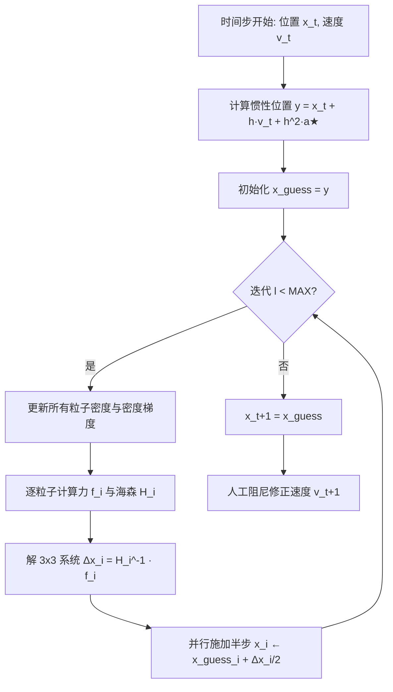

## 一句话总结

IPBF（Implicit Position-Based Fluids）从隐式欧拉的变分形式出发，用类似 Vertex Block Descent 的二阶下降 + 松弛 Jacobi 迭代来求解 SPH 不可压缩流体，在极大时间步和极少迭代次数下依然无条件稳定，同时保持低密度误差，且不会像 PBF 那样过度阻尼流体运动。

## 研究背景

SPH（Smoothed Particle Hydrodynamics）是图形学里模拟流体的主流拉格朗日粒子方法，但要在 SPH 框架下实现不可压缩性一直是根本难题：不可压缩对应于维持流体密度的硬约束。显式速度积分需要极小的时间步才能稳定，用高度非线性约束逼近不可压缩时步长还要更小；因此近年的工作大多转向半隐式速度积分，逐粒子自适应调节约束刚度（如 IISPH、DFSPH）。然而这些方法在复杂场景下仍会出现稳定性问题或过度压缩，需要较小时间步，反而削弱了 SPH 在并行计算上的性能优势。

Position-Based Fluids（PBF）是一个显著的例外，它把 SPH 转成类似 position-based dynamics 的约束形式，在大时间步下有出色的稳定性；但 PBF 使用的一阶近似会明显阻尼流体运动，偏离物理上合理的结果。本文提出另一种 position-based 的 SPH 形式，直接从隐式欧拉的变分形式出发做完全隐式积分，既能用任意大的刚度约束逼近不可压缩，又避免了 PBF 的过度阻尼。

## 方法

整体框架：把一步时间积分写成"最小化变分能量"的优化问题；对每个粒子把全局能量降为局部能量，用牛顿法算位置更新，再以松弛 Jacobi 方式并行施加半步更新；对海森矩阵做正定化近似保证可逆；最后用一个可选的人工阻尼提取多余动能。

关键设计：

- 变分能量与刚度归一化：目标能量为 $$\Psi(x)=\frac{1}{2h^2}\lVert x-y\rVert_M^2+E(x)$$，其中压力势用二次形式 $$E_i(x)=\tfrac{1}{2}k\,C_i(x)^2$$，密度约束取简单形式 $$C_i(x)=\frac{\rho_i}{\rho}-1$$。为避免大刚度 $$k$$ 引起的数值问题，作者把能量整体除以 $$k$$，引入柔度参数 $$\alpha=1/k$$，得到归一化能量 $$\bar{\Psi}(x)=\frac{\alpha}{2h^2}\lVert x-y\rVert_M^2+\frac{1}{2}\sum_i C_i(x)^2$$。这样可以取任意大刚度，甚至 $$k=\infty$$（$$\alpha=0$$）；实际大多数结果用 $$\alpha=0$$，但把迭代初值设为 $$y$$ 以保留已有动量。

- 二阶下降 + 松弛 Jacobi：仿照 VBD，假设其余粒子固定，把全局能量降为逐粒子局部能量 $$\Psi_i(x)$$，用牛顿法解 $$H_i\,\Delta x_i=f_i$$（$$H_i$$ 为 3×3 矩阵，直接求逆）。由于 SPH 邻域可达数十万粒子，Gauss-Seidel 代价过高且有数据冲突，作者改用松弛 Jacobi：并行算出所有 $$\Delta x_i$$ 后只施加一半（$$x_i\leftarrow x_i+\Delta x_i/2$$）。

- 海森近似：压力能量的海森含一项非正定、可能不可逆的项（尤其在做压力钳制处理粒子缺失时）。作者用基于列范数的对角近似替换该项（Andrews 等 2017），保证近似海森始终可逆，这对数值稳定至关重要。

- 人工阻尼：高刚度 + 有限迭代会注入能量，使流体难以静止。作者用更大的柔度 $$\alpha^\ast=1/1000$$ 在最后一次迭代额外算一个"较软"的备选位置 $$x_i^\ast$$，仅当两个位置足够接近（阈值为核半径的 $$\beta$$ 倍，取 $$\beta=60$$）时，比较两者动能并按权重从速度中提取多余动能。该阻尼只在运动趋于静止时起作用，对整体动态影响很小。

## 实验结果

在 NVIDIA RTX 4090 上用 CUDA 实现，与 PBF、IISPH、SISPH、DFSPH 对比。下表（原文 Table 1）在"各方法调到相近平均密度误差"的前提下，比较每帧总计算时间：

| 场景 | 方法 | 密度误差 | 迭代次数 | 步长 | 每帧耗时 |
|------|------|----------|----------|------|----------|
| Figure 2 | IPBF（本文） | 9.2e-4 | 2 | 1/480 s | 70 ms |
| Figure 2 | DFSPH | 1.2e-3 | 4+4 | 1/240 s | 111 ms |
| Figure 2 | SISPH | 2.5e-3 | 2 | 1/480 s | 117 ms |
| Figure 2 | IISPH | 5.5e-3 | 5 | 1/480 s | 250 ms |
| Figure 2 | PBF | 5.6e-3 | 4 | 1/960 s | 250 ms |
| Figure 12 | IPBF（本文） | 4.6e-4 | 1 | 1/480 s | 50 ms |
| Figure 12 | DFSPH | 5.8e-4 | 4+4 | 1/240 s | 110 ms |
| Figure 12 | SISPH | 1.3e-3 | 2 | 1/480 s | 100 ms |
| Figure 12 | IISPH | 2.6e-3 | 5 | 1/480 s | 250 ms |
| Figure 12 | PBF | 5.5e-3 | 2 | 1/960 s | 142 ms |

在相近密度误差下，IPBF 每帧耗时明显低于其他方法。此外：Double Dam Break 在每步仅 2 次迭代时，IISPH 与 DFSPH 会数值爆炸，而所有 position-based 方法（含 IPBF）仍稳定；压缩稳定性测试（初始 7 倍静止密度的流体球）中，DFSPH 爆炸、IISPH 无法恢复到静止密度导致明显体积损失、PBF 与 SISPH 有大量乱飞粒子，唯有 IPBF 无体积损失地恢复出连贯流动；收敛性测试中 IPBF 在不到 10 次迭代内收敛到更低密度误差。作者还展示了 90 万粒子的大规模模拟（气球在球体上方爆开），每帧约 159 毫秒。

## 亮点与局限

亮点：从隐式欧拉变分形式出发做完全隐式积分，兼顾不可压缩性、稳定性与计算成本三者，实验中表现出无条件稳定；通过 $$\alpha=1/k$$ 的归一化允许任意大刚度乃至无穷刚度；松弛 Jacobi 方案适合 GPU 大规模并行；海森近似与可选阻尼分别解决可逆性与残余能量注入问题；相比 PBF 不会过度阻尼流体运动。

局限：由于高刚度不可压缩流体的能量注入，方法仍可能出现伪影，主要来自 $$\alpha=0$$ 时的残余误差，使其无法提供收敛性保证；人工阻尼需要用户手动调参（如 $$\beta$$、$$\alpha^\ast$$）。

## 延伸思考

IPBF 把 Vertex Block Descent 的二阶局部下降思想迁移到 SPH 流体，说明"变分隐式积分 + 逐元素牛顿下降 + 松弛 Jacobi 并行"是一个可跨越弹性体与流体的通用求解范式。$$\alpha=0$$（无穷刚度）虽在实践中稳定且低误差，但失去收敛保证，是理论与工程之间的一个有趣取舍——未来若能设计出无需人工调参、且能给出收敛保证的阻尼或正则化形式，将让这类方法在交互式应用中更加可靠。此外，本文明确指出其求解器与粘性、张力不稳定等 SPH 改进是正交的，可组合使用，这为构建统一的高性能 SPH 管线留下了空间。
