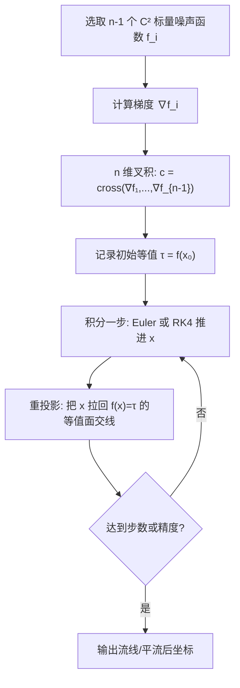

## 一句话总结

把无散度向量噪声（curl noise）重新表述为 $$n-1$$ 个噪声函数梯度的 $$n$$ 维叉积，从而在任意维度都严格保证无散度，并借助一个"重投影"步骤把粒子约束在等值面交线上，大幅提升积分精度。

## 研究背景

在图形学中，人们常用无散度向量场（$$\nabla \cdot \mathbf{c} = 0$$）来模拟不可压缩流体般的运动：沿这类向量场平流的形状体积守恒，粒子既不会被吸入汇点也不会从源点被排斥。这正是 curl noise 的价值所在。

Bridson 提出的经典 curl noise 定义为 $$\mathbf{c} = \nabla \times \mathbf{v}$$，但旋度算子只在三维有定义，这限制了它向更高维度的推广。另一条思路来自 DeWolf，他提出把两个噪声函数的梯度叉积作为三维无散度噪声，这一形式天然可扩展到曲面上，却长期被忽视。

本文抓住"叉积"这一关键：叉积可以推广到任意维度，因此同一套无散度向量噪声（DFVN）公式可以直接搬到 $$n$$ 维。同时作者发现，由于噪声场由梯度叉积构成，它必然处于所有噪声函数等值面的切平面内，这就为提升积分精度提供了一个几何抓手。

## 方法

### 整体框架

方法的核心是用 $$n-1$$ 个至少 $$C^2$$ 连续的标量函数 $$f_i$$（通常是噪声函数）构造无散度向量场，再沿该场平流点，并在每步后把点重投影回初始等值面交线上。

### 关键设计

1. **梯度叉积构造无散度噪声**：向量噪声定义为 $$\mathbf{c}(\mathbf{x}) = \mathrm{cross}(\nabla f_1(\mathbf{x}), \dots, \nabla f_{n-1}(\mathbf{x}))$$。作者用两种方式证明它在任意维度都无散度：一是把散度写成行列式展开的求和，利用二阶偏导可交换（Schwarz 定理），每一项都能找到一个符号相反、其余相同的配对项，成对相消；二是用外微分证明 $$\star \mathrm{d} \star \xi$$ 中每一项都含 $$\mathrm{d}^2 f_i = 0$$ 因子。

2. **重投影提升精度**：因为 $$\mathbf{c}$$ 是梯度叉积，它落在所有 $$f_i$$ 等值面的切平面内，其流线正是这些等值面的交线。若积分精确，点永远不会离开初始等值面交线。据此，作者构造 $$\mathbf{f}$$ 的一阶泰勒近似并求解 $$\mathbf{J}\mathbf{v} + \mathbf{f}(\mathbf{x}) = \boldsymbol{\tau}$$ 的最小范数解来更新 $$\mathbf{x} \leftarrow \mathbf{x} + \mathbf{v}$$；也可用逐等值面的 Newton-Raphson 步 $$\mathbf{x} \leftarrow \mathbf{x} - \nabla f_i \dfrac{f_i(\mathbf{x}) - \tau_i}{\lVert \nabla f_i \rVert^2}$$。二维时两者等价。

3. **两种表述并不等价**：curl 形式与叉积形式并非完全等同。作者证明 $$\mathbf{v}$$ 落在等值面切平面内的必要条件是 $$\mathbf{v} \cdot (\nabla \times \mathbf{v}) = 0$$，并给出反例 $$\mathbf{v} = [y, z, x]^{T}$$：它是某向量场的旋度，却无法写成两个梯度场的叉积。代价是损失一点表达力，换来的是可推广到任意维度与更高的积分精度。

4. **可替换为隐式曲面等函数**：$$f_i$$ 不必是噪声函数，把其中之一换成距离场或其他隐式表示，即可把 DFVN 约束在（超）曲面上；再借助式 $$f_2(\mathbf{x}) = (1-\alpha(\mathbf{x}))d(\mathbf{x}) + \alpha(\mathbf{x})\tilde{f}_2(\mathbf{x})$$ 可生成被曲面包围、在边界处贴合而内部为纯噪声的向量场，从而实现边界守恒的粒子抖动。此外还能借助"升维—投影"引入各向异性。

## 实验结果

在 $$n$$ 维点采样实验中，作者把 curl noise 抖动（CNJ, 基于 DFVN）与随机抖动、Poisson Disk 采样（PDS）、Sobol 序列在 3D~7D 上比较，报告最近点对的中位距离（括号内为最小距离，冒号后为墙钟秒数）：

| $$n$$ | CNJ (DFVN) | Jittering | PDS | Sobol |
|---|---|---|---|---|
| 3 | 0.083 (0.044):1 | 0.069 (0.015):1 | **0.104 (0.100)**:0 | 0.071 (0.031):0 |
| 4 | 0.081 (0.034):2 | 0.069 (0.010):1 | **0.104 (0.100)**:3 | 0.074 (0.030):0 |
| 5 | 0.083 (0.023):21 | 0.073 (0.011):8 | **0.103 (0.092)**:104 | 0.071 (0.019):10 |
| 6 | **0.136 (0.039)**:31 | 0.118 (0.057):7 | 0.103 (0.084):651 | 0.078 (0.025):23 |
| 7 | **0.176** (0.071):105 | 0.146 (0.087):20 | 0.102 (0.080):11k | 0.081 (0.030):501 |

低维（3D~5D）PDS 的中位距离最优，但其在高维迅速失效：7D 时 PDS 耗时超过三小时，而本文方法不到两分钟即可完成，且 CNJ 与 Jittering 属于易并行任务。6D、7D 时 CNJ 的中位距离反超其他方法，显示其在高维仍保持良好的蓝噪声特性。

在图像扭曲实验中，作者报告 64 步 RK4 加重投影在性能与 RMSE 上都优于 512 步纯 Euler 积分，印证了重投影带来的精度/性能权衡收益。

## 亮点与局限

亮点：
- 用一个简洁的叉积表述统一并推广了 DeWolf 与 Bridson 两条 curl noise 路线，并给出无散度性在任意维度成立的严格证明（代数与外微分两种）。
- 重投影方案几何直观、代价低，把点约束在等值面交线上显著提升积分精度，在高分辨率图像扭曲、曲面纹理扭曲上都验证有效。
- 应用面广：图像扭曲、曲面纹理、被隐式曲面包围的噪声、各向异性 curl noise、以及最高 7 维的点抖动，且天然支持边界守恒的粒子动画。

局限：
- 叉积形式的表达力严格弱于 curl 形式，部分 curl 向量场无法由两个梯度场叉积生成。
- 距离场作为 $$f_i$$ 时要求曲面曲率有界，否则中轴过于靠近曲面会破坏二阶可微性。
- 高维下 simplex 噪声梯度影响被稀释，噪声幅值趋近零，需按维度做尺度补偿（本文 7 维以内影响不大）。
- 升维引入各向异性时，只保证投影前的场无散度，投影回低维后不再严格保证。

## 延伸思考

这篇工作把"叉积几何"作为主线，既拿到了维度无关的通用性，又顺手用等值面交线这一几何事实换来了积分精度，是一个"约束换精度"的漂亮范例。它提示我们：当一个数值对象带有明确的几何不变量（这里是"流线落在等值面交线上"）时，与其一味堆更高阶的积分器，不如直接把状态投影回不变流形，往往性价比更高。

作者指出的未来方向也很有想象空间：用 $$(3+k)$$ 维投影算子在三维引入各向异性、把高维 DFVN 抖动用于高维积分或采样问题。对于需要蓝噪声采样却受困于维度灾难的场景（如高维蒙特卡洛积分的分层采样），这种既并行友好又在高维不失效的构造，可能是一条值得深挖的替代路线。
