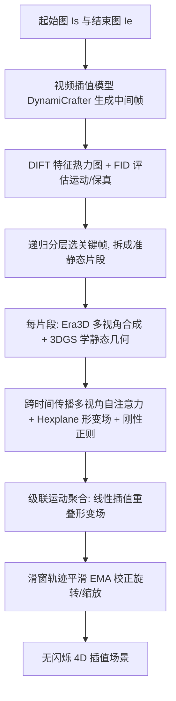

## 一句话总结

本文提出全新任务 In-2-4D：仅给定一个物体在两个不同运动状态下的单视角 RGB 图像（起始帧与结束帧），无需对物体类别、运动类型、时长或复杂度作任何假设，即可生成并重建两者之间平滑自然的 4D（3D+运动）插值内容。

## 研究背景

运动补间（inbetweening）是动画领域的经典问题，传统做法通常以两个 3D 状态（如点云）为输入。近年随着 3D 生成式 AI 的发展，出现了大量"视频到 4D"的工作，把视频中拍到的物体"抬升"到 3D 空间以便任意视角观看。但这条路线有明显短板：视频本身可能不真实（如花开这类极慢运动），或采集代价高昂（如极快运动）；而在运动规划、视觉分镜等场景中，所需运动本就是要探索生成的结果，无法事先采集。

与此同时，视频基础模型的进步催生了大量视频帧插值方法，但它们从两张图像产出的仍是视频，而非可任意视角观看的 4D 内容。作者提出把"补间"与"抬升"两个问题融合，从最小化、易获取的输入设置出发生成 4D 内容。相比仅靠文本或单张图像生成 4D（约束不足，复杂运动下伪影严重），锚定在两张图像上的插值式任务能提供更精确的运动约束，得到更合理、更干净的结果。核心难点在于：不对物体或运动类别设限、允许非刚性/拓扑改变的任意自由运动（如鸡蛋落入液体溅起水花）、并支持两状态时序与结构差异较大的中长程运动。

## 方法

整体分两个阶段：先用视频插值把两张静态图像补成视频，再把视频抬升为 4D。由于视频扩散模型多在短视频上训练，当两个输入状态跨越较大几何/结构变化时会产生大幅"运动跳变"与细节缺失，因此作者采用分治思路：自适应、递归地生成一批关键帧勾勒运动粗略轮廓，把长程非线性运动拆成若干时序局部、易建模的准静态片段；每个片段独立学习一个静态 3DGS 并借形变场转成动态 4D；最后自底向上合并各片段形变场并施加平滑约束，得到无闪烁的全局 4D 运动。

### 关键设计 1：分层时序片段生成（Temporal Fragment Hierarchy）

以视频插值模型 $$\psi(\cdot)$$（如 DynamiCrafter）在两状态间生成一组隐帧，并用 BLIP 抽取的运动提示词引导。用成对 DIFT 特征的余弦相似度构成热力图 $$H^{p}_{i,j}=\mathrm{CS}(f^{p}_{i}, f^{q^{*}}_{j})$$ 快速评估帧间运动变化：当帧对间平均热力值低于阈值即标记为关键帧，并进一步用 FID 挑选与输入状态最一致的关键帧以保真。关键帧把运动轨迹一分为二，再"分而治之"递归细分，直到所有相邻关键帧间运动都足够小。该过程训练无关、无需微调视频扩散模型，在动态区域密集采样、静态区域稀疏采样，平衡了训练开销与时序一致性。

### 关键设计 2：片段内几何建模与时序一致多视角

每个片段把其关键帧设为规范（canonical）参考，用多视角扩散模型 Era3D 合成多视角图像并以 3DGS 重建粗几何作初始化。为避免逐帧独立多视角合成导致的时序不一致，作者把规范帧的多视角自注意力特征沿整个片段传播：先按 $$z_{t}\leftarrow\gamma\cdot z_{c}+(1-\gamma)\cdot z_{t}$$ 混合规范隐变量与当前帧隐变量，再做标准注意力 $$\mathrm{Attention}(Q,K,V)=\mathrm{Softmax}(QK^{T}/\sqrt{d_{k}})\cdot V$$。随后用 Hexplane 形变场预测每个高斯相对规范态的位移、旋转与缩放，实现自由视角渲染。

### 关键设计 3：刚性正则与优化目标

动态高斯易在同色区域自由漂移造成闪烁/漂浮伪影。由于片段内运动很小，作者对邻域簇施加相对规范态的刚性正则 $$L_{rigid}=\lVert d(\mu^{c}_{i}, \mu^{c}_{j})-d(\mu^{\tau}_{i}, \mu^{\tau}_{j})\rVert_{1}$$，允许弯曲等非刚性形变的同时抑制局部刚性畸变。总目标结合参考帧 MSE、前景掩码损失与刚性正则：$$L=\lambda_{1}L_{Ref}+\lambda_{2}L_{mask}+\lambda_{3}L_{rigid}$$，权重分别取 $$0.4/0.3/0.3$$。

### 关键设计 4：级联 3D 运动聚合与轨迹平滑

各片段形变独立学习，需合并以保证全局一致。对相邻片段的重叠帧线性插值形变场 $$\Delta_{merge}\Phi_{ij}=\lambda\Delta\Phi_{i}+(1-\lambda)\Delta^{*}\Phi_{j}$$（$$\lambda=0.5$$，仅 $$\Delta^{*}\Phi_{j}$$ 可学），冻结两侧片段形变、只低学习率优化重叠段少量迭代，自 $$\Delta\Phi_{1}$$ 起累积式渐进合并。之后借 CoTracker 与 DepthAnything 在滑动窗口内估计深度与轨迹，把可见率超过 80% 的点提升到 3D，对旋转与缩放用指数移动平均（EMA，衰减 $$0.6$$）平滑，迭代校正错向高斯，得到稳定无闪烁重建。

## 实验结果

作者构建了 I4D-15 基准（涵盖车辆、花卉、人类、动物、日常场景等 15 个带大运动的关节物体，64 帧、16 fps，取正面视角首尾帧作输入、其余用于评测），并额外在 Consistent4D 基准上验证。由于是全新任务，作者用"两帧生视频 + 视频到 4D"的组合构造了三个基线。如下表所示，In-2-4D 在外观（CLIP、LPIPS、FVD）与几何（SI-CD、CD）指标上全面领先。

| 方法 | CLIP ↑ | LPIPS ↓ | FVD ↓ | SI-CD ↓ | CD ↓ |
| --- | --- | --- | --- | --- | --- |
| Baseline-I | 0.81 | 0.143 | 992.23 | 33.58 | 0.76 |
| Baseline-II | 0.84 | 0.136 | 729.32 | 31.79 | 0.73 |
| Baseline-III | 0.83 | 0.138 | 811.26 | 32.46 | 0.74 |
| Ours | 0.91 | 0.103 | 679.23 | 22.67 | 0.59 |

消融实验表明：时序片段分层用 4 个片段在成本与性能间取得最佳平衡（17 分钟，LPIPS 0.103），远优于不分层（w/o TFH）；运动合并与轨迹平滑组合能同时改善外观与几何。运行时间上，本方法约 35 分钟（单张 A100），比最快基线快约 25%。20 名研究生参与的用户研究中，本方法平均排名 1.46（1 为最佳），显著优于各基线。此外借助自定义运动提示词，同一起止状态可生成跳跃或行走等不同运动，展示了可控性。

## 亮点与局限

亮点：
- 首次提出并解决"从两张单视角远距离帧生成任意运动 4D 补间"这一新任务，输入设置极简却仍保有视觉运动控制力。
- 分层分治思路把复杂补间拆成一系列简单运动估计（视频→动态 3DGS），关键帧生成训练无关、无需微调视频扩散模型。
- 自底向上的形变场合并加平滑正则，产出平滑无闪烁的 3D 物体与运动过渡；并贡献了面向真实复杂运动的 I4D-15 基准。

局限：
- 当中间运动过于剧烈时会出现不自然形变，且视频中细微动作抬升到 4D 后可能失真。
- 3D 与 2D 组件目前不能相互修正协同。
- 依赖图像到 3D 模块，一旦该模块重建失败，4D 输出会继承相应伪影；作者也坦言结果尚非无伪影，仍是该难题上的一个"强基线"。

## 延伸思考

In-2-4D 的价值在于重新定义了 4D 生成的输入范式——用两张易获取的图像取代难以采集的视频或昂贵的文本/单图约束，把"运动补间"与"3D 抬升"这两个原本独立的问题优雅地融合。其分层分治的准静态片段拆解，本质上是在用"化繁为简"绕开视频扩散模型只擅长短运动的固有局限，这一思路对其他长程、非线性生成任务同样有借鉴意义。未来若能引入显式运动轨迹或其他 2D/3D 条件信号，并让 2D 与 3D 组件形成闭环互相纠错，有望进一步逼近真实动态；而对图像到 3D 模块的强依赖也提示，4D 生成的质量上限仍受制于底层单帧重建能力的进步。
