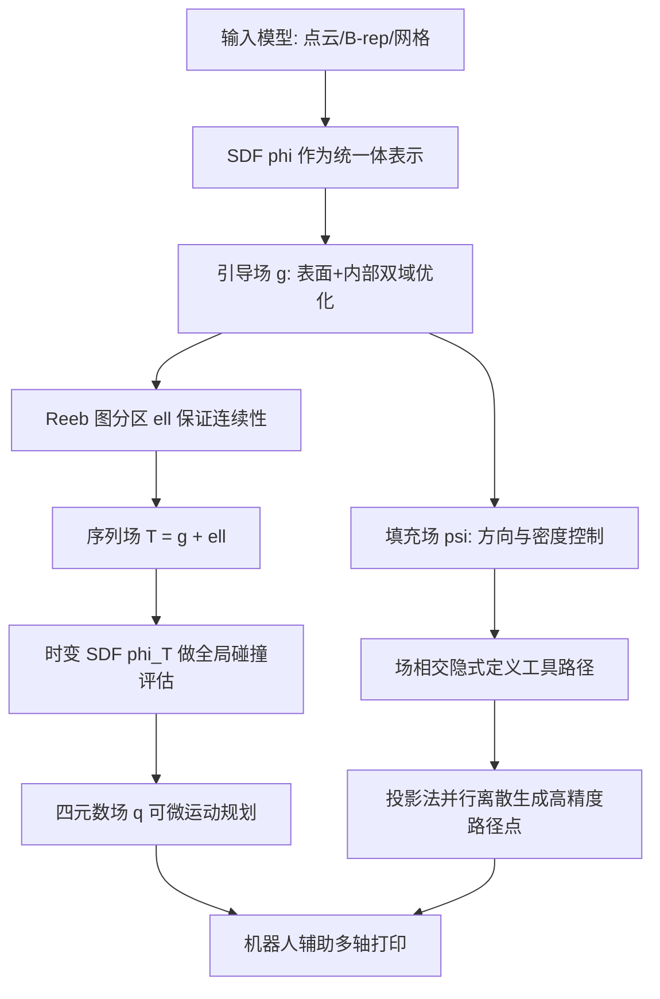

## 一句话总结

本文提出 INF-3DP：一个用隐式神经场（Implicit Neural Fields, INF）统一表示模型几何、走刀引导场与机器运动的多轴 3D 打印计算框架，把工具路径生成与全局无碰撞运动规划全部转化为可微场优化，相比基于网格的显式方法实现最高两个数量级的提速和显著更低的路径点误差。

## 研究背景

多轴 3D 打印通过动态调整局部打印方向（Local Printing Direction, LPD），能实现免支撑打印、更好的表面质量和各向异性性能控制，突破传统固定喷头平面分层的局限。但高自由度也带来巨大的计算复杂度：算法既要把模型分解成满足制造目标的空间工具路径，又要规划无碰撞的多轴运动。

现有的空间工具路径规划主要依赖显式表示（体素、表面网格、四面体、六面体网格）来离散化计算域，这带来三个核心问题：

- 精度与效率难以兼顾。显式表示依赖分辨率，打印尺寸放大时要维持路径点精度就需要更多单元，计算时间急剧上升。
- 跨域优化困难。已有方法要么用表面网格在 2-流形上定义外壳（shell）目标，要么用体网格在 3-流形上定义实体（solid）目标，表示与领域强绑定，难以泛化到不同情形。
- 全局碰撞处理困难。打印过程中物体形状动态变化，显式表示难以高效捕捉这种演化，全局碰撞检测极其耗时，且路径点数量常达百万级，点式离散方案难以做到鲁棒且可扩展的规划。

作者主张用隐式神经场作为贯穿所有计算阶段的统一表示来突破这些瓶颈。与最接近的 Neural-Slicer 相比（后者虽优化隐式引导场，但工具路径生成仍严重依赖四面体网格），INF-3DP 用 INF 统一表示打印模型、引导场和机器运动，消除分辨率依赖、支持端到端可微优化、并解决可扩展性难题。

## 方法

整体框架把多轴打印拆成一组待优化的隐式神经场：用有符号距离场（SDF）$$\phi: \mathbb{R}^3 \to \mathbb{R}$$ 表示输入模型；用引导场（guidance field）$$g: \mathbb{R}^3 \to \mathbb{R}$$ 在表面 $$S$$ 与内部区域 $$\Omega$$ 上编码制造目标；配合一组填充场（infill fields）$$\psi: \mathbb{R}^3 \to \mathbb{R}$$ 通过场相交隐式定义外壳与实体工具路径；在运动规划阶段，用序列场（sequence field）$$T: \mathbb{R}^3 \to \mathbb{R}$$ 编码打印次序，用时变 SDF $$\phi_T$$ 表示动态增长的打印体，并用四元数场（quaternion field）$$q: \mathbb{R}^3 \to \mathbb{R}^4$$ 联合优化尽可能连续、平滑且全局无碰撞的运动。

表面上的材料堆积方向由引导场梯度投影到局部切平面得到，投影算子定义为

$$
v_T(x) = f_{proj}(\nabla g(x)) = \nabla g(x) - \frac{\nabla g(x)\cdot\nabla\phi(x)}{\|\nabla\phi(x)\|^2}\nabla\phi(x)
$$

由于 $$v_T$$ 可从 $$g$$ 解析表达，表面与内部的工具路径目标都能无缝整合进同一个引导场 INF。

### 制造目标的场优化表述

作者把三类制造导向目标编码为场目标：

免支撑打印约束——LPD 与表面法向的夹角受限：

$$
C_{SF} := |d_p(x)\cdot n| - \sin(\alpha) \le 0
$$

其中法向由 SDF 计算 $$n = \nabla\phi(x)/\|\nabla\phi(x)\|$$，免支撑角 $$\alpha$$ 对 PLA 材料取 40 度。

打印质量与可制造性由场光滑性保证。表面切向场 $$v_T$$ 的奇点位置显著影响表面质量：sink 型奇点出现在关键区域会带来严重制造误差并增加碰撞风险，saddle 型奇点会导致欠堆积。表面与内部的光滑能量分别为

$$
O^{S}_{smooth}(g) = \frac{1}{2}\int_{S}\|\nabla\cdot f_{proj}(\nabla g(x))\|^2\, dx
$$

$$
O^{\Omega}_{smooth}(g) = \frac{1}{2}\int_{\Omega}(\Delta g(x))^2\, dx
$$

由于局部挤出率与引导场的范数成反比，光滑能量同时起到把挤出率约束在喷头可行范围内的作用。为让外壳与填充方向兼容，还引入对齐目标

$$
O_{align}(g) = \int_{S}\|\nabla g(x) - f_{proj}(\nabla g(x))\|^2\, dx
$$

### 两阶段引导场训练

引导场用 SIREN（周期激活网络）表示。由于光滑、对齐、免支撑三类目标彼此冲突且优化空间高维，作者采用两阶段训练：先在 2-流形表面优化，再扩展到 3-流形内部并在边界强制对齐。表面阶段的损失为

$$
L^{S}_{guide} = \omega^{S}_{smooth}L^{S}_{smooth} + \omega^{S}_{SF}L^{S}_{SF} + \omega^{\Omega_b}_{coll}L^{\Omega_b}_{coll}
$$

其中免支撑损失用 sigmoid 松弛，$$L^{\Omega_b}_{coll}$$ 在模型底部区域施加 Neumann 边界条件强制打印方向沿 z 轴，避免与打印平台碰撞，同时防止收敛到平凡解 $$g \equiv 0$$。内部阶段损失包含 Dirichlet 光滑项和对齐项。训练时用从 SDF 解析计算的最小主曲率方向 $$d_\kappa(x)$$ 作为 $$\nabla g$$ 的初始猜测——它天然位于切平面内、满足免支撑（免支撑角恒为 90 度）且使对齐损失为零。消融实验证明曲率初始猜测优于高度场初始猜测（后者会陷入内部等值面近乎平行不变的局部极小）。

### 填充场

填充场 $$\psi$$ 控制实体填充结构的生长方向 $$\nabla\psi(x)$$ 与密度 $$\|\nabla\psi(x)\|$$。密度损失让梯度范数逼近空间密度场 $$\rho(x)$$：常数密度得到规则填充，变密度可用 SDF 检测的局部特征尺寸驱动。通过设置不同参考角 $$\beta$$ 与参考方向训练多个填充场，可生成十字、菱形、六边形等多种填充图案，且填充初始方向始终垂直于 $$\nabla g$$ 以保证免支撑。

### 时变 SDF 与全局碰撞

作者不训练端到端的时变 SDF 网络（其边界符号易出错），而是用免训练的场插值构造时变 SDF，保证碰撞检测符号正确。全局无碰撞约束表述为

$$
C_{coll}(p) := \int_{M_e(p)} H(-\phi_T(p,x))\, dx \equiv 0
$$

其中 $$H(\cdot)$$ 是 Heaviside 阶跃函数，$$M_e(p)$$ 是打印装置（喷头及相连机器人关节）在路径点 $$p$$ 处的几何。当打印到 $$p$$ 时，通过比较全局 SDF 与查询点到当前工作面的距离来更新时变 SDF。多分区情形下用梯度追踪找投影点判断是否落入已打印区域，从而正确合并不同分区的时变 SDF。点到面距离用高效可微的近似

$$
d(x, S_{top}(\ell_k)) \approx (g_k - g(x))/\|\nabla g(x)\|
$$

该近似不影响精确碰撞检测（因为直接用 $$\phi(x)$$ 和 $$T(x)$$ 判定所有碰撞），只用于高效计算碰撞损失。

### 序列场与四元数运动场的迭代优化

为保证打印连续性，用 Reeb 图把模型分区（索引 $$\ell$$），序列场定义为 $$T(x) = g(x) + \ell(x)$$。运动损失联合优化碰撞、免支撑与平滑：

$$
L_{motion} = \omega_{coll}L_{coll} + \omega^{motion}_{SF}L^{motion}_{SF} + \omega^{motion}_{smooth}L^{motion}_{smooth}
$$

其中碰撞损失为所有碰撞点到部分打印体表面的距离之和 $$L_{coll} = \sum_{p}\sum_{x}-\phi_T(p,x)$$。关键设计是把平滑损失分别定义在 LPD 与自转轴上，而非直接对四元数施加平滑——因为神经四元数对同一运动存在多解，分轴平滑显著改善收敛。由于初始 Reeb 图分区会压缩无碰撞解空间（可能无可行解），框架迭代地在关键区域细化分区并重训序列场与运动场，直到所有路径点严格无碰撞。收敛性有保证：最坏情况退化到 $$T(x) = g(x)$$，以引入大跳变换取无碰撞解。

### 并行路径点生成

外壳与填充工具路径由场相交隐式定义为等值曲线（如填充 $$L^{\Omega}_{uv} = \{x \mid g(x)=u, \psi(x)=v, \phi(x)<0\}$$）。作者结合网格法与优化法：先用 Marching Cubes 风格算法提取候选交点保证连通性，再对每个候选点独立求解投影问题

$$
\arg\min_x \frac{1}{2}\|x - x_0\|^2 \quad \text{s.t.}\quad g(x)=u,\ \psi(x)=v
$$

该步高度并行，用增广拉格朗日法通常十次迭代内收敛到归一化误差小于 $$10^{-5}$$（即 1 米模型 0.01 mm）。

## 实验结果

作者在图形模型（Bunny、Fertility、Light Bulb）与工业模型（Statue-Goddess、Satellite Bracket、TO-Connector）上做了广泛实验，输入涵盖扫描点云、B-rep 参数曲面和网格顶点。所有实验在 Intel i9-14900K + NVIDIA RTX 4090 + 64GB 的桌面机上运行，代码开源。

路径点精度与效率上，TO-Connector 的平均点到面误差为 0.019 mm，不到 2.5 mm 路径点间距的 0.5%；相比之下基于 20 万四面体的 S3-slicer 网格法误差达 0.26 mm（高 12 倍），计算时间也慢 60 倍以上（826.4s 对 12.9s，模型高约 30cm）。以顶点训练 SDF 的 Light Bulb 模型仍达 0.076 mm 平均精度，比精网格结果（0.208 mm）改善 63.46%。

| 对比项 | INF-3DP（本文） | Neural-Slicer / 网格法 |
| --- | --- | --- |
| Spiral Fish 平均路径点误差 | 0.089 mm | 0.949 mm |
| Spiral Fish 生成 14 万点耗时 | 1.46 s | 29.4 s |
| TO-Connector 平均误差 | 0.019 mm | 0.26 mm（S3-slicer） |

路径点生成表现出很强的线性可扩展性：Bunny、Statue-Goddess 生成 20 万点仅需数秒；最大的 TO-Connector（246 万点）不到 20 秒；Light Bulb 200mm 版本 12 万点 1.92s，600mm 版本 174 万点 5.43s。碰撞规划上，对复杂拓扑的 Satellite Bracket，直接用 $$\nabla g$$ 作 LPD 碰撞率高达 34.85%，仅优化运动降到 7.07% 仍无法归零，经迭代细化分区后收敛到 0%。模型相对打印装置的尺寸显著影响所需迭代次数（Satellite Bracket 细化三次，Light Bulb 一次）。

物理实验用 UR5e 机械臂配 filament 挤出机和 PLA 材料，成功免支撑打印全部测试模型。3D 扫描定量评估显示：Bunny 平均距离误差降低 28.47%、视觉（法向）误差降低 39.10%；Statue-Goddess 距离误差降低 28.80%、视觉误差降低 78.20%。网格基线因不考虑运动连续性在 Statue-Goddess 顶部产生严重拉丝（stringing），而本文方法即使在自底向上打印方向的挑战性区域仍保持高质量表面。

消融实验证实：单阶段训练无法很好优化跨域光滑性并在内部产生不可打印奇点，两阶段训练配合曲率初始猜测效果最佳；运动场分轴平滑（LPD 与自转轴分离）相比直接对四元数平滑能稳定收敛到无碰撞状态。

## 亮点与局限

亮点：

- 首个系统性同时处理外壳与实体结构工具路径、并实现可扩展全局无碰撞规划的多轴 3D 打印计算流程，用 INF 作为贯穿所有阶段的统一表示。
- 两阶段引导场优化把 2-流形与 3-流形上的制造目标无缝整合到单一标量场，曲率初始猜测巧妙满足切平面、免支撑与对齐条件。
- 免训练的时变 SDF 场插值构造保证精确碰撞符号，配合近似距离得到高效可微的碰撞损失，支持 GPU 并行的运动 INF 优化。
- 借助 Marching Cubes 初始化加并行投影优化，路径点离散既连通又高精度，实现相对显式表示两个数量级的提速。

局限：

- 当前采用任务空间规划而非完整构型空间规划，打印装置仅用机器人末两关节与喷头表示，未纳入完整逆运动学；虽然测试中机器人基座距模型较远未发生碰撞，但整合完整 IK 仍是未来方向。
- 迭代式分区加运动规划虽在所有测试用例奏效且以无碰撞为最高优先级，但会牺牲区域间连续性得到次优分区；受组合复杂度限制，基于图分区的全局最优解仍是开放难题。

## 延伸思考

INF-3DP 的核心洞见是把制造中"几何表示—目标编码—运动规划"这条链路整体搬到连续可微的隐式场上，从而一举摆脱显式网格的分辨率依赖与跨域割裂。其中时变 SDF 用场插值而非端到端网络来保证碰撞符号正确，是一个值得借鉴的工程折中——它承认神经场在边界符号上的不可靠，转而用可解析的插值兜底精确性，只把近似留给不影响正确性的损失项。分轴平滑替代四元数平滑同样揭示了神经运动表示的多解陷阱。沿着作者指出的方向，把完整逆运动学与全局上下文的序列场学习纳入这一可微框架，有望进一步推动复杂拓扑模型的自动化、无碰撞多轴打印走向实用。此外，时变 SDF 的可及性评估思路也可迁移到减材制造等其他加工过程。
