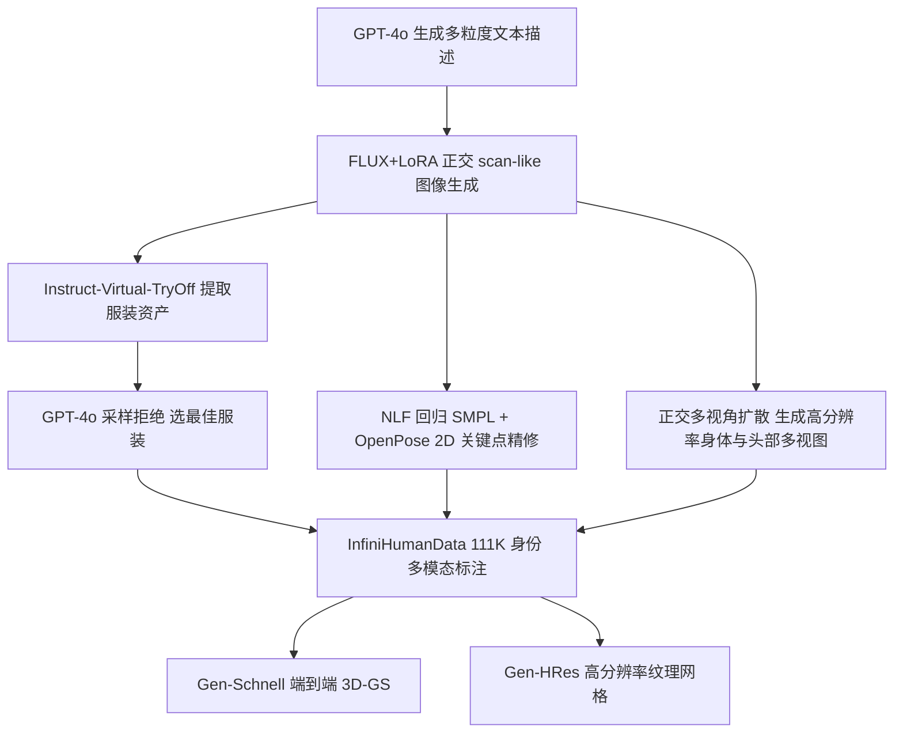

## 一句话总结

通过蒸馏现有的视觉语言与图像生成基础模型，自动合成理论上无限量、带丰富多模态标注的 3D 人体数据集，并在其上训练可由文本、体型和服装图像精确控制的 3D 人体生成模型。

## 研究背景

生成逼真且可控的 3D 人体化身是虚拟现实、数字时尚、游戏与社交远程呈现中的核心问题。应用要求化身能够按照文本描述、指定体型、用户提供的服装被个性化定制，并覆盖种族、年龄、服装风格、体型等广泛属性。

现有方法面临两难：一方面，人工采集与标注大规模 3D 人体数据代价高昂（商业扫描常达每个身份约 100 美元），公开数据集在规模、人群多样性以及服装、年龄、体型覆盖上都受限；另一方面，基于 Score Distillation Sampling（SDS）的免训练方法虽然借助文本到图像扩散模型绕开了数据采集，但优化耗时长、视觉保真度有限，且无法对服装外观、精细体型等属性做精确控制。此外，几乎没有数据集提供身份级别的细粒度标注（如细致文本、服装资产图像），而这正是训练可精确控制生成模型的关键。

本文提出的核心问题是：能否蒸馏现有基础模型，以理论上无限的规模、可精确控制的方式生成带丰富标注的 3D 人体数据？

## 方法

整体框架分为两部分：InfiniHumanData 是一条全自动的"以重建实现生成"数据流水线，编排多个基础模型产出多模态标注数据；InfiniHumanGen 则在该数据上学习联合条件分布 $$P(y \mid c_{text}, c_{SMPL}, c_{cloth})$$，包含快速的 Gen-Schnell 与高分辨率的 Gen-HRes 两个互补模型。

关键设计：

- **多粒度文本描述**：先用 Trellis 协议为已有人体扫描数据集生成描述，再随机采样 10 条作为上下文示例喂给 GPT-4o 生成新变体，并把每条描述总结为从约 40 词到 5 词的十级粒度，使模型同时接触粗粒度（如"老年"）与细粒度（如"六十岁末到七十岁初"）语义线索。

- **正交 scan-like 图像与多视角扩散**：多数文本到图像模型（如 FLUX）产出的图像透视强烈、光照复杂，不利于 3D 重建。作者用 LoRA 在均匀光照的正交扫描渲染上微调 FLUX，生成"扫描风"图像；正交视角具有水平极线，使多视角扩散可用高效的行内注意力，并在身体与头部视图间用密集像素级交叉注意力保证一致性。

- **服装图像控制（Instruct-Virtual-TryOff）**：反转虚拟试穿过程，微调 OminiControl，从整身图像中提取干净服装图。训练用流匹配目标 $$L_{VToFF}(\theta) = \mathbb{E}_{t,\varepsilon}\lVert v_\theta(x_t, I_{vton}, e_{text}, t) - \varepsilon + I_{cloth}\rVert^2$$，使用户可用图像而非配对扫描数据指定服装。

- **双生成模型**：Gen-Schnell 受 Human-3Diffusion 启发，结合 MVDream 多视角生成与 splatting 解码器，在采样时用 3D-GS 渲染图替换 2D 预测以保证一致性，约 12 秒端到端产出 3D 高斯泼溅；Gen-HRes 把生成建模为多图到图翻译，微调 OminiControl2，再用 Sapiens2B 计算法线、经 PSHuman 做 SMPL 驱动的体素雕刻得到高保真纹理网格，约 4 分钟产出并支持细粒度文本编辑。

## 实验结果

在 32 条 prompt 上与前馈式文本到多视角方法及 SDS 类文本到化身方法比较，用户研究（42 名参与者）评估外观质量与文本对齐，同时报告 FID 与 CLIP Score。

| 方法 | 质量↑（用户研究） | 对齐↑（用户研究） | FID↓ | CLIP Score↑ | 运行时↓ |
|------|------|------|------|------|------|
| MVDream | 20.83% | 20.36% | 141.33 | 30.37 | 2.8s |
| SPAD | 2.02% | 1.55% | 150.43 | 28.58 | 13.9s |
| Gen-Schnell（本文） | 77.14% | 78.10% | 100.39 | 30.82 | 12.9s |
| TADA | 1.27% | 1.27% | 129.68 | 28.84 | 213m |
| DreamAvatar | 1.27% | 1.90% | 151.57 | 28.42 | 384m |
| HumanGaussian | 2.22% | 3.48% | 140.24 | 30.56 | 40m |
| HumanNorm | 2.54% | 3.48% | 101.84 | 28.30 | 117m |
| AvatarVerse | 0.32% | 0.32% | 156.52 | 28.69 | 44m |
| Gen-HRes（本文） | 92.39% | 89.56% | 82.28 | 30.43 | 4m |

Gen-Schnell 与 Gen-HRes 分别在前馈式与 SDS 类对比中大幅领先，Gen-HRes 的高分辨率生成比同类基线至少快 8 倍。此外，在真实感用户研究中，真实扫描渲染获 746 票、InfiniHumanData 图像获 765 票，说明生成身份在视觉上几乎与真实扫描无法区分。

## 亮点与局限

亮点：

- 提出"蒸馏基础模型 + 以重建实现生成"的全自动数据流水线，产出 111K 身份、首个同时带多粒度文本与服装资产标注的大规模多模态人体数据集，并承诺公开数据、模型与流水线。
- 首次支持文本、SMPL 体型、服装图像三种模态的联合精确控制，覆盖种族、年龄（含儿童）、服装、体型等空前多样性。
- 双模型设计兼顾速度（约 12 秒的 3D-GS）与高保真（约 4 分钟的纹理网格），并展示了试穿、重动画、手办打印等应用。

局限：

- Gen-HRes 仍慢于端到端的 Gen-Schnell；而 Gen-Schnell 受 MVDream 低分辨率（256×256）限制，面部等细节模糊，受训练资源所限未能训练更高分辨率版本。
- 生成名人依赖 GPT-4o，出于隐私会拒绝识别未匹配样本，限制了名人名字在数据集中的纳入。
- Gen-HRes 采用多视角网格雕刻，自遮挡部位可能出现纹理伪影。

## 延伸思考

这项工作的关键判断是：与其昂贵地采集真实 3D 扫描，不如把多个成熟基础模型编排成一条"数据工厂"，让文本、图像、姿态、扩散模型各司其职，把数据稀缺问题转化为编排与蒸馏问题。这种思路对其他数据稀缺的 3D 任务（物体、场景、动作）具有借鉴意义。值得关注的是数据真实性与标注一致性的验证——用户几乎无法区分生成身份与真实扫描，这既是亮点也提示了潜在风险：当合成数据成为训练主力时，如何避免基础模型自身偏见（如种族、年龄分布）与错误被放大并固化进下游生成模型，是需要进一步审视的问题。此外，正交 scan-like 图像作为连接 2D 扩散先验与 3D 重建的中间表示，是一个可复用的工程设计点。
