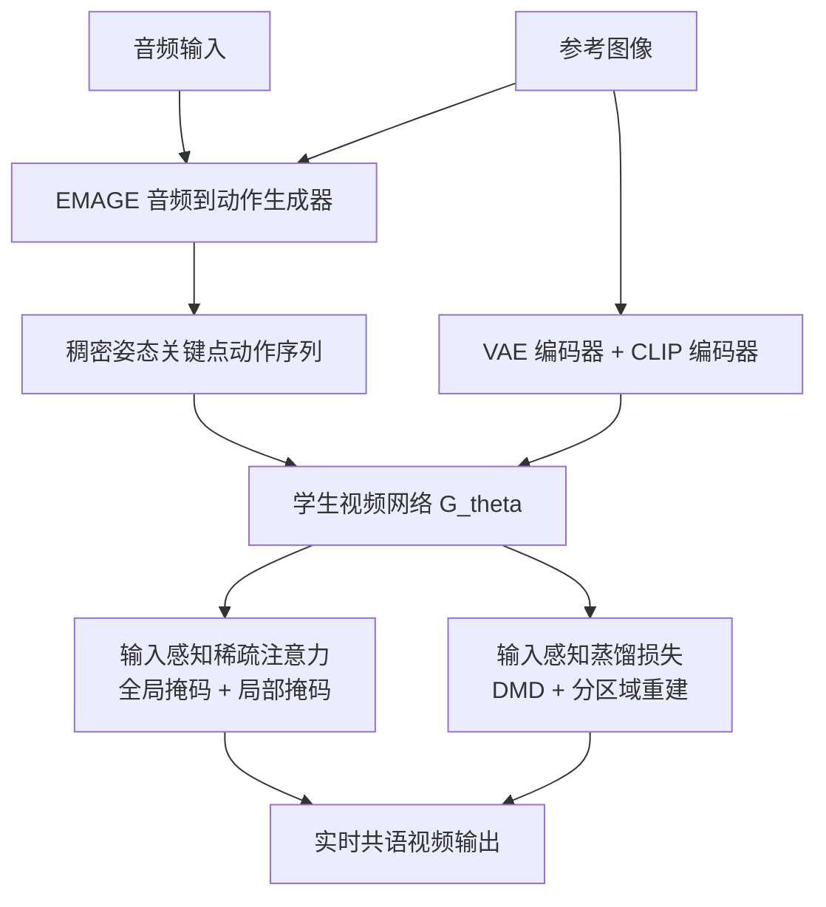

## 一句话总结

该工作把慢速的多步扩散教师视频模型蒸馏成少步学生模型，利用现成的人体姿态条件设计"输入感知稀疏注意力"和"输入感知蒸馏损失"，让语音驱动的共语视频生成首次达到实时（25.3 FPS），相比教师模型加速 13.1 倍并保持甚至提升画质。

## 研究背景

共语视频生成（co-speech video generation）从语音音频合成说话人视频，可用于虚拟数字人、教育内容、远程呈现等场景。扩散模型配合注意力机制在该任务上能生成高度逼真、连贯的视频，但存在两个致命的效率问题：

- **去噪步数多**：扩散模型需要大量迭代去噪步骤，推理极慢。
- **注意力开销大**：视频帧数与 token 数多，全注意力的二次方复杂度导致计算成本高昂，难以实时部署。

常见加速思路是网络蒸馏，把慢的教师模型蒸馏成快的学生模型。但作者发现，直接把通用的文生视频蒸馏方法（如 CausVid）套到共语生成上并不够用：一方面会明显退化画质，尤其在对自然手势至关重要的人脸和手部区域；另一方面加速幅度仍达不到实时要求。

作者的关键洞见是：与通用文生视频不同，共语生成天然拥有输入的人体姿态条件。姿态关键点能定位人脸、手部、上半身等关键区域，因此可以同时用来引导注意力（只关注相关区域）和设计蒸馏损失（优先保证关键区域的质量），从而兼顾效率与画质。

## 方法

整体框架：采用两阶段流水线。阶段一用 EMAGE 音频到动作生成器，把语音音频和参考图像转成用稠密姿态关键点表示的动作序列；阶段二把动作序列送入高效的学生视频生成网络 $$G_\theta$$，网络以参考图像特征（分别由 VAE 编码器和 CLIP 编码器提取）为条件合成最终视频。教师模型采用 MimicMotion，作者聚焦于加速视频生成部分（音频到动作只占很小计算量）。

关键设计：

- **输入感知全局注意力掩码**：为保证时序注意力聚焦相关历史信息并遵守因果性，用姿态相似度为每个当前帧筛选最相关的历史帧。用 $$B$$ 个上半身关键点表示每帧姿态 $$P_t \in \mathbb{R}^{B \times 2}$$，通过一个刚性变换矩阵 $$\tau$$ 补偿主体整体移动，将相似度定义为最小对齐误差 $$S(t_q, t_k) = \min_\tau \lVert P_{t_q} - \tau(P_{t_k}) \rVert_2$$。对每个当前帧 $$t_q$$ 只保留 top-$$K$$ 个最相似历史帧参与注意力计算，其余置为 $$-\infty$$。

- **输入感知局部注意力掩码**：把 token 按关键点位置（用刚性移动最小二乘变换估计）划分为人脸、手部、手臂、身体、肩膀等局部区域。同一帧内保持稠密注意力以捕捉局部上下文；跨帧注意力只允许同类区域之间互相关注（如人脸只关注人脸），强化身体部位的时序对应。

- **输入感知稀疏注意力**：最终掩码 $$M = M_{\text{global}} + M_{\text{local}}$$，让注意力动态适配输入信号，聚焦人脸手部等关键区域，减少背景等静态区域的冗余计算。为在现代硬件上高效执行，注意力以 $$128 \times 128$$ 的块（block）而非单个 token 计算，用 Flashinfer 构造稀疏掩码，大幅减少注意力查询数量同时保留细粒度结构。

- **输入感知蒸馏损失**：基于分布匹配蒸馏（DMD），学生最小化与教师数据分布之间的反向 KL 散度 $$\nabla_\theta L_{\text{DMD}} \approx -\mathbb{E}_t[(s_{\text{data}}(x_t, t) - s_{\text{gen}}(x_t, t)) \frac{\partial G_\theta}{\partial \theta}]$$。仅有 DMD 不足以保证关键区域质量，因此额外加入分区域重建损失：对每个区域 $$r$$ 用其姿态构造的掩码 $$m_r$$ 作用于真值与生成图，$$L_{\text{region}} = \sum_{r \in R} \lambda_r L_r(m_r \odot x, m_r \odot \hat{x})$$，其中人脸区域用预训练 ArcFace 特征的 L2 距离，其他区域用 LPIPS。

- **总目标**：$$G_\theta^* = \arg\min_{G_\theta} L_{\text{DMD}}(G_\theta) + \lambda_{\text{region}} L_{\text{region}}(G_\theta)$$，在教师潜分布匹配与区域语义一致性之间权衡。

## 实验结果

在 TalkShow 数据集（音频驱动方法）和自建 YouTube Talking Video 数据集（姿态驱动方法）上评测，指标涵盖图像/视频保真度（FID、FVD）、图像质量（SSIM、PSNR）、手部动作（HKC、HKD）、音唇同步（Sync-C、Sync-D）、情感一致性（E-FID）与推理效率（FPS，NVIDIA H100 上测量）。主结果如下：

| 方法 | 类型 | FPS ↑ | FID ↓ | FVD ↓ | SSIM ↑ | PSNR ↑ | HKC ↑ | Sync-C ↑ | Sync-D ↓ |
|------|------|-------|-------|-------|--------|--------|-------|----------|----------|
| MMDiffusion | 音频驱动 | 2.82 | 81.25 | 985.06 | 0.549 | 17.62 | 0.946 | 3.44 | 8.02 |
| S2G-MDD | 音频驱动 | 6.89 | 68.11 | 883.48 | 0.552 | 19.00 | 0.956 | 4.36 | 7.59 |
| **Ours** | 音频驱动 | **25.31** | **66.81** | **823.58** | **0.596** | **19.40** | **0.968** | **7.26** | **6.98** |
| AnimateAnyone | 姿态驱动 | 2.07 | 61.23 | 759.83 | 0.752 | 20.94 | 0.921 | 2.00 | 9.38 |
| EchoMimicV2 | 姿态驱动 | 8.92 | 57.98 | 611.65 | 0.800 | 22.02 | 0.939 | 7.19 | 7.02 |
| MimicMotion（教师） | 姿态驱动 | 1.93 | 56.32 | 628.03 | 0.823 | 23.89 | 0.928 | 4.56 | 7.34 |
| **Ours** | 姿态驱动 | **25.31** | 57.01 | 610.34 | 0.829 | 23.42 | 0.948 | **7.28** | 6.99 |

相比教师模型 MimicMotion，学生模型实现 13.1 倍推理加速（1.93→25.31 FPS）而不牺牲生成质量，还把手部关键点置信度 HKC 从 0.928 提升到 0.948、音唇同步 Sync-C 从 4.56 提升到 7.28。效率消融显示，处理 8 秒视频教师需 103.6 秒，全局注意力降到 60.9 秒、局部注意力再降到 45.2 秒、加入蒸馏后降到 7.9 秒。用户偏好研究（30 人）中，本方法在音唇同步、动作真实感、视频质量三项上均大幅优于基线，并接近真值水平。

## 亮点与局限

亮点：

- 首个实时的基于扩散的共语数字人方法，将姿态这一领域先验同时注入注意力稀疏化和蒸馏损失两处，思路统一且互补。
- 全局掩码用姿态相似度筛历史帧、局部掩码按身体部位限定跨帧注意力，既降冗余又强化时序对应，块级计算保证硬件效率。
- 分区域蒸馏损失（人脸用 ArcFace、其他用 LPIPS）针对性修复了纯 DMD 蒸馏在人脸手部的画质退化。

局限：

- 假设相机与背景相对静态，无法处理动态背景或复杂场景运动，适用范围限于演播室式受控环境。
- 对手指关节等细微手势仍会产生模糊或扭曲的手部区域。
- 主要在英语单语数据集上训练评测，扩展到多语种或语码转换场景需额外建模音素到手势的动态；即便实时，仍需较强 GPU，难以部署到边缘或移动端。

## 延伸思考

这项工作的核心启发在于：当任务本身携带强结构化输入条件（此处是人体姿态）时，与其套用通用加速方案，不如把该条件直接编织进注意力稀疏模式与损失设计中，往往能同时拿到效率和质量。这种"输入感知"范式有推广空间——凡是存在明确空间/语义先验的生成任务（如手语生成、体育动作合成、驾驶场景视频）都可能受益。另一方面，静态背景与细微手势的局限提示，未来若把稀疏注意力从"块级静态划分"升级为对前景运动更自适应的动态划分，并引入更细粒度的手部结构先验，有望进一步突破受控环境的限制。
