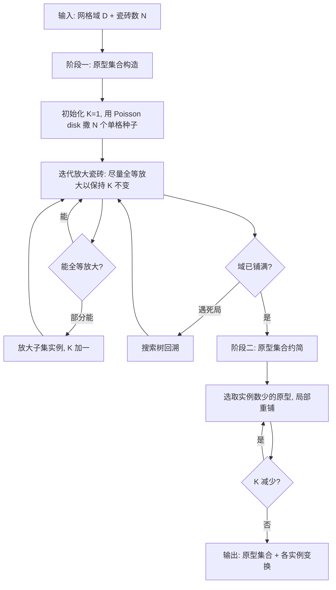

## 一句话总结

提出"逆向铺砌"（inverse tiling）新问题：不再预先给定原型瓷砖集合，而是从单个瓷砖出发，边铺砌边反向构造出一个数量尽可能少（$$K$$ 最小）的原型集合，去无缝覆盖一个用网格表示的二维有限域。

## 研究背景

铺砌（tiling）是用一组瓷砖无缝隙、无重叠地覆盖一个区域。当每块瓷砖都全等于 $$K$$ 种不同形状（称为原型瓷砖 prototile）之一时，就称为 $$K$$-hedral 铺砌。较小的 $$K$$ 不仅让铺砌外观更整齐美观，还能降低制造成本（例如用模具批量生产）并简化拼装过程。

传统做法是"正向铺砌"（forward tiling）：预先规定一组原型瓷砖，再放置它们的实例去覆盖区域。这有两个痛点：当原型集合太小（$$K$$ 小）时，可能根本无法完成铺砌；当原型集合太大（$$K$$ 大）时，结果又会用到远超所需的原型种类，抬高成本。而且判断某个预设集合能否铺满一个域，本身需要在庞大子集空间里反复试错。正向铺砌已知是 NP-complete 问题。

本文换了个视角，把原型集合当作"待求解的未知量"而非输入，提出逆向铺砌问题，并证明其为 NP-hard。为使问题可解，作者假设输入域由网格表示（网格单元只有一两种形状），并引入瓷砖总数 $$N$$ 作为控制参数，同时对原型尺寸设定上下界 $$\lbrack C_{\min}, C_{\max}\rbrack$$，避免生成过小或过大的原型。

## 方法

整体框架分为两个阶段：先"构造"原型集合，再"约简"原型集合。

关键设计（2~4 点）：

1. **搜索树 + 回溯避开死局**。由于放大过程可能进入"废局"（abortive tiling state，即还有空格却无法在不违反尺寸/形状约束下继续放大任何瓷砖），作者用带回溯的搜索树遍历合法状态。每个节点生成 $$m$$ 个下一状态候选（默认 $$m = 15$$），按两条准则排序：优先原型数更少，其次未覆盖格更少；无法生成合法子节点时回溯而非整体重启。

2. **两条局部放大准则服务两个全局目标**。可放大性准则（enlargeable tiles requirement）：均匀撒种子并在放大时刻意留出邻接空格，减少废局与回溯，服务"可铺满"目标；全等瓷砖准则（congruent tiles requirement）：尽量让一个原型的所有实例全等放大以保持 $$K$$ 不变，或让小原型放大后匹配已有原型（整体匹配或匹配其一部分），服务"最小化 $$K$$"目标。

3. **可放大性度量指导选择**。为每个未覆盖格定义阻塞性 $$b(x)$$（其 $$I$$-环邻域内相交的瓷砖数，$$I=3$$）；瓷砖的可放大性 $$e(t_{k,j}) = \sum_{x_u} \frac{1}{b(x_u)}$$ 对相邻空格阻塞性取倒数求和；原型的可放大性 $$e(t_k) = \frac{1}{n_k}\sum_j e(t_{k,j})$$。优先放大低可放大性的瓷砖，并优先把低阻塞性的空格分配给它们。

4. **局部重铺约简 $$K$$**。选取实例数 $$n_{\text{loc}} \le 3$$ 的原型，把域拆成其实例及一环邻居构成的 $$D_{\text{loc}}$$ 与其余 $$D_{\text{rem}}$$，在 $$D_{\text{loc}}$$ 上用改良版构造法重铺，并优先匹配 $$D_{\text{rem}}$$ 中已有原型；若整域原型数下降则接受，否则回退，反复迭代直到无法再减。

## 实验结果

在 $$K$$ 最小化实验中，作者用四格/五格骨牌（tetromino/pentomino）去铺 Coin、House、Teapot 三个域，并与最小 $$K$$ 的真值结果对比：

| 输入域 | 真值 $$K$$ | 本文 $$K$$ | 真值耗时（分钟） | 本文耗时（分钟） |
| --- | --- | --- | --- | --- |
| Coin | 1 | 1 | 0.02 | 0.11 |
| House | 2 | 2 | 0.78 | 2.31 |
| Teapot | 3 | 4 | 2.74 | 15.35 |

方法在 Coin、House 上达到最小 $$K$$，在 Teapot 上得到接近真值的 $$K=4$$（真值 $$K=3$$）。与三种正向铺砌方法（回溯 BT、整数线性规划 ILP、布尔可满足性 SAT）在 Bunny 上、三种尺寸约束下的对比表明：正向方法在允许瓷砖形状集合变大时常常 24 小时内无解，而本文方法能对全部任务给出解，且每个任务的原型数都最少。

## 亮点与局限

亮点：把铺砌问题从"给定原型去覆盖"反转为"覆盖过程中反向发现最少原型"，避免了预设原型集合的繁琐试错；两阶段（构造 + 约简）配合搜索树回溯与两条局部准则，在 NP-hard 问题上取得了良好可扩展性；能处理含孔洞与不连通形状的域，支持多种网格（方形、六边形、菱形、方-三角、八边-方），并可约束原型的凸性与包围盒；成果可落地为 3D 打印的二维拼装拼图。

局限：当原型尺寸/形状约束过紧（如 $$C_{\min} = C_{\max} = 10$$）时可能无法在 24 小时内给出完整铺砌；对内部面积不大的细长域，全等放大易失败，难以得到少原型结果；方法缺乏对域整体形状属性（如对称性）的理解，无法利用这些性质进一步压低 $$K$$。

## 延伸思考

作者指出的方向都颇有想象空间：给生成的瓷砖附加图形即可推广到 Escherization（埃舍尔式铺砌）；把二维逆向铺砌推广到三维有限域（如体素化形状），可服务建筑装配的"全等构件"理性化设计；引入可变形原型后还能用于城市布局与图案生成。一个值得追问的点是，如何把"域的全局对称性"显式编码进搜索准则——当前贪心式的局部放大天然难以复用全局规律，这既是当前 $$K$$ 未必最优的根因，也是把该框架从"启发式求解"推向"接近最优"的关键突破口。
