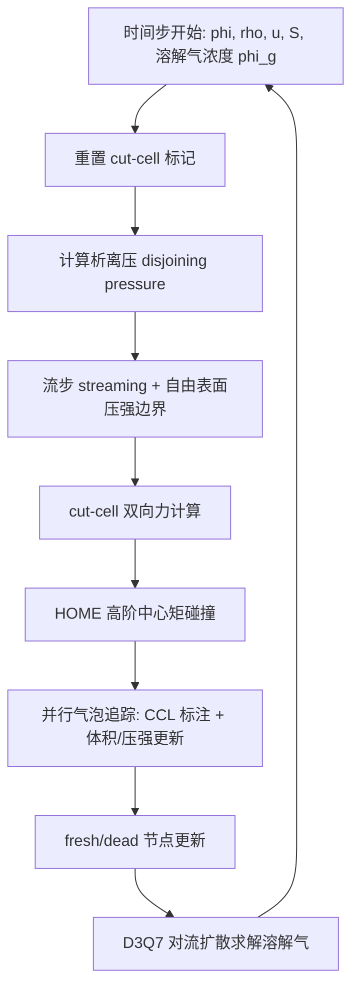

## 一句话总结

HOME-FREE LBM 把"高阶矩编码 + 高阶碰撞模型"引入自由表面格子玻尔兹曼（FSLBM），用体积分数（VOF）锐利界面只模拟液相而忽略气相，同时补上了并行气泡追踪、湍流抑制、cut-cell 双向耦合与泡沫加固粘性等一整套机制，从而在单相求解器的成本下捕捉到湍流、汩汩涌流、气泡以及靠表面张力相互粘连的泡沫。

## 研究背景

自由表面流动——液体与空气之间界面的运动——是图形学里最富视觉复杂度的现象之一：气泡上升破裂、飞溅、乃至泡沫。现有求解器各有短板。一类基于弥散界面（diffuse interface）的动理学多相 LBM 方法虽然稳定、能重现丰富湍流，但必须同时模拟液相与气相，且弥散界面天然会抹平界面细节：要捕捉小气泡的合并与破裂就得用极大网格，内存与时间开销巨大，而泡沫（气泡紧密堆叠、之间隔着极薄液膜）根本无法处理。另一类只模拟液相的动理学自由表面求解器（如经典 FSLBM）计算高效、内存低，但在稍有湍流的场景下就容易发散，无法重现完整的湍流行为，也长期无法处理气泡和泡沫。

FSLBM 的具体缺陷可归纳为：平衡态与外力项只用低阶展开、BGK 碰撞模型在惯性力不小时精度低，因而一遇湍流就不稳定；气泡内压强被简单设为大气压，无法反映气泡生长收缩合并；边界处理无法应对薄壳或非封闭物体；缺乏对泡沫层间液膜（lamellae）压强的建模。本文的目标就是逐条修复这些短板，得到一个统一、高效、稳定的锐利界面动理学自由表面求解器。

## 方法

整体思路：以 FSLBM 的锐利界面框架为骨架（只模拟液相，用 VOF 场 $$\phi$$ 作为指示函数追踪界面），把分布函数替换为速度矩编码，把碰撞升级为高阶中心矩模型，再叠加气泡追踪、湍流模型、cut-cell 耦合与泡沫处理四个模块。

关键设计：

- 矩编码与高阶碰撞（HOME-FREE 基础）：借鉴 HOME-LBM，不再存储 D3Q19/D3Q27 的分布函数 $$f_i$$，而只存密度 $$\rho$$、速度 $$\boldsymbol{u}$$ 和二阶速度矩 $$\boldsymbol{S}$$，每格点仅 10 个标量，既省内存又提升稳定性。流步时用三阶 Hermite 滤波重建 $$f_i$$：$$f_i=\rho w_i\left[1+\frac{\boldsymbol{c}_i\cdot\boldsymbol{u}}{c_s^2}+\frac{H^{[2]}(\boldsymbol{c}_i):\boldsymbol{S}}{2c_s^4}+\sum_{\alpha\beta\gamma}\frac{H^{[3]}_{\alpha\beta\gamma}(\boldsymbol{c}_i)T_{\alpha\beta\gamma}}{2c_s^6}\right]$$。碰撞采用非正交中心矩多松弛（NOCM-MRT）模型 $$\Omega=-\boldsymbol{M}^{-1}\boldsymbol{R}(\boldsymbol{m}-\boldsymbol{m}^{eq})+(\boldsymbol{I}-\tfrac{1}{2}\boldsymbol{R})\boldsymbol{K}$$，配合六阶 Hermite 平衡态展开。二维溃坝实验显示：BGK 模型 71 帧就崩溃、TRT 撑到 75 帧，而 HOME-FREE 全程稳定。

- 并行气泡模型：气泡定义为被液体包围的一片连通气/界面节点，其压强按等温理想气体定律 $$p(b_i,t)=p_{atmos}\,V(b_i,0)/V(b_i,t)$$ 更新，体积为 $$V(b_i,t)=\sum_{\boldsymbol{x}\in b_i}(1-\phi(\boldsymbol{x},t))$$。传统方法用串行 flood-fill + 二部图匹配新旧气泡编号，无法并行也不能处理薄壳。本文利用"LBM 每步 VOF 至多平流一格"的特性，用并行连通域标注（CCL，块状 union-find）重新编号，再通过原子加做体积/压强更新——不需要新旧编号对应关系：$$V_i\mathrel{+}=1-\phi(\boldsymbol{x},t)$$，$$V^0_i\mathrel{+}=(1-\phi(\boldsymbol{x},t))\,p^{old}_{i_{old}}/p_{atmos}$$，最后 $$p_i=p_{atmos}V^0_i/V_i$$。为保证体积精度用双精度。cut-cell 节点在 CCL 阶段被忽略（视为大气压气体），从而无额外开销地支持薄壳/非封闭物体。

- 湍流模型抑制小气泡消失：小气泡因高局部压强会在速度场里引发振铃伪影，速度超过 CFL 后小气泡平流出错、乱飞甚至消失。作者对距气泡不足四格的节点加涡粘性 $$\nu_e=4\lVert\boldsymbol{S}\rVert_F$$（正比于二阶速度矩的 Frobenius 范数），消除振铃。

- cut-cell 双向耦合：借鉴双侧 bounce-back，把与固体边界相交的格边标为 cut-cell 链、含此链的节点标为 cut-cell 节点，只在液/界面 cut-cell 节点施加 bounce-back，天然支持薄且非水密物体。流固作用力用中心矩格式以保证伽利略不变性，力与力矩表达式仅在液/界面 cut-cell 节点上累加、跳过气节点。对"fresh 节点"（突然脱离障碍物覆盖的节点）提出"缓入"策略：先由邻居 VOF 平均得 $$\phi$$，低于阈值 $$\theta$$ 则标为气、否则标为液并插值物理量；阈值 $$\theta$$ 随固体速度线性变化（快则取 0.95、慢则取 0.3），从而消除液体粘附障碍物的伪影。

- 泡沫建模：用 D3Q7 格子解溶解气浓度的对流扩散方程 $$\frac{\partial\varphi}{\partial t}+\nabla\cdot(\varphi\boldsymbol{u})=\nabla\cdot(\mu_g\nabla\varphi)+q$$，界面处用亨利定律 $$\varphi=k_H p_g$$ 设边界。引入析离压（disjoining pressure）$$\Pi=k_\pi(1-d/d_{max})$$（$$d\le d_{max}$$ 时）来稳定气泡间液膜，并入气密度式 $$\rho_g=(p_g-2\gamma\kappa-\Pi)/c_s^2$$。为让泡沫在高雷诺数下不塌，作者提出"泡沫加固"处理：D3Q7 改用中心矩松弛（CMR）碰撞、对距界面不足六格处加局部粘性 $$\nu_f$$、并在有析离压时切换到更高表面张力 $$\gamma_{oss}$$（$$\gamma=(\Pi{=}{=}0)\,?\,\gamma:\gamma_{oss}$$）。

## 实验结果

实现于 C++/CUDA，SoA 存储每格点两份共 10 个矩变量，全部在 NVIDIA RTX 3090（24GB）上以每帧 1/30 秒计时。代码已开源。

- 与弥散界面 LBM 对比（穿过薄"梳"结构的溃坝）：同分辨率下，本文方法比 [Li et al. 2022] 快约 2 倍、内存仅约 60%，且液体能更自由穿过薄结构、生成远多的气泡与湍流细节；较低分辨率下快约 4.4 倍、内存约 25%。相较非动理学求解器（同例在 GTX 1080Ti 上 90 秒/帧、64×64×32），本文在 RTX 3090 上 400×400×200 分辨率下 31 秒/帧。

- 代表性场景（部分取自 Table 1，RTX 3090，1/30 秒每帧）：

| 场景 | 分辨率 | 秒/帧 | 迭代/帧 |
|------|--------|-------|---------|
| 快速水片入容器（大表面张力） | 600×300×300 | 58.1 | 320 |
| 汩汩涌流 | 200×400×200 | 16.4 | 320 |
| 气泡环 | 400×300×400 | 80.6 | 320 |
| 泡沫层（气泡上升聚顶） | 400×400×400 | 130.6 | 240 |
| 兔子落水（双向耦合） | 250×300×250 | 13.2 | 100 |
| 三维气泡排液 | 300×600×200 | 46.8 | 320 |
| 水车（双向耦合） | 250×300×250 | 8.4 | 333 |
| 对冲射流 | 200×400×400 | 2.9–3.5 | 320 |

- 泡沫与高雷诺数：二维气泡成核（Re=100,000）中，[Ataei et al. 2021] 很快崩溃，而本文能生成受重力与毛细驱动的泡沫排液；缺少泡沫加固粘性时液膜无法维持。三维气泡排液呈现出与真实泡沫排液类似的规则格状结构。对冲射流在不同 Reynolds/Weber 数下重现了链环、开口边缘破碎、湍流拍打薄片等与真实实验一致的形态。相较某超算需 13,824 核跑 24 小时的算例（768×384×384），本文用 36 分钟在 600×300×300 得到相近视觉效果。

- 消融：cut-cell 双向力在低水量/高 cut-cell 占比场景优势明显（水车例中 2.4 ms vs. [Bogner 2017] 的 11.9 ms，约 5 倍）；fresh 节点缓入策略消除了移动物体的液体粘附（对比 [Bogner 2017]）与虚假气泡（对比 [Li and Desbrun 2023]，后者末帧超 70 个小气泡，本文不足 10 个）。

## 亮点与局限

亮点：在只模拟液相的锐利界面框架下，通过矩编码 + 高阶中心矩碰撞把稳定性推到高雷诺数湍流；提出无需新旧编号匹配、可 GPU 大规模并行的气泡追踪算法；cut-cell 双向耦合统一支持薄壳与厚体并保证伽利略不变性；泡沫加固粘性 + 局部表面张力切换首次在动理学自由表面框架里稳定重现紧密泡沫。整体相较弥散界面动理学求解器至少快 2 倍、内存显著更低，却能捕捉更细的界面细节。

局限：未处理浸润（wetting），需改进曲率估计；VOF 受网格尺寸限制，无法捕捉大量极小气泡，可考虑引入拉格朗日粒子增强；缺乏引导用户获得期望流动行为的直观交互接口；渲染时的界面提取依赖 marching cubes + 平滑/重网格，未来可尝试泊松重建或对偶轮廓等更优方案。

## 延伸思考

这篇工作最值得玩味的一点，是它反其道而行：当社区普遍转向弥散界面来换取稳定性时，作者选择坚守锐利界面、把稳定性问题交给"更高阶的分布函数表示与碰撞模型"去解决。这说明数值稳定并不必然要以牺牲界面锐度为代价——只模拟液相的自由表面假设（利用液气密度/粘度比极大这一物理事实）本身省下大量算力，而稳定性可由碰撞算子的阶数与矩编码补回。其并行气泡追踪的核心洞见（"LBM 每步 VOF 至多平流一格，故只需就地比对邻域编号 + 原子加聚合体积，而无需全局二部图匹配"）是一个把串行拓扑维护改写成并行归约的漂亮范例，思路可迁移到其他需要跨帧追踪连通结构的模拟场景。局限里点出的"VOF 受网格分辨率限制、难捕极小气泡"也预示了未来 Eulerian VOF 与 Lagrangian 粒子混合表示的方向。
