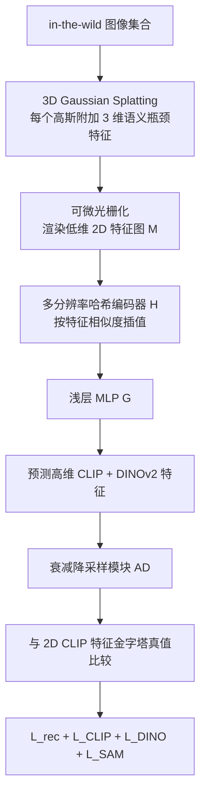

## 一句话总结

Lang3D-XL 通过给 3D Gaussian Splatting 增加一个极低维（3 维）的可学习语义瓶颈，配合基于特征相似度的多分辨率哈希编码器、衰减降采样模块与多种正则，在大规模互联网图像场景中高效蒸馏语言特征，实现交互式文本查询，性能接近逐提示优化两小时的 HaLo-NeRF，而推理快数个数量级。

## 研究背景

把语言场嵌入 3D 表示，可以让几何与语义关联，从而支持用自然语言查询、编辑场景，并有望改善场景检索、导航与多模态推理。对于地标级的大规模场景而言，这种能力尤其有价值。

现有做法各有短板：

- **逐提示优化太慢**：HaLo-NeRF 为每条文本提示优化一个语义定位头，单条提示推理约需两小时，难以支撑实时文本导航等交互应用。
- **特征蒸馏方法难以扩展**：从 DFF、Feature3DGS 到 LangSplat 等蒸馏方法，在面对海量互联网数据时遇到两类问题：一是 GPU 显存与运行时的效率瓶颈；二是用像素对齐的 2D 特征金字塔直接监督会带来明显的语义错位（semantic misalignment），相邻区域被"污染"上错误语义。

作者由此提出 Lang3D-XL，专门解决大规模、in-the-wild 静态互联网场景下语言特征蒸馏的效率与错位问题。

## 方法

整体框架：先给 3DGS 的每个高斯附加一个 $$d' = 3$$ 维的可学习语义瓶颈特征，经可微光栅化渲染成低维 2D 特征图；该特征图作为坐标输入到基于特征相似度的多分辨率哈希编码器，输出高维 CLIP 与 DINOv2 特征；再用衰减降采样模块与正则项对齐 2D 真值特征进行监督。

关键设计：

- **低维语义瓶颈（Semantic Bottleneck）**：每个高斯 $$G_i$$ 除位置、协方差、不透明度、球谐系数外，额外携带一个 $$d'$$ 维特征 $$f_i$$，其中 $$d' \ll D$$（$$D$$ 是预训练视觉语言模型的高维特征维度）。作者发现 $$d' = 3$$ 已足够，使得每个高斯只需渲染 3 维特征，大幅降低显存与渲染开销。

- **基于特征相似度的多分辨率哈希编码（受 Instant-NGP 启发）**：渲染得到 2D 特征图 $$M \in \mathbb{R}^{H \times W \times d'}$$ 后，每个像素特征 $$m_{u,v}$$ 作为坐标查询 $$L$$ 层哈希表，通过在 $$d'$$ 维特征空间中对邻近网格点线性插值得到嵌入，各层结果拼接后过浅层 MLP $$G$$ 输出高维 CLIP 与 DINOv2 特征。与 FMGS/FastSplat 的两点区别：（i）哈希编码在渲染后的 2D 特征空间进行，而非 3D 高斯空间，显著降低内存与渲染成本；（ii）哈希以"特征相似"而非"位置相似"为依据，使图像中不同位置的相似结构（如反复出现的柱子）被相似地哈希。

- **衰减降采样模块（Attenuated Downsampler）**：先以高于真值的分辨率渲染特征，再用一个三层 3×3 卷积的小网络为局部窗口内每个特征 $$f_i$$ 预测标量权重 $$w_i$$，做加权聚合：

$$F_d = \frac{\sum_{i \in S} \exp(w_i) \cdot f_i}{\sum_{i \in S} \exp(w_i)}$$

其中 $$S$$ 是对应单个输出像素的 $$R \times R$$ 局部窗口，$$R = H / H_d = W / W_d$$。这种自适应加权缓解了直接对齐错位 2D 特征的问题。

- **两项正则**：DINO 正则让共享 MLP $$G$$ 同时预测 CLIP 与 DINOv2 特征并配合权重衰减，使两类特征耦合更紧；SAM 正则不把特征硬约束到 SAM 掩码区域（在边界高度纠缠的 in-the-wild 场景中不适用），而是软约束掩码内 CLIP 特征方差，$$L_{\text{SAM}} = \sum_{M_i \in \text{Masks}} \mathrm{Var}[F_d(M_i > 0)]$$，鼓励同一语义物体内特征一致。

- **完整目标**：$$L = L_{\text{rec}} + \lambda_{\text{CLIP}} L_{\text{CLIP}} + \lambda_{\text{DINO}} L_{\text{DINO}} + \lambda_{\text{SAM}} L_{\text{SAM}}$$，联合优化高斯模型与语言场，不依赖预先构建好的 3D 高斯。

- **处理 in-the-wild 视图**：集成 SWAG 处理光照/天气/瞬态物体等变化（只作用于光度损失）；用 LLM 增强查询提示的同义表达；根据 COLMAP 元数据估计平均物理像素尺寸，定义跨图像一致的物理尺度 CLIP 金字塔，并采用 HaLo-NeRF 针对建筑域微调的 CLIP。

## 实验结果

在 HolyScenes 数据集（宗教地标大规模 in-the-wild 场景，单场景超 2000 张图像）上，用各语义类别的平均精度（AP）评测。主结果如下（mAP 越高越好）：

| 方法 | 类别 | Window | Minaret | Dome | Tower | Spire | Portal | mAP |
|------|------|--------|---------|------|-------|-------|--------|-----|
| LSeg | 2D 分割 | 0.13 | 0.06 | 0.05 | 0.19 | 0.06 | 0.05 | 0.09 |
| CLIPSeg | 2D 分割 | 0.44 | 0.63 | 0.69 | 0.87 | 0.46 | 0.29 | 0.56 |
| CLIPSegFT | 2D 分割 | 0.51 | 0.81 | 0.77 | 0.87 | 0.50 | 0.49 | 0.66 |
| LangSAM | 2D 分割 | 0.53 | 0.14 | 0.44 | 0.19 | 0.11 | 0.05 | 0.25 |
| HaLo-NeRF（2 小时/提示） | 3D 分割 | 0.64 | 0.80 | 0.74 | 0.87 | 0.61 | 0.45 | 0.68 |
| DFF | 特征蒸馏 | 0.04 | 0.17 | 0.11 | 0.17 | 0.09 | 0.06 | 0.11 |
| LERF | 特征蒸馏 | 0.15 | 0.09 | 0.10 | 0.13 | 0.18 | 0.16 | 0.14 |
| LangSplat | 特征蒸馏 | 0.03 | 0.22 | 0.25 | 0.38 | 0.20 | 0.08 | 0.19 |
| Feature3DGS | 特征蒸馏 | 0.03 | 0.04 | 0.03 | 0.14 | 0.05 | 0.01 | 0.05 |
| FMGS | 特征蒸馏 | 0.43 | 0.82 | 0.57 | 0.49 | 0.63 | 0.10 | 0.51 |
| **Ours** | 特征蒸馏 | 0.51 | 0.84 | 0.70 | 0.46 | 0.67 | 0.38 | **0.59** |

Lang3D-XL 在所有特征蒸馏方法中大幅领先（mAP 0.59，对比最强基线 FMGS 的 0.51、Feature3DGS 的 0.05），并在 Minaret、Spire 等更专业的建筑术语类别上表现突出；与逐提示优化两小时的 HaLo-NeRF（mAP 0.68）相比略低，但单条提示推理从约 2 小时降到 >0.1 秒，快数个数量级。效率消融（Tab. 2）显示其训练时间 0.10 秒、推理 0.026 秒、训练显存约 10GB，均优于 Feature3DGS 与 FMGS。

## 亮点与局限

亮点：

- 将语义哈希编码从 3D 高斯空间搬到渲染后的 2D 特征空间，并以特征相似度而非位置相似度做哈希，兼顾效率与对重复结构的泛化。
- 仅需 3 维语义瓶颈即可获得高质量结果，显著压缩 3D 表示的显存与渲染成本。
- 用衰减降采样与 SAM 方差正则（软约束）替代硬掩码约束，针对性缓解 in-the-wild 场景中 2D 特征金字塔的语义错位。

局限：

- 依赖多尺度 CLIP 特征，仍存在难以完全消除的空间歧义，可能把语义相似区域（如 Notre Dame 中部的装饰性开口）误判为窗户。
- 建筑元素尺寸差异大，需要多个金字塔尺度，简单平均会让大尺度特征淹没细小结构（如 Blue Mosque 顶部小窗易被漏检）。

## 延伸思考

该工作把"特征空间哈希"这一思路推到大规模真实场景，暗示语言蒸馏的瓶颈更多在 2D 真值特征的质量与对齐，而非 3D 表示本身。若未来 2D 开放词表定位模型能提供更空间精确、尺度无关的特征，或用更聪明的多尺度融合替代简单平均，这类交互式语义场有望进一步逼近甚至超越昂贵的逐提示优化方案，并推广到更广的场景类型与下游任务（检索、导航、VQA）。
