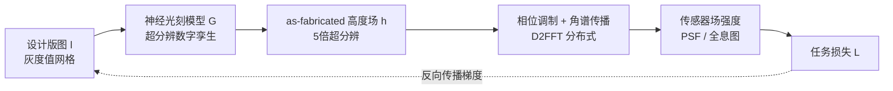

## 一句话总结

本文提出一套"面向制造"的端到端衍射光学设计流程：用一个超分辨神经光刻模型作为制造过程的可微数字孪生，把"设计版图→实际器件形貌"的偏差直接纳入优化，再配合分布式张量并行的 FFT/卷积计算框架把仿真扩展到厘米级、上百亿网格点，从而在无相机在环的开环条件下让全息、光束整形与单衍射元件宽带成像的仿真与实测高度吻合，真正弥合了学习型衍射光学的"设计-制造鸿沟"。

## 研究背景

可微光学（deep optics / differentiable optics）通过联合优化光学元件与图像处理算法，已在全息、点扩散函数（PSF）工程、波前整形等任务上展现出强大能力，而衍射光学元件（DOE）因能编码任意相位调制、结构紧凑，成为这类计算光学系统的核心器件。然而这些学习型系统大多停留在实验室原型阶段，根本障碍有二：其一是设计与制造之间存在巨大质量落差，其二是难以在高保真度下设计大面积器件。

落差的来源在于制造工艺本身。以直写灰度光刻为例，激光束在光刻胶上按二维网格扫描曝光，会引入光学模糊（可建模为设计图案与激光束 PSF 的卷积，导致小矩形特征的边角圆化）、非线性的光化学响应，以及显影阶段复杂的三维化学反应，最终得到的高度场在小于特征尺寸的尺度上必然偏离目标形貌；纳米压印复制阶段还会因树脂固化收缩带来进一步形变。与此同时，多数逆向设计流程出于算力限制在严重欠采样的网格上仿真（常见一格一特征，或仅 2 倍细化），违反奈奎斯特采样定理，而全息与 DOE 设计往往依赖相邻特征间的尖锐阶跃边缘，欠采样直接引入混叠、劣化实际性能。

已有的应对手段包括：商业设计中在"设计-制造-测量"间反复迭代，全息显示领域流行的相机在环（camera-in-the-loop），以及端到端成像系统里用实测原型微调计算模块。但这些"闭环"方式代价高昂，难以推广到实验室原型之外。本文的目标是构建一个能在开环仿真中准确预测最终系统的面向制造的设计流程。

## 方法

### 整体框架

作者把 DOE 建模为相位分布 $$\Phi_{\lambda}$$，与高度场 $$h$$ 通过 $$\Phi_{\lambda}(x,y)=\frac{2\pi}{\lambda}(n_{\lambda}-1)h(x,y)$$ 关联，其中 $$n_{\lambda}$$ 为波长相关折射率。入射波 $$E^{in}_{\lambda}$$ 经 DOE 调制后为 $$E^{doe}_{\lambda}=E^{in}_{\lambda}e^{i\Phi_{\lambda}}$$，再经角谱法（ASM）传播到传感器平面 $$E^{dest}_{\lambda}=\mathcal{F}^{-1}\{\mathcal{F}\{E^{doe}_{\lambda}\}\otimes H_{\lambda}\}$$。传统设计直接优化 $$h$$：$$h^{*}=\arg\min_{h}\sum_{\lambda}\mathcal{L}_{p}(\lVert E^{dest}_{\lambda}(h)\rVert^{2})$$，隐含"设计即所得"的完美恒等映射假设。

本文的关键改动是引入一个光刻模型 $$\mathcal{G}\{\cdot\}$$ 作为制造过程的可微代理，把设计版图 $$l$$ 映射为真实器件高度场 $$h=\mathcal{G}\{l\}$$，从而把优化目标改写为对版图（即光刻机的真实输入）的优化：$$l^{*}=\arg\min_{l}\sum_{\lambda}\mathcal{L}_{p}(\lVert E^{dest}_{\lambda}(\mathcal{G}\{l\})\rVert^{2})$$。只要包括 $$\mathcal{G}$$ 在内的所有环节都可微，就能用反向传播端到端求解。

### 关键设计

1. **超分辨神经光刻模型**。这是流程的核心。作者先做两阶段标定：先做"对比曲线标定"，通过 7×7 均匀灰度块测试图案与白光干涉仪测量，数值反演出新的灰度值分布（GVD）查找表，使显影深度与灰度值近似线性（并舍弃低端非线性区，仅用 1000 个灰度级）；再做"神经光刻学习"，随机生成经傅里叶低通滤波的图案并制造，用原子力显微镜（AFM）以约 200 nm 分辨率测量真实三维形貌作为真值。网络是一个仅 2 到 4 层卷积、带 ReLU、末尾接像素洗牌（pixel shuffle）上采样、并加跳连的小型 CNN，把 1 µm 网格的设计版图映射到 200 nm 网格的形貌，实现 5 倍超分辨；跳连对于把梯度正确回传到输入版图至关重要。作者发现仅需 10 对高质量数据即可训得泛化良好的模型，且其精度显著优于基于调制传递函数（MTF）的线性物理模型。

2. **玩具实验揭示"制造插值核"**。作者用一个 3.6×3.6 mm²、2 µm 特征的 DOE 生成二维全息图，对比常规 2 µm 网格、8 倍最近邻上采样、Lanczos 上采样等设置，说明：只有训练与评估在同一设置下全息图才能被良好重建；插值核在高频特征构建中起决定性作用，核不匹配会导致质量骤降。这正说明必须用准确的"制造核"而非人工假设的插值核，从而引出面向制造优化的必要性。

3. **D2FFT 分布式内存 FFT**。ASM 中的 FFT 是大规模波光学仿真的内存瓶颈。作者按张量并行思路把二维 FFT 分解为行列两次一维 FFT：先沿列把数组切分到不同 GPU，各设备独立做行方向批量一维 FFT，再用 all-to-all 集合通信（等价于矩阵转置）重新切分，最后做列方向一维 FFT。基于离散傅里叶变换可表为对称矩阵这一性质，反向传播只需再做一次分布式 FFT，实现可微。

4. **张量并行的空间划分卷积**。神经光刻模型在大面积版图（如 1 cm² 在 1 µm 网格下即 10,000×10,000）下同样内存不可承受，而滑窗策略只适用于推理、无法在训练时把梯度回传到版图。作者沿 Y 轴切分输入，各设备用同一卷积核独立处理子块，边界处用 collective permute 原语与相邻设备交换边界信息做填充，每个子块含 $$(\frac{H}{N}+2\lfloor\frac{K}{2}\rfloor)\times W$$ 个元素。

5. **GSPMD 编程模型统一实现**。整个框架在 JAX 中按 GSPMD 实现，用多维处理器网格加分片标注（PartitionSpec），由 XLA 编译器自动生成底层 MPI 式原语，从而无需手写易错的低层通信代码，即可灵活配置任意的数据并行与张量并行混合（如把处理器网格设为 [波长, 张量并行] 二维网格）。

## 实验结果

作者共制造 11 个 DOE（6 个全息显示、2 个光束整形、3 个宽带成像），在仿真与实测两方面验证。

计算全息显示：三个 3.6×3.6 mm² DOE 对比常规、常规+上采样、面向制造三种方案。仿真中所有方法在"同设置训练评估"下都成功，但常规方案在神经光刻评估设置下质量骤降，与实测吻合；而面向制造方案在相干激光照明下得到近乎无散斑、高清晰度的全息图，实测与仿真高度接近，基本弥合了设计-制造鸿沟。

大面积高清全息：进一步优化两个 32.16 mm × 21.44 mm、2 µm 特征的 DOE（对应 4K×6K 传感器像素），在 0.5 µm 网格（4 倍超分辨）上离散化，中间数组达 128,640×85,760 像素，远超单卡甚至单节点 8 卡容量。作者用 16 块 A-100 GPU（两节点）把数组空间分片到 16 段完成优化，实测验证了框架在前所未有规模上的可扩展性。

计算成本（部分，见下表）：

| 任务 / 方案 | 离散网格 | GPU 数 | GSPMD 网格 | 计算时间 |
|---|---|---|---|---|
| CHD 常规 | 3,600×3,600 | 1 | [1, 1] | 42 s |
| CHD 常规+上采样 | 28,800×28,800 | 1 | [1, 1] | 14 m |
| CHD 面向制造 | 28,800×28,800 | 1 | [1, 1] | 17 m |
| 大面积 CHD 面向制造 | 128,640×85,760 | 16 | [1, 16] | 15 h |
| 成像 面向制造 | 6×40,000×40,000 | 12 | [6, 2] | 10 h |

光束整形：设计将平面波分束为 8×8 平顶等强度点阵的衍射分束器，在相同照明与曝光条件下，面向制造方案的整体光斑强度比常规方案高 53%，体现出显著的衍射效率提升。

单 DOE 宽带彩色成像：在 400–700 nm 均匀采样 6 个波长，用混合数据/张量并行（网格 [6, 2]），对相位施加径向对称约束（优化 16 阶多项式径向向量），损失为聚焦项、光谱一致性项与能量项之和 $$\mathcal{L}_{imaging}=\mathcal{L}_{focus}+\mathcal{L}_{consistency}+\mathcal{L}_{energy}$$。对实拍图仅用仿真 PSF 做一步维纳反卷积 $$\hat{x}=\mathcal{F}^{-1}\{\frac{\overline{K_{sim}}}{\lvert K_{sim}\rvert^{2}+\gamma}Y_{cap}\}$$。面向制造方案因实测 PSF 与设计接近，重建结果逼近真值；常规最近邻上采样方案则出现波长相关色差、可逆性差波段的噪声升高与振铃伪影。这表明当设计流程包含准确的制造模型时，仅用轻量、边缘友好的一步反滤波即可获得高质量图像，无需重型深度网络微调。

扩展性分析：以相干全息为基准测不同 GPU 数下可容纳的最大系统规模，1→2 卡为亚线性（1.73 倍而非理想 2 倍，源于通信开销），2→16 卡呈线性扩展，验证了分布式框架的可扩展性。

## 亮点与局限

亮点：
- 首次把面向制造的可微数字孪生（超分辨神经光刻模型）与端到端衍射光学设计结合，且针对适合大面积量产的直写灰度光刻+纳米压印工艺，而非低通量的双光子聚合。
- 仅用 10 对 AFM 数据即可训练出泛化良好、精度显著超过 MTF 物理模型的神经光刻模型，标定可在一天内完成。
- 提出可微的分布式内存 D2FFT 与张量并行空间划分卷积，并用 GSPMD 统一实现，把仿真规模推到 128,640×85,760 网格、上百亿元素，扩展性接近线性。
- 在全息、光束整形、单 DOE 宽带成像三类任务上仿真与实测高度吻合，开环即可，成像任务甚至仅需一步逆滤波，代码开源。

局限：
- 制造与测量过程的固有随机性设定了神经光刻模型预测精度的上界（重复制造同一图案的 AFM 测量仍有残差），当前学术洁净室的人工干预（如显影时间控制）引入了操作者相关的变异。
- 模型只学习局部形貌偏差，不建模全局效应（如晶圆位置相关变化），依赖"全局变化极小"这一经验假设，跨厂/换材料需重新标定，无法直接迁移。
- AFM 测量是标定流程的主要瓶颈，虽可控但仍耗时且难以完全自动化。

## 延伸思考

这项工作最具启发性的一点，是把"制造工艺"本身当作一个可微、可学习的算子插入到端到端优化图中——不是事后用实测去微调，而是在设计阶段就让优化器"知道"版图会被工艺如何扭曲，进而直接优化真正可控的输入（光刻机版图）。这种"数字孪生前置"的思路对任何存在显著制造/执行偏差的软硬件协同设计问题（超表面、微透镜阵列、乃至更广义的增材/减材制造）都有迁移价值：关键在于找到一个既能准确刻画偏差、又只需少量标定数据、且梯度能顺畅回传到设计变量的代理模型。作者对"局部性"的强调也颇有洞察——把制造偏差限定为局部形貌变形，换来了小数据训练与快速重标定的实用性，代价是放弃全局效应建模，这一取舍在纳米压印这种全局均匀性较好的工艺上成立，但换到 SLM 等存在全局非均匀性的场景则未必。另一条主线是把可微波光学仿真真正"工业化"：D2FFT 与张量并行卷积把深度学习社区的分布式训练基础设施迁移到波光学，说明大规模计算光学的瓶颈正从算法转向系统与工程，未来"仿真最优即实物可用"的门槛，很大程度上取决于制造随机性能否被进一步压低与建模。
