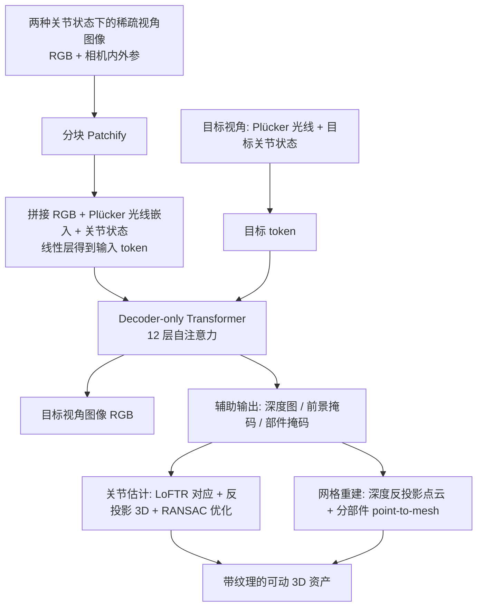

## 一句话总结

LARM 是一个统一的前馈模型，只需两种关节状态下的稀疏视角图像，就能联合恢复带纹理的精细几何、真实外观和准确的关节结构，实现高保真的可动物体三维重建。

## 研究背景

家电、家具、机械装置等可动（articulated）物体广泛存在于日常环境中，其几何与运动学结构的高保真建模是机器人仿真、数字孪生、AR/VR 与动画的基础。然而现有方法存在明显短板：

- 基于优化的方法（多建立在 NeRF 或 3D Gaussian Splatting 之上）需要密集多视角输入，并对每个实例做昂贵的逐实例优化，缺乏跨物体先验，难以扩展和泛化。
- 近期的前馈方法虽然更快，但大多用包围盒、模板网格或从小型数据库检索的零件来近似几何，导致结果粗糙、缺乏真实纹理，难以贴合输入图像；少数采用隐式场（如 SDF）的方法则依赖复杂脆弱的多阶段流程，同样缺乏高质量纹理。

作者由此提出 LARM，用一个简洁统一的架构，从稀疏视角输入联合恢复几何、纹理与关节结构，摆脱对密集观测的依赖。

## 方法

LARM 的核心思路是把静态物体的新视角合成方法 LVSM 扩展到可动物体场景：模型同时对相机位姿变化和关节状态变化进行推理，在合成新视角的同时额外输出深度图、前景掩码与可动部件掩码，再借助后处理模块完成显式的关节估计与网格提取。

关键设计：

1. **关节感知的 token 化与统一 Transformer**：对每个输入 patch，将图像 patch、Plücker 光线嵌入和标量关节状态 $$\theta_i$$ 拼接为 $$\mathrm{concat}([I_{ijk}, P_{ijk}, \theta_i]) \in \mathbb{R}^{9p^2+1}$$，经线性层映射为 token；目标视角只用光线嵌入与目标关节状态构造 token。关节状态采用相对尺度（如「静止」记为 0、「最大」记为 1），无需标注真实的角度或位移。全部 token 送入 decoder-only Transformer，联合建模视角与关节变化。

2. **辅助输出与多任务监督**：与只做新视角合成的 LVSM 不同，LARM 同时利用更新后的输入与目标 token 解码出深度、前景掩码与部件掩码。总损失为 $$L = L_{RGB} + \lambda_D L_D + \lambda_{MF} L_{MF} + \lambda_{MP} L_{MP}$$，其中 $$L_{RGB}$$ 含 MSE 与感知损失，深度用 L1，掩码用分别平均的 BCE，部件掩码还对裁剪后的小区域额外施加 BCE 以应对小部件。

3. **关节估计与网格重建**：固定视角、变化关节状态生成图像对，用 LoFTR 建立部件区域内的稠密对应，再借助深度和相机位姿反投影为 3D 点对；通过最小化 $$L_{joint} = \sum_i \lVert T_{\theta_u \to \theta_v}(P_i^u; a, p, s) - P_i^v \rVert_2^2$$ 并结合 RANSAC 求解旋转/平移关节的轴向 $$a$$、枢轴 $$p$$ 与尺度 $$s$$。网格重建则对可动部件与主体分别融合多视角彩色点云、送入现成 point-to-mesh 工具，得到可独立运动的两个网格。

4. **两阶段训练与数据增强**：先在 Objaverse 静态物体上做仅 RGB 监督的预训练（256×256 到 512×512 的由粗到精），再在带关节标注的 PartNet-Mobility 上微调，输出头用预训练 RGB 头权重复制初始化以加速收敛；微调阶段用随机缩放和纹理替换增强，缓解可动物体数据稀缺问题。

## 实验结果

在 PartNet-Mobility 六类物体（StorageFurniture、Microwave、Refrigerator、Safe、TrashCan、Table）上评测重建网格几何质量，报告 Chamfer Distance（越低越好）与 F-Score（越高越好）的平均值：

| 方法 | 输入 | CD ↓ | F-Score ↑ |
| --- | --- | --- | --- |
| URDFormer | 单视角 | 0.134 | 0.453 |
| Articulate-Anything | 单视角 | 0.108 | 0.592 |
| Singapo | 单视角 | 0.098 | 0.633 |
| Paris | 密集视角 | 0.046 | 0.913 |
| LARM（本文） | 稀疏视角 | 0.030 | 0.929 |

即便 Paris 使用密集视角输入，LARM 仅凭稀疏视角就在几何指标上更优。在纹理外观（PSNR 21.8、CLIP 相似度 0.908）、新视角与状态合成（平均 PSNR 30.76 对比 Paris 21.26）以及关节参数估计（四项指标成功率均领先）上，LARM 也全面超越各基线，并能处理 iPhone 随手拍摄的真实图像。

## 亮点与局限

亮点：
- 用一个简洁统一的前馈架构，联合恢复几何、纹理与关节结构，摆脱密集视角与逐实例优化，单物体重建与关节估计约 90 秒。
- 关节状态用相对尺度表示，无需标注真实物理量，降低了数据标注门槛。
- 通过静态物体大规模预训练迁移三维先验，有效缓解可动物体数据稀缺；消融显示去掉预训练会带来显著性能下降。
- 可零改动扩展到多部件（多抽屉/多门）场景，并在真实随手拍摄图像上验证了实用性。

局限：
- 性能与泛化仍受限于可动物体数据集的规模。
- 仅处理单自由度的旋转或平移关节，未涉及复杂运动链（如机械臂）。
- 关节类型需作为输入给定（作者视其为低门槛要求，并用大模型辅助判定佐证）。

## 延伸思考

LARM 的成功很大程度来自「把静态物体的强新视角合成先验迁移到可动场景」这一思路，说明在数据稀缺领域，借用相邻富数据任务的预训练是有效的杠杆。后续值得探索的方向包括：用生成模型合成更大规模的可动物体数据以突破数据瓶颈；将单自由度假设放宽到复杂运动链与多自由度耦合部件；以及把关节类型判定也纳入端到端框架，减少人工先验输入。这类「新视角合成 + 辅助几何输出 + 后处理显式化」的范式，或许也能推广到更一般的动态与可形变物体重建。
