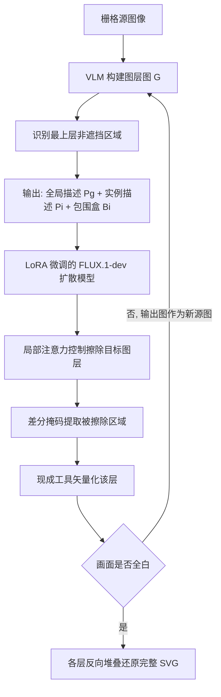

## 一句话总结

把栅格图像转成结构完整、图层清晰的矢量图：用视觉语言模型（VLM）分析遮挡关系找出"最上层"图形，再用微调的图像扩散模型把这层"撕掉"并补全其下被遮挡的内容，如此自回归地一层层剥离，最终反向堆叠还原出路径完整、层次连贯的 SVG。

## 研究背景

矢量图用路径、贝塞尔曲线等几何基元描述视觉内容，天然具备分辨率无关和可逐元素编辑的优势，广泛用于三维渲染、数字艺术和界面设计。手工绘制复杂矢量图门槛很高，因此图像矢量化（把栅格图自动转成矢量图）成为刚需。

但现有方法有一个共同硬伤：面对被部分遮挡的色块区域，它们往往产出残缺或碎裂的矢量元素。基于规则的算法和主流工具（如 Potrace、Adobe Illustrator）只描摹可见像素，无法恢复被遮挡的区域，导致语义结构被破坏、后续编辑变形时出现瑕疵。

围绕"图层化矢量化"的改进有两条路线，各有局限。一是给规则方法加上遮挡顺序估计（如用能量函数推断成对与全局遮挡关系再做曲率修复），但这类几何启发式在处理富语义内容时常生成不合理的形状。二是数据驱动方法：免训练方法用可微光栅化器（DiffVG）迭代优化形状参数，视觉保真度高，但其图层顺序估计容易碎片化连通区域或产生边界错位，需要大量后处理；训练式方法想直接从数据学习图层结构与顺序，却受限于缺乏大规模高质量矢量图数据集，泛化能力不足。LayerPeeler 正是针对这些痛点提出的。

## 方法

整体框架采用"渐进式简化"范式，核心是自回归剥离：每一轮先用 VLM 构建描述遮挡关系的图层图（layer graph），识别出当前最上层的非遮挡区域并给出描述；再把这些描述作为编辑指令交给微调后的扩散模型，精确擦除目标图层并补全其下内容；擦除掉的区域用现成矢量化工具转成矢量路径。如此循环直到画面全白，最后把各层按相反顺序堆叠还原成完整 SVG。

关键设计一：用 VLM 构建图层图。直接让 VLM 判断"哪层没被遮挡"并不可靠，作者把它拆解成 VLM 能稳定完成的子问题。图层图是一个有向图 $$\mathcal{G}=(\mathcal{V},\mathcal{E})$$，每个顶点是一块孤立的纯色区域，带有颜色描述、语义或几何标签、以及"属于哪个更大语义物体"三种属性；边有两类：$$occlude(v_1,v_2)$$ 表示 $$v_1$$ 遮挡 $$v_2$$，用于建立层级；$$interrupted\_shape(v_1,v_2)$$ 表示两块区域本是同一形状被中间遮挡物截断（如鹦鹉身体被翅膀分成上下两段），用于保持语义连贯。非遮挡区域即"不作为任何 $$occlude(\cdot,v)$$ 边终点"的顶点。每轮擦除后 VLM 会拿旧图与新图对比、校验并修正节点与边，从而应对新露出的区域、初始构图误差和生成瑕疵。

关键设计二：局部注意力雕刻（localized attention sculpting）。基座模型选 FLUX.1-dev（DiT 架构，配 T5 文本编码器），用 LoRA 微调，训练用条件流匹配损失：

$$\mathcal{L}_{CFM} = \mathbb{E}_{t,p_t(z\mid\epsilon),p(\epsilon)}\ \lVert v_\Theta(z,x_{src},c_e,t) - u_t(z\mid\epsilon)\rVert_2^2$$

矢量风格图的非遮挡区域常由许多细小、分散的色块组成，导致编辑指令极其细粒度，模型容易把指令与图像区域对错、出现"该删的没删"的擦除失败。为此，作者用 VLM 给出的实例包围盒 $$\mathcal{B}_i$$ 和标签 $$\mathcal{P}_i$$ 来调制联合注意力掩码：全局提示 $$\mathcal{P}_g$$ 可关注所有文本与整幅图像；实例标签 $$\mathcal{P}_i$$ 只能关注其包围盒内的图像 token 和自身，不能关注其他实例标签；包围盒内的图像 token 必须关注对应的 $$\mathcal{P}_i$$、屏蔽对其他标签的关注，而图像 token 之间不设限以保留全局上下文、便于补全被遮挡内容。核心思想是让"每条指令只和它对应的区域对话"，从而精确锁定要删除的区域、提升擦除精度与保真度。

关键设计三：面向图层剥离任务的大规模数据集。作者从 SVGRepo（52,800）和 Iconfont（127,000）收集共 179,000 个纯色 SVG，经语法简化、统一缩放到 512×512、过滤掉路径数超过 30 的复杂样本后，保留 115,700 个高质量 SVG（训练 113,700／验证 1000／测试 1000）。标注时系统地识别每个 SVG 中的非遮挡路径（没有其他路径既与之重叠又位于其上方），把完整 SVG 与提取出的顶层组分别渲染并左右并排（用竖直黑线分隔、棋盘格背景防混色），交给 Gemini-2.0-Flash 生成语义或几何描述，每条描述前缀 "remove" 构成编辑指令 $$\mathcal{P}_e$$。迭代剥离直到完全分解，最终得到约 617,000 个高质量数据三元组 $$(\mathcal{P}_e, I_{src}, I_{tar})$$。推理阶段擦除后用源图与输出图的像素差分图阈值化得到二值掩码，提取被删区域再矢量化（用 Recraft 工具，但方法与具体矢量化工具无关）。

## 实验结果

在从 SVG 渲染的 250 张测试图上（与训练集无重叠），从路径语义、路径不规则度、视觉保真度三个维度对比六种规则式与数据驱动方法。路径语义用"随机删 30% 路径后 CLIP 文-图相似度的下降幅度"衡量（越大说明单个形状语义贡献越显著，越好）；路径不规则度用与真值 SVG 的 Chamfer 距离衡量（越低越好）；视觉保真度用 MSE 和 LPIPS 衡量（越低越好）。

| 方法 | 路径语义 ↑ | 路径不规则度 ↓ | MSE ↓ | LPIPS ↓ |
|---|---|---|---|---|
| IVD | 0.0183 | 69.17 | 0.0135 | 0.0610 |
| LIVE | 0.0158 | 96.41 | 0.0033 | 0.0388 |
| O&R | 0.0196 | 149.9 | 0.0095 | 0.0694 |
| SGLIVE | 0.0172 | 99.19 | 0.0034 | 0.0415 |
| LIVSS | 0.0075 | 80.58 | **0.0006** | 0.0099 |
| LayerTracer | 0.0121 | 74.23 | 0.0508 | 0.0822 |
| LayerPeeler（本文） | **0.0242** | **25.41** | 0.0011 | **0.0083** |

LayerPeeler 在路径语义（0.0242）和路径不规则度（25.41）上大幅领先，说明它更能保留有意义的形状信息、重建平滑连贯的路径；视觉保真度上与直接最小化 MSE 的免训练方法 LIVSS 相当（LPIPS 最优、MSE 次优），得益于共享位置编码与局部注意力控制维持了与原图的细粒度对齐。30 人的主观实验中，本文在"视觉保真度"和"结构连贯性"两项的用户选择比例均高于所有基线。消融实验显示：去掉图层图会让 VLM 误把部分遮挡层当作顶层，路径不规则度升到 37.41、MSE 升到 0.0133；去掉注意力控制会出现"删不干净"和"误改无关区域"两类失败，各指标全面退化；路径语义在各消融下相对稳定，作者归因于渐进剥离流程本身强制了形状与提示间清晰可解释的对应关系。

## 亮点与局限

亮点在于范式设计巧妙：把"图层化矢量化"这个难题拆成"VLM 做遮挡推理 + 扩散模型做图层擦除与补全"的协作，用自回归剥离逐层简化，既借 VLM 的空间推理能力解决图层排序，又借扩散模型的强图像先验绕开矢量数据稀缺问题。局部注意力雕刻针对细粒度矢量图的擦除失败问题给出了精确且保真的解法。同时贡献了一个约 61.7 万三元组的大规模图层剥离数据集，对后续研究有价值。

局限在于：数据集只含纯色 SVG，遇到半透明元素时性能会下降；自回归流程存在误差累积，当 VLM 或扩散模型未能准确执行指令时偶尔失败；单张图平均矢量化耗时约 128 秒，速度较慢。作者计划用数据增强（加渐变色、半透明层）提升泛化，并在每轮剥离后加自动成功校验来缓解误差累积。

## 延伸思考

这项工作最有启发的一点，是把"结构化的矢量化"重新表述为"迭代式的图像编辑"：不直接一次性回归出所有图层，而是每次只解决"识别并移除最上层"这个局部、可验证的小问题，再让状态（图层图与画面）随剥离过程动态更新。这种"分解—验证—更新"的自回归思路，天然把复杂的全局排序难题化解为一串局部判断，也让 VLM 的空间推理与扩散模型的生成先验各司其职。它的瓶颈也随之清晰——整条链路对 VLM 的遮挡判断和扩散模型的指令跟随高度敏感，一旦某轮出错就会沿自回归链累积。未来若能引入每轮的自动校验与回退机制，或把矢量化目标更紧地耦合进生成过程（而非事后用现成工具描摹），在半透明、渐变等更复杂风格上的鲁棒性和速度都有望进一步提升。
