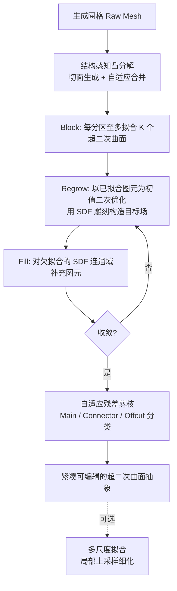

## 一句话总结

Light-SQ 是一个面向生成式网格的结构感知超二次曲面（superquadric）形状抽象框架，通过 SDF 雕刻、结构感知对齐与自适应残差剪枝，把过度密集、结构混乱的生成网格压缩为紧凑、低重叠、可编辑的图元表示。

## 研究背景

在用户生成内容（UGC）平台上，非专业用户越来越依赖图像到 3D 的生成模型来创建 3D 资产。但这些生成网格通常过度镶嵌、结构无序、难以编辑，给动画、绑定、交互式内容创作等下游任务带来困难。

基于图元的形状抽象是一条有希望的路径：把庞大的三角网格转成一组紧凑的解析图元，既能把存储从 MB 级降到 KB 级，又能让每个图元成为直观的操作把手。作者指出，面向 UGC 的理想抽象需要同时满足保真度与可编辑性，而可编辑性又依赖三条结构感知准则：低重叠（每个图元占据清晰、互不重叠的空间区域）、结构感知（图元贴合连贯的体积分区，不跨结构放置）、紧凑性（避免过度碎片化）。

现有方法难以兼顾这些要求：学习式方法在 ShapeNet 等干净数据外泛化差；规则式方法依赖分割，而生成网格的分割往往含噪、边界不可靠；优化式方法虽表达力强，却常产生大量高度重叠的图元，破坏了空间归属的清晰性，从而损害可编辑性。

## 方法

Light-SQ 以截断有符号距离场（TSDF）为拟合目标，沿用 Marching Primitives 的思路，但从低重叠、结构感知对齐、紧凑性三个方面显式强调结构感知，并额外支持多尺度拟合。

关键设计：

- SDF 雕刻（低重叠）。作者放松了单个超二次曲面优化中的惩罚权重形式，把它分解为"内部体素衰减项"与"TSDF 匹配项"，前者远大于后者，从而给外部体素远高于内部的惩罚。基于此，每拟合完一个图元，就把其内部区域从目标形状的内部翻转为外部（记作 $$\phi \setminus \phi_{\theta}$$），阻止后续图元侵占已拟合区域，显式惩罚重叠。

- 结构感知对齐。作者不依赖语义分割，而用几何分析提供结构指导。先在 CoACD 基础上做结构感知凸分解：通过 SDF 体积分析预计算几何上有意义的候选切面（结合横截面积的二阶差分 $$M_i$$ 与连通分量数变化 $$\Delta N_i = \lvert N_i - N_{i-1} \rvert$$ 得到显著性分数 $$S_i$$），再依据曲率连续性与体积 IoU 做自适应合并。随后用 Block-Regrow-Fill 三阶段拟合：Block 对每个凸分区至多拟合 $$K$$ 个图元（作者发现 $$K=1$$ 已足够好），Regrow 让各图元以自身为初值二次优化、在结构边界处形成柔性边界填补缝隙，Fill 再补充欠拟合区域，避免沿轴对齐切面产生杂乱的图元碎片。

- 自适应残差剪枝（紧凑性）。追踪 SDF 更新历史，对 fill 阶段的连通域按几何意义分类为 Main SQ（大部分 SDF 未被触及，属未拟合区域）、Connector SQ（被多个 Main SQ 更新，属桥接部分）、Offcut SQ（仅被单个 Main SQ 更新，属边角残余）。对三类施加递增的剪枝阈值 $$T_M, T_C, T_O$$，若初始图元最小尺度低于对应阈值则丢弃，从而在保留有意义的小结构（如飞机螺旋桨）的同时删除无意义的大碎片。

此外，多尺度拟合可对某个超二次曲面覆盖的区域做"轴对齐膨胀"后网格重采样，再沿各轴细分并分别拟合，实现局部上采样与细节细化，这是先前方法所缺乏的能力。

## 实验结果

作者构建 3DGen-Prim 基准（在 3DGen-Bench 的 510 张图像提示上，用 Hunyuan3D-2.0 与 TripoSG 两个图像到 3D 方法生成测试网格），从拟合保真（CD、EMD、Voxel-IoU）与可编辑性（重叠率 OR、平均图元数 N）两方面评测。主结果如下：

| 方法 | 类型 | CD ↓ (H3D) | EMD ↓ (H3D) | Voxel-IoU ↑ (H3D) | OR ↓ (H3D) | N (H3D) | CD ↓ (Tripo) | Voxel-IoU ↑ (Tripo) | OR ↓ (Tripo) |
|---|---|---|---|---|---|---|---|---|---|
| EMS | Optim. | 0.2345 | 0.2036 | 0.466 | 1.524 | 3.44 | 0.2472 | 0.436 | 1.540 |
| Marching-Primitives | Optim. | 0.0396 | 0.0544 | 0.868 | 4.201 | 67.7 | 0.0403 | 0.860 | 3.778 |
| AISSR | Rule | 0.1128 | 0.0918 | 0.403 | 1.051 | 7.94 | 0.1132 | 0.394 | 1.056 |
| PrimitiveAnything | Learn. | 0.1366 | 0.0986 | 0.442 | 1.845 | 82.7 | 0.1299 | 0.457 | 1.870 |
| Light-SQ（本文） | Optim. | 0.0388 | 0.0531 | 0.861 | 1.015 | 61.0 | 0.0385 | 0.864 | 1.016 |

Light-SQ 的拟合质量与 Marching-Primitives 相当（甚至 CD 略优），但重叠率 OR 从后者的约 4.2 降到约 1.015，接近"每个体素只被一个图元覆盖"的理想状态，同时显著优于规则式与学习式方法。效率上，单 GPU 工作站上每个形状约 25.98 秒，比 Marching-Primitives（339.59 秒）快 10 倍以上，并略快于 PrimitiveAnything（29.10 秒）。用户研究（25 名游戏开发工程师与美术参与者）中，Light-SQ 在几何/纹理可编辑性、编辑效率、动画友好性五项指标上平均排名均接近 1，全面领先。

## 亮点与局限

亮点：

- 首个正式定义并显式强调"结构感知"的超二次曲面优化算法，把低重叠、结构对齐、紧凑性三条准则落到具体机制上。
- SDF 雕刻以简单的体积翻转显式抑制图元重叠，在几乎不损失拟合精度的前提下把重叠率压到接近 1。
- Block-Regrow-Fill 在轴对齐凸分区的硬边界与超二次曲面的柔性拟合之间取得平衡，消融显示比"每个凸包拟合单一图元"的朴素方案精度显著更高。
- 速度比同类 TSDF 优化方法快一个数量级，配合多尺度拟合支持局部细化，适合 UGC 的图像到图元流水线。

局限：

- 方法不保证零重叠，只是显著降低；重叠率与图元数存在权衡（更低的 w、更高的 C 会降低 OR 但增加碎片化）。
- 依赖生成网格具有良好的水密性（评测用的 Hunyuan3D-2.0 与 TripoSG 输出自 SDF/占据场），对非水密或强噪声输入的稳健性未充分讨论。
- 结构感知对齐的效果较难量化，主要靠用户研究佐证；凸分解与合并引入若干需调的超参数（如 α、β、γ、阈值等）。

## 延伸思考

这项工作把"可编辑性"从模糊的直觉拆解为可操作的三条准则，并用几何优化而非语义学习去满足它们，避免了对高质量分割数据的依赖，这一思路对生成资产的后处理很有启发。一个自然的问题是：当图像到 3D 生成质量继续提升、网格更规整时，结构感知凸分解与学习式图元预测（如 PrimitiveAnything）能否互补——用学习方法提供初始结构先验，再用 Light-SQ 的优化机制保证低重叠与紧凑性。此外，超二次曲面之外，是否能把 SDF 雕刻与残差分类的思想推广到凸多面体、广义柱体等更丰富的图元库，从而在保真与可编辑性间提供更细的权衡，也值得探索。
