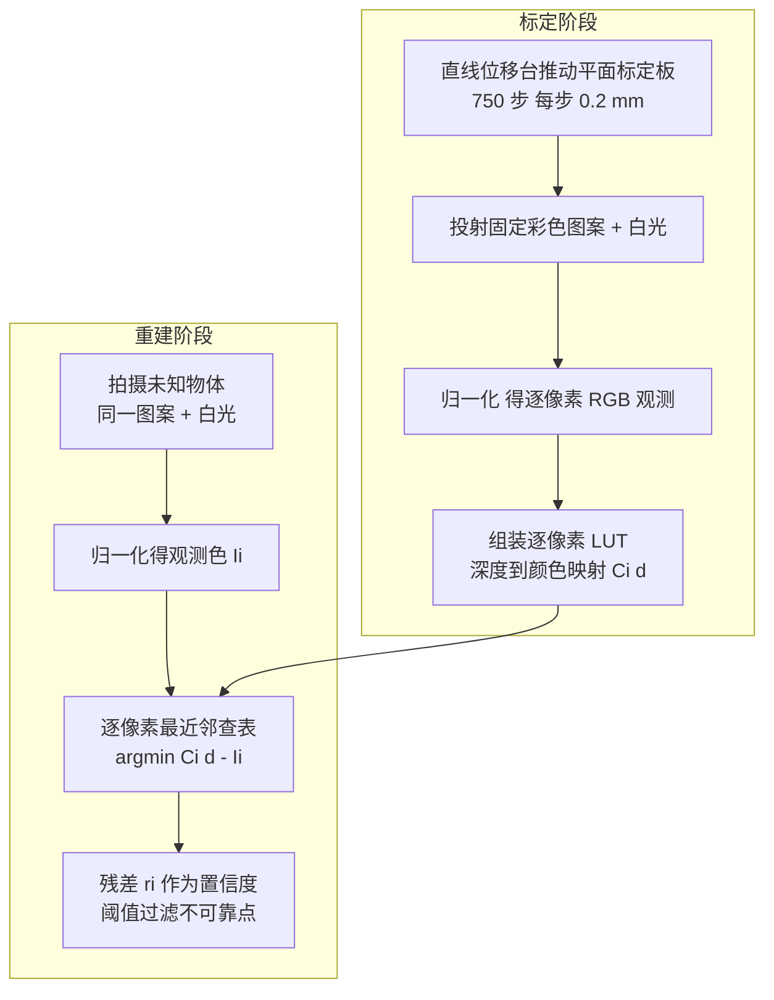

## 一句话总结

LookUp3D 用逐像素"颜色到深度"查找表（LUT）替代结构光中的投影仪标定与三角化，实现了在受控光照下 1 兆像素 450 fps（或 0.4 兆像素 1450 fps）的高速、高分辨率、高精度 3D 扫描。

## 研究背景

结构光（Structured Light, SL）是高分辨率非接触 3D 扫描的主流方案，通过标定好的投影仪-相机对投射时变图案，借助极线约束与三角化建立像素对应并恢复几何。经过六十年发展，SL 仍受两个根本限制：

- 精度上限由三角化决定，而三角化又受投影仪-相机标定质量的制约；低质量投影仪（如廉价 LCD 投影仪）的光学畸变难以建模，重建质量急剧下降。
- 速度上限由每次扫描需投射并解码多张图案决定，限制了动态场景的时间分辨率。此外 DLP 投影仪只有在二值模式下才有千赫兹刷新率，8-bit/24-bit 彩色投射帧率远低于此。

作者由此提出：能否绕开投影仪建模与三角化，直接从观测颜色查表得到深度？

## 方法

LookUp3D 把投影仪当作普通光源而非精确编码器，核心是为每个相机像素 $$i$$ 预先记录一张深度到颜色的映射 $$C_i(d): \mathbb{R}^+ \to \mathbb{R}^3$$。标定阶段用直线位移台扫过一块平面标定板建表；重建阶段只需拍摄图案图与白光参考图，逐像素查表即可得到深度。

关键设计：

- **逐像素 LUT 与并行查表重建。** 深度由 $$d_i^* = \arg\min_{d \in \mathcal{D}} \lVert C_i(d) - I_i \rVert_2$$ 直接检索得到，是天然可大规模并行的操作。透镜畸变、传感器缺陷、投影仪内外参等全部隐式"烘焙"进 LUT，因而对投影仪光学质量与对齐误差高度鲁棒。
- **归一化消除干扰因素。** 用图案图 $$I_P$$、白光图 $$I_W$$、环境图 $$I_B$$ 计算归一化色 $$I = \frac{I_P - I_B}{I_W - I_B}$$，抑制反照率、渐晕、纹理等干扰；动态场景中省去环境图采集，代价是有效帧率减半。
- **置信度残差。** 残差 $$r_i = \lVert C_i(d_i^*) - I_i \rVert_2$$ 衡量观测色与标定色的一致性，高残差强烈指示重建失败，可阈值过滤，利于物理属性推断等下游任务。
- **动态场景增强。** 针对短曝光高噪声，采用低秩近似等方法对 LUT 去噪（存储由 7GB 降至 152MB）；并用由粗到细搜索（C2F）与时序一致性（TC）在挑战性形变下消歧候选深度。
- **模拟投影仪原型。** 为突破商用投影仪帧率/位深的取舍，自制模拟投影仪：两只 100W LED 经 45 度分束镜交替投射"胶片彩色图案"与白光，配微控制器在千赫兹以上精确同步，从而实现高速捕获。

## 实验结果

静态设置下，将 LookUp3D（LU3D）与传统 44 张 Gray Code 结构光对比，报告重建点云相对真值几何的误差（mm）。在高质量 DLP 投影仪上二者相当，而在廉价 LCD 投影仪上传统方法因三角化标定失败而崩溃，LookUp3D 依然稳健：

| 方法 | 通道数 | DLP-Bunny | DLP-Pawn | DLP-Plane | LCD-Bunny | LCD-Pawn | LCD-Plane |
|------|--------|-----------|----------|-----------|-----------|----------|-----------|
| 传统 SL | 44 | 0.96 | 1.12 | 0.17 | 47.07 | 67.07 | 1.81 |
| LU3D | 3 | 1.46 | 1.86 | 0.42 | 3.02 | 1.42 | 0.42 |
| LU3D | 6 | 1.12 | 0.73 | 0.17 | 2.31 | 0.86 | 0.38 |
| LU3D | 9 | 1.03 | 0.34 | 0.13 | 2.01 | 0.63 | 0.34 |

动态验证中，以 450 fps 重建自由下落的硅胶兔子，从 20 帧点云质心拟合恢复重力加速度 9.60 m/s²（真值 9.80，相对误差约 2%）；直线台上兔子平移恢复距离 31.52 mm（真值 31.31 mm，误差 0.9%）。还通过弹球在多种材料上的弹跳恢复半径、重力加速度与恢复系数，验证了物理属性推断能力。

## 亮点与局限

亮点：

- 首个绕开投影仪建模的纯数据驱动 SL 方法，把 LUT 从"标定辅助"提升为"深度推断主机制"，对低质量光学器件鲁棒。
- 首次实现 1 兆像素 450 fps / 0.4 兆像素 1450 fps 的高速高分辨率扫描，精度足以恢复重力、速度、恢复系数等物理量。
- 自制开源模拟投影仪，绕开商用投影仪的帧率-位深取舍；查表天然并行且自带置信度度量。

局限：

- 需要电动直线位移台完成标定，且 LUT 占用较大存储与运行时内存（虽为一次性/摊销成本）。
- 依赖受控光照环境；动态场景因省去环境图采集导致有效帧率减半，且对传感器噪声更敏感，需额外去噪与消歧策略。
- 高速原型中最难复现的是胶片图案制作环节。

## 延伸思考

将重建的"精确编码投影仪"替换为"数据记录"这一思路，本质是用存储与标定采样换取模型简化与鲁棒性，与近年神经场、隐式表征"以数据拟合取代解析建模"的趋势一致。它提示我们：当器件标定成为精度瓶颈时，直接测量端到端映射可能比追求更精确的参数化模型更划算。后续值得关注的是如何降低标定/存储开销（如更强的 LUT 压缩或自监督在线更新）、放宽受控光照约束，以及把高速点云与物理仿真、机器人操控闭环结合，用于逆向设计与接触动力学验证。
