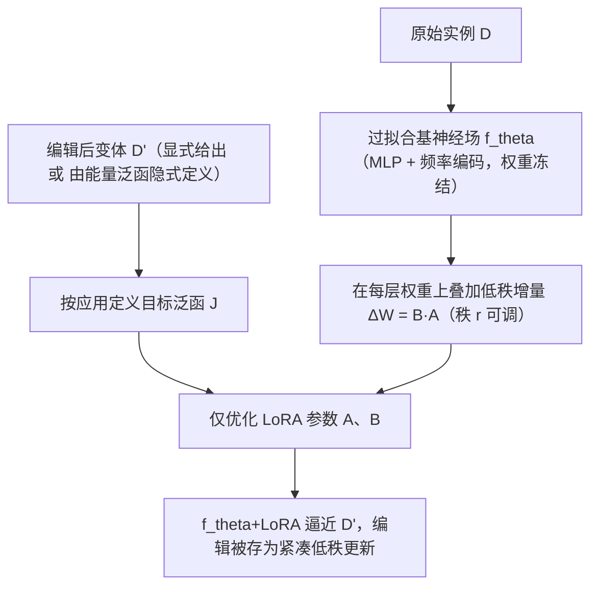

## 一句话总结

本文把大模型领域的低秩适配（LoRA）搬到"实例级神经场"上：对一个已经过拟合到单张图像 / 单个 SDF 的小型 MLP，用低秩的可训练增量去编码"编辑后"的变化，从而以比全量微调少 7~8 倍的参数量，紧凑地表示图像滤波、几何变形、视频压缩、能量最小化等一系列小改动。

## 研究背景

- 领域现状：神经场（coordinate-based MLP）已成为图像、SDF、NeRF、物理仿真等视觉计算任务中一种灵活的数据表示，具有连续、可微、紧凑、易查询等优点。
- 核心痛点：图形处理中大量任务本质是"在原始信号上做小改动"（图像局部滤波、曲面平滑 / 锐化、视频相邻帧差异等）。经典表示对此早有高效手段（法线贴图存位移、视频编码存 P 帧偏移），但如何紧凑地编码"对神经场的小改动"却鲜有研究。直接编辑神经场很难，因为权重变化与输出变化之间高度非线性；已有针对 NeRF / 神经 SDF 的编辑方法往往内存占用大、训练流程复杂，且常绑定特定架构或只能改特定属性（如颜色）。
- 本文 idea：作者的关键观察是——对神经场表示函数的典型编辑（滤波、局部修改）对应底层数据分布的小幅偏移，这正是参数高效微调擅长的场景。一个启发式实验显示：全量微调后的权重差 $$W_{\text{fine-tuned}} - W_{\text{base}}$$ 在考虑各层输入分布后，用低秩分解就能以很小误差近似。于是与其事后分解，不如直接用 LoRA 学出这个低秩增量。与以往在大型预训练模型（LLM、扩散模型）上用 LoRA 不同，本文把 LoRA 用在无需大规模预训练的实例级小网络上。

## 方法

整体框架：输入是一个表示原始实例 $$D$$ 的神经场 $$f_\theta$$（如一张图像或一个 SDF），以及一个编辑后的变体 $$D'$$（可显式给出，也可由能量最小化问题隐式定义）。方法冻结基模型权重 $$\theta$$，在每个权重矩阵上叠加一个可训练的低秩适配器，优化后得到 $$f_{\theta+\text{LoRA}}$$ 来逼近 $$D'$$，从而把"从 $$D$$ 到 $$D'$$ 的编辑"编码为一份轻量低秩更新。

关键设计：

- 低秩增量参数化：对基模型权重矩阵 $$W_i \in \mathbb{R}^{d_{out}\times d_{in}}$$ 保持冻结，只学增量 $$\Delta W_i := B_i A_i$$，其中 $$A_i \in \mathbb{R}^{r\times d_{in}}$$、$$B_i \in \mathbb{R}^{d_{out}\times r}$$，秩最多为 $$r$$。一个秩 $$r$$ 的 LoRA 只需 $$r(d_{in}+d_{out})$$ 个参数，远少于全量微调的 $$d_{in}\times d_{out}$$；当 $$r$$ 取到 $$\min\lbrace d_{in}, d_{out}\rbrace$$ 时退化为全量微调，因而可在存储与表达力之间连续调节。
- 统一的优化目标：所有应用都归结为对 LoRA 参数求解 $$\min_{\lbrace A_i\rbrace,\lbrace B_i\rbrace} J(f_{\theta+\text{LoRA}}, D, D')$$。图像用相对 $$L_2$$ 损失；SDF 用平均绝对百分比误差（MAPE）；能量最小化则在数据保真项外加一个用户定义的能量泛函 $$E$$（如总变差 $$E_{TV}(f,x) := \lVert \nabla_x f(x)\rVert_2$$），此时 $$D'$$ 只由能量泛函隐式刻画。
- 序列化编码：对视频 / 动画等大变化，把它拆成一串小帧。先对第 1 帧过拟合基网络，之后每帧训练一个 LoRA 承接前一帧的更新并冻结，第 $$k$$ 帧即对基模型的秩 $$r(k-1)$$ 更新；也可对静止基模型并行地为每帧独立训练 LoRA。
- 实现要点：基模型为标准 MLP（SDF/图像/视频分别用 4/5/6 隐层，宽度 256）加频率编码与 ReLU；$$A_i$$ 用 $$\mathcal{N}(0, 1/d_{in})$$ 初始化、$$B_i$$ 初始化为 0，增量按 $$1/r$$ 缩放。LoRA 可用比全量微调更大的学习率（$$5\times10^{-3}$$ 对 $$10^{-4}$$）而不发散。

## 实验结果

在图像变体与几何变形上，LoRA 用远少的参数即可逼近全量微调（FT）的重建质量。以 SDF 变形为例（IoU，越高越好，默认秩 $$r=16$$）：

| 形状 | $$r=1$$ | $$r=8$$ | $$r=16$$ | $$r=64$$ | 全量微调 FT |
| --- | --- | --- | --- | --- | --- |
| 参数占 FT 比例 | 0.9% | 7.0% | 13.8% | 51.9% | 100% |
| Penguin | 0.922 | 0.993 | 0.996 | 0.998 | 0.998 |
| Horse | 0.870 | 0.976 | 0.989 | 0.992 | 0.997 |
| Armadillo | — | — | — | — | 0.997 |

结果显示重建质量随秩单调提升，$$r\geq16$$ 时基本追平全量微调，同时省下约 85~90% 的参数；即便 $$r=1$$（参数减少约 99%）多数变形仍可辨认。图像任务中 LoRA 相比截断 SVD / 加权 SVD 的事后分解基线在各秩上 PSNR 高出约 10 dB；在相同参数预算下也优于从头训练的小 MLP 约 1.9 dB。

## 亮点与局限

- 亮点：把 LLM 领域成熟的 LoRA 迁移到实例级神经场，无需大规模预训练模型即可获得轻量、可控的编辑增量；统一框架覆盖图像滤波、几何变形、视频压缩、能量最小化四类任务，通用性强；在存储与表达力之间提供可预测、可调的连续权衡，低秩、大变化下误差优雅退化且集中在实际被编辑区域。
- 局限：训练速度受限于基模型规模——LoRA 优化每步仍要对整个基模型反向传播，反向占主导，作者未优化的实现每步并不比全量微调快（两者约 5 分钟得到可用结果，完全收敛需 20~30 分钟）；当 $$D$$ 与 $$D'$$ 差异过大、基模型不再提供有意义初始化时，LoRA 适配效果明显变差；方法仅限标准 MLP 神经场，未涵盖带辅助结构（特征网格等）的混合架构。

## 延伸思考

- 论文明确把"时间高效的 LoRA 更新"列为未来方向：既然瓶颈在于每步都要穿过整个基模型反传，是否可借助梯度检查点、部分层冻结、或对基模型做低秩/稀疏近似来削减反向成本，让 LoRA 在神经场上兼具存储与时间双重效率。
- 序列化 LoRA 在长视频上误差不显著累积，这提示一种"神经场版 P 帧"编码思路；若能引入关键帧（I 帧）+ 增量帧（LoRA）的分层结构，或结合可变秩自适应分配，可能进一步提升长序列的压缩率与随机访问能力。
- 低秩增量对"编辑区域局部化"的良好表现，暗示 LoRA 权重本身或许可作为一种可解释的"编辑签名"，用于编辑检索、编辑合成（多个 LoRA 叠加）或神经场版本管理等下游应用。
