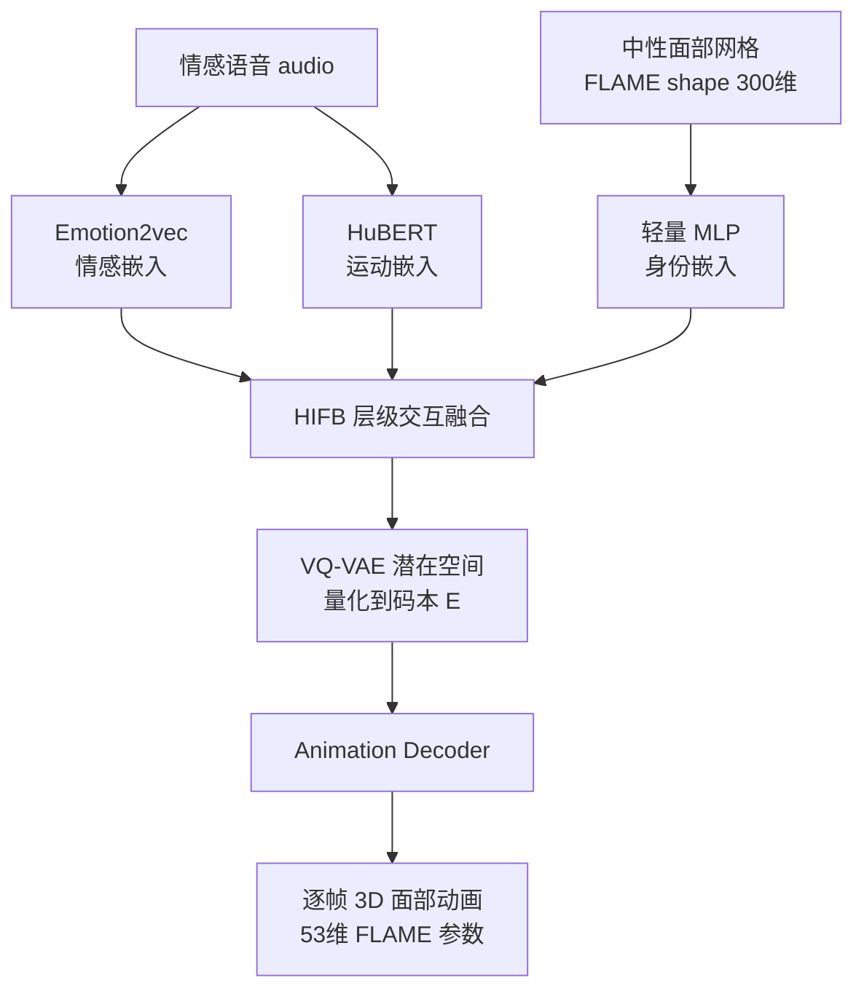

## 一句话总结

LSF-Animation 提出一种"无标签"的语音驱动 3D 面部动画框架，直接从语音中隐式提取情感线索、从中性面部网格中提取身份特征，摆脱了对情感和身份 one-hot 标签的依赖，从而更好地泛化到未见说话人与情感状态。

## 研究背景

语音驱动 3D 面部动画在影视、游戏、XR 数字人等场景有广泛应用，但传统流程依赖昂贵的动捕和大量人工调整。近期基于深度学习的方法虽然能端到端合成面部运动，却存在两个核心痛点：

- 情感与身份控制依赖显式的 one-hot 标签（如 ProbTalk3D、EmoTalk、EMOTE），这限制了模型对未见说话人和未标注情感的泛化能力。
- 语音本身携带的情感线索常被忽略，导致生成动画的自然度和适应性受限；同时很多方法需要"相同内容、不同情感"的配对音频，现实中难以获取。

作者的目标是构建一个完全不依赖人工标签的框架，让情感从语音中自然涌现、身份从中性网格中获取。

## 方法

整体框架由两部分组成：Speech-Aware Identity-Emotion Encoder（SIE-Encoder）与 Animation Decoder。SIE-Encoder 从语音中隐式提取情感、运动特征，从中性 FLAME 网格中提取身份特征，并通过层级交互融合模块（HIFB）融合；融合结果投影到 VQ-VAE 学到的离散潜在空间，再由解码器逐帧重建 53 维 FLAME 参数（50 维表情系数 + 3 维下颌旋转）。

关键设计：

- **隐式情感表征**：基于自监督的 Emotion2vec 提取帧级情感嵌入（50Hz，每帧 768 维连续向量），替代 one-hot 情感标签，保留细粒度的情感时序变化，避免中间的情感分类步骤。
- **隐式身份表征**：将中性 FLAME shape 参数 $$T_{neutral} \in \mathbb{R}^{300}$$ 输入轻量 MLP 得到身份特征 $$z_{id} = F_{id}(T_{neutral})$$，相比高维网格更结构化、更低维，且无需身份标签，提升对未见说话人的泛化。
- **层级交互融合块（HIFB）**：先用身份向量对情感、运动特征做逐元素调制（$$\tilde{m}_{1:T}=W_m m_{1:T}\odot s_{id}$$，$$\tilde{e}_{1:T}=W_e e_{1:T}\odot s_{id}$$）；随后引入可学习的 fusion token，在 $$L$$ 层中通过双向交互不断更新——每层将 fusion token 分别与运动、情感流拼接送入各自 Transformer，再对运动与情感特征做笛卡尔积后经交叉注意力更新 fusion token，从而密集捕获跨模态的时序依赖。这种渐进式双向融合显著改善了上半脸（眉、额）动态的稳定性与表现力。
- **两阶段训练**：第一阶段训练 VQ-VAE 运动自编码器学习离散码本；第二阶段训练 SIE-Encoder，从音频和中性网格预测潜在运动表征并解码，实现运动生成与身份/情感表征学习的解耦。

## 实验结果

在 3DMEAD 数据集（47 位说话人、8 种情感）上采用 subject-level 划分（每个身份只出现在一个子集），以评估对未见说话人的泛化能力。下表为与 SOTA 方法的定量对比（↓越低越好，↑越高越好）：

| Model | MVE ↓ | LVE ↓ | FDD ↓ | MEE ↓ | CE ↓ | Diversity ↑ |
|---|---|---|---|---|---|---|
| FaceFormer | 2.6139 | 2.3471 | 1.6145 | – | – | – |
| CodeTalker | 2.2207 | 2.1045 | 3.0540 | – | – | – |
| EMOTE | 1.3395 | 1.2936 | 0.7327 | 1.2101 | 1.0544 | – |
| FaceDiffuser (DDPM) | 1.6762 | 1.3463 | 1.7015 | 1.3463 | 1.3462 | 0.0005 |
| FaceDiffuser (DDIM) | 1.5901 | 1.1315 | 0.8243 | 1.0615 | 1.0610 | 0.0144 |
| ProbTalk3D | 1.2933 | 1.2708 | 0.4845 | 1.1852 | 1.0691 | 0.4310 |
| **LSF-Animation (Ours)** | **1.2244** | **1.0985** | **0.4724** | **1.0177** | **0.9225** | 0.4223 |

相比最强基线 ProbTalk3D，LSF-Animation 在 MEE 上提升 14.1%、CE 提升 13.7%、MVE 提升 5.32%、LVE 提升 13.5%、FDD 提升 2.50%；Diversity 略降 2.02%，作者解释这是中性面部先验使生成结果更贴合中性面部运动模式所致。用户研究（61 份有效问卷）显示，其在唇同步、面部真实感、情感表现力三项上均优于 FaceDiffuser 与 ProbTalk3D。

## 亮点与局限

亮点：

- 真正实现完全无标签（label-free）推理：情感来自语音、身份来自中性网格，无需任何人工情感/身份标注，泛化到未见说话人。
- HIFB 的渐进双向融合有效改善了上半脸动态，消融显示其在 FDD 上比交叉注意力融合降低 49.4%、比门控融合降低 38.4%。
- 无需"相同内容、不同情感"的配对音频，更贴近真实场景。

局限：

- Diversity 相比 ProbTalk3D 略有下降。
- 当前仅生成 FLAME 参数层面的几何动画，尚未覆盖带纹理的完整 3D 说话人头；作者将开放域、全纹理说话人头列为未来工作。
- 依赖 3DMEAD（由 2D MEAD 经 DECA/MICA 重建），数据本身的重建质量会影响上限。

## 延伸思考

该工作的核心思路——用自监督预训练模型（Emotion2vec）的连续帧级特征替代离散标签——很可能推广到其他条件生成任务，比如手势生成、全身动作驱动，凡是"标签稀缺但可从原始信号中隐式解耦"的场景都值得借鉴。fusion token + 笛卡尔积交叉注意力的密集融合机制，也为多模态时序对齐提供了一个可复用的组件。另一个值得探讨的方向是：既然情感被隐式编码，如何在推理时对情感强度进行可控编辑，同时保持无标签的优势，这在实际内容创作中会是很实用的能力。
