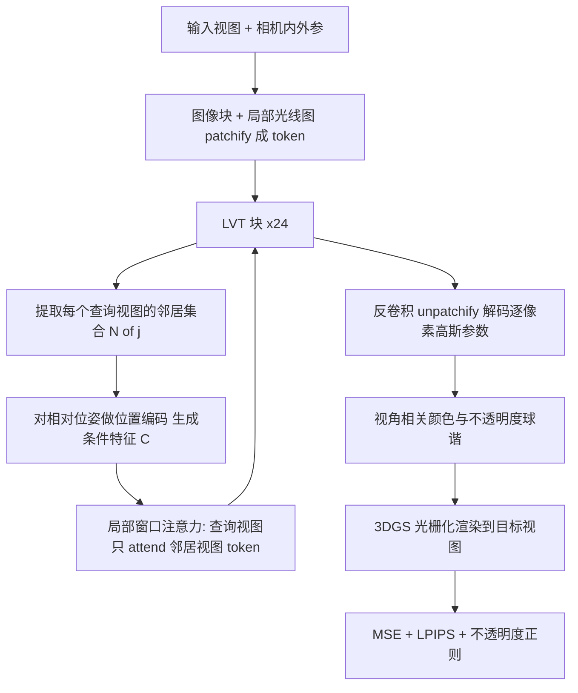

## 一句话总结

提出 Local View Transformer(LVT)——一种把标准 Transformer 的全局二次自注意力替换为"每个视图只与其空间邻近视图做局部注意力"的前馈式大场景重建架构，配合基于相对相机位姿的位置编码与带视角相关不透明度的 3D 高斯泼溅解码，实现单次前向推理即可重建任意大、高分辨率场景，且计算量随输入图像数线性(而非二次)增长。

## 研究背景

Transformer 已成为三维视觉与新视角合成(NVS)的强力工具，但其自注意力对 token 数的二次复杂度使得把这类模型扩展到含大量高分辨率输入视图的真实大场景变得困难。即便有 Flash Attention 等优化，全局自注意力在长序列上仍然昂贵。

现有路线各有短板：

- 逐场景优化方法(如 3DGS)能做到场景级重建，但需要数千步测试时梯度优化，且不学习跨场景可迁移的先验，容易过拟合、需要稠密输入或额外正则。
- 大重建模型(LRM)从极稀疏输入(常 1–4 张、几乎无重叠)就能出色重建，但受制于注意力的二次复杂度，只能处理短、低分辨率的采集。
- Long-LRM 用 Mamba2 与 Transformer 混合架构把输入视图数推到 32，但需要启发式的高斯合并与剪枝，牺牲了标准 Transformer 天然的顺序不变性，无法自然泛化到变长序列，还需要相机选择来保持固定输入数。

这凸显了对更可扩展、更鲁棒的可泛化重建方法的需求。作者从卷积神经网络(CNN)获得启发：CNN 用局部滑动窗口取代稠密连接，带来效率、平移不变带来的泛化、以及可处理任意尺寸输入的能力，而堆叠多层又能逐步扩大感受野。LVT 把这种"局部处理"范式引入到 Transformer 的注意力机制中。

## 方法

### 整体框架

给定 $$N_i$$ 张已知内参与位姿的输入图像 $$I=\{I_j\in\mathbb{R}^{H\times W\times 3},K_j,P_j\}$$，LVT 预测像素对齐的 3D 高斯泼溅参数；训练时把这些高斯渲染到 $$N_t$$ 个目标视图并与真值比对，端到端优化。整体结构沿用 GS-LRM：先把图像分块 tokenize，经过若干 Transformer 块，最后由解码块把 token 转成逐像素高斯参数。但每一步都被改造为"相对每个输入视图局部处理、与任意世界坐标系无关"，以获得变换不变性。

### 关键设计 1：局部视图注意力(Local View Attention)

核心洞见是"邻近视图对某一视图的局部场景结构提供的信息最相关"。因此不再计算完整的二次自注意力矩阵，而只在查询视图与其邻居集合 $$\mathcal{N}(j)$$ 之间计算注意力(每个视图也在自己的邻居集内)。堆叠多个 LVT 块会像堆叠 CNN 层那样逐步扩大"视图感受野"，让注意力范围随层数扩展到更多视图。邻居的定义可灵活选择：顺序采集时可取前后视图，一般情形按相机中心距离选最近的 $$w$$ 个。实验中采用相机中心距离来选邻居。

### 关键设计 2：相对位姿条件与变换不变性

为提供变换不变的空间条件信号，不直接使用相机位姿 $$P_j$$，而是用第 $$j$$ 与 $$j'$$ 视图之间的相对位姿 $$P_jP_{j'}^{-1}$$，对相对四元数与平移做位置编码，再经若干残差 MLP 得到条件特征 $$C_{(j,j')}\in\mathbb{R}^d$$。注意力块被改造为只 attend 邻居 token 并注入该条件：

$$Q^{(m,l)}_j=W_qM^{(m,l)}_j$$

$$K^{(m',l)}_{j'}=W_k\big(M^{(m',l)}_{j'}+C^{(l)}_{(j,j')}\big)$$

$$V^{(m',l)}_{j'}=W_v\big(M^{(m',l)}_{j'}+C^{(l)}_{(j,j')}\big)$$

输出为

$$M^{(m,l+1)}_j=\mathrm{softmax}_{j'\in\mathcal{N}(j),\,m'}\!\left(\frac{Q^{(m,l)}_jK^{(m',l)T}_{j'}}{\sqrt{d}}\right)V^{(m',l)}_{j'}$$

由此每个视图内的 token 以该视图自身局部坐标系编码高斯几何，attend 邻居时通过相对变换嵌入把邻居特征"搬"到查询视图坐标系。这类似 RoPE 用相对而非绝对位置，但这里作用于相邻相机之间的相对刚体变换。用相对而非绝对位姿也把学习问题从"所有 key/query 位姿的组合空间"缩小到"两个邻近视图之间相对变换的空间"，简化学习并让短序列训练学到的先验可迁移到任意长序列。

### 关键设计 3：局部光线图 tokenization

与常见 LRM 把像素与 Plücker 光线(同时编码内外参)拼接不同，因 LVT 局部处理、token 无需知道视图在三维空间中的绝对位置，故只用内参 $$K_j$$ 计算归一化的局部光线图 $$R_j$$，与像素拼接后卷积成 token：

$$M_j=\mathrm{Conv}(\mathrm{Concat}([I_j,R_j]))$$

消融显示，用 Plücker(去掉注意力条件)或用世界坐标系的绝对外参都劣于显式计算相对变换的做法。

### 关键设计 4：视角相关不透明度

在把球谐系数用于颜色的基础上，进一步用球谐建模视角相关的不透明度。每个视角相关高斯的颜色与不透明度分别用 $$d_c=3\times(\deg\_SH_{color}+1)^2$$ 与 $$d_o=(\deg\_SH_{\sigma}+1)^2$$ 个通道，球谐在各视图坐标系下计算再变换到世界系渲染。为避免从新视角看时出现虚假不透明度，加入正则项，在单位球面上随机采样方向惩罚不透明度过大：

$$R_{\sigma}=\frac{1}{HWN_i}\sum_{n=1}^{HWN_i}|\sigma(n)\cdot\hat{\mathbf{n}}|$$

作者发现视角相关不透明度能更好地表达薄结构与尖锐边界，尤其在长输入序列上，且因前馈模型的可泛化性不易过拟合。

### 训练目标

总损失为 MSE、感知损失(LPIPS)与不透明度正则的加权组合：

$$\mathcal{L}=\frac{1}{N_t}\sum_{k=1}^{N_t}\Big(\mathrm{MSE}(\hat{T}_k,T_k)+\lambda\cdot\mathrm{Perceptual}(\hat{T}_k,T_k)\Big)+\alpha\cdot R_{\sigma}$$

网络用 24 层 Transformer、隐藏维 1024(MLP 4096)、16 头注意力。先在 480×270 训练 150K 步，再在 960×540 微调 20K 步。为让模型泛化到变长序列，采用多分辨率、多长度数据混合策略：在 240×135 上训练最长序列(40–52 张)，480×270 上最多 24 张，960×540 上 16 张。

## 实验结果

在 DL3DV-140 测试集(960×540)上训练评测，并在 Tanks&Temples、MipNeRF360 上做零样本泛化。指标为 PSNR、SSIM、LPIPS。$$LVT_{base}$$ 无视角相关性，$$LVT_{SH-rgba}$$ 在颜色与不透明度上都用视角相关球谐。

| 模型 | 前馈 | DL3DV PSNR ↑ | DL3DV SSIM ↑ | DL3DV LPIPS ↓ | T&T PSNR ↑ | MipNeRF360 PSNR ↑ |
|---|---|---|---|---|---|---|
| 3DGS(逐场景 30k 步) | 否 | 25.53 | 0.849 | 0.210 | 20.45 | 24.81 |
| Long-LRM | 是 | 24.10 | 0.783 | 0.254 | 18.38 | – |
| $$LVT_{base}$$ | 是 | 23.65 | 0.813 | 0.215 | 18.33 | 21.51 |
| $$LVT_{SH-rgba}$$ | 是 | 27.64 | 0.883 | 0.133 | 21.17 | 24.53 |

主要发现：

- 在 DL3DV 上，$$LVT_{SH-rgba}$$ 在全部指标上超过 Long-LRM 与逐场景优化的 3DGS；相比 Long-LRM 高出约 3.54 dB PSNR，相比 3DGS 高出约 2.11 dB PSNR。
- 零样本泛化：在 Tanks&Temples 上用 66(train)/55(truck)张输入(长于训练序列)，$$LVT_{base}$$ 三项指标即超过 Long-LRM(约 +2.79 dB PSNR)，全模型进一步超过 3DGS(约 +0.72 dB PSNR)。Long-LRM 自报无法泛化到 MipNeRF360，而 LVT 在该数据集上也单次前向超过 3DGS。
- 局部 vs 全局注意力：两者都只在 16 输入上训练，在 12/16/20/32 输入上评测。局部注意力(复杂度 $$O(N)$$)在各序列长度上都不弱于甚至优于全局注意力($$O(N^2)$$)，且随长度增加更鲁棒。作者归因于局部、变换不变的设计使学到的空间推理是模块化的、与全局相机路径无关。
- 设计消融：从初始配置(PSNR 22.02)出发，混合分辨率训练、空间邻居选择、相对位姿条件、视角相关球谐及不透明度正则逐项叠加，全模型达到 PSNR 27.156 / SSIM 0.882 / LPIPS 0.102。其中把条件换成 Plücker(去掉注意力条件)降到 21.81，用世界系绝对位姿降到 21.44，均劣于相对位姿方案，验证了变换不变相对嵌入的价值。

## 亮点与局限

亮点：

- 用"每视图只 attend 空间邻居"的局部注意力替代全局二次自注意力，计算量随输入视图数线性增长，可扩展到远多于以往 Transformer 方法的输入视图数，单次前向重建大场景。
- 基于相对相机位姿的条件编码带来变换不变性，使短序列训练的先验可迁移到长且轨迹各异的推理序列，泛化性强。
- 首次把球谐视角相关性从颜色扩展到不透明度，并配合正则，改善薄结构、尖锐边界与复杂光照下的保真度。
- 类比 CNN 堆叠扩大感受野的思想，为 Transformer 引入局部性提供了清晰、可扩展的设计范式。

局限：

- 当输入序列含大量冗余、重叠视图时，局部注意力可能限制较远但相关视图间的信息交流；更多样的邻居选择或与标准 Transformer 层交错的混合方案或可缓解。
- 逐像素生成高斯在多张高分辨率输入下产生稠密冗余表示，光栅化会成为瓶颈；而视角相关不透明度又使"剔除近透明高斯"的简单加速变复杂。
- 视角相关不透明度在极端纹理区域偶尔产生 popping 伪影，增大正则权重 $$\alpha$$ 可缓解但会牺牲渲染质量，存在权衡。

## 延伸思考

- "局部性 + 相对位姿不变 + 前馈"的组合把 CNN 的成功经验迁移到 3D Transformer，提示在几何/视觉任务里，用相对刚体变换而非绝对坐标做条件，是提升长序列泛化的一条通用杠杆。
- 局部与全局注意力交错的混合架构值得探索：既保留线性扩展与鲁棒性，又补上远距离视图间的长程通信。
- 逐像素稠密高斯的冗余是落地瓶颈，结合已有的大规模 3DGS 高效渲染/剪枝技术，或引入更紧凑的表示，可能把该方法推向更大规模的实时应用。
- 视角相关不透明度作为一个较少被使用的维度，其在前馈可泛化模型中"不易过拟合"的观察，可能启发把更多传统逐场景易过拟合的表达要素迁移到前馈范式中。
