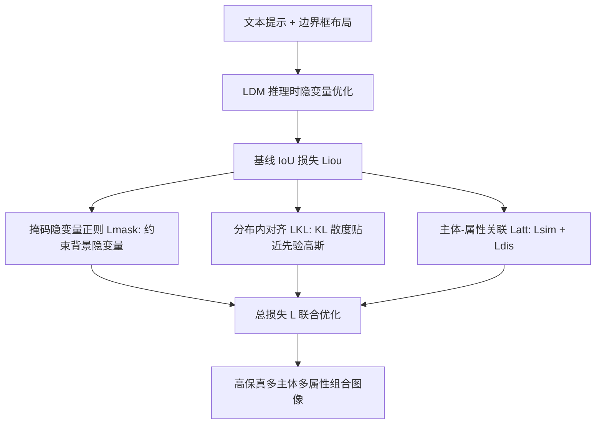

## 一句话总结

本文提出 MALeR（Masked Attribute-aware Latent Regularization），一种免训练的布局引导文生图方法：给定文本提示与对应的边界框布局，通过掩码隐变量正则化、分布内隐变量对齐、以及主体-属性关联损失三项技术，同时解决布局引导生成中的背景语义泄漏、分布外伪影、以及属性绑定错误三大问题，在多主体多属性的复杂场景中生成更准确的图像。

## 研究背景

扩散模型已能从文本提示生成高质量图像，但在处理包含多个主体与属性的复杂提示时仍常失败，典型问题包括：灾难性遗忘（跳过某些主体）、生成多余主体（要一只狗却出现两只）、以及主体-属性关联错误。

为增强用户控制，布局引导方法用边界框、深度图、语义图或涂鸦等空间条件来指定主体位置。其中边界框最直观易用。但这类方法继承了文生图的固有缺陷，并在推理时的隐变量优化中出现新问题：

- 背景语义泄漏：提示（框/文本）中未指定的额外主体出现在指定框之外或附近，且随主体数增加而愈发频繁。
- 分布外图像：优化约束使生成变脆，出现无纹理主体、平铺或开裂等不自然伪影，往往需要几十次随机初始化才能得到一张好图。
- 属性绑定错误：已有方法多依赖交叉注意力损失或相似度度量做属性绑定，但仅能处理一两个主体，在复杂组合中会出现属性跨主体泄漏或主体身份混融。

因此需要一个免训练的布局引导框架，既保证空间对齐，又能在多主体、多属性场景中实现稳健的属性绑定。

## 方法

MALeR 建立在潜在扩散模型（LDM）推理时隐变量优化的框架之上。基础做法是在采样每一步按目标损失的梯度更新隐变量：

$$
z'_t \leftarrow z_t - \alpha_t \cdot \nabla_{z_t} \mathcal{L}
$$

布局引导的基线损失采用交并比（IoU）形式，鼓励主体的交叉/自注意力集中在其边界框内、抑制框外区域。对于主体 token $$s_i$$ 及其框 $$b_i$$：

$$
\mathcal{L}_i = 1 - \frac{\sum \hat{A}_t[b_i]}{\sum \hat{A}_t[b_i] + \gamma \sum \hat{A}_t[\bar{b}_i]}, \quad \mathcal{L}_{iou} = \sum_i \mathcal{L}_i^2
$$

其中 $$\gamma$$ 为提示中的主体数量，用于放大对背景的惩罚。MALeR 在此基线上叠加三项新设计。

### 关键设计 1：掩码隐变量正则化（抑制背景语义泄漏）

作者观察到扩散前几步基本决定了物体布局——主体先出现、细节后补充。虽然已有方法优化隐变量 15 到 25 步，但物体布局其实在前 5 步就已确定，过度优化反而导致分布外图像。

为阻止框外形成主体样式，作者约束背景隐变量贴近其更新前的原值。记 $$z^{ref}_t$$ 为更新前隐变量的分离副本，构造二值掩码 $$M$$（框内为 1，框外为 0），$$\bar{M}$$ 为反转的背景掩码，引入掩码正则项并纳入更新：

$$
\mathcal{L}_{mask} = \left\| (z^{(k)}_t - z^{ref}_t) \odot \bar{M} \right\|_1
$$

$$
z'^{(k+1)}_t \leftarrow z^{(k)}_t - \alpha_t \cdot \nabla_{z_t}(\mathcal{L}_{iou} + \lambda_{mask}\mathcal{L}_{mask})
$$

每个时间步做 $$k$$ 次迭代精化。

### 关键设计 2：分布内隐变量对齐（抑制分布外伪影）

隐变量更新有把 $$z_t$$ 推离典型噪声分布的风险，而框内外更新的不平衡会加剧这一点。由于去噪早期隐变量接近随机噪声分布 $$z_t \sim \mathcal{N}(0, I)$$，作者在前 5 步引入基于 KL 散度的对齐项：

$$
\mathcal{L}_{KL} = D_{KL}\big(\mathcal{N}(\mu_{z_t}, \sigma_{z_t}) \,\|\, \mathcal{N}(0, 1)\big)
$$

$$
\mathcal{L} = \mathcal{L}_{iou} + \lambda_{mask}\mathcal{L}_{mask} + \lambda_{KL}\mathcal{L}_{KL}
$$

它约束了 $$\mathcal{L}_{iou}$$ 与 $$\mathcal{L}_{mask}$$ 在优化早期把隐变量推向分布外的倾向，从而无需多次随机初始化即可得到高保真图像。

### 关键设计 3：布局引导的主体-属性关联

从提示中抽取名词（主体）及其修饰词（属性），提出对注意力的约束：对齐的主体-属性对，其空间交叉注意力模式应相似；不对齐的对则应相异。

设主体 token 集合 $$S = \{s_1, \dots, s_S\}$$、对应框 $$B = \{b_1, \dots, b_S\}$$、属性 token 集合 $$A = \{a_1, \dots, a_S\}$$（无属性时 $$a_i = \emptyset$$，一个主体可对应多个属性 token）。将框区域内的注意力块重归一化为概率分布。

相似性损失用对称 KL 散度衡量配对主体 $$s_i$$ 与属性 $$a_i$$：

$$
\mathcal{L}_{sim}(i) = D_{sym}(A^c_t(s_i)[b_i],\, A^c_t(a_i)[b_i])
$$

$$
D_{sym}(P, Q) = \tfrac{1}{2}D_{KL}(P\|Q) + \tfrac{1}{2}D_{KL}(Q\|P)
$$

仅最小化相似性不足以绑定属性。仿照三元组损失，对错配组合 $$(s_i, b_i, a_j),\, j \neq i$$ 引入相异性损失（负对称 KL）：

$$
\mathcal{L}_{dis}(i, j) = -D_{sym}(A^c_t(s_i)[b_i],\, A^c_t(a_j)[b_i])
$$

属性总损失为 $$\mathcal{L}_{att} = \lambda_{sim}\mathcal{L}_{sim} + \lambda_{dis}\mathcal{L}_{dis}$$。作者强调：布局条件明确指定了主体与属性交叉注意力需相似的确切区域，因而在掩码区域内做匹配比直接对整图注意力做匹配更有效；相异损失则通过最大化各主体与其非对应属性的距离来防止泄漏；且经验上对称 KL 明显优于 JS 散度。

### 最终目标

综合上述各项：

$$
\mathcal{L} = \mathcal{L}_{iou} + \lambda_{mask}\mathcal{L}_{mask} + \lambda_{KL}\mathcal{L}_{KL} + \lambda_{att}\mathcal{L}_{att}
$$

实现细节：$$\lambda_{mask}=0.01$$、$$\lambda_{KL}=5$$、$$\lambda_{sim}=\lambda_{dis}=\lambda_{att}=1$$；$$\mathcal{L}_{mask}$$ 与 $$\mathcal{L}_{KL}$$ 用于前 5 个去噪步，$$\mathcal{L}_{att}$$ 用于 50 步中的前 18 步；每个应用损失的去噪步做 $$k=5$$ 次梯度下降；步长 $$\alpha$$ 从 30 线性降到 8。方法在 SD-1.5 与 SDXL 两种骨干上均可运行。

## 实验结果

在 DrawBench（空间、颜色、计数）与 HRS（空间、颜色、尺寸）两个基准上，与 GLIGEN、Attention Refocusing、BoxDiff、Layout Guidance、ReCo、R&B、Bounded Attention（BA，等价于仅用 $$\mathcal{L}_{iou}$$）共七个方法对比。所有方法用相同随机种子以保证公平。

除 HRS 尺寸任务外，MALeR 取得最佳表现。主要结果（准确率 Acc，计数用 P/R/F1）：

| Method | Base | DrawBench 空间 | DrawBench 颜色 | DrawBench F1 | HRS 空间 | HRS 颜色 | HRS 尺寸 |
| --- | --- | --- | --- | --- | --- | --- | --- |
| GLIGEN | SD1.4 | 0.75 | 0.12 | 0.77 | 27.7 | 15.8 | 66.5 |
| ReCo | SD1.4* | 0.70 | 0.19 | 0.84 | 25.9 | 20.0 | 75.5 |
| AttnRef. | SD1.4 | 0.74 | 0.31 | 0.79 | 32.0 | 31.3 | 72.5 |
| LGuidance | SD1.5 | 0.65 | 0.31 | 0.79 | 15.9 | 17.4 | 60.5 |
| R&B | SD1.5 | 0.68 | 0.35 | 0.88 | 34.0 | 34.3 | 77.8 |
| BoxDiff | SD2.1 | 0.66 | 0.26 | 0.84 | 21.0 | 1.9 | 74.9 |
| BoundAttn | SD1.5 | 0.68 | 0.34 | 0.84 | 30.9 | 33.0 | 57.5 |
| MALeR | SD1.5 | 0.78 | 0.42 | 0.85 | 31.8 | 40.4 | 56.3 |
| BoundAttn | SDXL | 0.69 | 0.44 | 0.83 | 33.9 | 37.5 | 64.7 |
| MALeR | SDXL | 0.81 | 0.61 | 0.88 | 37.7 | 41.3 | 59.9 |

关键提升：空间提示上 MALeR 在 DrawBench 较最强基线 GLIGEN 提升 +6.0%、在 HRS 较 R&B 提升 +3.7%；颜色提示提升更明显，DrawBench +17%、HRS +3.8%；计数 F1 达 0.88，与此前最佳 R&B 持平并优于其余。相较同骨干（SDXL）的最近基线 BA，MALeR 全面显著领先。作者也指出 HRS 尺寸任务表现偏低，部分源于自动生成的引导框存在不准确、混淆的宽高比。

感知质量方面，在 DrawBench 上对 Vanilla SDXL、BA、MALeR 计算 FID，三者相当（161.03 / 164.59 / 163.02），MALeR 略优于 BA、与 SDXL 相当，说明约束带来的组合精度提升并未牺牲感知保真度。

用户研究：第一项平均人类排序（4 个挑战性提示、10 个种子、2 方法共 400 个评分，1-5 分李克特量表），MALeR 均分 3.13 全面高于 BA 的 2.15。第二项错误类型分析中，MALeR 在背景语义泄漏（BSL）、分布外（OOD）、属性泄漏（AL）、其他错误（OE）四类的出现比例均低于 BA，相对改善分别为 +46%、+25%、+32%、+43%。

消融实验（DrawBench）：单加掩码正则会使性能下降（因隐变量漂离先验分布），单加 KL 对齐带来小幅一致提升，二者合用达到最佳（同时抑制泄漏并稳定优化）；再加入属性损失使颜色准确率显著提升（0.47→0.61）。定性上，仅用相似或仅用相异损失都无法解决属性泄漏，只有完整的相似+相异组合才能得到正确的主体身份与准确的属性绑定。

## 亮点与局限

亮点：
- 免训练、可直接套用于 SD-1.5 / SDXL，无需额外模块或微调即可增强布局控制。
- 系统性地把布局引导生成的三大顽疾（背景语义泄漏、分布外伪影、属性绑定错误）拆解为三项针对性损失，逐一对症。
- 掩码化的主体-属性相似/相异损失支持"每个主体多个属性"的复杂组合，突破了此前方法仅能处理一两个主体的限制。
- 使用相同随机种子进行公平对比，并辅以 FID、双用户研究与逐项消融，结论可复现、可信度高。

局限：
- 性能受限于底层 SDXL 的生成能力，SDXL 本身失效时结果也会次优。
- 对部分重叠的边界框表现尚可，但对完全重叠的框可能无法遵循布局。
- 自动生成布局带来的非典型宽高比框较难处理（如 HRS 尺寸任务），不过在真实用户交互中较少见。

## 延伸思考

MALeR 的核心价值在于用"约束早期隐变量优化"这一低成本、免训练的手段，把布局引导生成的多个失败模式归因到隐变量漂移与注意力错配，并给出解耦而互补的解法。特别值得注意的是三点观察：布局在去噪前 5 步就已确定、过度优化导致分布外、以及掩码区域内做属性匹配远比全图匹配有效——这些都指向一个更一般的启发：推理时的引导应当"精准且克制"，在正确的时间窗口、正确的空间区域施加正则，而非全程强推。完全重叠框的失败与对底层模型能力的依赖，则提示未来可结合更强的骨干（如 rectified flow / DiT 类模型）与显式的遮挡/深度推理来进一步提升复杂场景的鲁棒性。
