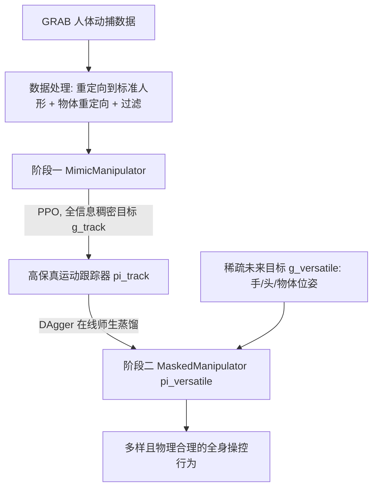

## 一句话总结

通过"先训练全信息运动跟踪器、再蒸馏成稀疏目标条件生成策略"的两阶段学习，让物理仿真人形角色能从稀疏的时空目标（如手部位姿、物体目标位置）出发，生成多样且物理合理的全身操控（loco-manipulation）行为。

## 研究背景

生成既能全身移动又能灵巧操控物体的可控人形智能体，是角色动画与机器人共同面临的挑战。核心矛盾在于：**任务的多样性**要求控制器理解抽象、欠定义的用户意图（如"把杯子放到这里"这类稀疏目标，其解空间极大）；而**操控的精确性**又要求毫米级的接触控制，抓取、重定位、放置中的微小偏差都可能导致物体掉落或任务失败且难以恢复。

已有方法通常只擅长其中一端：要么专注复杂灵巧操控，要么专注多样化的身体控制（如基于目标条件的 MaskedMimic）。像 OmniGrasp 这类依赖稠密奖励与场景无关先验的方法，受限于短时程目标，难以完成"把物体搬到目标位置"这类长时程、灵巧的目标条件任务。如何在一个统一框架里同时支持身体与物体目标、并优雅平衡"灵活性—精确性"权衡，仍是开放问题。

## 方法

### 整体框架

本文提出两阶段框架。第一阶段 MimicManipulator 在**全可观测**设定下用强化学习训练一个高保真运动跟踪器，从人体动捕数据（GRAB 数据集）恢复出低层动作命令并物理重建灵巧的人—物交互序列。第二阶段将这个专家跟踪器的交互知识**蒸馏**成 MaskedManipulator：一个仅依赖当前状态与稀疏未来目标的生成式控制策略，把控制问题构造为"物理版的运动补全（inpainting）"。

### 关键设计

- **分阶段接触奖励（Phased Contact Reward）**：把交互拆成"接近—接触维持—释放"三阶段。接近段引导末端执行器沿参考轨迹平滑靠近物体表面（惩罚距离与表面法向差异）；维持段鼓励稳定接触、抑制过早脱离；释放段引导受控且及时地脱手。跟踪总奖励采用**乘积式**设计 $$R_{track}=r_{pose}\cdot r_{contact}\cdot r_{energy}\cdot r_{interaction}$$，强制角色在长序列的所有环节都达标。

- **紧致的早停与优先训练**：任一身体部位偏离参考 $$>25\,\text{cm}$$、物体偏离 $$>10\,\text{cm}$$、或接触阶段连续 10 帧意外失接触即终止回合，形成"可行性包络"。同时周期性评估并**过采样失败序列**，应对不同物体与交互难度的巨大差异。消融显示紧致早停带来的提升最显著。

- **物体重定向解决形态差异**：先把源动作的局部自由度旋转迁移到标准 SMPL-X 人形，再基于原始接触数据重定向物体全局位置，以保持交互一致性；无法物理重建的复杂双手交互等序列被过滤。最终得到 1007 条训练序列、141 条测试序列。

- **蒸馏与多模态策略架构**：用 DAgger 在线蒸馏，学生策略只看稀疏掩码目标 $$g^{versatile}_t$$，教师看稠密目标，目标是最小化 $$\mathcal{L}_{distill}=-\log \pi_{versatile}\!\left(a^{track}_t \mid s_t, g^{versatile}_t\right)$$。采用 Transformer 处理可变数量的目标 token。因稀疏目标存在多解，作者对比了确定性、C-VAE（带学习先验）与扩散（Diffusion）三种策略架构，后两者显式建模解的多模态性。

## 实验结果

在 ProtoMotions + IsaacLab 仿真（120 FPS 仿真、有效控制 30 FPS）中评测。第一阶段 MimicManipulator 的消融与对比如下（关注序列成功率、首次交互成功率、MPJPE、跟踪时长）：

| 方法 | 训练集序列成功率 | 训练集首交互成功率 | 训练集 MPJPE (mm) | 测试集序列成功率 | 测试集首交互成功率 | 测试集 MPJPE (mm) |
| --- | --- | --- | --- | --- | --- | --- |
| MimicManipulator（本文） | 80.7% | 93.5% | 9.8 | 60.2% | 83.7% | 13.2 |
| (-) 紧致早停 | 74.6% | 91.2% | 15.3 | 51.8% | 80.1% | 22.8 |
| (-) 优先训练 | 71.2% | 89.3% | 15.5 | 56% | 73.8% | 18.4 |
| (-) 接触引导 | 69.4% | 86.6% | 16.4 | 47.5% | 78% | 25.5 |
| InterMimic*（复现） | 11% | 31.1% | 42.2 | 8.5% | 29.8% | 50.5 |

第二阶段中，遥操作式位姿匹配任务里扩散策略在测试集比其他架构多完成约 3.6% 的未见序列；长时程稀疏物体目标链任务里，扩散策略在测试集比 C-VAE 多解出约 9.3% 的未见序列，显示其对多模态动作分布建模带来的更强泛化能力。此外，纯离线训练版本性能大幅下降，印证了自博弈（self-play）对学习从错误中恢复的重要性。

## 亮点与局限

**亮点**
- 用统一框架同时支持身体部位与物体的时空目标条件，兼顾多样性与精确性，突破了以往"要么灵巧、要么多样"的二选一。
- 分阶段接触奖励 + 乘积式奖励 + 紧致早停的组合，有效解决了长序列灵巧操控中的信用分配问题。
- 从稀疏目标即可涌现出换手传递、双手抬举、按需接触/脱手等自然行为，甚至在几乎无目标时也能生成合理的交互。

**局限**
- 统一跟踪器在覆盖 GRAB 全部多样性时，对单条复杂序列的重建保真度略低于专门过拟合单条动作的跟踪器，暗示策略容量可能成为瓶颈。
- 重建覆盖率并非 100%，部分交互仍难以在物理仿真中忠实复现；对全新未见任务的表现仍有提升空间。
- 控制粒度有限：MaskedManipulator 会自行推断抓取点、接触时机等细节，用户无法在细粒度上（如指定物体表面的确切接触位置）显式控制交互方式。

## 延伸思考

两阶段"稠密跟踪 → 稀疏目标蒸馏"的范式本质上是把难以直接 RL 的欠定义问题，转化为先构造一个高质量可行解分布、再学会在该分布上按稀疏约束采样。这与运动补全、扩散策略的思路高度契合，值得思考能否推广到更长时程的场景级人—物—环境交互，或引入语言/接触点等更丰富的条件通道来补足当前细粒度控制的缺失。同时，扩散策略在泛化上的一致优势也提示：在多模态、稀疏目标的具身控制中，显式建模解的多样性可能比单点回归更关键。
