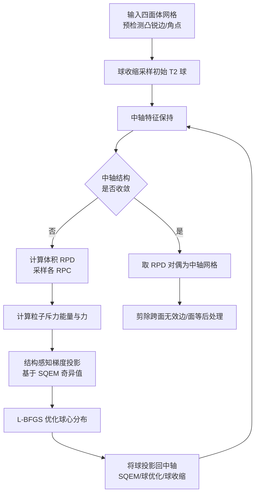

## 一句话总结

提出一个结构感知的变分优化框架，用受限功率图（RPD）引导的粒子优化与球面二次误差度量（SQEM）约束，同时保持中轴结构（sheet/seam/junction）并生成高质量的三维中轴网格。

## 研究背景

中轴（medial axis）是刻画三维形状拓扑与几何的基础结构，中轴变换（MAT）在中轴基础上附加半径函数，形成对形状几何与拓扑的紧凑编码。中轴结构由相互连接的中轴面（sheets）、中轴缝（seams）与中轴结点（junctions）组成，为形状提供了自然的体积分解，对形状分析、识别与匹配等下游任务尤为有用。

现有方法存在明显不足：PC、SAT 等经典方法忽视中轴结构，生成的中轴网格常含大量三维"闭合口袋"单元，破坏中轴的薄性（thinness），难以提取结构；VoxelCore（VC）虽能通过非流形分析识别结构，却产生过多冗余中轴面，难以有效剪枝；MATFP、MATTopo 利用 RPD 逼近 MAT，在结构保持上有所改进，但它们在检测到结构缺陷时插入中轴缝上的球却不再更新其位置，导致数值不稳定、结构混乱，同时依赖表面 RPD 分类，在拓扑密集区域频繁误分类，最终三角形质量差。

本文针对上述两大难题——中轴球分类不准与中轴球过度拥挤——提出解决方案。

## 方法

整体框架从预先检测好凸锐边与角点的四面体网格出发，用球收缩算法采样得到初始 $$T_2$$ 中轴球，随后进入外层-内层双重循环：内层用带梯度投影约束的 L-BFGS 优化粒子分布，外层将球投影回中轴并做特征保持，直到中轴结构收敛，最后取 RPD 的对偶得到中轴网格并做后处理剪枝。

关键设计：

1. 体积 RPD 中轴球分类。表面 RPD 分类假设球恰好落在中轴上，一旦球心偏离就会错分。作者改用体积 RPD：即便球偏离中轴，其体积受限功率单元（RPC）仍会与中轴划分出的上下等多个子体积相交，通过对 RPC 内样本到表面的最近投影聚类，可稳健判定球的切点数（$$T_2$$ 面、$$T_3$$ 缝、$$T_4$$ 结点），显著提升分类准确率。

2. 粒子斥力能量促进均匀分布。将球心视为无半径粒子，定义高斯核斥力能量 $$E^{ij}_{par}=e^{-\lVert \theta_j-\theta_i\rVert^2/(2\sigma^2)}$$，用 L-BFGS 最小化总能量使球心沿各子结构均匀铺开，缓解缝/结点附近的过度拥挤。

3. RPD-SQEM 与结构感知梯度投影。SQEM 度量球到一组切平面的平方距离 $$\text{SQEM}_i=\sum_{\Omega_i}[(p_{ik}-\theta_i)^\top n_{ik}-r_i]^2$$，其对应 $$4\times4$$ 矩阵 $$A$$ 的四个奇异值刻画解空间的自由度。据此分四种情形把粒子梯度投影到允许移动的零空间（点/线/面/固定），确保球只在其所属子结构内运动而不漂离中轴。

4. 中轴球投影与无效连接剪枝。每轮优化后依次尝试 SQEM 线性求解、球优化（强制点切约束）与球收缩（回退兜底）三种策略把球拉回中轴；后处理阶段检查每条中轴边的对偶受限功率面是否与端点 RPC 落入相同子体积，跨面的无效边与面被剪除。作者还提出中轴结构误差率（MSER）这一新指标量化 seam/junction 分类的准确性。

## 实验结果

在 ABC 数据集的 100 个 CAD 模型上，与 PC、SAT、VC、MATFP、MATTopo、VMAS 六种方法对比。评价指标含中轴结构误差率（MSER，越低越好）、三角形质量（TQ，越高越好）、拓扑误差率（TER，越低越好）与 Hausdorff 距离（HD，越低越好）。

| 指标 | PC | SAT | VC | MATFP | MATTopo | VMAS | 本文 |
|------|------|------|------|------|------|------|------|
| MSER↓ (Avg) | - | - | 0.334 | 0.437 | 0.485 | - | 0.009 |
| TQ↑ (Avg) | 0.421 | 0.249 | 0.599 | 0.423 | 0.485 | 0.699 | 0.712 |
| TER↓ | 1.00 | 1.00 | 0.03 | 0.27 | 0.00 | 0.87 | 0.00 |
| HD(%)↓ (Avg) | 2.284 | 1.223 | 0.977 | 0.744 | 0.805 | 1.654 | 0.735 |

本文在结构准确性（MSER 0.009）、三角形质量（TQ 0.712）与拓扑正确性（TER 0）上均取得最优，HD 也达到最低，重建保真度与 MATFP、MATTopo 相当。在 14 个有机模型上，本文同样在三角形质量与拓扑保持上领先。运行时间上，因需为每个中轴球采样并投影 RPC，每个模型通常需数分钟。

## 亮点与局限

亮点：首个把结构感知显式融入优化过程的中轴框架，同时输出带清晰结构分解、拓扑正确、几何保真的中轴网格；体积 RPD 分类比表面 RPD 更稳健；提出 MSER 新指标填补了中轴结构准确性量化的空白；对含锐边、角点的 CAD 模型尤其有效。

局限：结构感知与高质量以计算代价为代价，除体积 RPD 外还需对每个球采样并投影 RPC，运行时间明显高于 MATFP、MATTopo；与其他变分划分算法一样，无法保证全局收敛或最优性；输入须满足流形、单连通、无自交、无内腔的假设。

## 延伸思考

作者已指出 RPC 采样是主要瓶颈，若能并行化该步骤将大幅提速，这也是把方法推向大规模或交互式应用的关键。MSER 这一结构级评价指标或可推广到更广义的骨架/中轴质量评估中，成为该方向的通用度量。此外，方法当前依赖预检测的锐边特征与较严格的输入假设，如何放宽到带噪声、非流形或含内腔的真实扫描数据，以及能否与近年学习式中轴提取结合以在保证拓扑与结构的同时降低计算量，都是值得探索的方向。
