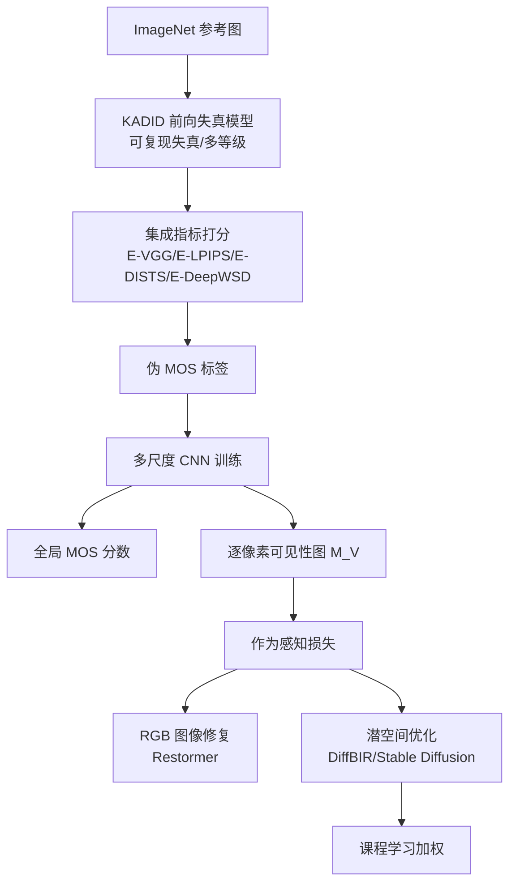

## 一句话总结

提出 MILO，一个轻量、多尺度的全参考图像质量评价(FR-IQA)指标：用"可复现的失真前向模型 + 掩蔽感知指标集成"生成伪 MOS 标签实现大规模无人工标注训练，既能输出与人眼判断高度相关的质量分数与空间可见性图，又能作为感知损失直接在 RGB 或扩散模型的 VAE 潜空间中做空间加权、课程学习式的优化，从而在质量预测精度、推理速度以及去噪/超分/人脸修复等下游任务上同时取得优势。

## 研究背景

图像质量评价要回答"人眼看到的质量有多好"，用于指导图像合成与修复流程。传统指标(MAE、PSNR、SSIM 等)基于逐像素或手工假设比较，常与人类感知不一致，且不考虑图像内容与视觉掩蔽(masking)等现象。学习型指标(LPIPS、DISTS、DeepWSD、TOPIQ 等)借助预训练网络的深度特征更贴近人眼，但普遍依赖成本高昂的人工标注感知数据。

问题有两层：

- 数据稀缺。以常用的 KADID-10k 为例，只有 81 张参考图、25 种失真、5 个失真等级，合计上万对图像都需人工标注；重复且受控的主观打分极其耗费人力，导致数据集规模与多样性受限。
- 缺乏对感知敏感度随空间结构与频率内容变化的建模。作者指出即便失真强度差别很大，人眼主观评分(MOS)也可能因掩蔽或内容容忍度而完全相同——同一张图叠加不同强度噪声，MOS 却一致。

因此需要一种既能在无人工标注下大规模训练、又能感知内容相关且空间分辨的失真可见性的方法。作者提出 MILO 来同时满足质量预测与感知优化两方面的需求。

## 方法

### 整体框架

MILO 采用两阶段框架。第一阶段：对多样参考图施加参数化、可复现的失真(高斯模糊、加性噪声、JPEG 压缩等)合成训练集，并用一组掩蔽感知的全参考指标集成来打伪 MOS 分数，得到稠密、内容相关的监督而无需人工标注。第二阶段：训练一个轻量多尺度 CNN，同时预测全局 MOS 分数与逐像素可见性图。此外把该指标扩展到直接处理 VAE 编码的潜表示，并配合课程学习做感知对齐的优化。

### 关键设计 1：伪 MOS 数据增强

为绕开人工打分，作者构建伪 MOS 预测模块。利用 KADID-10k 提供的前向失真模型，在任意参考图(随机取自 ImageNet)上以受控等级复现传统失真类型，保证每张失真图都遵循已知、可解释的退化过程，而非难以捉摸的学习类或域特定伪影。

对每张失真图，计算掩蔽感知版本 E-VGG、E-LPIPS、E-DISTS、E-DeepWSD 的输出并以等权聚合，记为 Ensemble。等权是为了避免因人工标注数据有限而过拟合；集成利用各分量的互补优势，其预测精度高于任一单一指标。生成的伪 MOS 分数用于训练多尺度指标，是达到高性能而无需大规模人工标注的关键。

### 关键设计 2：多尺度 CNN 模型

模型 $$F$$ 对失真图 $$Y$$ 与参考图 $$X$$ 估计逐像素掩码 $$M\in[0,1]^{H\times W}$$ 与全局质量分数 $$S_{\text{raw}}\in\mathbb{R}$$，即 $$(S_{\text{raw}},M)=F(X,Y)$$。设计理念是用多尺度架构而非大型预训练主干来兼顾性能与可解释性：不同尺度对应不同空间频率带——高频失真(如冲激噪声)在细尺度更易捕捉，低频失真(如颜色变化)对应粗尺度。

对参考图与失真图做双三次下采样构建金字塔：

$$\{X_l,Y_l\}_{l=1}^{L},\quad X_l,Y_l\in\mathbb{R}^{\frac{H}{2^{l-1}}\times\frac{W}{2^{l-1}}\times3}$$

其中 $$l=1$$ 为最粗尺度，$$l=L$$ 为原分辨率。每个尺度由共享子网络 $$\phi_l$$ 计算残差误差掩码：

$$M_r^{l}=\phi_l(X_l,Y_l,M^{l-1})$$

初始 $$M^0=0$$。下一尺度的输入掩码由上一尺度掩码与本尺度输出相加后双线性上采样(Up)得到：

$$M^{l}=\mathrm{Up}\big(\phi_l(X_l,Y_l,M^{l-1})+M^{l-1}\big)$$

残差掩码被馈送到所有尺度而非各尺度独立计算，因为它不是经典意义上的频率选择，而是编码由局部对比度、结构与纹理共同决定的、空间局部化的内容相关可见性；把这一上下文前向传递可让细尺度复用粗尺度的可见性预测而不必重学。每尺度 CNN 为五层卷积，通道数 16–32–64–32–16，除最后一层用 sigmoid 把掩码约束到 $$[0,1]$$ 外均用 ReLU。

最细分辨率掩码 $$M_L$$ 调制输入的局部误差，并在最细尺度上聚合为全局误差：

$$\tilde{E}=M_L\odot E,\quad E=|X-Y|$$

$$S_{\text{raw}}=\frac{1}{HW}\sum_{i,j}\tilde{E}_{i,j}$$

再由一个轻量标量映射网络 $$G:\mathbb{R}\to\mathbb{R}$$ 把 $$S_{\text{raw}}$$ 映射到预测的 MOS 分数、把 $$\tilde{E}$$ 映射为最终可见性图 $$M_V=G(\tilde{E})$$，使其与 MOS 标签的取值范围可比。$$G$$ 与 $$F$$ 联合训练。相比单尺度版本，引入多分辨率显著提升效果，尤其在增强数据上训练时。MILO 仅用 Ensemble 生成的伪 MOS 分数监督，训练输入只有参考图、失真图与伪 MOS 分数。

### 关键设计 3：潜空间掩蔽

可见性掩码同样可从解码到潜空间的图像导出。现代生成模型(如稳定扩散)在 VAE 编码的紧凑潜空间中生成以提高效率，直接在潜空间操作可避免反复 VAE 解码，减少显存与计算开销。MILO 的感知掩蔽保留空间结构，从而在语义相关区域做定向修复，且处理潜表示无需改动其余流程。

### 关键设计 4：课程学习与感知掩蔽

图像修复常用全局质量分数或均匀损失，忽视不同区域感知重要性差异。MILO 的掩码提供空间分辨的失真可见性信息，据此设计课程学习：网络先修复感知不那么关键(掩蔽强、失真可见性低)的区域，再逐步转向失真更明显的显著区域。引入调度参数 $$\alpha\in[0,1]$$，记 $$M\equiv M_L$$、$$D=|X-Y|$$，定义课程加权的 L1 损失：

$$L_{\text{curr}}=\big[(1-\alpha)(1-M)\cdot D+\alpha M\cdot D\big]_{\text{mean}}$$

$$\alpha$$ 随当前 epoch $$e$$ 与总 epoch 数 $$N$$ 调度，比较两种策略。线性调度：

$$\alpha=\frac{e}{N}$$

余弦调度(慢启动、中期加速、过渡更平滑)：

$$\alpha=\frac{1}{2}\left(1-\cos\left(\pi\cdot\frac{e}{N}\right)\right)$$

## 实验结果

质量预测：在 CSIQ、TID、PIPAL 三个标准数据集上，用 PLCC/SRCC/KRCC 衡量预测与人工标注 MOS 的相关性。传统指标(MAE、SSIM、HDR-VDP-2、ColorVideoVDP 等)相关性偏低；MILO 相比 LPIPS、DeepWSD、TOPIQ 等学习型指标取得更高精度。尽管网络显著更小，MILO 凭借针对性架构、语义有意义的数据与增强策略胜出。值得注意的是，虽然 MILO 用 Ensemble 输出训练，却在未见数据(尤其是失真多来自欠训练神经网络、非确定性伪影的 PIPAL)上泛化更好，说明其多尺度网络能捕捉超出训练标签表征范围的感知结构。CSIQ 上 MILO(20k) 达 PLCC 0.967 / SRCC 0.968；PIPAL 上 MILO 达 SRCC 0.711，优于 TOPIQ(0.693)。

运行时间：在 512×384 分辨率、GPU 上取 1000 次平均、仅计纯指标处理时间。MILO 图像版单图约 3.94 ms，潜空间版 MILO 约 2.16 ms(因潜表示维度更低而更快)，远快于 TOPIQ(357.69 ms)、WaDIQaM(172.06 ms)、Ensemble(105.40 ms)、LPIPS(18.97 ms)等。

| 指标 | 单图推理时间 (ms) |
|---|---|
| PieApp | 72.75 |
| DeepWSD | 24.53 |
| DISTS | 21.03 |
| LPIPS | 18.97 |
| TOPIQ | 357.69 |
| WaDIQaM | 172.06 |
| Ensemble | 105.40 |
| MILO (图像版) | 3.94 |
| MILO (潜空间版) | 2.16 |

可见性图质量：对同一图像分别加高斯噪声与模糊，噪声在高对比度区域被更强掩蔽(如摩托车纹理区噪声可见性降低)，而模糊在高对比度边缘更明显。网络仅用逐图伪 MOS 监督便隐式学到了局部误差可见性与感知掩蔽的关系，能生成逐像素可见性图。

作为图像修复损失(Restormer 框架)：

- 去噪。在 BSD400 上以加性高斯噪声($$\sigma\in[0,50]$$)训练，五个标准基准评测。MILO 监督相比 MAE 基线持续改善感知质量(LPIPS、Ensemble 指标更优)；参考图更多(即使每图失真更少)能提升泛化，课程学习进一步增益，余弦调度略优。例如 $$\sigma=50$$ 时 MILO(curr_cos) 的 LPIPS 从基线 0.1686 降到 0.1256。
- 运动去模糊。在 GoPro 上用最佳版本(1M 图、余弦课程)训练评测，PSNR 从 29.14 提升到 29.65，SSIM 0.8862→0.8965，LPIPS 0.1436→0.1293，均优于 MAE 损失。

潜空间优化(扩展 DiffBIR)：把潜空间版 MILO 集成到 DiffBIR 第二阶段，作为推理期潜空间引导，直接在潜空间施加掩蔽，避免每步 VAE 解码，无需重训扩散模块。用无参考指标(TOPIQ、CLIP-IQA、MUSIQ)评测去噪、超分、人脸修复三类盲修复任务。去噪与超分上 MILO 在全部指标优于 DiffBIR 基线(如超分 TOPIQ 0.6685→0.6997)；人脸修复视觉上更好地保留面部结构与细节、避免过平滑，但无参考指标反而下降——这是该领域已知的指标与主观感受不一致问题。

消融：数据集规模上，参考图越多指标相关性越好，静态相关性约在 1 万张参考图后饱和；但作为感知损失用于去噪等下游任务时未见饱和，性能随参考图增多持续提升，说明数据多样性的意义超出 IQA 相关性的饱和点。全失真 vs 随机采样：用"每图一种随机失真+更多参考图"比"每图全 25 种失真"在修复性能上更好，而指标相关性相当，表明参考图多样性比每图失真全覆盖更重要；但仍需对每种失真施加所有等级，让网络学到失真感知随幅度的非线性。

## 亮点与局限

亮点：

- 用可复现前向失真模型加掩蔽感知指标集成生成伪 MOS，实现大规模无人工标注训练，绕开感知数据集稀缺的瓶颈，且泛化到未见数据甚至超过其训练标签来源。
- 轻量多尺度残差掩码架构在保持高精度的同时推理极快(图像版约 3.94 ms、潜空间版约 2.16 ms)，适合实时与训练期反复调用。
- 一个模型兼作质量预测器与空间加权的感知损失，并可直接在扩散模型潜空间工作，避免反复 VAE 解码。
- 掩码为课程学习提供空间分辨的难度信号，在去噪、去模糊、盲超分等任务上带来一致提升。
- 学到的掩蔽是失真相关的(边缘掩蔽噪声但不掩蔽模糊)，比固定手工模型更贴合人眼视觉系统的自适应行为。

局限：

- 训练 Ensemble 分量所用人工分数采自不受控的在线环境，观看距离、环境光等变异使增强数据质量受限。
- 可见性图未用基于阈值的可见性数据做校准，专注相对空间差异而非绝对逐像素差异；精确预测逐像素感知差异对任何现有指标仍是开放难题。
- 在生成场景中无法纠正底层生成模型的失败：若扩散过程产生语义错误的输出，指标引导能力有限。
- 人脸修复中无参考指标与主观视觉判断不一致，量化评估难以反映真实提升。

## 延伸思考

- "可复现前向失真 + 指标集成打分"作为伪标签范式，本质是用可信的合成监督替代昂贵人工标注；这一思路可推广到其他缺乏大规模主观数据的感知任务，前提是找到足够可靠的教师指标集成。
- 学生模型泛化超过教师(在 PIPAL 上超过 Ensemble)提示：多尺度归纳偏置本身能提取超出标签的感知结构，值得研究架构先验与标签质量之间的权衡。
- 直接在潜空间施加感知掩蔽以省去 VAE 解码，是把感知度量嵌入生成流水线的实用范式，未来可探索在更多扩散控制场景(如引导采样、编辑)中复用。
- 无参考指标与主观质量在人脸修复上的背离说明当前评测体系的缺口；作者提出的无参考扩展与生成式数据增强(应对 PIPAL 类复杂失真)是自然的后续方向。
